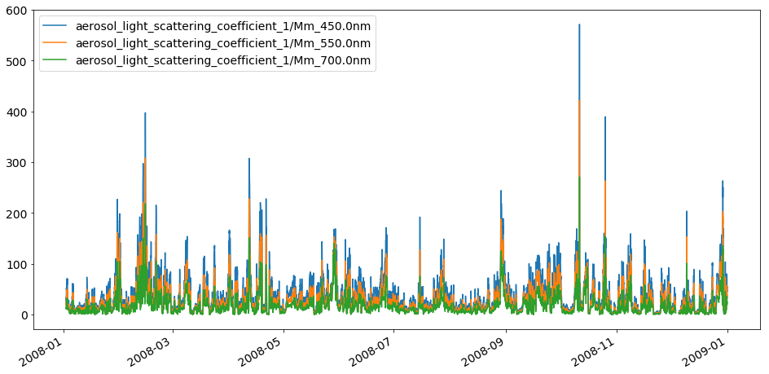

Tutorial showing how to read EBAS NASA Ames files
~~~~~~~~~~~~~~~~~~~~~~~~~~~~~~~~~~~~~~~~~~~~~~~~~

**Note**: this notebook is currently under development

Please see
`here <https://ebas-submit.nilu.no/Submit-Data/Getting-started>`__ for
information related to the EBAS NASA Ames file format.

**Further links**: - `Pyaerocom
website <http://aerocom.met.no/pyaerocom/>`__ - `Pyaerocom installation
instructions <http://aerocom.met.no/pyaerocom/readme.html#installation>`__
- `Getting
started <http://aerocom.met.no/pyaerocom/notebooks.html#getting-started>`__

.. code:: ipython3

    import os 
    from pyaerocom.io import EbasNasaAmesFile
    
    ebasdir = "/lustre/storeA/project/aerocom/aerocom1/AEROCOM_OBSDATA/EBASMultiColumn/data/data/"
    filename = "DE0043G.20080101000000.20160708144500.nephelometer..aerosol.1y.1h.DE09L_tsi_neph_3563.DE09L_nephelometer.lev2.nas"
    
    mc = EbasNasaAmesFile(file=ebasdir+filename,
                          only_head=False,          #set True if you only want to import header
                          replace_invalid_nan=True, #replace invalid values with NaNs
                          convert_timestamps=True,  #compute datetime64 timestamps from numerical values
                          decode_flags=True,        #decode all flags (e.g. 0.111222333 -> 111 222 333)
                          verbose=False)
    print(mc)

.. parsed-literal::

    Init data paths for lustre

.. parsed-literal::

    0.005696773529052734 s
    Pyaerocom EbasNasaAmesFile
    --------------------------
    
       num_head_lines: 60
       num_head_fmt: 1001
       data_originator: Flentje, Harald
       sponsor_organisation: DE09L, Deutscher Wetterdienst, DWD, Met. Obs., Hohenspeissenberg, , 82283, Hohenspeissenberg, Germany
       submitter: Flentje, Harald
       project_association: EUSAAR GAW-WDCA
       vol_num: 1
       vol_totnum: 1
       ref_date: 2008-01-01T00:00:00
       revision_date: 2016-07-08T00:00:00
       freq: 0.041667
       descr_time_unit: days from file reference point
       num_cols_dependent: 11
       mul_factors (list, 11 items)
       [1.0
        1.0
        ...
        1.0
        1.0]
    
       vals_invalid (list, 11 items)
       [999.999999
        999.999
        ...
        9999.9
        9.999999999]
    
       descr_first_col: end_time of measurement, days from the file reference point
    
       Column variable definitions
       -------------------------------
       EbasColDef: name=starttime, unit=days, is_var=False, is_flag=False, flag_id=, 
       EbasColDef: name=endtime, unit=days, is_var=False, is_flag=False, flag_id=, 
       EbasColDef: name=aerosol_light_backscattering_coefficient, unit=1/Mm, is_var=True, is_flag=False, flag_id=numflag, wavelength=450.0 nm, 
       EbasColDef: name=aerosol_light_backscattering_coefficient, unit=1/Mm, is_var=True, is_flag=False, flag_id=numflag, wavelength=550.0 nm, 
       EbasColDef: name=aerosol_light_backscattering_coefficient, unit=1/Mm, is_var=True, is_flag=False, flag_id=numflag, wavelength=700.0 nm, 
       EbasColDef: name=aerosol_light_scattering_coefficient, unit=1/Mm, is_var=True, is_flag=False, flag_id=numflag, wavelength=450.0 nm, 
       EbasColDef: name=aerosol_light_scattering_coefficient, unit=1/Mm, is_var=True, is_flag=False, flag_id=numflag, wavelength=550.0 nm, 
       EbasColDef: name=aerosol_light_scattering_coefficient, unit=1/Mm, is_var=True, is_flag=False, flag_id=numflag, wavelength=700.0 nm, 
       EbasColDef: name=pressure, unit=hPa, is_var=True, is_flag=False, flag_id=numflag, location=instrument internal, 
       EbasColDef: name=relative_humidity, unit=%, is_var=True, is_flag=False, flag_id=numflag, location=instrument internal, 
       EbasColDef: name=temperature, unit=K, is_var=True, is_flag=False, flag_id=numflag, location=instrument internal, 
       EbasColDef: name=numflag, unit=no unit, is_var=False, is_flag=True, flag_id=, 
    
       EBAS meta data
       ------------------
       verbose: False
       data_definition: EBAS_1.1
       set_type_code: TU
       timezone: UTC
       file_name: DE0043G.20080101000000.20160708144500.nephelometer..aerosol.1y.1h.DE09L_tsi_neph_3563.DE09L_nephelometer.lev2.nas
       file_creation: 20181001025156
       startdate: 20080101000000
       revision_date: 20160708144500
       statistics: arithmetic mean
       data_level: 2
       period_code: 1y
       resolution_code: 1h
       station_code: DE0043G
       platform_code: DE0043S
       station_name: Hohenpeissenberg
       station_wdca-id: GAWADE__HPB
       station_gaw-id: HPB
       station_gaw-name: Hohenpeissenberg
       station_land_use: Grassland
       station_setting: Mountain
       station_gaw_type: G
       station_wmo_region: 6
       station_latitude: 47.8014984131
       station_longitude: 11.0096197128
       station_altitude: 985.0 m
       regime: IMG
       component: 
       unit: 1/Mm
       matrix: aerosol
       laboratory_code: DE09L
       instrument_type: nephelometer
       instrument_name: tsi_neph_3563
       method_ref: DE09L_nephelometer
       originator: Flentje, Harald, Harald.Flentje@dwd.de, , , , , , , ,
       submitter: Flentje, Harald, Harald.Flentje@dwd.de, , , , , , , ,
    
       Data
       --------
    [[0.00000000e+00 4.16670000e-02            nan ...            nan
                 nan 3.94999000e-01]
     [4.16670000e-02 8.33330000e-02            nan ...            nan
                 nan 3.94999000e-01]
     [8.33330000e-02 1.25000000e-01            nan ...            nan
                 nan 3.94999000e-01]
     ...
     [3.65875000e+02 3.65916667e+02 4.75900000e+00 ... 8.50000000e+00
      2.99900000e+02 2.47000000e-01]
     [3.65916667e+02 3.65958310e+02 5.16200000e+00 ... 8.70000000e+00
      2.99900000e+02 2.47000000e-01]
     [3.65958333e+02 3.66000000e+02 5.31800000e+00 ... 9.30000000e+00
      2.99700000e+02 0.00000000e+00]]
    Colnum: 12
    Timestamps: 8784

Column information
^^^^^^^^^^^^^^^^^^

.. code:: ipython3

    mc.print_col_info()

.. parsed-literal::

    Column 0
    Pyaerocom EbasColDef
    --------------------
    name: starttime
    unit: days
    is_var: False
    is_flag: False
    flag_id: 
    
    Column 1
    Pyaerocom EbasColDef
    --------------------
    name: endtime
    unit: days
    is_var: False
    is_flag: False
    flag_id: 
    
    Column 2
    Pyaerocom EbasColDef
    --------------------
    name: aerosol_light_backscattering_coefficient
    unit: 1/Mm
    is_var: True
    is_flag: False
    flag_id: numflag
    wavelength: 450.0 nm
    
    Column 3
    Pyaerocom EbasColDef
    --------------------
    name: aerosol_light_backscattering_coefficient
    unit: 1/Mm
    is_var: True
    is_flag: False
    flag_id: numflag
    wavelength: 550.0 nm
    
    Column 4
    Pyaerocom EbasColDef
    --------------------
    name: aerosol_light_backscattering_coefficient
    unit: 1/Mm
    is_var: True
    is_flag: False
    flag_id: numflag
    wavelength: 700.0 nm
    
    Column 5
    Pyaerocom EbasColDef
    --------------------
    name: aerosol_light_scattering_coefficient
    unit: 1/Mm
    is_var: True
    is_flag: False
    flag_id: numflag
    wavelength: 450.0 nm
    
    Column 6
    Pyaerocom EbasColDef
    --------------------
    name: aerosol_light_scattering_coefficient
    unit: 1/Mm
    is_var: True
    is_flag: False
    flag_id: numflag
    wavelength: 550.0 nm
    
    Column 7
    Pyaerocom EbasColDef
    --------------------
    name: aerosol_light_scattering_coefficient
    unit: 1/Mm
    is_var: True
    is_flag: False
    flag_id: numflag
    wavelength: 700.0 nm
    
    Column 8
    Pyaerocom EbasColDef
    --------------------
    name: pressure
    unit: hPa
    is_var: True
    is_flag: False
    flag_id: numflag
    location: instrument internal
    
    Column 9
    Pyaerocom EbasColDef
    --------------------
    name: relative_humidity
    unit: %
    is_var: True
    is_flag: False
    flag_id: numflag
    location: instrument internal
    
    Column 10
    Pyaerocom EbasColDef
    --------------------
    name: temperature
    unit: K
    is_var: True
    is_flag: False
    flag_id: numflag
    location: instrument internal
    
    Column 11
    Pyaerocom EbasColDef
    --------------------
    name: numflag
    unit: no unit
    is_var: False
    is_flag: True
    flag_id: 
    

You can see that all variable columns were assigned the same flag
column, since there is only one. This would be different if there were
multiple flag columns (e.g. one for each variable).

Access flag information
^^^^^^^^^^^^^^^^^^^^^^^

You can access the flags for each column using the ``flags`` attribute
of the file.

.. code:: ipython3

    mc.flags

.. parsed-literal::

    OrderedDict([('numflag',
                  <pyaerocom.io.ebas_nasa_ames.EbasFlagCol at 0x7f5f51df9a20>)])

.. code:: ipython3

    flagcol = mc.flags["numflag"]

The raw flags can be accessed via:

.. code:: ipython3

    flagcol.raw_data

.. parsed-literal::

    array([0.394999, 0.394999, 0.394999, ..., 0.247   , 0.247   , 0.      ])

And the processed flags are in stored in a (Nx3) numpy array where N is
the total number of timestamps.

.. code:: ipython3

    flagcol.flags

.. parsed-literal::

    array([[394, 999,   0],
           [394, 999,   0],
           [394, 999,   0],
           ...,
           [247,   0,   0],
           [247,   0,   0],
           [  0,   0,   0]])

For instance, access the flags of the 5 timestamp:

.. code:: ipython3

    flagcol.flags[4]

.. parsed-literal::

    array([394, 999,   0])

Convert object to pandas Dataframe
^^^^^^^^^^^^^^^^^^^^^^^^^^^^^^^^^^

The conversion does currently exclude all flag columns

.. code:: ipython3

    df = mc.to_dataframe()
    df.head()

.. raw:: html

    

    
    <table border="1" class="dataframe">
      <thead>
        <tr style="text-align: right;">
          <th></th>
          <th>starttime_days</th>
          <th>endtime_days</th>
          <th>aerosol_light_backscattering_coefficient_1/Mm_450.0nm</th>
          <th>aerosol_light_backscattering_coefficient_1/Mm_550.0nm</th>
          <th>aerosol_light_backscattering_coefficient_1/Mm_700.0nm</th>
          <th>aerosol_light_scattering_coefficient_1/Mm_450.0nm</th>
          <th>aerosol_light_scattering_coefficient_1/Mm_550.0nm</th>
          <th>aerosol_light_scattering_coefficient_1/Mm_700.0nm</th>
          <th>pressure_hPa</th>
          <th>relative_humidity_%</th>
          <th>temperature_K</th>
          <th>numflag_no unit</th>
        </tr>
      </thead>
      <tbody>
        <tr>
          <th>2008-01-01 00:30:00</th>
          <td>0.000000</td>
          <td>0.041667</td>
          <td>NaN</td>
          <td>NaN</td>
          <td>NaN</td>
          <td>NaN</td>
          <td>NaN</td>
          <td>NaN</td>
          <td>NaN</td>
          <td>NaN</td>
          <td>NaN</td>
          <td>0.394999</td>
        </tr>
        <tr>
          <th>2008-01-01 01:29:59</th>
          <td>0.041667</td>
          <td>0.083333</td>
          <td>NaN</td>
          <td>NaN</td>
          <td>NaN</td>
          <td>NaN</td>
          <td>NaN</td>
          <td>NaN</td>
          <td>NaN</td>
          <td>NaN</td>
          <td>NaN</td>
          <td>0.394999</td>
        </tr>
        <tr>
          <th>2008-01-01 02:29:59</th>
          <td>0.083333</td>
          <td>0.125000</td>
          <td>NaN</td>
          <td>NaN</td>
          <td>NaN</td>
          <td>NaN</td>
          <td>NaN</td>
          <td>NaN</td>
          <td>NaN</td>
          <td>NaN</td>
          <td>NaN</td>
          <td>0.394999</td>
        </tr>
        <tr>
          <th>2008-01-01 03:30:00</th>
          <td>0.125000</td>
          <td>0.166667</td>
          <td>NaN</td>
          <td>NaN</td>
          <td>NaN</td>
          <td>NaN</td>
          <td>NaN</td>
          <td>NaN</td>
          <td>NaN</td>
          <td>NaN</td>
          <td>NaN</td>
          <td>0.394999</td>
        </tr>
        <tr>
          <th>2008-01-01 04:29:59</th>
          <td>0.166667</td>
          <td>0.208333</td>
          <td>NaN</td>
          <td>NaN</td>
          <td>NaN</td>
          <td>NaN</td>
          <td>NaN</td>
          <td>NaN</td>
          <td>NaN</td>
          <td>NaN</td>
          <td>NaN</td>
          <td>0.394999</td>
        </tr>
      </tbody>
    </table>
    

.. code:: ipython3

    mc.to_dataframe('aerosol_light_scattering_coefficient', statistics='arithmetic mean').plot(figsize=(16,8))

.. parsed-literal::

    <matplotlib.axes._subplots.AxesSubplot at 0x7f5f3bf39fd0>

