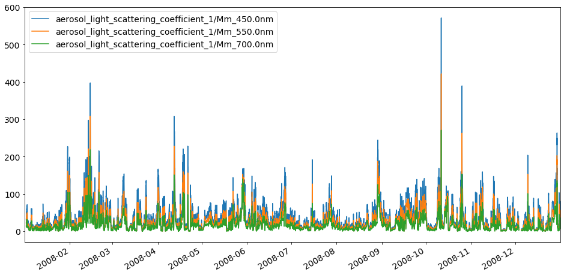

Tutorial showing how to read EBAS NASA Ames files
~~~~~~~~~~~~~~~~~~~~~~~~~~~~~~~~~~~~~~~~~~~~~~~~~

**Note**: this notebook is currently under development

Please see
`here <https://ebas-submit.nilu.no/Submit-Data/Getting-started>`__ for
information related to the EBAS NASA Ames file format.

**Further links**: - `Pyaerocom
website <http://aerocom.met.no/pyaerocom/>`__ - `Pyaerocom installation
instructions <http://aerocom.met.no/pyaerocom/readme.html#installation>`__
- `Getting
started <http://aerocom.met.no/pyaerocom/notebooks.html#getting-started>`__

.. code:: ipython3

    import pyaerocom as pya

.. parsed-literal::

    Initating pyaerocom configuration
    Checking server configuration ...
    Checking access to: /lustre/storeA
    Access to lustre database: True
    Init data paths for lustre
    Expired time: 0.018 s

.. code:: ipython3

    ebasdir = pya.const.EBASMC_DATA_DIR
    ebasdir

.. parsed-literal::

    '/lustre/storeA/project/aerocom/aerocom1/AEROCOM_OBSDATA/EBASMultiColumn/data/data/'

Provide filename of one of the files in the directory

.. code:: ipython3

    filename = "DE0043G.20080101000000.20160708144500.nephelometer..aerosol.1y.1h.DE09L_tsi_neph_3563.DE09L_nephelometer.lev2.nas"

.. code:: ipython3

    mc = pya.io.EbasNasaAmesFile(file=ebasdir+filename,
                                 only_head=False,          #set True if you only want to import header
                                 replace_invalid_nan=True, #replace invalid values with NaNs
                                 convert_timestamps=True,  #compute datetime64 timestamps from numerical values
                                 decode_flags=True)        #decode all flags (e.g. 0.111222333 -> 111 222 333)
                                 
    print(mc)

.. parsed-literal::

    Pyaerocom EbasNasaAmesFile
    --------------------------
    
       num_head_lines: 60
       num_head_fmt: 1001
       data_originator: Flentje, Harald
       sponsor_organisation: DE09L, Deutscher Wetterdienst, DWD, Met. Obs., Hohenspeissenberg, , 82283, Hohenspeissenberg, Germany
       submitter: Flentje, Harald
       project_association: EUSAAR GAW-WDCA
       vol_num: 1
       vol_totnum: 1
       ref_date: 2008-01-01T00:00:00
       revision_date: 2016-07-08T00:00:00
       freq: 0.041667
       descr_time_unit: days from file reference point
       num_cols_dependent: 11
       mul_factors (list, 11 items)
       [1.0
        1.0
        ...
        1.0
        1.0]
    
       vals_invalid (list, 11 items)
       [999.999999
        999.999
        ...
        9999.9
        9.999999999]
    
       descr_first_col: end_time of measurement, days from the file reference point
    
       Column variable definitions
       -------------------------------
       EbasColDef: name=starttime, unit=days, is_var=False, is_flag=False, flag_col=11, 
       EbasColDef: name=endtime, unit=days, is_var=False, is_flag=False, flag_col=11, 
       EbasColDef: name=aerosol_light_backscattering_coefficient, unit=1/Mm, is_var=True, is_flag=False, flag_col=11, wavelength=450.0 nm, 
       EbasColDef: name=aerosol_light_backscattering_coefficient, unit=1/Mm, is_var=True, is_flag=False, flag_col=11, wavelength=550.0 nm, 
       EbasColDef: name=aerosol_light_backscattering_coefficient, unit=1/Mm, is_var=True, is_flag=False, flag_col=11, wavelength=700.0 nm, 
       EbasColDef: name=aerosol_light_scattering_coefficient, unit=1/Mm, is_var=True, is_flag=False, flag_col=11, wavelength=450.0 nm, 
       EbasColDef: name=aerosol_light_scattering_coefficient, unit=1/Mm, is_var=True, is_flag=False, flag_col=11, wavelength=550.0 nm, 
       EbasColDef: name=aerosol_light_scattering_coefficient, unit=1/Mm, is_var=True, is_flag=False, flag_col=11, wavelength=700.0 nm, 
       EbasColDef: name=pressure, unit=hPa, is_var=True, is_flag=False, flag_col=11, location=instrument internal, 
       EbasColDef: name=relative_humidity, unit=%, is_var=True, is_flag=False, flag_col=11, location=instrument internal, 
       EbasColDef: name=temperature, unit=K, is_var=True, is_flag=False, flag_col=11, location=instrument internal, 
       EbasColDef: name=numflag, unit=no unit, is_var=False, is_flag=True, flag_col=None, 
    
       EBAS meta data
       ------------------
       decode_flags: True
       data_definition: EBAS_1.1
       set_type_code: TU
       timezone: UTC
       file_name: DE0043G.20080101000000.20160708144500.nephelometer..aerosol.1y.1h.DE09L_tsi_neph_3563.DE09L_nephelometer.lev2.nas
       file_creation: 20190115031321
       startdate: 20080101000000
       revision_date: 20160708144500
       statistics: arithmetic mean
       data_level: 2
       period_code: 1y
       resolution_code: 1h
       station_code: DE0043G
       platform_code: DE0043S
       station_name: Hohenpeissenberg
       station_wdca-id: GAWADE__HPB
       station_gaw-id: HPB
       station_gaw-name: Hohenpeissenberg
       station_land_use: Grassland
       station_setting: Mountain
       station_gaw_type: G
       station_wmo_region: 6
       station_latitude: 47.8014984131
       station_longitude: 11.0096197128
       station_altitude: 985.0 m
       regime: IMG
       component: 
       unit: 1/Mm
       matrix: aerosol
       laboratory_code: DE09L
       instrument_type: nephelometer
       instrument_name: tsi_neph_3563
       method_ref: DE09L_nephelometer
       originator: Flentje, Harald, Harald.Flentje@dwd.de, , , , , , , ,
       submitter: Flentje, Harald, Harald.Flentje@dwd.de, , , , , , , ,
    
       Data
       --------
    [[0.00000000e+00 4.16670000e-02            nan ...            nan
                 nan 3.94999000e-01]
     [4.16670000e-02 8.33330000e-02            nan ...            nan
                 nan 3.94999000e-01]
     [8.33330000e-02 1.25000000e-01            nan ...            nan
                 nan 3.94999000e-01]
     ...
     [3.65875000e+02 3.65916667e+02 4.75900000e+00 ... 8.50000000e+00
      2.99900000e+02 2.47000000e-01]
     [3.65916667e+02 3.65958310e+02 5.16200000e+00 ... 8.70000000e+00
      2.99900000e+02 2.47000000e-01]
     [3.65958333e+02 3.66000000e+02 5.31800000e+00 ... 9.30000000e+00
      2.99700000e+02 0.00000000e+00]]
    Colnum: 12
    Timestamps: 8784

The NASA Ames files are strucured in the same way as they are
represented by in the instance of the EbasNasaAmesFile class.

-  A header with global metadata
-  One row that specifies multiplication factors for each data column
   (``mul_factors``)
-  One row that specifies NaN-equivalent values for each data column
   (``vals_invalid``)
-  A number of rows specifying metainformation for each data column in
   the file (i.e. 12 rows, if the data has 12 columns)
-  Dataset specific metadata
-  Data block: rows are timestamps, columns are different columns
   specified in the header (cf. 2 points above)

   -  Represented by 2D numpy array (``data`` attribute) where first
      index is row and second index is column

For details related to the file format `see
here <https://ebas-submit.nilu.no/Submit-Data/Data-Reporting/Templates/Category/Aerosol/Aerosol-Optical-Depth>`__.

.. code:: ipython3

    print(mc.shape)

.. parsed-literal::

    (8784, 12)

Column information
^^^^^^^^^^^^^^^^^^

Detailed information about each column can be accessed via the
``var_defs`` attribute. E.g. to see what is in the 4th column:

.. code:: ipython3

    mc.var_defs[3]

.. parsed-literal::

    EbasColDef: name=aerosol_light_backscattering_coefficient, unit=1/Mm, is_var=True, is_flag=False, flag_col=11, wavelength=550.0 nm, 

The ``is_var`` attribute specifies, whether this column contains actual
variable data or if it is a flag column. A NASA Ames file can have one
or more flag columns that can be used to identify valid or invalid
measurments. Each flag in a flag column comprises a floating point
number that has encoded up to 3 3-digit numerical flags which are
specified here:

https://github.com/metno/pyaerocom/blob/master/pyaerocom/data/ebas_flags.csv

More info about the flags follows below. You can see, that the column 4
printed above has assigned column 12 (index 11) as flag column.

If you want to see an overview of all available columns in the file you
may use the following command:

.. code:: ipython3

    mc.print_col_info()

.. parsed-literal::

    Column 0
    Pyaerocom EbasColDef
    --------------------
    name: starttime
    unit: days
    is_var: False
    is_flag: False
    flag_col: 11
    
    Column 1
    Pyaerocom EbasColDef
    --------------------
    name: endtime
    unit: days
    is_var: False
    is_flag: False
    flag_col: 11
    
    Column 2
    Pyaerocom EbasColDef
    --------------------
    name: aerosol_light_backscattering_coefficient
    unit: 1/Mm
    is_var: True
    is_flag: False
    flag_col: 11
    wavelength: 450.0 nm
    
    Column 3
    Pyaerocom EbasColDef
    --------------------
    name: aerosol_light_backscattering_coefficient
    unit: 1/Mm
    is_var: True
    is_flag: False
    flag_col: 11
    wavelength: 550.0 nm
    
    Column 4
    Pyaerocom EbasColDef
    --------------------
    name: aerosol_light_backscattering_coefficient
    unit: 1/Mm
    is_var: True
    is_flag: False
    flag_col: 11
    wavelength: 700.0 nm
    
    Column 5
    Pyaerocom EbasColDef
    --------------------
    name: aerosol_light_scattering_coefficient
    unit: 1/Mm
    is_var: True
    is_flag: False
    flag_col: 11
    wavelength: 450.0 nm
    
    Column 6
    Pyaerocom EbasColDef
    --------------------
    name: aerosol_light_scattering_coefficient
    unit: 1/Mm
    is_var: True
    is_flag: False
    flag_col: 11
    wavelength: 550.0 nm
    
    Column 7
    Pyaerocom EbasColDef
    --------------------
    name: aerosol_light_scattering_coefficient
    unit: 1/Mm
    is_var: True
    is_flag: False
    flag_col: 11
    wavelength: 700.0 nm
    
    Column 8
    Pyaerocom EbasColDef
    --------------------
    name: pressure
    unit: hPa
    is_var: True
    is_flag: False
    flag_col: 11
    location: instrument internal
    
    Column 9
    Pyaerocom EbasColDef
    --------------------
    name: relative_humidity
    unit: %
    is_var: True
    is_flag: False
    flag_col: 11
    location: instrument internal
    
    Column 10
    Pyaerocom EbasColDef
    --------------------
    name: temperature
    unit: K
    is_var: True
    is_flag: False
    flag_col: 11
    location: instrument internal
    
    Column 11
    Pyaerocom EbasColDef
    --------------------
    name: numflag
    unit: no unit
    is_var: False
    is_flag: True
    flag_col: None
    

You can see that all variable columns were assigned the same flag
column, since there is only one (column no. 11). This would be different
if there were multiple flag columns (e.g. one for each variable).

Access flag information
^^^^^^^^^^^^^^^^^^^^^^^

You can access the flags for each column using the ``flag_col_info``
attribute of the file (and the key of the respective flag column, that
you want to access, here->11).

.. code:: ipython3

    flagcol = mc.flag_col_info[11]
    flagcol

.. parsed-literal::

    <pyaerocom.io.ebas_nasa_ames.EbasFlagCol at 0x7f3c37123358>

The raw flags can be accessed via:

.. code:: ipython3

    flagcol.raw_data

.. parsed-literal::

    array([0.394999, 0.394999, 0.394999, ..., 0.247   , 0.247   , 0.      ])

And the processed flags are in stored in a (Nx3) numpy array where N is
the total number of timestamps.

.. code:: ipython3

    flagcol.decoded

.. parsed-literal::

    array([[394, 999,   0],
           [394, 999,   0],
           [394, 999,   0],
           ...,
           [247,   0,   0],
           [247,   0,   0],
           [  0,   0,   0]])

For instance, access the flags of the 5 timestamp:

.. code:: ipython3

    flagcol.decoded[4]

.. parsed-literal::

    array([394, 999,   0])

This timestamp contains 2 (of the possible up to 3) flags: 394, 999.

Validity of a combination of the flags can be directly accessed via:

.. code:: ipython3

    flagcol.valid[4]

.. parsed-literal::

    False

This combination of flags (394, 999) evaluates to an invalid
measurement. Looking into `the flag definition
file <https://github.com/metno/pyaerocom/blob/master/pyaerocom/data/ebas_flags.csv>`__
we see that these two flags have the following meaning:

-  394,‘Data completeness less than 90%’,‘V’
-  999,‘Missing measurement, unspecified reason’,‘M’

where the last string specifies if this flag is valid (V) or invalid (I)
or missing (M).

Convert object to pandas Dataframe
^^^^^^^^^^^^^^^^^^^^^^^^^^^^^^^^^^

.. code:: ipython3

    df = mc.to_dataframe()
    df.head()

.. raw:: html

    

    
    <table border="1" class="dataframe">
      <thead>
        <tr style="text-align: right;">
          <th></th>
          <th>starttime_days</th>
          <th>endtime_days</th>
          <th>aerosol_light_backscattering_coefficient_1/Mm_450.0nm</th>
          <th>aerosol_light_backscattering_coefficient_1/Mm_550.0nm</th>
          <th>aerosol_light_backscattering_coefficient_1/Mm_700.0nm</th>
          <th>aerosol_light_scattering_coefficient_1/Mm_450.0nm</th>
          <th>aerosol_light_scattering_coefficient_1/Mm_550.0nm</th>
          <th>aerosol_light_scattering_coefficient_1/Mm_700.0nm</th>
          <th>pressure_hPa</th>
          <th>relative_humidity_%</th>
          <th>temperature_K</th>
          <th>numflag_no unit</th>
        </tr>
      </thead>
      <tbody>
        <tr>
          <th>2008-01-01 00:30:00</th>
          <td>0.000000</td>
          <td>0.041667</td>
          <td>NaN</td>
          <td>NaN</td>
          <td>NaN</td>
          <td>NaN</td>
          <td>NaN</td>
          <td>NaN</td>
          <td>NaN</td>
          <td>NaN</td>
          <td>NaN</td>
          <td>0.394999</td>
        </tr>
        <tr>
          <th>2008-01-01 01:29:59</th>
          <td>0.041667</td>
          <td>0.083333</td>
          <td>NaN</td>
          <td>NaN</td>
          <td>NaN</td>
          <td>NaN</td>
          <td>NaN</td>
          <td>NaN</td>
          <td>NaN</td>
          <td>NaN</td>
          <td>NaN</td>
          <td>0.394999</td>
        </tr>
        <tr>
          <th>2008-01-01 02:29:59</th>
          <td>0.083333</td>
          <td>0.125000</td>
          <td>NaN</td>
          <td>NaN</td>
          <td>NaN</td>
          <td>NaN</td>
          <td>NaN</td>
          <td>NaN</td>
          <td>NaN</td>
          <td>NaN</td>
          <td>NaN</td>
          <td>0.394999</td>
        </tr>
        <tr>
          <th>2008-01-01 03:30:00</th>
          <td>0.125000</td>
          <td>0.166667</td>
          <td>NaN</td>
          <td>NaN</td>
          <td>NaN</td>
          <td>NaN</td>
          <td>NaN</td>
          <td>NaN</td>
          <td>NaN</td>
          <td>NaN</td>
          <td>NaN</td>
          <td>0.394999</td>
        </tr>
        <tr>
          <th>2008-01-01 04:29:59</th>
          <td>0.166667</td>
          <td>0.208333</td>
          <td>NaN</td>
          <td>NaN</td>
          <td>NaN</td>
          <td>NaN</td>
          <td>NaN</td>
          <td>NaN</td>
          <td>NaN</td>
          <td>NaN</td>
          <td>NaN</td>
          <td>0.394999</td>
        </tr>
      </tbody>
    </table>
    

You may also apply selection constraints when converting to a DataFrame
'''''''''''''''''''''''''''''''''''''''''''''''''''''''''''''''''''''''

.. code:: ipython3

    scattering = mc.to_dataframe('aerosol_light_scattering_coefficient', statistics='arithmetic mean')
    scattering

.. raw:: html

    

    
    <table border="1" class="dataframe">
      <thead>
        <tr style="text-align: right;">
          <th></th>
          <th>aerosol_light_scattering_coefficient_1/Mm_450.0nm</th>
          <th>aerosol_light_scattering_coefficient_1/Mm_550.0nm</th>
          <th>aerosol_light_scattering_coefficient_1/Mm_700.0nm</th>
        </tr>
      </thead>
      <tbody>
        <tr>
          <th>2008-01-01 00:30:00</th>
          <td>NaN</td>
          <td>NaN</td>
          <td>NaN</td>
        </tr>
        <tr>
          <th>2008-01-01 01:29:59</th>
          <td>NaN</td>
          <td>NaN</td>
          <td>NaN</td>
        </tr>
        <tr>
          <th>2008-01-01 02:29:59</th>
          <td>NaN</td>
          <td>NaN</td>
          <td>NaN</td>
        </tr>
        <tr>
          <th>2008-01-01 03:30:00</th>
          <td>NaN</td>
          <td>NaN</td>
          <td>NaN</td>
        </tr>
        <tr>
          <th>2008-01-01 04:29:59</th>
          <td>NaN</td>
          <td>NaN</td>
          <td>NaN</td>
        </tr>
        <tr>
          <th>2008-01-01 05:29:59</th>
          <td>NaN</td>
          <td>NaN</td>
          <td>NaN</td>
        </tr>
        <tr>
          <th>2008-01-01 06:30:00</th>
          <td>NaN</td>
          <td>NaN</td>
          <td>NaN</td>
        </tr>
        <tr>
          <th>2008-01-01 07:29:59</th>
          <td>NaN</td>
          <td>NaN</td>
          <td>NaN</td>
        </tr>
        <tr>
          <th>2008-01-01 08:29:59</th>
          <td>NaN</td>
          <td>NaN</td>
          <td>NaN</td>
        </tr>
        <tr>
          <th>2008-01-01 09:30:00</th>
          <td>NaN</td>
          <td>NaN</td>
          <td>NaN</td>
        </tr>
        <tr>
          <th>2008-01-01 10:29:59</th>
          <td>NaN</td>
          <td>NaN</td>
          <td>NaN</td>
        </tr>
        <tr>
          <th>2008-01-01 11:29:59</th>
          <td>NaN</td>
          <td>NaN</td>
          <td>NaN</td>
        </tr>
        <tr>
          <th>2008-01-01 12:30:00</th>
          <td>NaN</td>
          <td>NaN</td>
          <td>NaN</td>
        </tr>
        <tr>
          <th>2008-01-01 13:29:59</th>
          <td>NaN</td>
          <td>NaN</td>
          <td>NaN</td>
        </tr>
        <tr>
          <th>2008-01-01 14:29:59</th>
          <td>NaN</td>
          <td>NaN</td>
          <td>NaN</td>
        </tr>
        <tr>
          <th>2008-01-01 15:30:00</th>
          <td>NaN</td>
          <td>NaN</td>
          <td>NaN</td>
        </tr>
        <tr>
          <th>2008-01-01 16:29:59</th>
          <td>NaN</td>
          <td>NaN</td>
          <td>NaN</td>
        </tr>
        <tr>
          <th>2008-01-01 17:29:59</th>
          <td>NaN</td>
          <td>NaN</td>
          <td>NaN</td>
        </tr>
        <tr>
          <th>2008-01-01 18:30:00</th>
          <td>NaN</td>
          <td>NaN</td>
          <td>NaN</td>
        </tr>
        <tr>
          <th>2008-01-01 19:29:59</th>
          <td>NaN</td>
          <td>NaN</td>
          <td>NaN</td>
        </tr>
        <tr>
          <th>2008-01-01 20:29:59</th>
          <td>NaN</td>
          <td>NaN</td>
          <td>NaN</td>
        </tr>
        <tr>
          <th>2008-01-01 21:30:00</th>
          <td>NaN</td>
          <td>NaN</td>
          <td>NaN</td>
        </tr>
        <tr>
          <th>2008-01-01 22:29:59</th>
          <td>NaN</td>
          <td>NaN</td>
          <td>NaN</td>
        </tr>
        <tr>
          <th>2008-01-01 23:29:59</th>
          <td>NaN</td>
          <td>NaN</td>
          <td>NaN</td>
        </tr>
        <tr>
          <th>2008-01-02 00:30:00</th>
          <td>NaN</td>
          <td>NaN</td>
          <td>NaN</td>
        </tr>
        <tr>
          <th>2008-01-02 01:29:59</th>
          <td>NaN</td>
          <td>NaN</td>
          <td>NaN</td>
        </tr>
        <tr>
          <th>2008-01-02 02:29:59</th>
          <td>NaN</td>
          <td>NaN</td>
          <td>NaN</td>
        </tr>
        <tr>
          <th>2008-01-02 03:30:00</th>
          <td>NaN</td>
          <td>NaN</td>
          <td>NaN</td>
        </tr>
        <tr>
          <th>2008-01-02 04:29:59</th>
          <td>NaN</td>
          <td>NaN</td>
          <td>NaN</td>
        </tr>
        <tr>
          <th>2008-01-02 05:29:59</th>
          <td>NaN</td>
          <td>NaN</td>
          <td>NaN</td>
        </tr>
        <tr>
          <th>...</th>
          <td>...</td>
          <td>...</td>
          <td>...</td>
        </tr>
        <tr>
          <th>2008-12-30 18:30:00</th>
          <td>5.250</td>
          <td>3.716</td>
          <td>2.264</td>
        </tr>
        <tr>
          <th>2008-12-30 19:29:58</th>
          <td>7.934</td>
          <td>5.414</td>
          <td>3.308</td>
        </tr>
        <tr>
          <th>2008-12-30 20:29:59</th>
          <td>70.955</td>
          <td>50.095</td>
          <td>30.940</td>
        </tr>
        <tr>
          <th>2008-12-30 21:30:00</th>
          <td>103.578</td>
          <td>73.434</td>
          <td>45.628</td>
        </tr>
        <tr>
          <th>2008-12-30 22:29:58</th>
          <td>57.828</td>
          <td>40.803</td>
          <td>25.309</td>
        </tr>
        <tr>
          <th>2008-12-30 23:29:59</th>
          <td>41.293</td>
          <td>30.195</td>
          <td>19.253</td>
        </tr>
        <tr>
          <th>2008-12-31 00:30:00</th>
          <td>32.975</td>
          <td>24.133</td>
          <td>15.449</td>
        </tr>
        <tr>
          <th>2008-12-31 01:29:58</th>
          <td>22.381</td>
          <td>16.227</td>
          <td>10.269</td>
        </tr>
        <tr>
          <th>2008-12-31 02:29:59</th>
          <td>6.382</td>
          <td>4.487</td>
          <td>2.890</td>
        </tr>
        <tr>
          <th>2008-12-31 03:30:00</th>
          <td>6.934</td>
          <td>4.876</td>
          <td>3.026</td>
        </tr>
        <tr>
          <th>2008-12-31 04:29:58</th>
          <td>9.422</td>
          <td>6.621</td>
          <td>4.073</td>
        </tr>
        <tr>
          <th>2008-12-31 05:29:59</th>
          <td>18.791</td>
          <td>13.431</td>
          <td>8.296</td>
        </tr>
        <tr>
          <th>2008-12-31 06:30:00</th>
          <td>42.560</td>
          <td>31.077</td>
          <td>19.972</td>
        </tr>
        <tr>
          <th>2008-12-31 07:29:58</th>
          <td>40.905</td>
          <td>29.963</td>
          <td>19.293</td>
        </tr>
        <tr>
          <th>2008-12-31 08:29:59</th>
          <td>29.099</td>
          <td>21.226</td>
          <td>13.575</td>
        </tr>
        <tr>
          <th>2008-12-31 09:30:00</th>
          <td>16.988</td>
          <td>12.135</td>
          <td>7.623</td>
        </tr>
        <tr>
          <th>2008-12-31 10:29:58</th>
          <td>24.601</td>
          <td>17.758</td>
          <td>11.318</td>
        </tr>
        <tr>
          <th>2008-12-31 11:29:59</th>
          <td>24.114</td>
          <td>17.331</td>
          <td>11.010</td>
        </tr>
        <tr>
          <th>2008-12-31 12:30:00</th>
          <td>27.016</td>
          <td>19.509</td>
          <td>12.520</td>
        </tr>
        <tr>
          <th>2008-12-31 13:29:58</th>
          <td>62.217</td>
          <td>44.872</td>
          <td>28.652</td>
        </tr>
        <tr>
          <th>2008-12-31 14:29:59</th>
          <td>80.137</td>
          <td>56.764</td>
          <td>35.320</td>
        </tr>
        <tr>
          <th>2008-12-31 15:30:00</th>
          <td>69.304</td>
          <td>49.066</td>
          <td>30.776</td>
        </tr>
        <tr>
          <th>2008-12-31 16:29:58</th>
          <td>61.384</td>
          <td>43.327</td>
          <td>26.987</td>
        </tr>
        <tr>
          <th>2008-12-31 17:29:59</th>
          <td>57.607</td>
          <td>41.258</td>
          <td>25.973</td>
        </tr>
        <tr>
          <th>2008-12-31 18:30:00</th>
          <td>76.904</td>
          <td>55.401</td>
          <td>35.085</td>
        </tr>
        <tr>
          <th>2008-12-31 19:29:58</th>
          <td>61.421</td>
          <td>44.224</td>
          <td>28.044</td>
        </tr>
        <tr>
          <th>2008-12-31 20:29:59</th>
          <td>43.144</td>
          <td>30.726</td>
          <td>19.240</td>
        </tr>
        <tr>
          <th>2008-12-31 21:30:00</th>
          <td>44.719</td>
          <td>31.694</td>
          <td>19.885</td>
        </tr>
        <tr>
          <th>2008-12-31 22:29:58</th>
          <td>48.623</td>
          <td>34.503</td>
          <td>21.719</td>
        </tr>
        <tr>
          <th>2008-12-31 23:29:59</th>
          <td>54.983</td>
          <td>39.390</td>
          <td>24.721</td>
        </tr>
      </tbody>
    </table>
    
8784 rows × 3 columns

    

.. code:: ipython3

    scattering.plot(figsize=(16,8))

.. parsed-literal::

    <matplotlib.axes._subplots.AxesSubplot at 0x7f3c36dc74e0>

