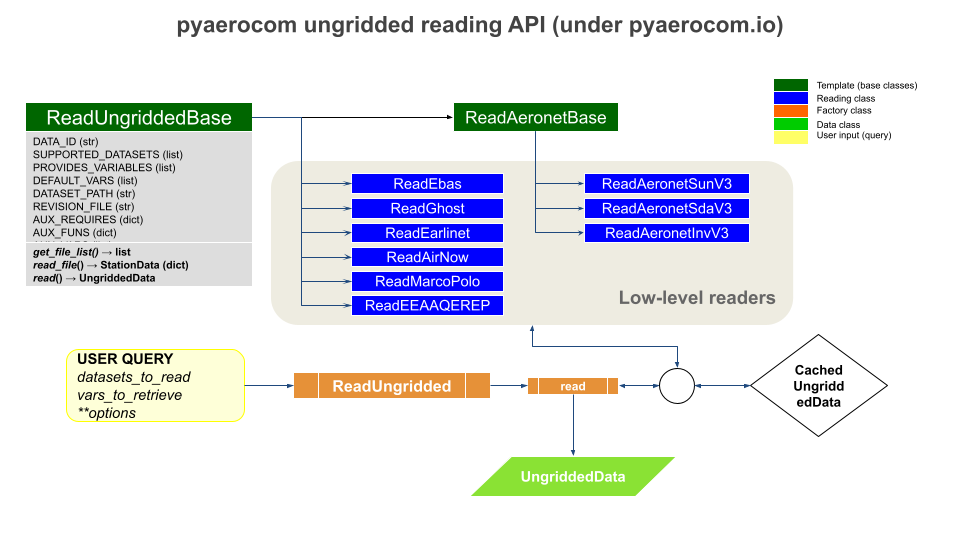

API
===

Documentation of the pyaerocom programming interface.

Data classes
------------

Gridded data
^^^^^^^^^^^^

.. automodule:: pyaerocom.griddeddata
   :members:
   :undoc-members:

Ungridded data
^^^^^^^^^^^^^^^^

.. automodule:: pyaerocom.ungriddeddata
   :members:
   :undoc-members:

Colocated data
^^^^^^^^^^^^^^^

.. automodule:: pyaerocom.colocateddata
   :members:
   :undoc-members:

Station data
^^^^^^^^^^^^

.. automodule:: pyaerocom.stationdata
   :members:
   :undoc-members:

Other data classes
^^^^^^^^^^^^^^^^^^^^

.. automodule:: pyaerocom.vertical_profile
   :members:
   :undoc-members:

Colocation routines
-------------------

Automatic colocation engine
^^^^^^^^^^^^^^^^^^^^^^^^^^^

.. automodule:: pyaerocom.colocation_auto
   :members:
   :undoc-members:

Low-level colocation methods
^^^^^^^^^^^^^^^^^^^^^^^^^^^^

.. automodule:: pyaerocom.colocation
   :members:
   :undoc-members:

Combining ungridded observations
^^^^^^^^^^^^^^^^^^^^^^^^^^^^^^^^
.. automodule:: pyaerocom.combine_vardata_ungridded
   :members:
   :undoc-members:

.. _reading:

Reading of gridded data
-----------------------

Gridded data specifies any dataset that can be represented and stored on a
regular grid within a certain domain (e.g. lat, lon time), for instance, model
output or level 3 satellite data, stored, for instance, as NetCDF files.
In pyaerocom, the underlying data object is :class:`GriddedData` and
pyaerocom supports reading of such data for different file naming conventions.

Data stored using AeroCom conventions
^^^^^^^^^^^^^^^^^^^^^^^^^^^^^^^^^^^^^^
.. automodule:: pyaerocom.io.readgridded
   :members:
   :undoc-members:

Data stored using EMEP conventions
^^^^^^^^^^^^^^^^^^^^^^^^^^^^^^^^^^^^^^
.. automodule:: pyaerocom.io.read_mscw_ctm
  :members:
  :undoc-members:

Reading of ungridded data
-------------------------

Other than gridded data, ungridded data represents data that is irregularly
sampled in space and time, for instance, observations at different locations
around the globe. Such data is represented in pyaerocom by
:class:`UngriddedData` which is essentially a point-cloud dataset. Reading of
:class:`UngriddedData` is typically specific for different observational
data records, as they typically come in various data formats using various
metadata conventions, which need to be harmonised, which is done during the
data import.

The following flowchart illustrates the architecture of ungridded reading in
pyaerocom. Below are information about the individual reading classes for each
dataset (blue in flowchart), the abstract template base classes the reading
classes are based on (dark green) and the factory class :class:`ReadUngridded`
(orange) which has registered all individual reading classes. The data classes
that are returned by the reading class are indicated in light green.

ReadUngridded factory class
^^^^^^^^^^^^^^^^^^^^^^^^^^^^^^^^^^^^

Factory class that has all reading class for the individual datasets registered.

.. automodule:: pyaerocom.io.readungridded
   :members:
   :undoc-members:

ReadUngriddedBase template class
^^^^^^^^^^^^^^^^^^^^^^^^^^^^^^^^^^^^

All ungridded reading routines are based on this template class.

.. automodule:: pyaerocom.io.readungriddedbase
   :members:
   :undoc-members:

AERONET
^^^^^^^^^^^^^^^^^^^^^^^^^^^^^^^^^^^^

All AERONET reading classes are based on the template :class:`ReadAeronetBase`
class which, in turn inherits from :class:`ReadUngriddedBase`.

.. automodule:: pyaerocom.io.readaeronetbase
   :members:
   :undoc-members:
   :inherited-members:
   :show-inheritance:

AERONET Sun (V3)
""""""""""""""""

.. automodule:: pyaerocom.io.read_aeronet_sunv3
   :members:
   :undoc-members:
   :inherited-members:
   :show-inheritance:

AERONET SDA (V3)
""""""""""""""""
.. automodule:: pyaerocom.io.read_aeronet_sdav3
   :members:
   :undoc-members:
   :inherited-members:
   :show-inheritance:

AERONET Inversion (V3)
""""""""""""""""""""""
.. automodule:: pyaerocom.io.read_aeronet_invv3
   :members:
   :undoc-members:
   :inherited-members:
   :show-inheritance:

AERONET (older versions)
""""""""""""""""""""""""

.. automodule:: pyaerocom.io.read_aeronet_sunv2
   :members:
   :undoc-members:
   :inherited-members:
   :show-inheritance:

.. automodule:: pyaerocom.io.read_aeronet_sdav2
   :members:
   :undoc-members:
   :inherited-members:
   :show-inheritance:

.. automodule:: pyaerocom.io.read_aeronet_invv2
   :members:
   :undoc-members:
   :inherited-members:
   :show-inheritance:

EARLINET
^^^^^^^^^^^^^^^^^^^^^^^^^^^^^^^^^^^^

.. automodule:: pyaerocom.io.read_earlinet
   :members:
   :undoc-members:
   :inherited-members:
   :show-inheritance:

EBAS
^^^^^^^^^^^^^^^^^^^^^^^^^^^^^^^^^^^^

.. automodule:: pyaerocom.io.read_ebas
   :members:
   :undoc-members:
   :inherited-members:
   :show-inheritance:

EBAS (low level)
""""""""""""""""

.. automodule:: pyaerocom.io.ebas_nasa_ames
   :members:
   :undoc-members:

.. automodule:: pyaerocom.io.ebas_file_index
   :members:
   :undoc-members:

.. automodule:: pyaerocom.io.ebas_varinfo
   :members:
   :undoc-members:

GHOST
^^^^^

.. automodule:: pyaerocom.io.read_ghost
   :members:
   :undoc-members:

.. _io:

Further I/O features
--------------------

.. note::

	The	:mod:`pyaerocom.io` package also includes all relevant data import and
  reading routines. These are introduced above, in Section
  :ref:`reading`.

AeroCom database browser
^^^^^^^^^^^^^^^^^^^^^^^^^^^^^^^^

.. automodule:: pyaerocom.io.aerocom_browser
   :members:
   :undoc-members:

File naming conventions
^^^^^^^^^^^^^^^^^^^^^^^^^^^^^^^^

.. automodule:: pyaerocom.io.fileconventions
   :members:
   :undoc-members:

Iris helpers
^^^^^^^^^^^^^

.. automodule:: pyaerocom.io.iris_io
   :members:
   :undoc-members:

.. automodule:: pyaerocom.io.aux_read_cubes
   :members:
   :undoc-members:

Handling of cached ungridded data objects
^^^^^^^^^^^^^^^^^^^^^^^^^^^^^^^^^^^^^^^^^^

.. automodule:: pyaerocom.io.cachehandler_ungridded
   :members:
   :undoc-members:

I/O utils
^^^^^^^^^

.. automodule:: pyaerocom.io.utils
   :members:
   :undoc-members:

I/O helpers
^^^^^^^^^^^^

.. automodule:: pyaerocom.io.helpers
   :members:
   :undoc-members:

Metadata and vocabulary standards
----------------------------------

.. automodule:: pyaerocom.metastandards
  :members:
  :undoc-members:

Variable conventions
---------------------

Helper classes and methods related to variable definitions and variable
naming and metadata conventions.

.. automodule:: pyaerocom.variable
  :members:
  :undoc-members:

Regions and  data filtering
----------------------------

Region definitions
^^^^^^^^^^^^^^^^^

.. automodule:: pyaerocom.region
   :members:
   :undoc-members:

Filter class
^^^^^^^^^^^^

.. automodule:: pyaerocom.filter
   :members:
   :undoc-members:

Land / Sea masks
^^^^^^^^^^^^^^^^

.. automodule:: pyaerocom.helpers_landsea_masks
   :members:
   :undoc-members:

Time and frequencies
--------------------

Handling of time frequencies
^^^^^^^^^^^^^^^^^^^^^^^^^^^^

.. automodule:: pyaerocom.tstype
   :members:
   :undoc-members:

Temporal resampling
^^^^^^^^^^^^^^^^^^^

.. automodule:: pyaerocom.time_resampler
   :members:
   :undoc-members:

Global constants
^^^^^^^^^^^^^^^^

.. automodule:: pyaerocom.time_config
   :members:
   :undoc-members:

Conversion of vertical coordinates
----------------------------------

.. automodule:: pyaerocom.vert_coords
   :members:
   :undoc-members:

Trends computation
------------------

Trends engine
^^^^^^^^^^^^^

.. automodule:: pyaerocom.trends_engine
   :members:
   :undoc-members:

Helper methods
^^^^^^^^^^^^^^

.. automodule:: pyaerocom.trends_helpers
   :members:
   :undoc-members:

Utils
-----

.. automodule:: pyaerocom.utils
   :members:
   :undoc-members:

Helpers
-------

.. automodule:: pyaerocom.helpers
   :members:
   :undoc-members:

Mathematical helpers
--------------------

.. automodule:: pyaerocom.mathutils
   :members:
   :undoc-members:

Geodesic calculations and topography
------------------------------------

.. automodule:: pyaerocom.geodesy
   :members:
   :undoc-members:

Units and unit conversion
-------------------------

Units helpers in base package
^^^^^^^^^^^^^^^^^^^^^^^^^^^^^

.. automodule:: pyaerocom.units_helpers
   :members:
   :undoc-members:

Units helpers in `io` sub-package
^^^^^^^^^^^^^^^^^^^^^^^^^^^^^^^^^

.. automodule:: pyaerocom.io.helpers_units
  :members:
  :undoc-members:

Plotting / visualisation (sub package `plot`)
----------------------------------------------

The :mod:`pyaerocom.plot` package contains algorithms related to data
visualisation and plotting.

Plotting maps
^^^^^^^^^^^^^

.. automodule:: pyaerocom.plot.mapping
  :members:
  :undoc-members:

Scatter plots
^^^^^^^^^^^^^^^^^^^^^^

.. automodule:: pyaerocom.plot.plotscatter
  :members:
  :undoc-members:

Time-series plots
^^^^^^^^^^^^^^^^^^

.. automodule:: pyaerocom.plot.plotseries
  :members:
  :undoc-members:

Heatmap plots
^^^^^^^^^^^^^

.. automodule:: pyaerocom.plot.heatmaps
  :members:
  :undoc-members:

Colors etc.
^^^^^^^^^^^

.. automodule:: pyaerocom.plot.config
  :members:
  :undoc-members:

Web processing (sub-package: web)
---------------------------------

This sub-package contains high level processing routines that can be used to
process AeroCom data for individual web-interfaces, such as the
`AeroCom Evaluation <https://aerocom-evaluation.met.no>`__ interface or
the `Aerosol trends <https://aerocom-trends.met.no/>`__ interface.

AeroCom Evaluation interface
^^^^^^^^^^^^^^^^^^^^^^^^^^^^

.. automodule:: pyaerocom.web.aerocom_evaluation
   :members:
   :undoc-members:

Helper methods for evaluation interface
""""""""""""""""""""""""""""""""""""""""

.. automodule:: pyaerocom.web.helpers_evaluation_iface
   :members:
   :undoc-members:

Aerosol Trends interface
^^^^^^^^^^^^^^^^^^^^^^^^^^^^

.. automodule:: pyaerocom.web.trends_evaluation
   :members:
   :undoc-members:

Helper methods for trends interface
""""""""""""""""""""""""""""""""""""""""

.. automodule:: pyaerocom.web.helpers_trends_iface
  :members:
  :undoc-members:

Helpers of web-subpackage
^^^^^^^^^^^^^^^^^^^^^^^^^

.. automodule:: pyaerocom.web.helpers
   :members:
   :undoc-members:

High level utility methods
^^^^^^^^^^^^^^^^^^^^^^^^^^

.. automodule:: pyaerocom.web.utils
   :members:
   :undoc-members:

Configuration and global constants
----------------------------------

Basic configuration class
^^^^^^^^^^^^^^^^^^^^^^^^^

Will be initiated on input and is accessible via `pyaerocom.const`.

.. automodule:: pyaerocom.config
   :members:
   :undoc-members:

Config defaults related to gridded data
^^^^^^^^^^^^^^^^^^^^^^^^^^^^^^^^^^^^^^^

.. automodule:: pyaerocom.grid_io
   :members:
   :undoc-members:

Config details related to observations
^^^^^^^^^^^^^^^^^^^^^^^^^^^^^^^^^^^^^^

.. automodule:: pyaerocom.obs_io
   :members:
   :undoc-members:

Molar masses and related helpers
^^^^^^^^^^^^^^^^^^^^^^^^^^^^^^^^

.. automodule:: pyaerocom.molmasses
   :members:
   :undoc-members:

Access to minimal test dataset
------------------------------

.. automodule:: pyaerocom.testdata_access
   :members:
   :undoc-members:
