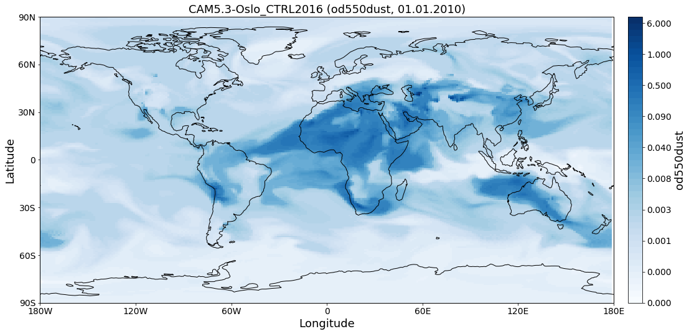

.. pyaerocom documentation master file, created by
   sphinx-quickstart on Thu Apr  5 10:59:20 2018.
   You can adapt this file completely to your liking, but it should at least
   contain the root `toctree` directive.

***************************
The Pyaerocom website
***************************

Official website of Pyaerocom, a Python package containing reading, post analysis and visualisation tools for the `AEROCOM project <http://aerocom.met.no/protocol.html>`__.

.. toctree::
   :maxdepth: 6
   :caption: Contents:

   readme
   tutorials
   api
   api_testsuite
   config_files

Indices and tables
==================

* :ref:`genindex`
* :ref:`modindex`
* :ref:`search`
