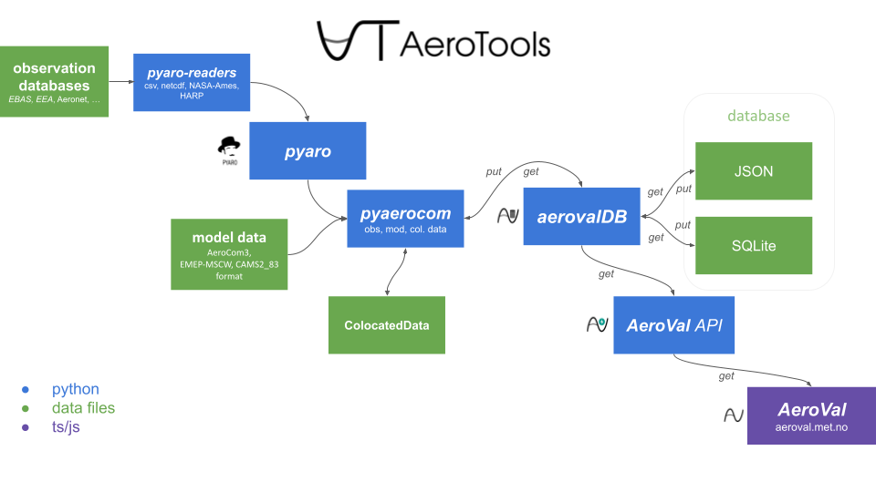

.. pyaerocom documentation master file, created by
   sphinx-quickstart on Thu Apr  5 10:59:20 2018.
   You can adapt this file completely to your liking, but it should at least
   contain the root `toctree` directive.

.. figure:: aerotools_full_logo.png

***************************
pyaerocom
***************************
**A building block of AeroTools**

Official website of pyaerocom, a Python package for climate and air quality model evaluation. 

   MET Norway's AeroTools workflow

.. toctree::
   :maxdepth: 1
   :caption: Contents:

   intro
   install
   pyaerocom-tutorials/index
   api
   api-aeroval
   aeroval-examples
   cli

Indices and tables
==================

* :ref:`genindex`
* :ref:`modindex`
* :ref:`search`

Issues?
=======
Please `submit an issue <https://github.com/metno/pyaerocom/issues>`__ if you would like to see a feature or experience a bug.
