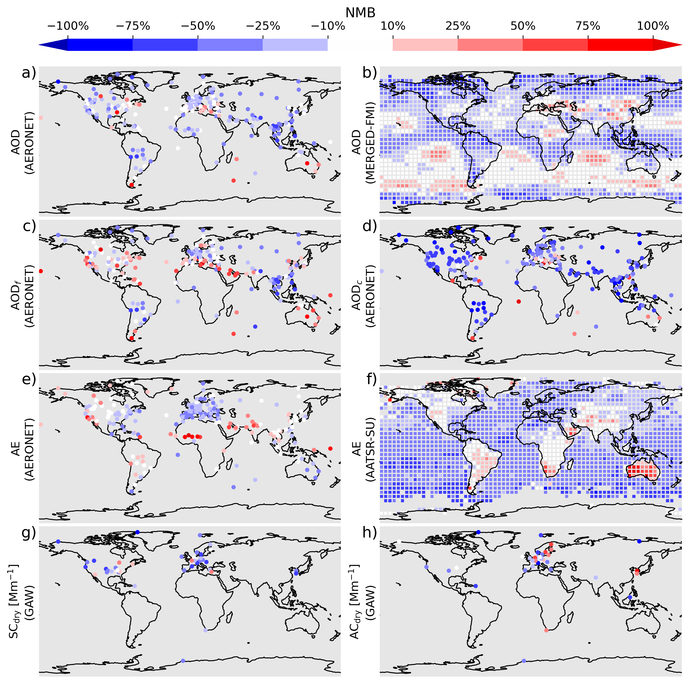

.. pyaerocom documentation master file, created by
   sphinx-quickstart on Thu Apr  5 10:59:20 2018.
   You can adapt this file completely to your liking, but it should at least
   contain the root `toctree` directive.

***************************
pyaerocom
***************************

Official website of pyaerocom, a Python package for climate and air quality model evaluation.

  Bias maps of the AeroCom ensemble median compared to several observation records (Figure 5 from `Gliß et al., 2021 <https://acp.copernicus.org/articles/21/87/2021/acp-21-87-2021.html>`__, processed with pyaerocom)

.. toctree::
   :maxdepth: 1
   :caption: Contents:

   intro
   install
   pyaerocom-tutorials/index
   api
   api-aeroval
   aeroval-examples
   cli

Indices and tables
==================

* :ref:`genindex`
* :ref:`modindex`
* :ref:`search`

Issues?
=======
Please `submit an issue <https://github.com/metno/pyaerocom/issues>`__ if you would like to see a feature or experience a bug.
