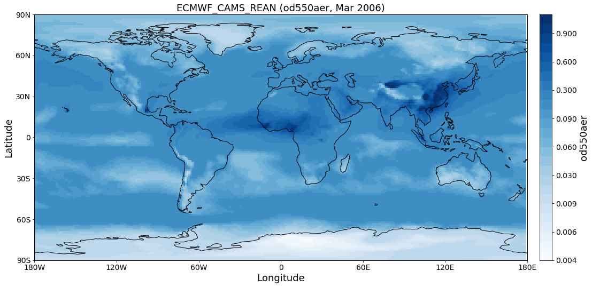

Setup for AeroCom users database (`aerocom-users.met.no <https://wiki.met.no/aerocom/data_retrieval>`__)
~~~~~~~~~~~~~~~~~~~~~~~~~~~~~~~~~~~~~~~~~~~~~~~~~~~~~~~~~~~~~~~~~~~~~~~~~~~~~~~~~~~~~~~~~~~~~~~~~~~~~~~~

Getting access to the user-server
^^^^^^^^^^^^^^^^^^^^^^^^^^^^^^^^^

Please follow the `instructions provided
here <https://wiki.met.no/aerocom/data_retrieval>`__. After you have
tested your access as described in the link, the easiest way to set it
up for pyaerocom is by mounting the remote user-server into a local
directory of your choice.

Here, the AEROCOM user-server (that is, the directory
***/metno/aerocom-users-database/*** on the ***aerocom-users.met.no***)
is mounted to the following location:

.. code:: ipython3

    import os
    HOME = os.path.expanduser('~') + '/'
    
    DATA_DIR = HOME + 'aerocom-users-database/'
    os.listdir(DATA_DIR)

.. parsed-literal::

    ['AEROCOM_EMISSIONS',
     'AEROCOM-PHASE-II-IND2',
     'EURODELTA',
     'AEROCOM-PHASE-III',
     'AEROCOM-PHASE-III-Trend',
     'HTAP-PHASE-II',
     'AEROCOM-PHASE-II',
     'AEROCOM-PHASE-II-IND3',
     'AEROCOM-PHASE-III-CTRL2018',
     'SATELLITE-DATA',
     'HTAP-PHASE-I',
     'AEROCOM-PHASE-I',
     'AMAP',
     'ACCMIP',
     'AEROCOM-PHASE-I-IND',
     'AEROCOM-PHASE-II-PRESCRIBED-2013',
     'BACCHUS',
     'C3S-Aerosol',
     'ECMWF',
     'ECLIPSE',
     'CCI-Aerosol']

If you have mounted correctly, this should output a list of data
directories as found in the corresponding directory on the server.

NOTE
''''

Currently, the user-server does not include any ungridded data (e.g.
from Aeronet or EBAS networks).

Preparing pyaerocom
^^^^^^^^^^^^^^^^^^^

.. code:: ipython3

    import pyaerocom as pya
    pya.__version__ # NEEDS to be >= 0.7.0

.. parsed-literal::

    Init data paths for lustre

.. parsed-literal::

    0.007809877395629883 s

.. parsed-literal::

    '0.7.2.dev1'

**Note**: The import of pyaerocom will not output *Init data paths for
lustre* if you are not working at METNo (or if you do but you do not
have *lustre* mounted at your root). This is because the METNo internal
database structure for AEROCOM data will only be loaded and initiated if
access to this database can actually be established.

Updating the base directory
'''''''''''''''''''''''''''

Change the data base directory to the mounted subdirectory
*aerocom-users-database* and it will automatically recognise the
corresponding sub-directory structure for you.

.. code:: ipython3

    pya.const.BASEDIR = DATA_DIR

.. parsed-literal::

    Initiating directories for AEROCOM users database

You should see the output message
``Initiating directories for AEROCOM users database`` when doing this.
If you do not, something may be wrong with you mount or you have an
outdated version of *pyaerocom* (you need at least version 0.7.0) for
this to work.

Now you are ready to go
^^^^^^^^^^^^^^^^^^^^^^^

You can start with searching the database for a model (or satellite) of
you interest.

.. code:: ipython3

    pya.browse_database('ECMWF*')

.. parsed-literal::

    Found more than 20 matches for based on input string ECMWF*:
    
    Matches: ['ECMWF_GEUH', 'ECMWF_GBST', 'ECMWF_EAC3_CLIM', 'ECMWF_EZUB', 'ECMWF_GZHY_96h', 'ECMWF_GKVV_96h', 'ECMWF_FI8E', 'ECMWF_FGKY', 'ECMWF_FBOVclim', 'ECMWF_FBOV_1x1', 'ECMWF_FWU0_96h', 'ECMWF_GTYL', 'ECMWF_GNHB_96h', 'ECMWF_G1UT', 'ECMWF_FLV2', 'ECMWF_CNTRL_96h', 'ECMWF_G1WY', 'ECMWF_G4E2test', 'ECMWF_0001_12Z', 'ECMWF_CAMS_REAN', 'ECMWF_GQK3', 'ECMWF_GU42', 'ECMWF_GN29', 'ECMWF_GSYG_96h', 'ECMWF_FZPR', 'ECMWF_FJ6U', 'ECMWF_GJJH_96h', 'ECMWF_FNYP_96h', 'ECMWF_0001_12Z_96h', 'ECMWF_F93I_96h', 'ECMWF_GKVV', 'ECMWF_FO4R', 'ECMWF_EYIM', 'ECMWF_G148', 'ECMWF_FSZD', 'ECMWF_GNAR', 'ECMWF_OSUITE_12Z', 'ECMWF_FTKI', 'ECMWF_OSUITE-NOSS', 'ECMWF_G4E2_96h', 'ECMWF_G4O2', 'ECMWF_GU42_96h', 'ECMWF_GZNU', 'ECMWF_ESUITE_0067_96h', 'ECMWF_EXLZ', 'ECMWF_GEUH_96h', 'ECMWF_GAEN', 'ECMWF_0001_96h', 'ECMWF_FBOV', 'ECMWF_FWU0', 'ECMWF_G2AA', 'ECMWF_GXB2', 'ECMWF_FNYP', 'ECMWF_GOKG', 'ECMWF_GWOE', 'ECMWF_FMNG', 'ECMWF_0001', 'ECMWF_GSTX', 'ECMWF_GXUV', 'ECMWF_EAC3', 'ECMWF_FA50', 'ECMWF_GQ7S', 'ECMWF_FH9Z', 'ECMWF_0067', 'ECMWF_CNTRL', 'ECMWF_GQ7U', 'ECMWF_F93I_48h', 'ECMWF_G1UX', 'ECMWF_GP1P', 'ECMWF_OSUITEtest', 'ECMWF_FWR5', 'ECMWF_G4E2', 'ECMWF_OSUITE', 'ECMWF_OSUITE_noFilter', 'ECMWF_GQM5', 'ECMWF_GSYG', 'ECMWF_FZPR_96h', 'ECMWF_FBOVtest', 'ECMWF_ESUITE_0067', 'ECMWF_G4O2_96h', 'ECMWF_MACC_REAN', 'ECMWF_0001_T511', 'ECMWF_0070', 'ECMWF_GYA6', 'ECMWF_F93I_72h', 'ECMWF_GLS8', 'ECMWF_G4E2test500', 'ECMWF_F026', 'ECMWF_REAN', 'ECMWF_GSTZ', 'ECMWF_FTKI_96h', 'ECMWF_GP1P_96h', 'ECMWF_FI91', 'ECMWF_GJJH', 'ECMWF', 'ECMWF_G9RR_96h', 'ECMWF_F93I', 'ECMWF_GMHE', 'ECMWF_OSUITE_96h', 'ECMWF_0067_96h', 'ECMWF_GNHB', 'ECMWF_OSUITE_12Z_96h', 'ECMWF_GZHY', 'ECMWF_G199', 'ECMWF_FG6N', 'ECMWF_G9RR', 'ECMWF-IFS-CY42R1-CAMS-RA-CTRL_AP3-CTRL2016-PD', 'ECMWF-IFS-CY43R1-CAMS-NITRATE-DEV_AP3-CTRL2016-PD', 'ECMWF_INSITU', 'ECMWF-IFS-CY42R1-CAMS-RA-CTRL_AP3-CTRL2016-PD', 'ECMWF-IFS-CY43R1-CAMS-NITRATE-DEV_AP3-CTRL2016-PD']
    
    To receive more detailed information, please specify search ID more accurately

Reading of ECMWF IFS reanalysis data.

.. code:: ipython3

    gridded_reader = pya.io.ReadGridded('ECMWF_CAMS_REAN')
    print(gridded_reader)

.. parsed-literal::

    
    Pyaerocom ReadGridded
    ---------------------
    Model ID: ECMWF_CAMS_REAN
    Data directory: /home/jonasg/aerocom-users-database//ECMWF/ECMWF_CAMS_REAN/renamed
    Available variables: ['ang4487aer', 'ec532aer3D', 'od440aer', 'od550aer', 'od550bc', 'od550dust', 'od550oa', 'od550so4', 'od550ss', 'od865aer']
    Available years: [2003, 2004, 2005, 2006, 2007, 2008, 2009, 2010, 2011, 2012, 2013, 2014, 2015, 2016, 2017, 9999]
    Available time resolutions ['daily', 'monthly']

.. code:: ipython3

    od550aer = gridded_reader.read_var(var_name='od550aer', ts_type='monthly')
    print(od550aer)

.. parsed-literal::

    /home/jonasg/anaconda3/lib/python3.6/site-packages/iris/fileformats/_pyke_rules/compiled_krb/fc_rules_cf_fc.py:2029: UserWarning: Gracefully filling 'lat' dimension coordinate masked points
      warnings.warn(msg.format(str(cf_coord_var.cf_name)))
    /home/jonasg/anaconda3/lib/python3.6/site-packages/iris/fileformats/_pyke_rules/compiled_krb/fc_rules_cf_fc.py:2029: UserWarning: Gracefully filling 'lon' dimension coordinate masked points
      warnings.warn(msg.format(str(cf_coord_var.cf_name)))
    /home/jonasg/anaconda3/lib/python3.6/site-packages/iris/fileformats/_pyke_rules/compiled_krb/fc_rules_cf_fc.py:2029: UserWarning: Gracefully filling 'lat' dimension coordinate masked points
      warnings.warn(msg.format(str(cf_coord_var.cf_name)))
    /home/jonasg/anaconda3/lib/python3.6/site-packages/iris/fileformats/_pyke_rules/compiled_krb/fc_rules_cf_fc.py:2029: UserWarning: Gracefully filling 'lon' dimension coordinate masked points
      warnings.warn(msg.format(str(cf_coord_var.cf_name)))
    /home/jonasg/anaconda3/lib/python3.6/site-packages/iris/fileformats/_pyke_rules/compiled_krb/fc_rules_cf_fc.py:2029: UserWarning: Gracefully filling 'lat' dimension coordinate masked points
      warnings.warn(msg.format(str(cf_coord_var.cf_name)))
    /home/jonasg/anaconda3/lib/python3.6/site-packages/iris/fileformats/_pyke_rules/compiled_krb/fc_rules_cf_fc.py:2029: UserWarning: Gracefully filling 'lon' dimension coordinate masked points
      warnings.warn(msg.format(str(cf_coord_var.cf_name)))
    /home/jonasg/anaconda3/lib/python3.6/site-packages/iris/fileformats/_pyke_rules/compiled_krb/fc_rules_cf_fc.py:2029: UserWarning: Gracefully filling 'lat' dimension coordinate masked points
      warnings.warn(msg.format(str(cf_coord_var.cf_name)))
    /home/jonasg/anaconda3/lib/python3.6/site-packages/iris/fileformats/_pyke_rules/compiled_krb/fc_rules_cf_fc.py:2029: UserWarning: Gracefully filling 'lon' dimension coordinate masked points
      warnings.warn(msg.format(str(cf_coord_var.cf_name)))

.. parsed-literal::

    pyaerocom.GriddedData: ECMWF_CAMS_REAN
    Grid data: Aerosol optical depth at 550 nm / (1) (time: 60; latitude: 161; longitude: 320)
         Dimension coordinates:
              time                             x             -               -
              latitude                         -             x               -
              longitude                        -             -               x
         Attributes:
              Conventions: CF-1.6
              NCO: "4.5.4"
              history: Thu Nov 23 16:24:26 2017: ncrcat -O ECMWF_CAMS_REAN.daily.od550aer.2003.nc.01.nc...
              nco_openmp_thread_number: 1
         Cell methods:
              mean: step
              mean: time

.. parsed-literal::

    /home/jonasg/anaconda3/lib/python3.6/site-packages/iris/fileformats/_pyke_rules/compiled_krb/fc_rules_cf_fc.py:2029: UserWarning: Gracefully filling 'lat' dimension coordinate masked points
      warnings.warn(msg.format(str(cf_coord_var.cf_name)))
    /home/jonasg/anaconda3/lib/python3.6/site-packages/iris/fileformats/_pyke_rules/compiled_krb/fc_rules_cf_fc.py:2029: UserWarning: Gracefully filling 'lon' dimension coordinate masked points
      warnings.warn(msg.format(str(cf_coord_var.cf_name)))

.. code:: ipython3

    od550aer.start, od550aer.stop, len(od550aer.time_stamps())

.. parsed-literal::

    (numpy.datetime64('2003-01-01T00:00:00.000000'),
     numpy.datetime64('2007-12-31T23:59:59.999999'),
     60)

Plot map of AOD
^^^^^^^^^^^^^^^

.. code:: ipython3

    ax = od550aer.quickplot_map(time_idx='Mar 2006')

Interactive map plotting
^^^^^^^^^^^^^^^^^^^^^^^^

.. code:: ipython3

    from ipywidgets import interact, fixed
    interact(od550aer.quickplot_map, time_idx=(0, 59), xlim=fixed((-180, 180)), 
             ylim=fixed((-90, 90)), vmin=(0, 0.5), vmax=(0.5, 1.5), log_scale=fixed(True),
             add_zero=True)

.. image:: tut001_setup_userserver/tut001_setup_userserver_19_0.png

.. image:: tut001_setup_userserver/tut001_setup_userserver_19_1.png

.. parsed-literal::

    <function ipywidgets.widgets.interaction._InteractFactory.__call__.<locals>.<lambda>(*args, **kwargs)>

