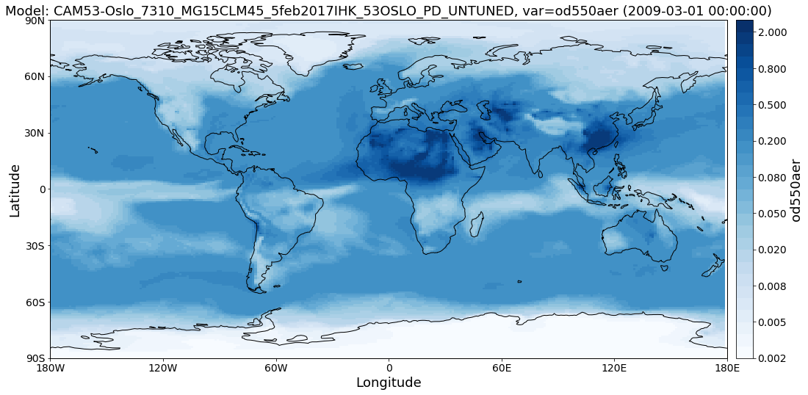
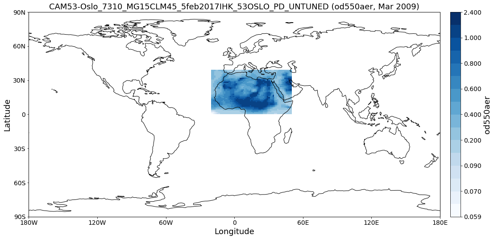
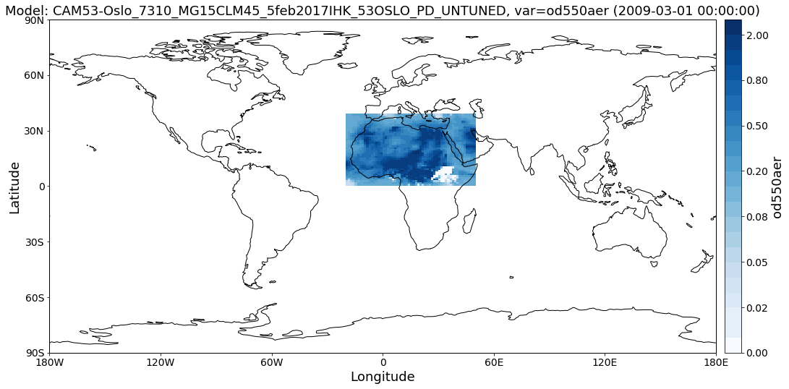
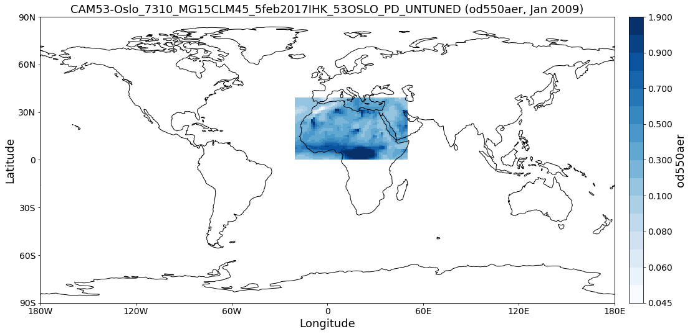
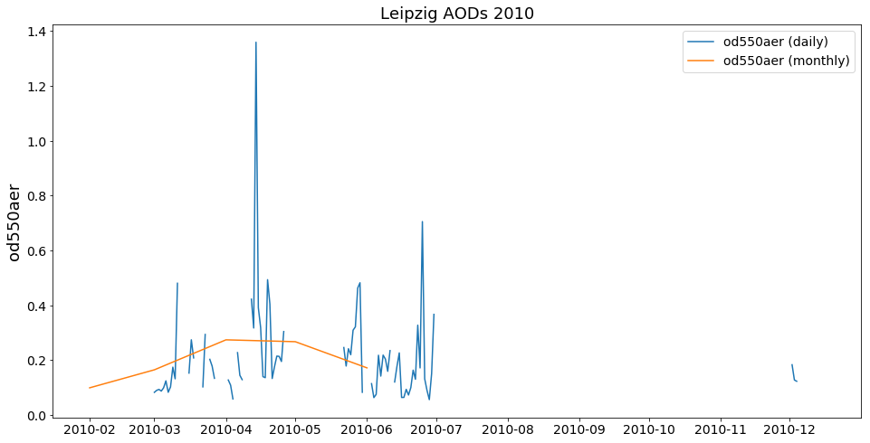
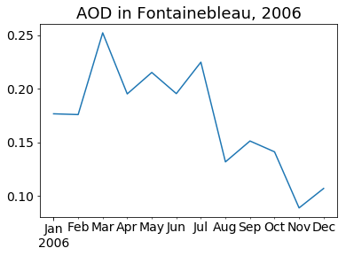

Getting started
~~~~~~~~~~~~~~~

This notebook is meant to give a quick introduction into the main
features and workflows of
`pyaerocom <http://aerocom.met.no/pyaerocom/>`__.

This includes brief introductions into the following features:

-  Finding model and observation data on the AeroCom servers (method
   ``browse_database``).
-  Reading of **gridded** model data (``ReadGridded`` class).
-  Reading of **ungridded** observation data (``ReadUngridded`` class).
-  Working with **gridded** data (``GriddedData`` class).
-  Working with **ungridded** data (``UngriddedData`` class).
-  Retrieving and working with data from individual stations
   (``StationData`` class).
-  **Colocation** of model data with all stations from an observation
   network.

It ends with a colocation of CAM53-Oslo model AODs both all-sky and
clear-sky with Aeronet Sun V3 level 2 data.

Prerequisites
^^^^^^^^^^^^^

-  In order to run this notebook, you need to be connected to the
   AeroCom post processing servers (PPI).
-  If you have PPI (/lustre/) mounted on your local machine you need to
   update the basic data directory after importing pyaerocom as follows:
   ``import pyaerocom as pya  pya.const.BASEDIR = <path_where_lustre_is_mounted>``

Pyaerocom API flowchart (minimal)
^^^^^^^^^^^^^^^^^^^^^^^^^^^^^^^^^

The following flowchart illustrates the minimal workflow to create
standard output in pyaerocom based on a user query (that typically
comprises a model ID and observation ID as well as one (or more)
variable(s) of interest (products indicated in red are not available
yet, date of latest update: 4-10-2018).

.. code:: ipython3

    from IPython.display import Image
    flowchart = Image(filename=('../suppl/pyaerocom_basic_flowchart.png'))
    flowchart

.. image:: tut00_get_started/tut00_get_started_2_0.png

A user query typically comprises a model (+ experiment -> model run) and
an observation network, which are supposed to be compared.

**Note**: the flowchart depicts a situation, where the data from the
observation network is *ungridded*, that is, the data is not available
in a gridded format such as NetCDF, but, for instance, in the form of
column seperated text files (as is the case for Aeronet data, which is
used as an example here and included in the test dataset). For
``gridded`` observations (e.g. satellite data), the flowchart is
equivalent but with ``ReadGridded`` class and ``GriddedData`` for the
observation branch (and without caching).

This notebook illustrates and briefly discusses the individual aspects
displayed in the flowchart.

.. code:: ipython3

    import pyaerocom as pya

.. parsed-literal::

    Initating pyaerocom configuration
    Checking database access...
    Checking access to: /lustre/storeA
    Access to lustre database: True
    Init data paths for lustre
    Expired time: 0.018 s

Check data directory
''''''''''''''''''''

By default, pyaerocom assumes that the AEROCOM database can be accessed
(cf. top of flowchart), that is, it initiates all data query paths
relative to the database server path names.

.. code:: ipython3

    pya.const.BASEDIR

.. parsed-literal::

    '/lustre/storeA/project/aerocom'

**NOTE**: Execution of the following lines will only work if you are
connected to the AEROCOM data server or if you have access to the
pyaerocom testdataset. The latter can be retrieved upon request (please
contact jonasg@met.no).

Reading of and working with *gridded* model data (``ReadGridded`` and ``GriddedData`` classes)
^^^^^^^^^^^^^^^^^^^^^^^^^^^^^^^^^^^^^^^^^^^^^^^^^^^^^^^^^^^^^^^^^^^^^^^^^^^^^^^^^^^^^^^^^^^^^^

This section illustrates the reading of gridded data as well as some
features of the ``GriddedData`` class of *pyaerocom*. First, however, we
have to find a valid model ID for the reading (cf. flow chart).

Find model data
'''''''''''''''

The database contains data from the CAM53-Oslo model, which is used in
the following. You can use the ``browse_database`` function of pyaerocom
to find model ID’s (which can be quite cryptic sometimes) using wildcard
pattern search.

.. code:: ipython3

    pya.browse_database('CAM53*-Oslo*UNTUNED*')

.. parsed-literal::

    
    Pyaerocom ReadGridded
    ---------------------
    Model ID: CAM53-Oslo_7310_MG15CLM45_5feb2017IHK_53OSLO_PI_UNTUNED
    Data directory: /lustre/storeA/project/aerocom/aerocom2/NorESM_SVN_TEST/CAM53-Oslo_7310_MG15CLM45_5feb2017IHK_53OSLO_PI_UNTUNED/renamed
    Available variables: ['abs440aer', 'abs440aercs', 'abs500aer', 'abs5503Daer', 'abs550aer', 'abs550bc', 'abs550dryaer', 'abs550dust', 'abs550oa', 'abs550so4', 'abs550ss', 'abs670aer', 'abs870aer', 'airmass', 'area', 'asy3Daer', 'bc5503Daer', 'cheaqpso4', 'chegpso4', 'chepso2', 'cl3D', 'clt', 'drybc', 'drydms', 'drydust', 'dryoa', 'dryso2', 'dryso4', 'dryss', 'ec5503Daer', 'ec550dryaer', 'emibc', 'emidms', 'emidust', 'emioa', 'emiso2', 'emiso4', 'emiss', 'hus', 'landf', 'loadbc', 'loaddms', 'loaddust', 'loadoa', 'loadso2', 'loadso4', 'loadss', 'mmraerh2o', 'mmrbc', 'mmrdu', 'mmroa', 'mmrso4', 'mmrss', 'od440aer', 'od440csaer', 'od550aer', 'od550aerh2o', 'od550bc', 'od550csaer', 'od550dust', 'od550lt1aer', 'od550lt1dust', 'od550oa', 'od550so4', 'od550ss', 'od670aer', 'od870aer', 'od870csaer', 'orog', 'precip', 'pressure', 'ps', 'rlds', 'rlus', 'rlut', 'rlutcs', 'rsds', 'rsdscs', 'rsdt', 'rsus', 'rsut', 'sconcbc', 'sconcdms', 'sconcdust', 'sconcoa', 'sconcso2', 'sconcso4', 'sconcss', 'temp', 'vmrdms', 'vmrso2', 'wetbc', 'wetdms', 'wetdust', 'wetoa', 'wetso2', 'wetso4', 'wetss']
    Available years: [9999]
    Available time resolutions ['monthly']
    
    Pyaerocom ReadGridded
    ---------------------
    Model ID: CAM53-Oslo_7310_MG15CLM45_5feb2017IHK_53OSLO_PD_UNTUNED
    Data directory: /lustre/storeA/project/aerocom/aerocom2/NorESM_SVN_TEST/CAM53-Oslo_7310_MG15CLM45_5feb2017IHK_53OSLO_PD_UNTUNED/renamed
    Available variables: ['abs440aer', 'abs440aercs', 'abs500aer', 'abs5503Daer', 'abs550aer', 'abs550aercs', 'abs550bc', 'abs550dryaer', 'abs550dust', 'abs550oa', 'abs550so4', 'abs550ss', 'abs670aer', 'abs870aer', 'airmass', 'ang4487aer', 'ang4487csaer', 'area', 'asy3Daer', 'bc5503Daer', 'cheaqpso4', 'chegpso4', 'chepso2', 'cl3D', 'clt', 'drybc', 'drydms', 'drydust', 'dryoa', 'dryso2', 'dryso4', 'dryss', 'ec5503Daer', 'ec550dryaer', 'emibc', 'emidms', 'emidust', 'emioa', 'emiso2', 'emiso4', 'emiss', 'hus', 'landf', 'loadbc', 'loaddms', 'loaddust', 'loadoa', 'loadso2', 'loadso4', 'loadss', 'mmraerh2o', 'mmrbc', 'mmrdu', 'mmroa', 'mmrso4', 'mmrss', 'od440aer', 'od440csaer', 'od550aer', 'od550aerh2o', 'od550bc', 'od550csaer', 'od550dust', 'od550lt1aer', 'od550lt1dust', 'od550oa', 'od550so4', 'od550ss', 'od670aer', 'od870aer', 'od870csaer', 'orog', 'precip', 'pressure', 'ps', 'rlds', 'rlus', 'rlut', 'rlutcs', 'rsds', 'rsdscs', 'rsdt', 'rsus', 'rsut', 'sconcbc', 'sconcdms', 'sconcdust', 'sconcoa', 'sconcso2', 'sconcso4', 'sconcss', 'temp', 'vmrdms', 'vmrso2', 'wetbc', 'wetdms', 'wetdust', 'wetoa', 'wetso2', 'wetso4', 'wetss']
    Available years: [2004, 2005, 2006, 2007, 2008, 2009, 2010, 9999]
    Available time resolutions ['monthly']

Read Aerosol optical depth at 550 nm
''''''''''''''''''''''''''''''''''''

Import both clear-sky (*cs* in variable name) and all-sky data.

.. code:: ipython3

    import warnings
    warnings.filterwarnings('ignore')
    reader = pya.io.ReadGridded('CAM53-Oslo_7310_MG15CLM45_5feb2017IHK_53OSLO_PD_UNTUNED')
    od550aer = reader.read_var('od550aer')
    od550csaer = reader.read_var('od550csaer')

Both data objects are instances of class
`GriddedData <http://aerocom.met.no/pyaerocom/api.html#module-pyaerocom.griddeddata>`__
which is based on the
`Cube <https://scitools.org.uk/iris/docs/v1.9.0/html/iris/iris/cube.html#iris.cube.Cube>`__
class (`iris
library <https://scitools.org.uk/iris/docs/v1.9.0/html/index.html>`__)
and features very similar functionality and more.

Some of these features are introduced below.

Overview of what is in the data
'''''''''''''''''''''''''''''''

Simply print the object.

.. code:: ipython3

    print(od550aer)

.. parsed-literal::

    pyaerocom.GriddedData: CAM53-Oslo_7310_MG15CLM45_5feb2017IHK_53OSLO_PD_UNTUNED
    Grid data: Aerosol optical depth at 500nm / (1) (time: 84; latitude: 192; longitude: 288)
         Dimension coordinates:
              time                            x             -               -
              latitude                        -             x               -
              longitude                       -             -               x
         Attributes:
              Conventions: CF-1.0
              NCO: 4.3.7
              Version: $Name$
              case: 53OSLO_PD_UNTUNED
              history: Thu Feb  9 11:05:21 2017: ncatted -O -a units,od550aer,o,c,1 /projects/NS2345K/CAM-Oslo/DO_AEROCOM/CAM53-Oslo_7310_MG15CLM45_5feb2017IHK_53OSLO_PD_UNTUNED/renamed/aerocom3_CAM53-Oslo_7310_MG15CLM45_5feb2017IHK_53OSLO_PD_UNTUNED_od550aer_Column_2004_monthly.nc
    Thu...
              host: hexagon-2
              initial_file: /work/shared/noresm/inputdata/atm/cam/inic/fv/cami-mam3_0000-01-01_0.9...
              logname: ihkarset
              nco_openmp_thread_number: 1
              revision_Id: $Id$
              source: CAM
              title: UNSET
              topography_file: /work/shared/noresm/inputdata/noresm-only/inputForNudging/ERA_f09f09_3...
         Cell methods:
              mean: time

.. code:: ipython3

    print(od550csaer)

.. parsed-literal::

    pyaerocom.GriddedData: CAM53-Oslo_7310_MG15CLM45_5feb2017IHK_53OSLO_PD_UNTUNED
    Grid data: Clear air Aerosol optical depth at 550nm / (1) (time: 84; latitude: 192; longitude: 288)
         Dimension coordinates:
              time                                      x             -               -
              latitude                                  -             x               -
              longitude                                 -             -               x
         Attributes:
              Conventions: CF-1.0
              NCO: 4.3.7
              Version: $Name$
              case: 53OSLO_PD_UNTUNED
              history: Thu Feb  9 11:05:16 2017: ncatted -O -a units,od550csaer,o,c,1 /projects/NS2345K/CAM-Oslo/DO_AEROCOM/CAM53-Oslo_7310_MG15CLM45_5feb2017IHK_53OSLO_PD_UNTUNED/renamed/aerocom3_CAM53-Oslo_7310_MG15CLM45_5feb2017IHK_53OSLO_PD_UNTUNED_od550csaer_Column_2004_monthly.nc
    Thu...
              host: hexagon-2
              initial_file: /work/shared/noresm/inputdata/atm/cam/inic/fv/cami-mam3_0000-01-01_0.9...
              logname: ihkarset
              nco_openmp_thread_number: 1
              revision_Id: $Id$
              source: CAM
              title: UNSET
              topography_file: /work/shared/noresm/inputdata/noresm-only/inputForNudging/ERA_f09f09_3...
         Cell methods:
              mean: time

Access time stamps
''''''''''''''''''

Time stamps are represented as numerical values with respect to a
reference date and frequency, according to the CF conventions. They can
be accessed via the ``time`` attribute of the data class.

.. code:: ipython3

    od550aer.time

.. parsed-literal::

    DimCoord(array([   0.,   31.,   60.,   91.,  121.,  152.,  182.,  213.,  244.,
            274.,  305.,  335.,  366.,  397.,  425.,  456.,  486.,  517.,
            547.,  578.,  609.,  639.,  670.,  700.,  731.,  762.,  790.,
            821.,  851.,  882.,  912.,  943.,  974., 1004., 1035., 1065.,
           1096., 1127., 1155., 1186., 1216., 1247., 1277., 1308., 1339.,
           1369., 1400., 1430., 1461., 1492., 1521., 1552., 1582., 1613.,
           1643., 1674., 1705., 1735., 1766., 1796., 1827., 1858., 1886.,
           1917., 1947., 1978., 2008., 2039., 2070., 2100., 2131., 2161.,
           2192., 2223., 2251., 2282., 2312., 2343., 2373., 2404., 2435.,
           2465., 2496., 2526.]), standard_name='time', units=Unit('days since 2004-01-01 00:00:00', calendar='gregorian'))

You may also want the time-stamps in the form of actual datetime-like
objects. These can be computed using the ``time_stamps()`` method:

.. code:: ipython3

    od550aer.time_stamps()[0:3]

.. parsed-literal::

    array(['2004-01-01T00:00:00.000000', '2004-02-01T00:00:00.000000',
           '2004-03-01T00:00:00.000000'], dtype='datetime64[us]')

Plotting maps
'''''''''''''

Maps of individual time stamps can be plotted using the quickplot_map
method.

.. code:: ipython3

    fig1 = od550aer.quickplot_map('2009-3-15')
    fig2 = od550csaer.quickplot_map('2009-3-15')

.. image:: tut00_get_started/tut00_get_started_23_1.png

Filtering
'''''''''

Regional filtering can be performed using the
`Filter <http://aerocom.met.no/pyaerocom/api.html#module-pyaerocom.filter>`__
class (cf. flowchart above).

An overview of available default regions can be accessed via:

.. code:: ipython3

    print(pya.region.get_all_default_region_ids())

.. parsed-literal::

    ['WORLD', 'EUROPE', 'ASIA', 'AUSTRALIA', 'CHINA', 'INDIA', 'NAFRICA', 'SAFRICA', 'SAMERICA', 'NAMERICA']

Now let’s go for north Africa. Create instance of Filter class:

.. code:: ipython3

    f = pya.Filter('NAFRICA')
    f

.. parsed-literal::

    Filter([('_name', 'NAFRICA-wMOUNTAINS'),
            ('_region',
             Region NAFRICA Region([('_name', 'NAFRICA'), ('lon_range', [-20, 50]), ('lat_range', [0, 40]), ('lon_range_plot', [-20, 50]), ('lat_range_plot', [0, 40]), ('lon_ticks', None), ('lat_ticks', None)])),
            ('lon_range', [-20, 50]),
            ('lat_range', [0, 40]),
            ('alt_range', None)])

… and apply to the two data objects (this can be done by calling the
filter with the corresponding data class as input parameter):

.. code:: ipython3

    od550aer_nafrica = f(od550aer)
    od550csaer_nafrica = f(od550csaer)

Compare shapes:

.. code:: ipython3

    od550aer_nafrica

.. parsed-literal::

    pyaerocom.GriddedData
    Grid data: <iris 'Cube' of Aerosol optical depth at 500nm / (1) (time: 84; latitude: 42; longitude: 57)>

.. code:: ipython3

    od550aer

.. parsed-literal::

    pyaerocom.GriddedData
    Grid data: <iris 'Cube' of Aerosol optical depth at 500nm / (1) (time: 84; latitude: 192; longitude: 288)>

As you can see, the filtered object is reduced in the longitude and
latitude dimension. Let’s plot the two new objects:

.. code:: ipython3

    ax1 = od550aer_nafrica.quickplot_map('2009-3-15')
    ax2 = od550csaer_nafrica.quickplot_map('2009-3-15')

Filtering of time
'''''''''''''''''

Filtering of time is not yet included in the Filter class but can be
easily performed from the ``GriddedData`` object directly. If you know
the indices of the time stamps you want to crop, you can simply use
numpy indexing syntax (remember that we have a 3D array containing time,
latitude and lonfgitude).

Let’s say we want to filter the **year 2009**.

Since the time dimension corresponds the first index in the 3D data
(time, lat, lon), and since we know, that we have monthly data from
2008-2010 (see above), we may use

.. code:: ipython3

    od550aer_nafrica_2009 = od550aer_nafrica[12:24]
    od550aer_nafrica_2009.time_stamps()

.. parsed-literal::

    array(['2005-01-01T00:00:00.000000', '2005-02-01T00:00:00.000000',
           '2005-03-01T00:00:00.000000', '2005-04-01T00:00:00.000000',
           '2005-05-01T00:00:00.000000', '2005-06-01T00:00:00.000000',
           '2005-07-01T00:00:00.000000', '2005-08-01T00:00:00.000000',
           '2005-09-01T00:00:00.000000', '2005-10-01T00:00:00.000000',
           '2005-11-01T00:00:00.000000', '2005-12-01T00:00:00.000000'],
          dtype='datetime64[us]')

in order to extract the year 2009.

However, this methodology might not always be handy (imagine you have a
10 year dataset of ``3hourly`` sampled data and want to extract three
months in the 6th year …). In that case, you can perform the cropping
using the actual timestamps (for comparibility, let’s stick to 2009
here):

.. code:: ipython3

    od550aer_nafrica_2009_alt = od550aer_nafrica.crop(time_range=('1-1-2009', '1-1-2010'))
    od550aer_nafrica_2009.time_stamps()

.. parsed-literal::

    array(['2005-01-01T00:00:00.000000', '2005-02-01T00:00:00.000000',
           '2005-03-01T00:00:00.000000', '2005-04-01T00:00:00.000000',
           '2005-05-01T00:00:00.000000', '2005-06-01T00:00:00.000000',
           '2005-07-01T00:00:00.000000', '2005-08-01T00:00:00.000000',
           '2005-09-01T00:00:00.000000', '2005-10-01T00:00:00.000000',
           '2005-11-01T00:00:00.000000', '2005-12-01T00:00:00.000000'],
          dtype='datetime64[us]')

Data aggregation
''''''''''''''''

Let’s say we want to compute yearly means for each of the 3 years. In
this case we can simply call the ``downscale_time`` method:

.. code:: ipython3

    od550aer_nafrica.downscale_time('yearly')
    od550aer_nafrica.quickplot_map('2009')

.. parsed-literal::

    This method is deprecated. Please use new name resample_time

.. image:: tut00_get_started/tut00_get_started_41_2.png

**Note**: seasonal aggregation is not yet implemented in pyaerocom but
will follow soon.

In the following section the reading of ungridded data is illustrated
based on the example of AERONET version 3 (level 2) data. The test
dataset contains a randomly picked subset of 100 Aeronet stations.
Aeronet provides different products,

Reading of and working with ungridded data (``ReadUngridded`` and ``UngriddedData`` classes)
^^^^^^^^^^^^^^^^^^^^^^^^^^^^^^^^^^^^^^^^^^^^^^^^^^^^^^^^^^^^^^^^^^^^^^^^^^^^^^^^^^^^^^^^^^^^

Ungridded data in pyaerocom refers to data that is available in the form
of *files per station* and that is not sampled in a manner that it would
make sense to translate into a rgular gridded format such as the
previously introduced ``GriddedData`` class.

Data from the AERONET network (that is introduced in the following), for
instance, is provided in the form of column seperated text files per
measurement station, where columns correspond to different variables and
data rows to individual time stamps. Needless to say that the time
stamps (or the covered periods) vary from station to station.

The basic workflow for reading of ungridded data, such as Aeronet data,
is very similar to the reading of gridded data (comprising a reading
class that handles a query and returns a data class, here
`UngriddedData <http://aerocom.met.no/pyaerocom/api.html#module-pyaerocom.ungriddeddata>`__
(see also flow chart above).

Before we can continue with the data import, some things need to be said
related to the caching of ``UngriddedData`` objects.

Caching of UngriddedData
''''''''''''''''''''''''

Reading of ungridded data is often rather time-consuming. Therefore,
pyaerocom uses a caching strategy that stores loaded instances of the
``UngriddedData`` class as pickle files in a cache directory
(illustrated in the left hand side of the flowchart shown above). The
loaction of the cache directory can be accessed via:

.. code:: ipython3

    pya.const.CACHEDIR

.. parsed-literal::

    '/home/jonasg/MyPyaerocom/_cache/jonasg'

You may change this directory if required.

.. code:: ipython3

    print('Caching is active? {}'.format(pya.const.CACHING))

.. parsed-literal::

    Caching is active? True

**Deactivate caching**

.. code:: ipython3

    pya.const.CACHING = False

**Activate caching**

.. code:: ipython3

    pya.const.CACHING = True

**Note**: if caching is active, make sure you have enough disk quota or
change location where the files are stored.

Read Aeronet Sun v3 level 2 data
''''''''''''''''''''''''''''''''

As illustrated in the flowchart above, ungridded observation data can be
imported using the ``ReadUngridded`` class. The reading class requires
an ID for the observation network that is supposed to be read. Let’s
find the right ID for these data:

.. code:: ipython3

    pya.browse_database('Aeronet*V3*Lev2*')

.. parsed-literal::

    
    Dataset name: AeronetSunV3Lev2.daily
    Data directory: /lustre/storeA/project/aerocom/aerocom1/AEROCOM_OBSDATA/AeronetSunV3Lev2.0.daily/renamed
    Supported variables: ['od340aer', 'od440aer', 'od500aer', 'od870aer', 'ang4487aer', 'ang4487aer_calc', 'od550aer']
    Last revision: 20190311
    Reading failed for AeronetSunV3Lev2.AP. Error: OSError('Data directory /lustre/storeA/project/aerocom/aerocom1/AEROCOM_OBSDATA/AeronetSunV3Lev2.0.AP/renamed of observation network AeronetSunV3Lev2.AP does not exists',)
    
    Dataset name: AeronetSDAV3Lev2.daily
    Data directory: /lustre/storeA/project/aerocom/aerocom1/AEROCOM_OBSDATA/Aeronet.SDA.V3L2.0.daily/renamed
    Supported variables: ['od500gt1aer', 'od500lt1aer', 'od500aer', 'ang4487aer', 'od550aer', 'od550gt1aer', 'od550lt1aer']
    Last revision: 20190402
    Reading failed for AeronetSDAV3Lev2.AP. Error: NetworkNotImplemented('No reading class available yet for dataset AeronetSDAV3Lev2.AP',)
    
    Dataset name: AeronetInvV3Lev2.daily
    Data directory: /lustre/storeA/project/aerocom/aerocom1/AEROCOM_OBSDATA/Aeronet.Inv.V3L2.0.daily/renamed
    Supported variables: ['abs440aer', 'angabs4487aer', 'od440aer', 'ang4487aer', 'abs550aer', 'od550aer']
    Last revision: 20190330

It found one match and the dataset ID is *AeronetSunV3Lev2.daily*. It
also tells us what variables can be loaded via the interface.

**Note**: You can safely ignore all the warnings in the output. These
are due to the fact that the testdata set does not contain all
observation networks that are available in the AEROCOM database.

.. code:: ipython3

    obs_reader = pya.io.ReadUngridded('AeronetSunV3Lev2.daily')
    print(obs_reader)

.. parsed-literal::

    
    Dataset name: AeronetSunV3Lev2.daily
    Data directory: /lustre/storeA/project/aerocom/aerocom1/AEROCOM_OBSDATA/AeronetSunV3Lev2.0.daily/renamed
    Supported variables: ['od340aer', 'od440aer', 'od500aer', 'od870aer', 'ang4487aer', 'ang4487aer_calc', 'od550aer']
    Last revision: 20190311

Let’s read the data (you can read a single or multiple variables at the
same time). For now, we only read the AOD at 550 nm:

.. code:: ipython3

    aeronet_data = obs_reader.read(vars_to_retrieve='od550aer')
    type(aeronet_data) #displays data type

.. parsed-literal::

    Found Cache match for AeronetSunV3Lev2.daily

.. parsed-literal::

    pyaerocom.ungriddeddata.UngriddedData

As you can see, the data object is of type ``UngriddedData``. Like the
``GriddedData`` object, also the ``UngriddedData`` class has an
informative string representation (that can be printed):

.. code:: ipython3

    print(aeronet_data)

.. parsed-literal::

    
    Pyaerocom UngriddedData
    -----------------------
    Contains networks: ['AeronetSunV3Lev2.daily']
    Contains variables: ['od550aer']
    Contains instruments: ['sun_photometer']
    Total no. of meta-blocks: 1206

Plot all station coordinates
''''''''''''''''''''''''''''

.. code:: ipython3

    aeronet_data.plot_station_coordinates();

.. image:: tut00_get_started/tut00_get_started_64_0.png

Access of individual stations
'''''''''''''''''''''''''''''

Get all station names:

.. code:: ipython3

    all_station_names = aeronet_data.unique_station_names
    all_station_names[:10]  #displays first 10 stations

.. parsed-literal::

    ['AAOT',
     'AOE_Baotou',
     'ARM_Ascension_Is',
     'ARM_Barnstable_MA',
     'ARM_Darwin',
     'ARM_Gan_Island',
     'ARM_Graciosa',
     'ARM_Highlands_MA',
     'ARM_HyytialaFinland',
     'ARM_Macquarie_Is']

For instance, to access the data for the city of Leipzig, Germany, you
can use square brackets with the station name of Leipzig:

.. code:: ipython3

    station_data = aeronet_data['Leipzig'] # this is fully equivalent with aeronet_data.to_station_data('Leipzig')
    type(station_data)

.. parsed-literal::

    pyaerocom.stationdata.StationData

As you can see, the returned object is of type ``StationData``, which is
one further data format of pyaerocom (note that this is not displayed in
the simplified flowchart above). ``StationData`` may be useful for
individual stations and is an extended Python dictionary (if you are
familiar with Python).

You may print it to see what is in there:

.. code:: ipython3

    print(station_data)

.. parsed-literal::

    
    Pyaerocom StationData
    ---------------------
    var_info (BrowseDict([('od550aer', OrderedDict([('unit', '1'), ('overlap', False), ('ts_type', 'daily')]))]))
       od550aer (<class 'collections.OrderedDict'>)
        unit: 1
        overlap: False
        ts_type: daily
    station_coords ({'latitude': 51.352500000000006, 'longitude': 12.435277999999998, 'altitude': 125.0})
       latitude: 51.352500000000006
       longitude: 12.435277999999998
       altitude: 125.0
    data_err (BrowseDict([('od550aer', array([nan, nan, nan, ..., nan, nan, nan]))]))
       od550aer (array, 2894 items)
       [nan
        nan
        ...
        nan
        nan]
    
    overlap: 
    filename: None
    station_id: None
    station_name: Leipzig
    instrument_name: sun_photometer
    PI: Brent_Holben
    country: None
    ts_type: daily
    latitude: 51.352500000000006
    longitude: 12.435277999999998
    altitude: 125.0
    data_id: AeronetSunV3Lev2.daily
    dataset_name: None
    data_product: None
    data_version: None
    data_level: None
    revision_date: None
    ts_type_src: daily
    stat_merge_pref_attr: None
    data_revision: 20190311
    
    Data arrays
    .................
    dtime (array, 6364 items)
       [numpy.datetime64('2001-05-20T00:00:00.000000000')
        numpy.datetime64('2001-05-21T00:00:00.000000000')
        ...
        numpy.datetime64('2018-10-20T00:00:00.000000000')
        numpy.datetime64('2018-10-21T00:00:00.000000000')]
    
    Pandas Series
    .................
    od550aer (Series, 6364 items)

As you can see, this station contains a time-series of the AOD at 550
nm. If you like, you can plot this time-series:

.. code:: ipython3

    ax = station_data.insert_nans_timeseries('od550aer').plot_timeseries('od550aer', marker='x', ls='none')
    station_data.plot_timeseries('od550aer', freq='monthly', marker=' ', ls='-', lw=3, ax=ax)

.. parsed-literal::

    <matplotlib.axes._subplots.AxesSubplot at 0x7f2d478582e8>

You can also retrieve the ``StationData`` with specifying more
constraints using ``to_station_data`` (e.g. in monthly resolution and
only for the year 2010). And you can overlay different curves, by
passing the axes instance returned by the plotting method:

.. code:: ipython3

    ax=aeronet_data.to_station_data('Leipzig', 
                                    start=2010, 
                                    freq='daily').plot_timeseries('od550aer')
    
    ax=aeronet_data.to_station_data('Leipzig', 
                                    start=2010, 
                                    freq='monthly').plot_timeseries('od550aer', ax=ax)
    ax.legend()
    ax.set_title('Leipzig AODs 2010')

.. parsed-literal::

    Text(0.5, 1.0, 'Leipzig AODs 2010')

You can also plot the time-series directly
^^^^^^^^^^^^^^^^^^^^^^^^^^^^^^^^^^^^^^^^^^

For instance, if you want to do an air-quality check for you next
bouldering trip, you may call:

.. code:: ipython3

    ts = aeronet_data.to_station_data('Fontainebleau', 'od550aer', 2006, None, 'monthly')
    ts

.. parsed-literal::

    StationData([('dtime',
                  array(['2006-01-15T00:00:00.000000000', '2006-02-15T00:00:00.000000000',
                         '2006-03-15T00:00:00.000000000', '2006-04-15T00:00:00.000000000',
                         '2006-05-15T00:00:00.000000000', '2006-06-15T00:00:00.000000000',
                         '2006-07-15T00:00:00.000000000', '2006-08-15T00:00:00.000000000',
                         '2006-09-15T00:00:00.000000000', '2006-10-15T00:00:00.000000000',
                         '2006-11-15T00:00:00.000000000', '2006-12-15T00:00:00.000000000'],
                        dtype='datetime64[ns]')),
                 ('var_info',
                  BrowseDict([('od550aer',
                               OrderedDict([('unit', '1'),
                                            ('overlap', False),
                                            ('ts_type', 'monthly')]))])),
                 ('station_coords',
                  {'latitude': 48.406666999999985,
                   'longitude': 2.6802780000000004,
                   'altitude': 85.0}),
                 ('data_err',
                  BrowseDict([('od550aer',
                               array([nan, nan, nan, nan, nan, nan, nan, nan, nan, nan, nan, nan, nan,
                                      nan, nan, nan, nan, nan, nan, nan, nan, nan, nan, nan, nan, nan,
                                      nan, nan, nan, nan, nan, nan, nan, nan, nan, nan, nan, nan, nan,
                                      nan, nan, nan, nan, nan, nan, nan, nan, nan, nan, nan, nan, nan,
                                      nan, nan, nan, nan, nan, nan, nan, nan, nan, nan, nan, nan, nan,
                                      nan, nan, nan, nan, nan, nan, nan, nan, nan, nan, nan, nan, nan,
                                      nan, nan, nan, nan, nan, nan, nan, nan, nan, nan, nan, nan, nan,
                                      nan, nan, nan, nan, nan, nan, nan, nan, nan, nan, nan, nan, nan,
                                      nan, nan, nan, nan, nan, nan, nan, nan, nan, nan, nan, nan, nan,
                                      nan, nan, nan, nan, nan, nan, nan, nan, nan, nan, nan, nan, nan,
                                      nan, nan, nan, nan, nan, nan, nan, nan, nan, nan, nan, nan, nan,
                                      nan, nan, nan, nan, nan, nan, nan, nan, nan, nan, nan, nan, nan,
                                      nan, nan, nan, nan, nan, nan, nan, nan, nan, nan, nan, nan, nan,
                                      nan, nan, nan, nan, nan, nan, nan, nan, nan, nan, nan, nan, nan,
                                      nan, nan, nan, nan, nan, nan, nan, nan, nan, nan, nan, nan, nan,
                                      nan, nan, nan]))])),
                 ('overlap', BrowseDict()),
                 ('filename', None),
                 ('station_id', None),
                 ('station_name', 'Fontainebleau'),
                 ('instrument_name', 'sun_photometer'),
                 ('PI', 'Brent_Holben'),
                 ('country', None),
                 ('ts_type', 'monthly'),
                 ('latitude', 48.406666999999985),
                 ('longitude', 2.6802780000000004),
                 ('altitude', 85.0),
                 ('data_id', 'AeronetSunV3Lev2.daily'),
                 ('dataset_name', None),
                 ('data_product', None),
                 ('data_version', None),
                 ('data_level', None),
                 ('revision_date', None),
                 ('ts_type_src', 'daily'),
                 ('stat_merge_pref_attr', None),
                 ('data_revision', '20190311'),
                 ('od550aer', 2006-01-15    0.176742
                  2006-02-15    0.176013
                  2006-03-15    0.252403
                  2006-04-15    0.195318
                  2006-05-15    0.215357
                  2006-06-15    0.195586
                  2006-07-15    0.224991
                  2006-08-15    0.131814
                  2006-09-15    0.151338
                  2006-10-15    0.141222
                  2006-11-15    0.088815
                  2006-12-15    0.106992
                  dtype: float64)])

.. code:: ipython3

    aeronet_data.plot_station_timeseries('Fontainebleau', 'od550aer', ts_type='monthly',
                                         start=2006).set_title('AOD in Fontainebleau, 2006')

.. parsed-literal::

    Text(0.5, 1.0, 'AOD in Fontainebleau, 2006')

.. image:: tut00_get_started/tut00_get_started_77_1.png

Seems like November is a good time (maybe a bit rainy though)

Colocation of model and obsdata
^^^^^^^^^^^^^^^^^^^^^^^^^^^^^^^

Now that we have different data objects loaded we can continue with
colocation. In the following, both the all-sky and the clear-sky data
from CAM53-Oslo will be colocated with the subset of Aeronet stations
that we just loaded.

The colocation will be performed for the year of 2010 and two scatter
plots will be created.

You have also the option to apply a certain filter when colocating using
a valid filter name. Here, we use global data and exclude mountain
sides.

.. code:: ipython3

    col_all_sky_glob = pya.colocation.colocate_gridded_ungridded(od550aer, aeronet_data, 
                                                                    ts_type='monthly',
                                                                    start=2010,
                                                                    filter_name='WORLD-noMOUNTAINS')
    type(col_all_sky_glob)

.. parsed-literal::

    This method is deprecated. Please use new name resample_time
    Setting od550aer outlier lower lim: -1.00
    Setting od550aer outlier upper lim: 10.00
    Interpolating data of shape (12, 192, 288). This may take a while.
    Successfully interpolated cube

.. parsed-literal::

    pyaerocom.colocateddata.ColocatedData

Let’s do the same for the clear-sky data.

.. code:: ipython3

    col_clear_sky_glob = pya.colocation.colocate_gridded_ungridded(od550csaer, aeronet_data, 
                                                                      ts_type='monthly',
                                                                      start=2010,
                                                                      filter_name='WORLD-noMOUNTAINS')
    type(col_clear_sky_glob)

.. parsed-literal::

    This method is deprecated. Please use new name resample_time
    Setting od550aer outlier lower lim: -1.00
    Setting od550aer outlier upper lim: 10.00
    Interpolating data of shape (12, 192, 288). This may take a while.
    Successfully interpolated cube

.. parsed-literal::

    pyaerocom.colocateddata.ColocatedData

.. code:: ipython3

    ax1 = col_all_sky_glob.plot_scatter()
    ax1.set_title('All sky (2010, monthly)');

.. image:: tut00_get_started/tut00_get_started_84_0.png

.. code:: ipython3

    ax2 = col_clear_sky_glob.plot_scatter()
    ax2.set_title('Clear sky (2010, monthly)');

.. image:: tut00_get_started/tut00_get_started_85_0.png

… or for EUROPE:

.. code:: ipython3

    pya.colocation.colocate_gridded_ungridded(od550aer, aeronet_data,
                                              ts_type='monthly',
                                              start=2010,
                                              filter_name='EUROPE-noMOUNTAINS').plot_scatter();

.. parsed-literal::

    This method is deprecated. Please use new name resample_time
    Setting od550aer outlier lower lim: -1.00
    Setting od550aer outlier upper lim: 10.00
    Interpolating data of shape (12, 192, 288). This may take a while.
    Successfully interpolated cube

.. image:: tut00_get_started/tut00_get_started_87_1.png

Remark on the ColocatedData object
''''''''''''''''''''''''''''''''''

The ``ColocatedData`` object has not many features and methods
implemented yet. But it builds a good basis for further analysis using
features of the underlying data-structure, which is an instance of the
`xarray.DataArray <http://xarray.pydata.org/en/stable/generated/xarray.DataArray.html>`__
class and can be accessed via the ``data`` attribute if the
``ColocatedData`` object:

.. code:: ipython3

    arr = col_all_sky_glob.data
    type(arr)

.. parsed-literal::

    xarray.core.dataarray.DataArray

You may want to read more about it
`here <http://xarray.pydata.org/en/stable/data-structures.html>`__.
