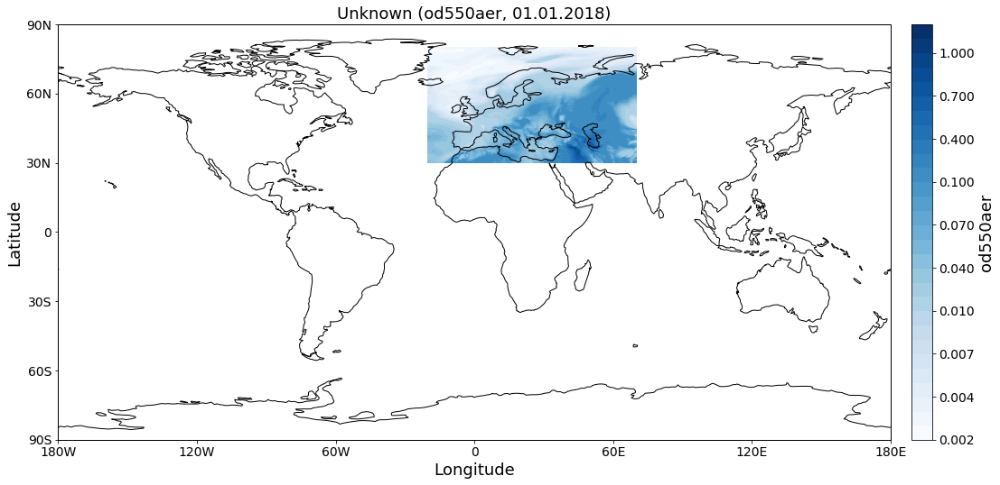

AEROCOM default regions
~~~~~~~~~~~~~~~~~~~~~~~

This notebook introduces how pya handles information related to default
regions (e.g. Europe, Asia, ...) as used in the `AEROCOM
interface <http://aerocom.met.no/cgi-bin/AEROCOM/aerocom/surfobs_annualrs.pl>`__.
All default regions are defined in the file
`regions.ini <http://aerocom.met.no/pya/config_files.html#default-regions>`__.

.. code:: ipython3

    import pyaerocom as pya
    
    pya.region.all()

.. parsed-literal::

    Init data paths for lustre

.. parsed-literal::

    0.006241798400878906 s

.. parsed-literal::

    ['WORLD',
     'EUROPE',
     'ASIA',
     'AUSTRALIA',
     'CHINA',
     'INDIA',
     'NAFRICA',
     'SAFRICA',
     'SAMERICA',
     'NAMERICA']

These region IDs can be used to access more information about the
regions (which is used throughout pyaerocom). For instance:

.. code:: ipython3

    europe = pya.Region("EUROPE")
    print(europe)

.. parsed-literal::

    pyaeorocom Region
    Name: EUROPE
    Longitude range: [-20, 70]
    Latitude range: [30, 80]
    Longitude range (plots): [-20, 70]
    Latitude range (plots): [30, 80]

.. code:: ipython3

    asia = pya.Region("ASIA")
    print(asia)

.. parsed-literal::

    pyaeorocom Region
    Name: ASIA
    Longitude range: [40, 150]
    Latitude range: [0, 60]
    Longitude range (plots): [40, 150]
    Latitude range (plots): [0, 60]

Load example data and apply region specific crop
^^^^^^^^^^^^^^^^^^^^^^^^^^^^^^^^^^^^^^^^^^^^^^^^

In the following cell, we create an instance of the ``GriddedData``
class (hich is introduced in more detail in a later tutorial), load some
test data (from the CAMS ECMWF OSUITE dataset), crop it and plot a map
of the results over Europe.

.. code:: ipython3

    data = pya.GriddedData()
    data._init_testdata_default()
    crop = data.crop(region="EUROPE")
    fig = crop.quickplot_map()

.. parsed-literal::

    /home/jonasg/anaconda3/lib/python3.6/site-packages/iris/fileformats/_pyke_rules/compiled_krb/fc_rules_cf_fc.py:1932: UserWarning: Ignoring netCDF variable 'od550bc' invalid units '~'
      warnings.warn(msg)
    /home/jonasg/anaconda3/lib/python3.6/site-packages/iris/fileformats/_pyke_rules/compiled_krb/fc_rules_cf_fc.py:2029: UserWarning: Gracefully filling 'latitude' dimension coordinate masked points
      warnings.warn(msg.format(str(cf_coord_var.cf_name)))
    /home/jonasg/anaconda3/lib/python3.6/site-packages/iris/fileformats/_pyke_rules/compiled_krb/fc_rules_cf_fc.py:2029: UserWarning: Gracefully filling 'longitude' dimension coordinate masked points
      warnings.warn(msg.format(str(cf_coord_var.cf_name)))
    /home/jonasg/anaconda3/lib/python3.6/site-packages/iris/fileformats/_pyke_rules/compiled_krb/fc_rules_cf_fc.py:2029: UserWarning: Gracefully filling 'time' dimension coordinate masked points
      warnings.warn(msg.format(str(cf_coord_var.cf_name)))
    /home/jonasg/anaconda3/lib/python3.6/site-packages/iris/fileformats/_pyke_rules/compiled_krb/fc_rules_cf_fc.py:1932: UserWarning: Ignoring netCDF variable 'od550so4' invalid units '~'
      warnings.warn(msg)
    /home/jonasg/anaconda3/lib/python3.6/site-packages/iris/fileformats/_pyke_rules/compiled_krb/fc_rules_cf_fc.py:2029: UserWarning: Gracefully filling 'latitude' dimension coordinate masked points
      warnings.warn(msg.format(str(cf_coord_var.cf_name)))
    /home/jonasg/anaconda3/lib/python3.6/site-packages/iris/fileformats/_pyke_rules/compiled_krb/fc_rules_cf_fc.py:2029: UserWarning: Gracefully filling 'longitude' dimension coordinate masked points
      warnings.warn(msg.format(str(cf_coord_var.cf_name)))
    /home/jonasg/anaconda3/lib/python3.6/site-packages/iris/fileformats/_pyke_rules/compiled_krb/fc_rules_cf_fc.py:2029: UserWarning: Gracefully filling 'time' dimension coordinate masked points
      warnings.warn(msg.format(str(cf_coord_var.cf_name)))
    /home/jonasg/anaconda3/lib/python3.6/site-packages/iris/fileformats/_pyke_rules/compiled_krb/fc_rules_cf_fc.py:1932: UserWarning: Ignoring netCDF variable 'od550dust' invalid units '~'
      warnings.warn(msg)
    /home/jonasg/anaconda3/lib/python3.6/site-packages/iris/fileformats/_pyke_rules/compiled_krb/fc_rules_cf_fc.py:2029: UserWarning: Gracefully filling 'latitude' dimension coordinate masked points
      warnings.warn(msg.format(str(cf_coord_var.cf_name)))
    /home/jonasg/anaconda3/lib/python3.6/site-packages/iris/fileformats/_pyke_rules/compiled_krb/fc_rules_cf_fc.py:2029: UserWarning: Gracefully filling 'longitude' dimension coordinate masked points
      warnings.warn(msg.format(str(cf_coord_var.cf_name)))
    /home/jonasg/anaconda3/lib/python3.6/site-packages/iris/fileformats/_pyke_rules/compiled_krb/fc_rules_cf_fc.py:2029: UserWarning: Gracefully filling 'time' dimension coordinate masked points
      warnings.warn(msg.format(str(cf_coord_var.cf_name)))
    /home/jonasg/anaconda3/lib/python3.6/site-packages/iris/fileformats/_pyke_rules/compiled_krb/fc_rules_cf_fc.py:1932: UserWarning: Ignoring netCDF variable 'od550oa' invalid units '~'
      warnings.warn(msg)
    /home/jonasg/anaconda3/lib/python3.6/site-packages/iris/fileformats/_pyke_rules/compiled_krb/fc_rules_cf_fc.py:2029: UserWarning: Gracefully filling 'latitude' dimension coordinate masked points
      warnings.warn(msg.format(str(cf_coord_var.cf_name)))
    /home/jonasg/anaconda3/lib/python3.6/site-packages/iris/fileformats/_pyke_rules/compiled_krb/fc_rules_cf_fc.py:2029: UserWarning: Gracefully filling 'longitude' dimension coordinate masked points
      warnings.warn(msg.format(str(cf_coord_var.cf_name)))
    /home/jonasg/anaconda3/lib/python3.6/site-packages/iris/fileformats/_pyke_rules/compiled_krb/fc_rules_cf_fc.py:2029: UserWarning: Gracefully filling 'time' dimension coordinate masked points
      warnings.warn(msg.format(str(cf_coord_var.cf_name)))
    /home/jonasg/anaconda3/lib/python3.6/site-packages/iris/fileformats/_pyke_rules/compiled_krb/fc_rules_cf_fc.py:1932: UserWarning: Ignoring netCDF variable 'od550aer' invalid units '~'
      warnings.warn(msg)
    /home/jonasg/anaconda3/lib/python3.6/site-packages/iris/fileformats/_pyke_rules/compiled_krb/fc_rules_cf_fc.py:2029: UserWarning: Gracefully filling 'latitude' dimension coordinate masked points
      warnings.warn(msg.format(str(cf_coord_var.cf_name)))
    /home/jonasg/anaconda3/lib/python3.6/site-packages/iris/fileformats/_pyke_rules/compiled_krb/fc_rules_cf_fc.py:2029: UserWarning: Gracefully filling 'longitude' dimension coordinate masked points
      warnings.warn(msg.format(str(cf_coord_var.cf_name)))
    /home/jonasg/anaconda3/lib/python3.6/site-packages/iris/fileformats/_pyke_rules/compiled_krb/fc_rules_cf_fc.py:2029: UserWarning: Gracefully filling 'time' dimension coordinate masked points
      warnings.warn(msg.format(str(cf_coord_var.cf_name)))

That's it. Not much more to say about regions until now.
