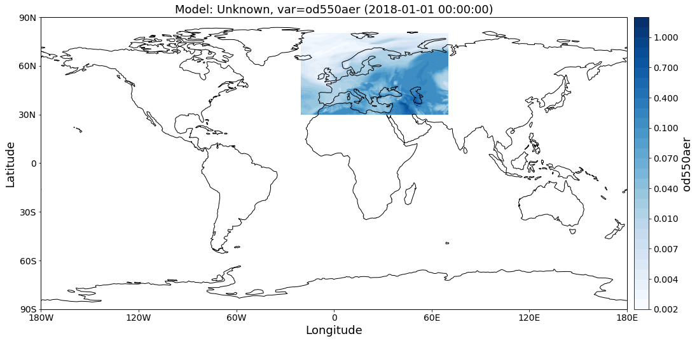

AEROCOM default regions
~~~~~~~~~~~~~~~~~~~~~~~

This notebook introduces how pya handles information related to default
regions (e.g. Europe, Asia, …) as used in the `AEROCOM
interface <http://aerocom.met.no/cgi-bin/AEROCOM/aerocom/surfobs_annualrs.pl>`__.
All default regions are defined in the file
`regions.ini <http://aerocom.met.no/pya/config_files.html#default-regions>`__.

.. code:: ipython3

    import pyaerocom as pya
    
    print(pya.region.get_all_default_region_ids())

.. parsed-literal::

    /home/jonasg/anaconda3/lib/python3.6/site-packages/geonum/__init__.py:32: UserWarning: Neither LatLon23 nor LatLon are available. Many basic features will not be available (e.g. objects GeoPoint or GeoVector 
      warn('Neither LatLon23 nor LatLon are available. Many basic features '
    /home/jonasg/anaconda3/lib/python3.6/site-packages/geonum/__init__.py:42: UserWarning: Plotting of maps etc. is deactivated, please install Basemap
      warn('Plotting of maps etc. is deactivated, please install Basemap')
    /home/jonasg/anaconda3/lib/python3.6/site-packages/matplotlib/cbook/deprecation.py:107: MatplotlibDeprecationWarning: The mpl_toolkits.axes_grid module was deprecated in version 2.1. Use mpl_toolkits.axes_grid1 and mpl_toolkits.axisartist provies the same functionality instead.
      warnings.warn(message, mplDeprecation, stacklevel=1)

.. parsed-literal::

    ['WORLD', 'EUROPE', 'ASIA', 'AUSTRALIA', 'CHINA', 'INDIA', 'NAFRICA', 'SAFRICA', 'SAMERICA', 'NAMERICA']

Now load some default regions and print them.

.. code:: ipython3

    europe = pya.Region("EUROPE")
    asia = pya.Region("ASIA")
    
    print(europe)
    print()
    print(asia)

.. parsed-literal::

    pyaeorocom Region
    Name: EUROPE
    Longitude range: [-20, 70]
    Latitude range: [30, 80]
    Longitude range (plots): [-20, 70]
    Latitude range (plots): [30, 80]
    
    pyaeorocom Region
    Name: ASIA
    Longitude range: [40, 150]
    Latitude range: [0, 60]
    Longitude range (plots): [40, 150]
    Latitude range (plots): [0, 60]

Load example data and apply region specific crop
^^^^^^^^^^^^^^^^^^^^^^^^^^^^^^^^^^^^^^^^^^^^^^^^

In the following cell, we create an instance of the ``GriddedData``
class (hich is introduced in more detail in a later tutorial), load some
test data (from the CAMS ECMWF OSUITE dataset), crop it and plot a map
of the results over Europe.

.. code:: ipython3

    data = pya.GriddedData()
    data._init_testdata_default()
    crop = data.crop(region="EUROPE")
    fig = crop.quickplot_map()

.. parsed-literal::

    /home/jonasg/anaconda3/lib/python3.6/site-packages/iris/fileformats/_pyke_rules/compiled_krb/fc_rules_cf_fc.py:1808: UserWarning: Ignoring netCDF variable 'od550bc' invalid units '~'
      warnings.warn(msg)
    /home/jonasg/anaconda3/lib/python3.6/site-packages/iris/fileformats/_pyke_rules/compiled_krb/fc_rules_cf_fc.py:1813: FutureWarning: Conversion of the second argument of issubdtype from `str` to `str` is deprecated. In future, it will be treated as `np.str_ == np.dtype(str).type`.
      if np.issubdtype(cf_var.dtype, np.str):
    /home/jonasg/anaconda3/lib/python3.6/site-packages/iris/fileformats/_pyke_rules/compiled_krb/fc_rules_cf_fc.py:1813: FutureWarning: Conversion of the second argument of issubdtype from `str` to `str` is deprecated. In future, it will be treated as `np.str_ == np.dtype(str).type`.
      if np.issubdtype(cf_var.dtype, np.str):
    /home/jonasg/anaconda3/lib/python3.6/site-packages/iris/fileformats/_pyke_rules/compiled_krb/fc_rules_cf_fc.py:1808: UserWarning: Ignoring netCDF variable 'od550aer' invalid units '~'
      warnings.warn(msg)
    /home/jonasg/anaconda3/lib/python3.6/site-packages/iris/fileformats/_pyke_rules/compiled_krb/fc_rules_cf_fc.py:1813: FutureWarning: Conversion of the second argument of issubdtype from `str` to `str` is deprecated. In future, it will be treated as `np.str_ == np.dtype(str).type`.
      if np.issubdtype(cf_var.dtype, np.str):
    /home/jonasg/anaconda3/lib/python3.6/site-packages/iris/fileformats/_pyke_rules/compiled_krb/fc_rules_cf_fc.py:1808: UserWarning: Ignoring netCDF variable 'od550dust' invalid units '~'
      warnings.warn(msg)
    /home/jonasg/anaconda3/lib/python3.6/site-packages/iris/fileformats/_pyke_rules/compiled_krb/fc_rules_cf_fc.py:1813: FutureWarning: Conversion of the second argument of issubdtype from `str` to `str` is deprecated. In future, it will be treated as `np.str_ == np.dtype(str).type`.
      if np.issubdtype(cf_var.dtype, np.str):
    /home/jonasg/anaconda3/lib/python3.6/site-packages/iris/fileformats/_pyke_rules/compiled_krb/fc_rules_cf_fc.py:1808: UserWarning: Ignoring netCDF variable 'od550so4' invalid units '~'
      warnings.warn(msg)
    /home/jonasg/anaconda3/lib/python3.6/site-packages/iris/fileformats/_pyke_rules/compiled_krb/fc_rules_cf_fc.py:1813: FutureWarning: Conversion of the second argument of issubdtype from `str` to `str` is deprecated. In future, it will be treated as `np.str_ == np.dtype(str).type`.
      if np.issubdtype(cf_var.dtype, np.str):
    /home/jonasg/anaconda3/lib/python3.6/site-packages/iris/fileformats/_pyke_rules/compiled_krb/fc_rules_cf_fc.py:1808: UserWarning: Ignoring netCDF variable 'od550oa' invalid units '~'
      warnings.warn(msg)
    /home/jonasg/anaconda3/lib/python3.6/site-packages/iris/fileformats/_pyke_rules/compiled_krb/fc_rules_cf_fc.py:1813: FutureWarning: Conversion of the second argument of issubdtype from `str` to `str` is deprecated. In future, it will be treated as `np.str_ == np.dtype(str).type`.
      if np.issubdtype(cf_var.dtype, np.str):

