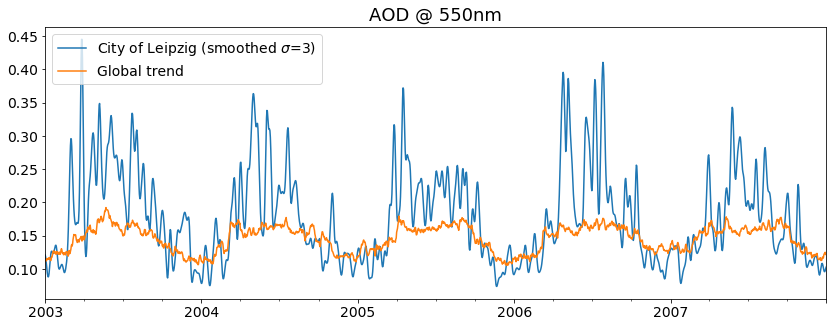

Reading of gridded data - the *ReadGridded* class
~~~~~~~~~~~~~~~~~~~~~~~~~~~~~~~~~~~~~~~~~~~~~~~~~

This notebook introduces the
`ReadGridded <http://aerocom.met.no/pyaerocom/api.html#pyaerocom.io.readgridded.ReadGridded>`__
class of pyaerocom, a flexible interface for importing model results
from a single model, based on variable name (e.g. *od550aer*,
*od550bc*), start / stop time stamps and temporal resolution (e.g.
*hourly, 3hourly, daily, monthly*).

The class is part of the
`readgridded <http://aerocom.met.no/pyaerocom/api.html#module-pyaerocom.io.readgridded>`__
module of pyaerocom, as well as the class
`ReadGriddedMulti <http://aerocom.met.no/pyaerocom/api.html#pyaerocom.io.readgridded.ReadGriddedMulti>`__,
which is introduced in the following tutorial (may be skipped).

In the following, we create an instance of the the ``ReadGridded`` class
and use this object to find and import data files containing the aerosol
optical depth at 550 nm (*od550aer*) from the ECMWF CAMS reanalysis
dataset (*ECMWF\_CAMS\_REAN*) for the years 2003-2007 and in daily
resolution. The files will be temporally merged and put into a single
instance of the ``GriddedData`` class.

We start with creating a reading object, that will take care of finding
the model directory for us (based on the model ID) and all valid NetCDF
files on initialisation. Use the ``print`` commant to preview the string
representation of ``ReadGridded`` object, which provides useful
information about what is in there.

Remark on reading of gridded data
^^^^^^^^^^^^^^^^^^^^^^^^^^^^^^^^^

Since model data files can be large (too large for in-memory
operations), gridded data in pyaerocom (e.g. model data or satellite
data) is generally read and represented as *lazy data*. That means, that
the actual N-dimensional data array is not loaded into memory before
needed. Lazy data is represented as [dask array] as pyaerocom data
objects rely either on the Python
`iris <https://scitools.org.uk/iris/docs/latest/index.html>`__ library
or `xarray <http://xarray.pydata.org/en/stable/index.html>`__ (which
both use dask for representing lazy data and for out of core
computation). For more information on lazy data, see e.g.
https://scitools.org.uk/iris/docs/latest/userguide/real\_and\_lazy\_data.html.

**Example**: Consider one year of daily model data in 1x1 resolution
with 30 vertical layers, stored as 64 bit floating point numbers.
Loading such a file into memory, would require a RAM of at least:

.. code:: ipython3

    '{:.1f} GB'.format(64 * (360 * 180) * 30 * 365 / (8 * 10**9))

.. parsed-literal::

    '5.7 GB'

Or the same in hourly resolution:

.. code:: ipython3

    '{:.1f} GB'.format(64 * (360 * 180) * 30 * 365 * 24 / (8 * 10**9))

.. parsed-literal::

    '136.2 GB'

.. code:: ipython3

    import pyaerocom as pya
    pya.change_verbosity('critical')
    read = pya.io.ReadGridded(name="ECMWF_CAMS_REAN",
                              start="1-1-2003",
                              stop="31-12-2007")
    print(read)

.. parsed-literal::

    Init data paths for lustre

.. parsed-literal::

    0.005434751510620117 s
    
    Pyaerocom ReadGridded
    ---------------------
    Model ID: ECMWF_CAMS_REAN
    Data directory: /lustre/storeA/project/aerocom/aerocom-users-database/ECMWF/ECMWF_CAMS_REAN/renamed
    Available variables: ['ang4487aer', 'ec532aer3D', 'od440aer', 'od550aer', 'od550bc', 'od550dust', 'od550oa', 'od550so4', 'od550ss', 'od865aer']
    Available years: [2003, 2004, 2005, 2006, 2007, 2008]
    Available time resolutions ['daily', 'monthly']

The output contains information about all variables that were found and
all corresponding years. These information is extracted from the
filenames, which have to follow the AEROCOM file naming conventions.

**Please note** that at this point, no data is actually imported but
only the paths are set that contain data for this model. In order to
read one variable, call the ``read_var`` function with a valid variable
name. You can check available variables using the ``vars`` attribute (or
by printing the string representation, as shown in the cell above).

.. code:: ipython3

    print("Detected variables for model %s:\n %s" %(read.name, read.vars))

.. parsed-literal::

    Detected variables for model ECMWF_CAMS_REAN:
     ['ang4487aer', 'ec532aer3D', 'od440aer', 'od550aer', 'od550bc', 'od550dust', 'od550oa', 'od550so4', 'od550ss', 'od865aer']

.. code:: ipython3

    data = read.read_var(var_name="od550aer", ts_type="daily")
    data

.. parsed-literal::

    /home/jonasg/anaconda3/lib/python3.6/site-packages/iris/fileformats/_pyke_rules/compiled_krb/fc_rules_cf_fc.py:2029: UserWarning: Gracefully filling 'lat' dimension coordinate masked points
      warnings.warn(msg.format(str(cf_coord_var.cf_name)))
    /home/jonasg/anaconda3/lib/python3.6/site-packages/iris/fileformats/_pyke_rules/compiled_krb/fc_rules_cf_fc.py:2029: UserWarning: Gracefully filling 'lon' dimension coordinate masked points
      warnings.warn(msg.format(str(cf_coord_var.cf_name)))
    /home/jonasg/anaconda3/lib/python3.6/site-packages/iris/fileformats/_pyke_rules/compiled_krb/fc_rules_cf_fc.py:2029: UserWarning: Gracefully filling 'lat' dimension coordinate masked points
      warnings.warn(msg.format(str(cf_coord_var.cf_name)))
    /home/jonasg/anaconda3/lib/python3.6/site-packages/iris/fileformats/_pyke_rules/compiled_krb/fc_rules_cf_fc.py:2029: UserWarning: Gracefully filling 'lon' dimension coordinate masked points
      warnings.warn(msg.format(str(cf_coord_var.cf_name)))
    /home/jonasg/anaconda3/lib/python3.6/site-packages/iris/fileformats/_pyke_rules/compiled_krb/fc_rules_cf_fc.py:2029: UserWarning: Gracefully filling 'lat' dimension coordinate masked points
      warnings.warn(msg.format(str(cf_coord_var.cf_name)))
    /home/jonasg/anaconda3/lib/python3.6/site-packages/iris/fileformats/_pyke_rules/compiled_krb/fc_rules_cf_fc.py:2029: UserWarning: Gracefully filling 'lon' dimension coordinate masked points
      warnings.warn(msg.format(str(cf_coord_var.cf_name)))
    /home/jonasg/anaconda3/lib/python3.6/site-packages/iris/fileformats/_pyke_rules/compiled_krb/fc_rules_cf_fc.py:2029: UserWarning: Gracefully filling 'lat' dimension coordinate masked points
      warnings.warn(msg.format(str(cf_coord_var.cf_name)))
    /home/jonasg/anaconda3/lib/python3.6/site-packages/iris/fileformats/_pyke_rules/compiled_krb/fc_rules_cf_fc.py:2029: UserWarning: Gracefully filling 'lon' dimension coordinate masked points
      warnings.warn(msg.format(str(cf_coord_var.cf_name)))
    /home/jonasg/anaconda3/lib/python3.6/site-packages/iris/fileformats/_pyke_rules/compiled_krb/fc_rules_cf_fc.py:2029: UserWarning: Gracefully filling 'lat' dimension coordinate masked points
      warnings.warn(msg.format(str(cf_coord_var.cf_name)))
    /home/jonasg/anaconda3/lib/python3.6/site-packages/iris/fileformats/_pyke_rules/compiled_krb/fc_rules_cf_fc.py:2029: UserWarning: Gracefully filling 'lon' dimension coordinate masked points
      warnings.warn(msg.format(str(cf_coord_var.cf_name)))

.. parsed-literal::

    pyaerocom.GriddedData
    Grid data: <iris 'Cube' of Aerosol optical depth at 550 nm / (1) (time: 1826; latitude: 161; longitude: 320)>

The returned data object is of type
`GriddedData <http://aerocom.met.no/pyaerocom/api.html#pyaerocom.griddeddata.GriddedData>`__
class, which will be introduced in more detail later. This data object
is returned by the ``read_var`` method and can also be accessed from the
instance of the reading class using:

.. code:: ipython3

    d = read.data["od550aer"]
    d is data #?

.. parsed-literal::

    True

We may also import other variables using either the above used method
``read_var`` or the more general ``read`` method which can read single
or multiple variables on the run.

.. code:: ipython3

    read.read(['od550bc', 'od550dust', 'od550oa', 'od550so4'])

.. parsed-literal::

    /home/jonasg/anaconda3/lib/python3.6/site-packages/iris/fileformats/_pyke_rules/compiled_krb/fc_rules_cf_fc.py:2029: UserWarning: Gracefully filling 'lat' dimension coordinate masked points
      warnings.warn(msg.format(str(cf_coord_var.cf_name)))
    /home/jonasg/anaconda3/lib/python3.6/site-packages/iris/fileformats/_pyke_rules/compiled_krb/fc_rules_cf_fc.py:2029: UserWarning: Gracefully filling 'lon' dimension coordinate masked points
      warnings.warn(msg.format(str(cf_coord_var.cf_name)))
    /home/jonasg/anaconda3/lib/python3.6/site-packages/iris/fileformats/_pyke_rules/compiled_krb/fc_rules_cf_fc.py:2029: UserWarning: Gracefully filling 'lat' dimension coordinate masked points
      warnings.warn(msg.format(str(cf_coord_var.cf_name)))
    /home/jonasg/anaconda3/lib/python3.6/site-packages/iris/fileformats/_pyke_rules/compiled_krb/fc_rules_cf_fc.py:2029: UserWarning: Gracefully filling 'lon' dimension coordinate masked points
      warnings.warn(msg.format(str(cf_coord_var.cf_name)))
    /home/jonasg/anaconda3/lib/python3.6/site-packages/iris/fileformats/_pyke_rules/compiled_krb/fc_rules_cf_fc.py:2029: UserWarning: Gracefully filling 'lat' dimension coordinate masked points
      warnings.warn(msg.format(str(cf_coord_var.cf_name)))
    /home/jonasg/anaconda3/lib/python3.6/site-packages/iris/fileformats/_pyke_rules/compiled_krb/fc_rules_cf_fc.py:2029: UserWarning: Gracefully filling 'lon' dimension coordinate masked points
      warnings.warn(msg.format(str(cf_coord_var.cf_name)))
    /home/jonasg/anaconda3/lib/python3.6/site-packages/iris/fileformats/_pyke_rules/compiled_krb/fc_rules_cf_fc.py:2029: UserWarning: Gracefully filling 'lat' dimension coordinate masked points
      warnings.warn(msg.format(str(cf_coord_var.cf_name)))
    /home/jonasg/anaconda3/lib/python3.6/site-packages/iris/fileformats/_pyke_rules/compiled_krb/fc_rules_cf_fc.py:2029: UserWarning: Gracefully filling 'lon' dimension coordinate masked points
      warnings.warn(msg.format(str(cf_coord_var.cf_name)))
    /home/jonasg/anaconda3/lib/python3.6/site-packages/iris/fileformats/_pyke_rules/compiled_krb/fc_rules_cf_fc.py:2029: UserWarning: Gracefully filling 'lat' dimension coordinate masked points
      warnings.warn(msg.format(str(cf_coord_var.cf_name)))
    /home/jonasg/anaconda3/lib/python3.6/site-packages/iris/fileformats/_pyke_rules/compiled_krb/fc_rules_cf_fc.py:2029: UserWarning: Gracefully filling 'lon' dimension coordinate masked points
      warnings.warn(msg.format(str(cf_coord_var.cf_name)))
    /home/jonasg/anaconda3/lib/python3.6/site-packages/iris/fileformats/_pyke_rules/compiled_krb/fc_rules_cf_fc.py:2029: UserWarning: Gracefully filling 'lat' dimension coordinate masked points
      warnings.warn(msg.format(str(cf_coord_var.cf_name)))
    /home/jonasg/anaconda3/lib/python3.6/site-packages/iris/fileformats/_pyke_rules/compiled_krb/fc_rules_cf_fc.py:2029: UserWarning: Gracefully filling 'lon' dimension coordinate masked points
      warnings.warn(msg.format(str(cf_coord_var.cf_name)))
    /home/jonasg/anaconda3/lib/python3.6/site-packages/iris/fileformats/_pyke_rules/compiled_krb/fc_rules_cf_fc.py:2029: UserWarning: Gracefully filling 'lat' dimension coordinate masked points
      warnings.warn(msg.format(str(cf_coord_var.cf_name)))
    /home/jonasg/anaconda3/lib/python3.6/site-packages/iris/fileformats/_pyke_rules/compiled_krb/fc_rules_cf_fc.py:2029: UserWarning: Gracefully filling 'lon' dimension coordinate masked points
      warnings.warn(msg.format(str(cf_coord_var.cf_name)))
    /home/jonasg/anaconda3/lib/python3.6/site-packages/iris/fileformats/_pyke_rules/compiled_krb/fc_rules_cf_fc.py:2029: UserWarning: Gracefully filling 'lat' dimension coordinate masked points
      warnings.warn(msg.format(str(cf_coord_var.cf_name)))
    /home/jonasg/anaconda3/lib/python3.6/site-packages/iris/fileformats/_pyke_rules/compiled_krb/fc_rules_cf_fc.py:2029: UserWarning: Gracefully filling 'lon' dimension coordinate masked points
      warnings.warn(msg.format(str(cf_coord_var.cf_name)))
    /home/jonasg/anaconda3/lib/python3.6/site-packages/iris/fileformats/_pyke_rules/compiled_krb/fc_rules_cf_fc.py:2029: UserWarning: Gracefully filling 'lat' dimension coordinate masked points
      warnings.warn(msg.format(str(cf_coord_var.cf_name)))
    /home/jonasg/anaconda3/lib/python3.6/site-packages/iris/fileformats/_pyke_rules/compiled_krb/fc_rules_cf_fc.py:2029: UserWarning: Gracefully filling 'lon' dimension coordinate masked points
      warnings.warn(msg.format(str(cf_coord_var.cf_name)))
    /home/jonasg/anaconda3/lib/python3.6/site-packages/iris/fileformats/_pyke_rules/compiled_krb/fc_rules_cf_fc.py:2029: UserWarning: Gracefully filling 'lat' dimension coordinate masked points
      warnings.warn(msg.format(str(cf_coord_var.cf_name)))
    /home/jonasg/anaconda3/lib/python3.6/site-packages/iris/fileformats/_pyke_rules/compiled_krb/fc_rules_cf_fc.py:2029: UserWarning: Gracefully filling 'lon' dimension coordinate masked points
      warnings.warn(msg.format(str(cf_coord_var.cf_name)))
    /home/jonasg/anaconda3/lib/python3.6/site-packages/iris/fileformats/_pyke_rules/compiled_krb/fc_rules_cf_fc.py:2029: UserWarning: Gracefully filling 'lat' dimension coordinate masked points
      warnings.warn(msg.format(str(cf_coord_var.cf_name)))
    /home/jonasg/anaconda3/lib/python3.6/site-packages/iris/fileformats/_pyke_rules/compiled_krb/fc_rules_cf_fc.py:2029: UserWarning: Gracefully filling 'lon' dimension coordinate masked points
      warnings.warn(msg.format(str(cf_coord_var.cf_name)))
    /home/jonasg/anaconda3/lib/python3.6/site-packages/iris/fileformats/_pyke_rules/compiled_krb/fc_rules_cf_fc.py:2029: UserWarning: Gracefully filling 'lat' dimension coordinate masked points
      warnings.warn(msg.format(str(cf_coord_var.cf_name)))
    /home/jonasg/anaconda3/lib/python3.6/site-packages/iris/fileformats/_pyke_rules/compiled_krb/fc_rules_cf_fc.py:2029: UserWarning: Gracefully filling 'lon' dimension coordinate masked points
      warnings.warn(msg.format(str(cf_coord_var.cf_name)))
    /home/jonasg/anaconda3/lib/python3.6/site-packages/iris/fileformats/_pyke_rules/compiled_krb/fc_rules_cf_fc.py:2029: UserWarning: Gracefully filling 'lat' dimension coordinate masked points
      warnings.warn(msg.format(str(cf_coord_var.cf_name)))
    /home/jonasg/anaconda3/lib/python3.6/site-packages/iris/fileformats/_pyke_rules/compiled_krb/fc_rules_cf_fc.py:2029: UserWarning: Gracefully filling 'lon' dimension coordinate masked points
      warnings.warn(msg.format(str(cf_coord_var.cf_name)))
    /home/jonasg/anaconda3/lib/python3.6/site-packages/iris/fileformats/_pyke_rules/compiled_krb/fc_rules_cf_fc.py:2029: UserWarning: Gracefully filling 'lat' dimension coordinate masked points
      warnings.warn(msg.format(str(cf_coord_var.cf_name)))
    /home/jonasg/anaconda3/lib/python3.6/site-packages/iris/fileformats/_pyke_rules/compiled_krb/fc_rules_cf_fc.py:2029: UserWarning: Gracefully filling 'lon' dimension coordinate masked points
      warnings.warn(msg.format(str(cf_coord_var.cf_name)))
    /home/jonasg/anaconda3/lib/python3.6/site-packages/iris/fileformats/_pyke_rules/compiled_krb/fc_rules_cf_fc.py:2029: UserWarning: Gracefully filling 'lat' dimension coordinate masked points
      warnings.warn(msg.format(str(cf_coord_var.cf_name)))
    /home/jonasg/anaconda3/lib/python3.6/site-packages/iris/fileformats/_pyke_rules/compiled_krb/fc_rules_cf_fc.py:2029: UserWarning: Gracefully filling 'lon' dimension coordinate masked points
      warnings.warn(msg.format(str(cf_coord_var.cf_name)))
    /home/jonasg/anaconda3/lib/python3.6/site-packages/iris/fileformats/_pyke_rules/compiled_krb/fc_rules_cf_fc.py:2029: UserWarning: Gracefully filling 'lat' dimension coordinate masked points
      warnings.warn(msg.format(str(cf_coord_var.cf_name)))
    /home/jonasg/anaconda3/lib/python3.6/site-packages/iris/fileformats/_pyke_rules/compiled_krb/fc_rules_cf_fc.py:2029: UserWarning: Gracefully filling 'lon' dimension coordinate masked points
      warnings.warn(msg.format(str(cf_coord_var.cf_name)))
    /home/jonasg/anaconda3/lib/python3.6/site-packages/iris/fileformats/_pyke_rules/compiled_krb/fc_rules_cf_fc.py:2029: UserWarning: Gracefully filling 'lat' dimension coordinate masked points
      warnings.warn(msg.format(str(cf_coord_var.cf_name)))
    /home/jonasg/anaconda3/lib/python3.6/site-packages/iris/fileformats/_pyke_rules/compiled_krb/fc_rules_cf_fc.py:2029: UserWarning: Gracefully filling 'lon' dimension coordinate masked points
      warnings.warn(msg.format(str(cf_coord_var.cf_name)))
    /home/jonasg/anaconda3/lib/python3.6/site-packages/iris/fileformats/_pyke_rules/compiled_krb/fc_rules_cf_fc.py:2029: UserWarning: Gracefully filling 'lat' dimension coordinate masked points
      warnings.warn(msg.format(str(cf_coord_var.cf_name)))
    /home/jonasg/anaconda3/lib/python3.6/site-packages/iris/fileformats/_pyke_rules/compiled_krb/fc_rules_cf_fc.py:2029: UserWarning: Gracefully filling 'lon' dimension coordinate masked points
      warnings.warn(msg.format(str(cf_coord_var.cf_name)))
    /home/jonasg/anaconda3/lib/python3.6/site-packages/iris/fileformats/_pyke_rules/compiled_krb/fc_rules_cf_fc.py:2029: UserWarning: Gracefully filling 'lat' dimension coordinate masked points
      warnings.warn(msg.format(str(cf_coord_var.cf_name)))
    /home/jonasg/anaconda3/lib/python3.6/site-packages/iris/fileformats/_pyke_rules/compiled_krb/fc_rules_cf_fc.py:2029: UserWarning: Gracefully filling 'lon' dimension coordinate masked points
      warnings.warn(msg.format(str(cf_coord_var.cf_name)))
    /home/jonasg/anaconda3/lib/python3.6/site-packages/iris/fileformats/_pyke_rules/compiled_krb/fc_rules_cf_fc.py:2029: UserWarning: Gracefully filling 'lat' dimension coordinate masked points
      warnings.warn(msg.format(str(cf_coord_var.cf_name)))
    /home/jonasg/anaconda3/lib/python3.6/site-packages/iris/fileformats/_pyke_rules/compiled_krb/fc_rules_cf_fc.py:2029: UserWarning: Gracefully filling 'lon' dimension coordinate masked points
      warnings.warn(msg.format(str(cf_coord_var.cf_name)))

.. parsed-literal::

    (pyaerocom.GriddedData
     Grid data: <iris 'Cube' of Aerosol optical depth at 550 nm / (1) (time: 1826; latitude: 161; longitude: 320)>,
     pyaerocom.GriddedData
     Grid data: <iris 'Cube' of Aerosol optical depth at 550 nm / (1) (time: 1826; latitude: 161; longitude: 320)>,
     pyaerocom.GriddedData
     Grid data: <iris 'Cube' of Aerosol optical depth at 550 nm / (1) (time: 1826; latitude: 161; longitude: 320)>,
     pyaerocom.GriddedData
     Grid data: <iris 'Cube' of Aerosol optical depth at 550 nm / (1) (time: 1826; latitude: 161; longitude: 320)>)

Now let's double check if all variables have been imported.

.. code:: ipython3

    print(read)

.. parsed-literal::

    
    Pyaerocom ReadGridded
    ---------------------
    Model ID: ECMWF_CAMS_REAN
    Data directory: /lustre/storeA/project/aerocom/aerocom-users-database/ECMWF/ECMWF_CAMS_REAN/renamed
    Available variables: ['ang4487aer', 'ec532aer3D', 'od440aer', 'od550aer', 'od550bc', 'od550dust', 'od550oa', 'od550so4', 'od550ss', 'od865aer']
    Available years: [2003, 2004, 2005, 2006, 2007, 2008]
    Available time resolutions ['daily', 'monthly']
    
    Loaded GriddedData objects:
    
    Pyaerocom GriddedData
    ---------------------
    Variable: od550aer
    Temporal resolution: daily
    Start / Stop: 2003-01-01T00:00:00.000000 - 2007-12-31T23:59:59.999999
    
    Pyaerocom GriddedData
    ---------------------
    Variable: od550bc
    Temporal resolution: daily
    Start / Stop: 2003-01-01T00:00:00.000000 - 2007-12-31T23:59:59.999999
    
    Pyaerocom GriddedData
    ---------------------
    Variable: od550dust
    Temporal resolution: daily
    Start / Stop: 2003-01-01T00:00:00.000000 - 2007-12-31T23:59:59.999999
    
    Pyaerocom GriddedData
    ---------------------
    Variable: od550oa
    Temporal resolution: daily
    Start / Stop: 2003-01-01T00:00:00.000000 - 2007-12-31T23:59:59.999999
    
    Pyaerocom GriddedData
    ---------------------
    Variable: od550so4
    Temporal resolution: daily
    Start / Stop: 2003-01-01T00:00:00.000000 - 2007-12-31T23:59:59.999999

In the following we continue with the ``od550aer`` data object that was
loaded first and that was assigned the name ``data`` above.

.. code:: ipython3

    print("\nThe data object is of type %s and contains %d time stamps" %(type(data), data.shape[0]))

.. parsed-literal::

    
    The data object is of type <class 'pyaerocom.griddeddata.GriddedData'> and contains 1826 time stamps

The returned
`GriddedData <http://aerocom.met.no/pyaerocom/api.html#pyaerocom.griddeddata.GriddedData>`__
object contains 1826 time stamps. Given that the defined period of 5
years includes one leap year, we should expect that we imported data for
each day of the five years?

.. code:: ipython3

    print(1826 == 5*365+1)

.. parsed-literal::

    True

Remark on time definition
^^^^^^^^^^^^^^^^^^^^^^^^^

If you run this notebook with ``verbose=True`` in the reading object,
you will receive the output

``Error message: AttributeError('Cube does not contain time dimension',)  Invalid time axis in file ECMWF_CAMS_REAN.daily.od550aer.2007.nc. Attempting to correct.``

several times when reading the data. This warning indicates, that the
corresponding data in the netCDF files has some issue with the time
dimension. Here, the time variable is not properly defined in the NetCDF
file. Pyaerocom can correct for this on data import by

1. First checking if the time dimension in the NetCDF file is correct
   according to CF convention (`see here for details on the
   implementation <http://aerocom.met.no/pyaerocom/api.html#pyaerocom.io.helpers.check_time_coord>`__
   and if a problem is detected, then ...
2. the time axis is redefined based on the year and time resolution
   (*ts\_type*) that is encrypted in the filename. The latter requires
   that the file follows one of the `pyaerocom file
   conventions <http://aerocom.met.no/pyaerocom/config_files.html#file-conventions>`__.

A very brief introduction into the GriddedData class
^^^^^^^^^^^^^^^^^^^^^^^^^^^^^^^^^^^^^^^^^^^^^^^^^^^^

Now as a final step, we briefly introduce some of the features of the
``GriddedData`` class by computing and plotting a time series of the
global weighted average aerosol optical density as well as the same time
series at the coordinates in the city of Leipzig, Germany.

.. code:: ipython3

    from pandas import Series
    from scipy.ndimage import gaussian_filter1d
    #compute global mean (area weighted)
    glob_mean = data.area_weighted_mean()
    
    #extract AODs at the position of Leipzig
    lon_leipzig = 12.44
    lat_leipzig = 51.35
    
    data_leipzig = data.interpolate([("latitude", lat_leipzig), 
                                     ("longitude", lon_leipzig)])
    
    # create pandas Series for global average
    s_glob = Series(glob_mean, index=data.time_stamps())
    
    # create pandas Series for leipzig average (and smooth in time)
    GAUSS_SIGMA = 3
    s_leipzig = Series(gaussian_filter1d(data_leipzig.grid.data, GAUSS_SIGMA), 
                       data_leipzig.time_stamps())
    
    ax = s_leipzig.plot(label=r"City of Leipzig (smoothed $\sigma$=%d)" %GAUSS_SIGMA, figsize=(14,5))
    s_glob.plot(label="Global trend", ax=ax)
    ax.legend()
    tit = ax.set_title("AOD @ 550nm")

.. parsed-literal::

    /home/jonasg/anaconda3/lib/python3.6/site-packages/iris/analysis/cartography.py:377: UserWarning: Using DEFAULT_SPHERICAL_EARTH_RADIUS.
      warnings.warn("Using DEFAULT_SPHERICAL_EARTH_RADIUS.")
    Interpolating data of shape (1826, 161, 320). This may take a while.
    Successfully interpolated cube

In the following section, the ``ReadGriddedMulti`` class is introduced,
which is largely based on the ``ReadGridded`` class and allows for
importing data from multiple models.
