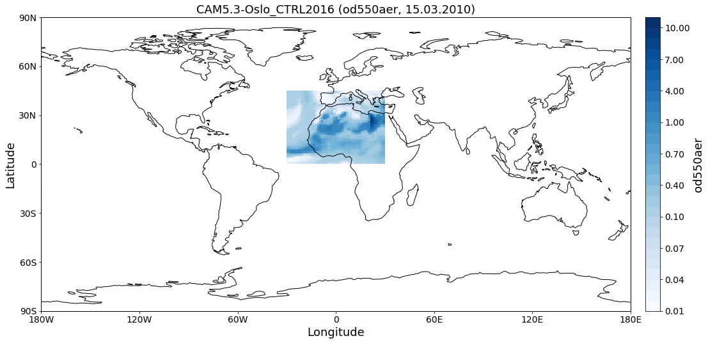
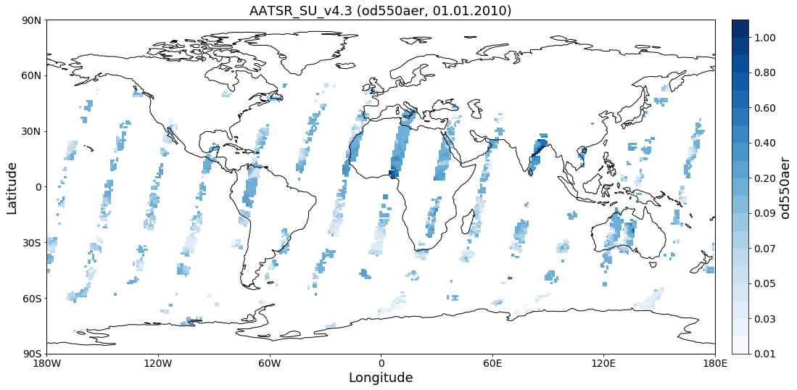
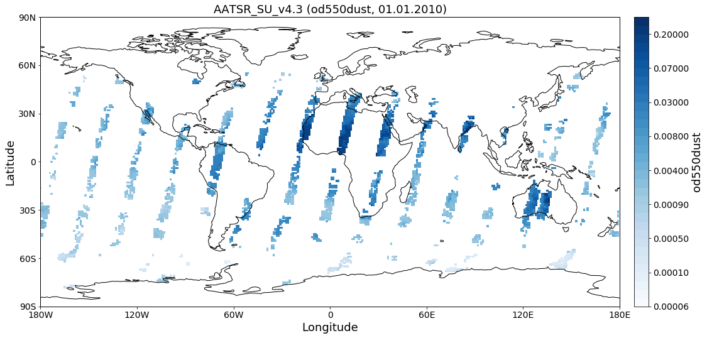
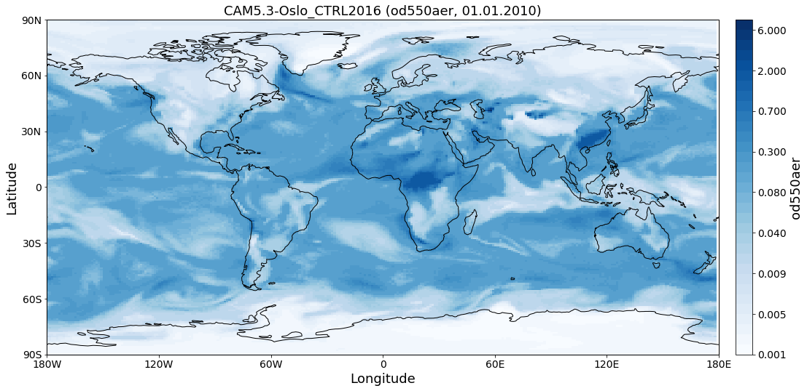
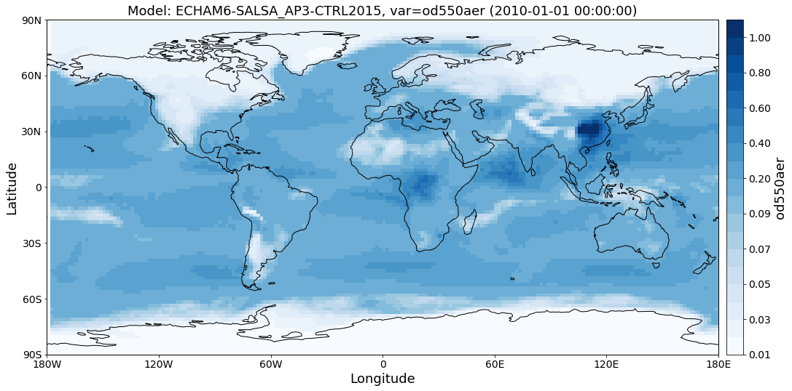
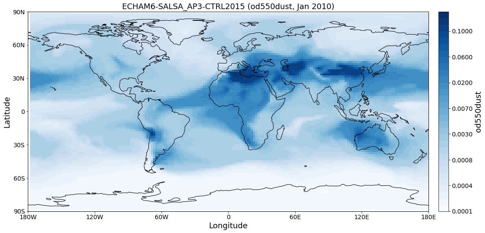

Reading data from multiple models: the ReadGriddedMulti class
~~~~~~~~~~~~~~~~~~~~~~~~~~~~~~~~~~~~~~~~~~~~~~~~~~~~~~~~~~~~~

The ``pyaerocom.ReadGriddedMulti`` class provides an interface to import
multiple variables for an arbitrary number of gridded datasets (e.g.
model data, level 2 satellite data) and within a specific time interval.
It makes large use of the ``ReadGridded`` class that provides an
interface for importing results from a single dataset (and that does the
actual reading).

**Note**: This is not strictly relevant for the following tutorials. You
might skip this tutorial if it is not of particular interest for you to
read multiple models at once.

.. code:: ipython3

    import os
    import pyaerocom as pya
    pya.change_verbosity('critical')

.. parsed-literal::

    Init data paths for lustre

.. parsed-literal::

    0.009521484375 s

Define two models (this list can contain as many models as you like)

.. code:: ipython3

    models = ["AATSR_SU_v4.3", "CAM5.3-Oslo_CTRL2016"]

Again, if you are not sure what is the exact name of the dataset you are
searching for, you may use wildcards to search for options. For
instance, if you want to include results from the implementation of the
sectional aerosol microphysics module (SALSA) in the ECHAM5-HAM
aerosol-climate model, you may search if data exists ...

.. code:: ipython3

    try: 
        pya.search_data_dir_aerocom("*ECHAM*salsa*CTRL*2015")
    except Exception as e:
        print(repr(e))

... and include it:

.. code:: ipython3

    models.append('ECHAM6-SALSA_AP3-CTRL2015')

Now create and initiate ``ReadGriddedMulti`` class. The directory for
each model as well as all valid files in the model directories are
searched on initiation of the instance. Valid here means, that the files
belong to the corresponding model. Subsetting of the time interval is
done in a later process.

.. code:: ipython3

    read = pya.io.ReadGriddedMulti(models, '2010','2011')
    print(read)

.. parsed-literal::

    
    Pyaerocom ReadGriddedMulti
    --------------------------
    Model IDs: ['AATSR_SU_v4.3', 'CAM5.3-Oslo_CTRL2016', 'ECHAM6-SALSA_AP3-CTRL2015']
    
    Loaded data:
    
    Pyaerocom ReadGridded
    ---------------------
    Model ID: AATSR_SU_v4.3
    Data directory: /lustre/storeA/project/aerocom/aerocom-users-database/CCI-Aerosol/CCI_AEROSOL_Phase2/AATSR_SU_v4.3/renamed
    Available variables: ['abs550aer', 'ang4487aer', 'od550aer', 'od550dust', 'od550erraer', 'od550gt1aer', 'od550lt1aer']
    Available years: [2010, 2011, 2012]
    Available time resolutions ['daily']
    
    Pyaerocom ReadGridded
    ---------------------
    Model ID: CAM5.3-Oslo_CTRL2016
    Data directory: /lustre/storeA/project/aerocom/aerocom-users-database/AEROCOM-PHASE-III/CAM5.3-Oslo_CTRL2016/renamed
    Available variables: ['abs550aer', 'deltaz3d', 'humidity3d', 'od440aer', 'od550aer', 'od550aer3d', 'od550aerh2o', 'od550dryaer', 'od550dust', 'od550lt1aer', 'od870aer']
    Available years: [2010]
    Available time resolutions ['3hourly', 'daily']
    
    Pyaerocom ReadGridded
    ---------------------
    Model ID: ECHAM6-SALSA_AP3-CTRL2015
    Data directory: /lustre/storeA/project/aerocom/aerocom-users-database/AEROCOM-PHASE-III/ECHAM6-SALSA_AP3-CTRL2015/renamed
    Available variables: ['depbc', 'depdust', 'depoa', 'depso4', 'depss', 'emibc', 'emidms', 'emidust', 'emiso2', 'emiso4', 'emiss', 'emivoc', 'emivoct', 'loadbc', 'loaddust', 'loadoa', 'loadso4', 'loadss', 'od550aer', 'od550bc', 'od550dust', 'od550oa', 'od550so4', 'od550ss', 'sconcbc', 'sconcdust', 'sconcoa', 'sconcso4', 'sconcss']
    Available years: [2010]
    Available time resolutions ['monthly']

As you can see, the 3 different instances of the ``ReadGridded`` class
were created (which was introduced in the previous tutorial), one for
each of the 3 requested datasets. These can be used to access the data
for each of the datasets.

Let's define a bunch of test variables that are supposed to be loaded
for each model.

.. code:: ipython3

    test_vars = ["od550aer", "od550dust"]

Read all variables for all models

.. code:: ipython3

    result_dict = read.read(test_vars, ts_type="daily")

.. parsed-literal::

    /home/jonasg/anaconda3/lib/python3.6/site-packages/iris/fileformats/_pyke_rules/compiled_krb/fc_rules_cf_fc.py:2029: UserWarning: Gracefully filling 'latitude' dimension coordinate masked points
      warnings.warn(msg.format(str(cf_coord_var.cf_name)))
    /home/jonasg/anaconda3/lib/python3.6/site-packages/iris/fileformats/_pyke_rules/compiled_krb/fc_rules_cf_fc.py:2029: UserWarning: Gracefully filling 'longitude' dimension coordinate masked points
      warnings.warn(msg.format(str(cf_coord_var.cf_name)))
    /home/jonasg/anaconda3/lib/python3.6/site-packages/iris/fileformats/_pyke_rules/compiled_krb/fc_rules_cf_fc.py:2029: UserWarning: Gracefully filling 'time' dimension coordinate masked points
      warnings.warn(msg.format(str(cf_coord_var.cf_name)))
    /home/jonasg/anaconda3/lib/python3.6/site-packages/iris/fileformats/_pyke_rules/compiled_krb/fc_rules_cf_fc.py:2029: UserWarning: Gracefully filling 'latitude' dimension coordinate masked points
      warnings.warn(msg.format(str(cf_coord_var.cf_name)))
    /home/jonasg/anaconda3/lib/python3.6/site-packages/iris/fileformats/_pyke_rules/compiled_krb/fc_rules_cf_fc.py:2029: UserWarning: Gracefully filling 'longitude' dimension coordinate masked points
      warnings.warn(msg.format(str(cf_coord_var.cf_name)))
    /home/jonasg/anaconda3/lib/python3.6/site-packages/iris/fileformats/_pyke_rules/compiled_krb/fc_rules_cf_fc.py:2029: UserWarning: Gracefully filling 'time' dimension coordinate masked points
      warnings.warn(msg.format(str(cf_coord_var.cf_name)))
    /home/jonasg/anaconda3/lib/python3.6/site-packages/iris/fileformats/_pyke_rules/compiled_krb/fc_rules_cf_fc.py:2029: UserWarning: Gracefully filling 'latitude' dimension coordinate masked points
      warnings.warn(msg.format(str(cf_coord_var.cf_name)))
    /home/jonasg/anaconda3/lib/python3.6/site-packages/iris/fileformats/_pyke_rules/compiled_krb/fc_rules_cf_fc.py:2029: UserWarning: Gracefully filling 'longitude' dimension coordinate masked points
      warnings.warn(msg.format(str(cf_coord_var.cf_name)))
    /home/jonasg/anaconda3/lib/python3.6/site-packages/iris/fileformats/_pyke_rules/compiled_krb/fc_rules_cf_fc.py:2029: UserWarning: Gracefully filling 'time' dimension coordinate masked points
      warnings.warn(msg.format(str(cf_coord_var.cf_name)))
    /home/jonasg/anaconda3/lib/python3.6/site-packages/iris/fileformats/_pyke_rules/compiled_krb/fc_rules_cf_fc.py:2029: UserWarning: Gracefully filling 'latitude' dimension coordinate masked points
      warnings.warn(msg.format(str(cf_coord_var.cf_name)))
    /home/jonasg/anaconda3/lib/python3.6/site-packages/iris/fileformats/_pyke_rules/compiled_krb/fc_rules_cf_fc.py:2029: UserWarning: Gracefully filling 'longitude' dimension coordinate masked points
      warnings.warn(msg.format(str(cf_coord_var.cf_name)))
    /home/jonasg/anaconda3/lib/python3.6/site-packages/iris/fileformats/_pyke_rules/compiled_krb/fc_rules_cf_fc.py:2029: UserWarning: Gracefully filling 'time' dimension coordinate masked points
      warnings.warn(msg.format(str(cf_coord_var.cf_name)))
    /home/jonasg/anaconda3/lib/python3.6/site-packages/iris/fileformats/_pyke_rules/compiled_krb/fc_rules_cf_fc.py:2029: UserWarning: Gracefully filling 'lat' dimension coordinate masked points
      warnings.warn(msg.format(str(cf_coord_var.cf_name)))
    /home/jonasg/anaconda3/lib/python3.6/site-packages/iris/fileformats/_pyke_rules/compiled_krb/fc_rules_cf_fc.py:2029: UserWarning: Gracefully filling 'lon' dimension coordinate masked points
      warnings.warn(msg.format(str(cf_coord_var.cf_name)))
    /home/jonasg/anaconda3/lib/python3.6/site-packages/iris/fileformats/_pyke_rules/compiled_krb/fc_rules_cf_fc.py:2029: UserWarning: Gracefully filling 'time' dimension coordinate masked points
      warnings.warn(msg.format(str(cf_coord_var.cf_name)))
    /home/jonasg/anaconda3/lib/python3.6/site-packages/iris/fileformats/_pyke_rules/compiled_krb/fc_rules_cf_fc.py:2036: UserWarning: Gracefully filling 'time' dimension coordinate masked bounds
      warnings.warn(msg.format(str(cf_coord_var.cf_name)))
    /home/jonasg/anaconda3/lib/python3.6/site-packages/iris/fileformats/_pyke_rules/compiled_krb/fc_rules_cf_fc.py:2029: UserWarning: Gracefully filling 'lat' dimension coordinate masked points
      warnings.warn(msg.format(str(cf_coord_var.cf_name)))
    /home/jonasg/anaconda3/lib/python3.6/site-packages/iris/fileformats/_pyke_rules/compiled_krb/fc_rules_cf_fc.py:2029: UserWarning: Gracefully filling 'lat' dimension coordinate masked points
      warnings.warn(msg.format(str(cf_coord_var.cf_name)))
    /home/jonasg/anaconda3/lib/python3.6/site-packages/iris/fileformats/_pyke_rules/compiled_krb/fc_rules_cf_fc.py:2029: UserWarning: Gracefully filling 'lat' dimension coordinate masked points
      warnings.warn(msg.format(str(cf_coord_var.cf_name)))
    /home/jonasg/anaconda3/lib/python3.6/site-packages/iris/fileformats/_pyke_rules/compiled_krb/fc_rules_cf_fc.py:2029: UserWarning: Gracefully filling 'lon' dimension coordinate masked points
      warnings.warn(msg.format(str(cf_coord_var.cf_name)))
    /home/jonasg/anaconda3/lib/python3.6/site-packages/iris/fileformats/_pyke_rules/compiled_krb/fc_rules_cf_fc.py:2029: UserWarning: Gracefully filling 'time' dimension coordinate masked points
      warnings.warn(msg.format(str(cf_coord_var.cf_name)))
    /home/jonasg/anaconda3/lib/python3.6/site-packages/iris/fileformats/_pyke_rules/compiled_krb/fc_rules_cf_fc.py:2036: UserWarning: Gracefully filling 'time' dimension coordinate masked bounds
      warnings.warn(msg.format(str(cf_coord_var.cf_name)))
    /home/jonasg/anaconda3/lib/python3.6/site-packages/iris/fileformats/_pyke_rules/compiled_krb/fc_rules_cf_fc.py:2029: UserWarning: Gracefully filling 'lat' dimension coordinate masked points
      warnings.warn(msg.format(str(cf_coord_var.cf_name)))
    /home/jonasg/anaconda3/lib/python3.6/site-packages/iris/fileformats/_pyke_rules/compiled_krb/fc_rules_cf_fc.py:2036: UserWarning: Gracefully filling 'lat' dimension coordinate masked bounds
      warnings.warn(msg.format(str(cf_coord_var.cf_name)))
    /home/jonasg/anaconda3/lib/python3.6/site-packages/iris/fileformats/_pyke_rules/compiled_krb/fc_rules_cf_fc.py:2029: UserWarning: Gracefully filling 'lon' dimension coordinate masked points
      warnings.warn(msg.format(str(cf_coord_var.cf_name)))
    /home/jonasg/anaconda3/lib/python3.6/site-packages/iris/fileformats/_pyke_rules/compiled_krb/fc_rules_cf_fc.py:2036: UserWarning: Gracefully filling 'lon' dimension coordinate masked bounds
      warnings.warn(msg.format(str(cf_coord_var.cf_name)))
    /home/jonasg/anaconda3/lib/python3.6/site-packages/iris/fileformats/_pyke_rules/compiled_krb/fc_rules_cf_fc.py:2029: UserWarning: Gracefully filling 'time' dimension coordinate masked points
      warnings.warn(msg.format(str(cf_coord_var.cf_name)))
    /home/jonasg/anaconda3/lib/python3.6/site-packages/iris/fileformats/_pyke_rules/compiled_krb/fc_rules_cf_fc.py:2036: UserWarning: Gracefully filling 'time' dimension coordinate masked bounds
      warnings.warn(msg.format(str(cf_coord_var.cf_name)))
    /home/jonasg/anaconda3/lib/python3.6/site-packages/iris/fileformats/_pyke_rules/compiled_krb/fc_rules_cf_fc.py:2029: UserWarning: Gracefully filling 'lat' dimension coordinate masked points
      warnings.warn(msg.format(str(cf_coord_var.cf_name)))
    /home/jonasg/anaconda3/lib/python3.6/site-packages/iris/fileformats/_pyke_rules/compiled_krb/fc_rules_cf_fc.py:2036: UserWarning: Gracefully filling 'lat' dimension coordinate masked bounds
      warnings.warn(msg.format(str(cf_coord_var.cf_name)))
    /home/jonasg/anaconda3/lib/python3.6/site-packages/iris/fileformats/_pyke_rules/compiled_krb/fc_rules_cf_fc.py:2029: UserWarning: Gracefully filling 'lon' dimension coordinate masked points
      warnings.warn(msg.format(str(cf_coord_var.cf_name)))
    /home/jonasg/anaconda3/lib/python3.6/site-packages/iris/fileformats/_pyke_rules/compiled_krb/fc_rules_cf_fc.py:2036: UserWarning: Gracefully filling 'lon' dimension coordinate masked bounds
      warnings.warn(msg.format(str(cf_coord_var.cf_name)))
    /home/jonasg/anaconda3/lib/python3.6/site-packages/iris/fileformats/_pyke_rules/compiled_krb/fc_rules_cf_fc.py:2029: UserWarning: Gracefully filling 'time' dimension coordinate masked points
      warnings.warn(msg.format(str(cf_coord_var.cf_name)))
    /home/jonasg/anaconda3/lib/python3.6/site-packages/iris/fileformats/_pyke_rules/compiled_krb/fc_rules_cf_fc.py:2036: UserWarning: Gracefully filling 'time' dimension coordinate masked bounds
      warnings.warn(msg.format(str(cf_coord_var.cf_name)))

As we can see, for the ECHAM6 data, the import failed. The reason for
this is, that these data only exists in monthly resolution. We can load
these data manually.

.. code:: ipython3

    r = read["ECHAM6-SALSA_AP3-CTRL2015"]
    r.vars

.. parsed-literal::

    ['depbc',
     'depdust',
     'depoa',
     'depso4',
     'depss',
     'emibc',
     'emidms',
     'emidust',
     'emiso2',
     'emiso4',
     'emiss',
     'emivoc',
     'emivoct',
     'loadbc',
     'loaddust',
     'loadoa',
     'loadso4',
     'loadss',
     'od550aer',
     'od550bc',
     'od550dust',
     'od550oa',
     'od550so4',
     'od550ss',
     'sconcbc',
     'sconcdust',
     'sconcoa',
     'sconcso4',
     'sconcss']

Now read the aerosol optical depth at 550 nm and in monthly resolution.

.. code:: ipython3

    r.read_var("od550aer", ts_type="monthly")

.. parsed-literal::

    /home/jonasg/anaconda3/lib/python3.6/site-packages/iris/fileformats/_pyke_rules/compiled_krb/fc_rules_cf_fc.py:2029: UserWarning: Gracefully filling 'lat' dimension coordinate masked points
      warnings.warn(msg.format(str(cf_coord_var.cf_name)))
    /home/jonasg/anaconda3/lib/python3.6/site-packages/iris/fileformats/_pyke_rules/compiled_krb/fc_rules_cf_fc.py:2036: UserWarning: Gracefully filling 'lat' dimension coordinate masked bounds
      warnings.warn(msg.format(str(cf_coord_var.cf_name)))
    /home/jonasg/anaconda3/lib/python3.6/site-packages/iris/fileformats/_pyke_rules/compiled_krb/fc_rules_cf_fc.py:2029: UserWarning: Gracefully filling 'lon' dimension coordinate masked points
      warnings.warn(msg.format(str(cf_coord_var.cf_name)))
    /home/jonasg/anaconda3/lib/python3.6/site-packages/iris/fileformats/_pyke_rules/compiled_krb/fc_rules_cf_fc.py:2036: UserWarning: Gracefully filling 'lon' dimension coordinate masked bounds
      warnings.warn(msg.format(str(cf_coord_var.cf_name)))
    /home/jonasg/anaconda3/lib/python3.6/site-packages/iris/fileformats/_pyke_rules/compiled_krb/fc_rules_cf_fc.py:2029: UserWarning: Gracefully filling 'time' dimension coordinate masked points
      warnings.warn(msg.format(str(cf_coord_var.cf_name)))
    /home/jonasg/anaconda3/lib/python3.6/site-packages/iris/fileformats/_pyke_rules/compiled_krb/fc_rules_cf_fc.py:2036: UserWarning: Gracefully filling 'time' dimension coordinate masked bounds
      warnings.warn(msg.format(str(cf_coord_var.cf_name)))

.. parsed-literal::

    pyaerocom.GriddedData
    Grid data: <iris 'Cube' of atmosphere_optical_thickness_due_to_ambient_aerosol_particles / (1) (time: 12; latitude: 96; longitude: 192)>

Print what is in there (similar to the previously introduced
``ReadGridded`` class, also the ``ReadGriddedMulti`` class has a helpful
string representation)

.. code:: ipython3

    print(read)

.. parsed-literal::

    
    Pyaerocom ReadGriddedMulti
    --------------------------
    Model IDs: ['AATSR_SU_v4.3', 'CAM5.3-Oslo_CTRL2016', 'ECHAM6-SALSA_AP3-CTRL2015']
    
    Loaded data:
    
    Pyaerocom ReadGridded
    ---------------------
    Model ID: AATSR_SU_v4.3
    Data directory: /lustre/storeA/project/aerocom/aerocom-users-database/CCI-Aerosol/CCI_AEROSOL_Phase2/AATSR_SU_v4.3/renamed
    Available variables: ['abs550aer', 'ang4487aer', 'od550aer', 'od550dust', 'od550erraer', 'od550gt1aer', 'od550lt1aer']
    Available years: [2010, 2011, 2012]
    Available time resolutions ['daily']
    
    Loaded GriddedData objects:
    
    Pyaerocom GriddedData
    ---------------------
    Variable: od550aer
    Temporal resolution: daily
    Start / Stop: 2010-01-01T00:00:00.000000 - 2011-01-01T23:59:59.999999
    
    Pyaerocom GriddedData
    ---------------------
    Variable: od550dust
    Temporal resolution: daily
    Start / Stop: 2010-01-01T00:00:00.000000 - 2011-01-01T23:59:59.999999
    
    Pyaerocom ReadGridded
    ---------------------
    Model ID: CAM5.3-Oslo_CTRL2016
    Data directory: /lustre/storeA/project/aerocom/aerocom-users-database/AEROCOM-PHASE-III/CAM5.3-Oslo_CTRL2016/renamed
    Available variables: ['abs550aer', 'deltaz3d', 'humidity3d', 'od440aer', 'od550aer', 'od550aer3d', 'od550aerh2o', 'od550dryaer', 'od550dust', 'od550lt1aer', 'od870aer']
    Available years: [2010]
    Available time resolutions ['3hourly', 'daily']
    
    Loaded GriddedData objects:
    
    Pyaerocom GriddedData
    ---------------------
    Variable: od550aer
    Temporal resolution: daily
    Start / Stop: 2010-01-01T00:00:00.000000 - 2010-12-31T23:59:59.999999
    
    Pyaerocom GriddedData
    ---------------------
    Variable: od550dust
    Temporal resolution: daily
    Start / Stop: 2010-01-01T00:00:00.000000 - 2010-12-31T23:59:59.999999
    
    Pyaerocom ReadGridded
    ---------------------
    Model ID: ECHAM6-SALSA_AP3-CTRL2015
    Data directory: /lustre/storeA/project/aerocom/aerocom-users-database/AEROCOM-PHASE-III/ECHAM6-SALSA_AP3-CTRL2015/renamed
    Available variables: ['depbc', 'depdust', 'depoa', 'depso4', 'depss', 'emibc', 'emidms', 'emidust', 'emiso2', 'emiso4', 'emiss', 'emivoc', 'emivoct', 'loadbc', 'loaddust', 'loadoa', 'loadso4', 'loadss', 'od550aer', 'od550bc', 'od550dust', 'od550oa', 'od550so4', 'od550ss', 'sconcbc', 'sconcdust', 'sconcoa', 'sconcso4', 'sconcss']
    Available years: [2010]
    Available time resolutions ['monthly']
    
    Loaded GriddedData objects:
    
    Pyaerocom GriddedData
    ---------------------
    Variable: od550aer
    Temporal resolution: monthly
    Start / Stop: 2010-01-01T00:00:00.000000 - 2010-12-31T23:59:59.999999
    
    Pyaerocom GriddedData
    ---------------------
    Variable: od550dust
    Temporal resolution: monthly
    Start / Stop: 2010-01-01T00:00:00.000000 - 2010-12-31T23:59:59.999999

Print some information about the different data objects

.. code:: ipython3

    for name, result in read.results.items():
        print("Current model: %s" %name)
        for var_name, data in result.data.items():
            print("\nCurrent variable: %s" %var_name)
            # data is of type pya.GriddedData which uses an extended representation of the Cube class
            print(repr(data))

.. parsed-literal::

    Current model: AATSR_SU_v4.3
    
    Current variable: od550aer
    pyaerocom.GriddedData
    Grid data: <iris 'Cube' of atmosphere_optical_thickness_due_to_ambient_aerosol / (1) (time: 366; latitude: 180; longitude: 360)>
    
    Current variable: od550dust
    pyaerocom.GriddedData
    Grid data: <iris 'Cube' of atmosphere_optical_thickness_due_to_ambient_aerosol / (1) (time: 366; latitude: 180; longitude: 360)>
    Current model: CAM5.3-Oslo_CTRL2016
    
    Current variable: od550aer
    pyaerocom.GriddedData
    Grid data: <iris 'Cube' of Aerosol optical depth at 550nm / (1) (time: 365; latitude: 192; longitude: 288)>
    
    Current variable: od550dust
    pyaerocom.GriddedData
    Grid data: <iris 'Cube' of mineral aerosol optical depth 550nm / (1) (time: 365; latitude: 192; longitude: 288)>
    Current model: ECHAM6-SALSA_AP3-CTRL2015
    
    Current variable: od550aer
    pyaerocom.GriddedData
    Grid data: <iris 'Cube' of atmosphere_optical_thickness_due_to_ambient_aerosol_particles / (1) (time: 12; latitude: 96; longitude: 192)>
    
    Current variable: od550dust
    pyaerocom.GriddedData
    Grid data: <iris 'Cube' of atmosphere_optical_thickness_due_to_dust_ambient_aerosol_particles / (1) (time: 12; latitude: 96; longitude: 192)>

Now get and arbitrarily crop the CAM5.3-Oslo\_CTRL2016 data object
containing the od550aer values and draw a map.

.. code:: ipython3

    data = read["CAM5.3-Oslo_CTRL2016"]["od550aer"]
    print("\nStart / stop before crop: %s - %s\n"
          %(data.start,
            data.stop))
    
    dat_crop = data.crop(lon_range=(-30, 30),
                         lat_range=(0, 45),
                         time_range=('15 March 2010','22 June 2010'))
    
    
    print("Start / stop after crop: %s - %s"
          %(dat_crop.grid.coord("time").cell(0).point,
            dat_crop.grid.coord("time").cell(-1).point))

.. parsed-literal::

    
    Start / stop before crop: 2010-01-01T00:00:00.000000 - 2010-12-31T23:59:59.999999
    
    Start / stop after crop: 2010-03-15 10:30:00 - 2010-06-22 10:30:00

Plot a map of the first day.

.. code:: ipython3

    fig = dat_crop.quickplot_map()

Iterate over models and variables
^^^^^^^^^^^^^^^^^^^^^^^^^^^^^^^^^

The following cell iterates over all imported variables and models and
plots the first time stamp of each result file.

.. code:: ipython3

    for name, result in read.results.items():
        for var_name, model_data in result.data.items():
            fig = model_data.quickplot_map()

.. image:: tut03_intro_class_ReadGriddedMulti/tut03_intro_class_ReadGriddedMulti_27_3.png

