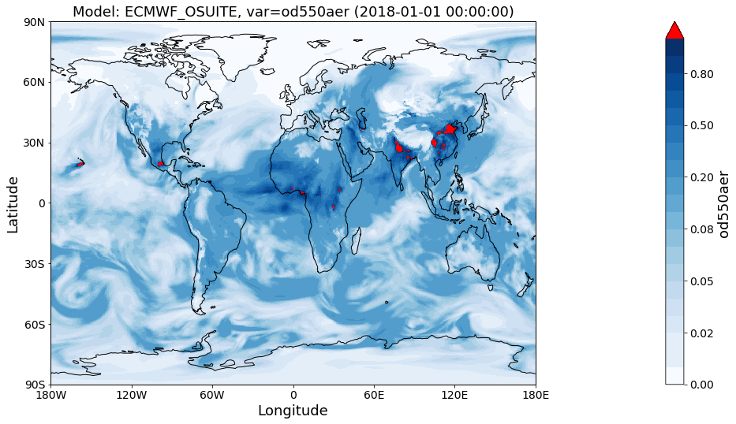
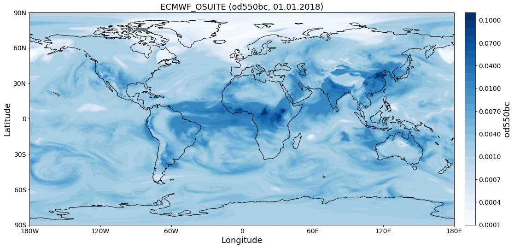
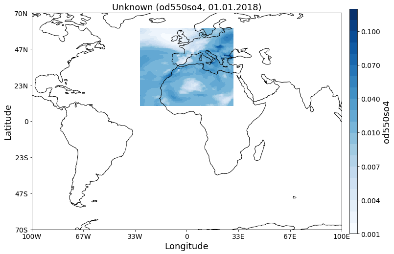
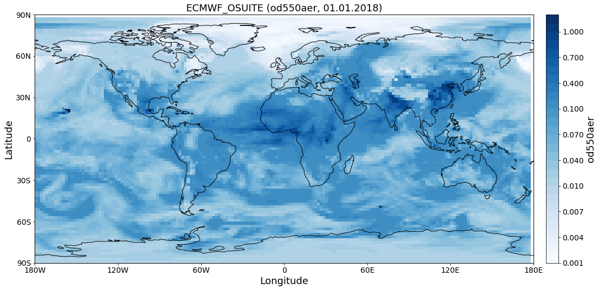
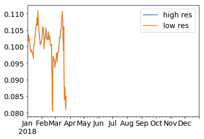

Introducing the ``GriddedData`` class
~~~~~~~~~~~~~~~~~~~~~~~~~~~~~~~~~~~~~

This notebook introduces basic features of the
`GriddedData <http://aerocom.met.no/pya/api.html#pya.griddeddata.GriddedData>`__
class of pyaerocom. The ``GriddedData`` class is the fundamental base
class for the analysis of model data. The underlying data type is
`iris.cube.Cube <http://scitools.org.uk/iris/docs/latest/iris/iris/cube.html#iris.cube.Cube>`__
which was extended, for instance by allowing direct imports of netCDF
files when creating an instance of ``GriddedData`` (i.e. by passing the
filename and specifying the variable name on initialisation). This
notebook introduces some of the features of the ``GriddedData`` class.
Starting with some imports…

.. code:: ipython3

    import pyaerocom as pya
    from warnings import filterwarnings
    filterwarnings('ignore')
    pya.change_verbosity('critical')

.. parsed-literal::

    Initating pyaerocom configuration
    Checking server configuration ...
    Checking access to: /lustre/storeA
    Access to lustre database: True
    Init data paths for lustre
    Expired time: 0.016 s

Let’s get a test file to load

.. code:: ipython3

    test_files = pya.io.testfiles.get()
    for name, filepath in test_files["models"].items(): print("%s\n%s\n" %(name, filepath))

.. parsed-literal::

    aatsr_su_v4.3
    /lustre/storeA/project/aerocom/aerocom-users-database/CCI-Aerosol/CCI_AEROSOL_Phase2/AATSR_SU_v4.3/renamed/aerocom.AATSR_SU_v4.3.daily.od550aer.2008.nc
    
    ecmwf_osuite
    /lustre/storeA/project/aerocom/aerocom1/ECMWF_OSUITE_NRT_test/renamed/aerocom.ECMWF_OSUITE_NRT_test.daily.od550aer.2018.nc
    

Let’s pick out the ECMWF OSUITE test file and load the data directly
into an instance of the ``GriddedData`` class. The ``GriddedData`` class
takes either preloaded instances of the ``iris.cube.Cube`` class as
input, or a valid netCDF file path. The latter requires specification of
the variable name which is then filtered from the data stored in the
netCDF file (which may contain multiple variables. The following example
imports the data for the aerosol optical density at 550 nm. The string
representation of the ``GriddedData`` class (see print at end of
following code cell) was slitghtly adapted from the underlying ``Cube``
object.

.. code:: ipython3

    fpath = test_files["models"]["ecmwf_osuite"]
    data = pya.GriddedData(input=fpath, var_name="od550aer", name="ECMWF_OSUITE")
    print(data)

.. parsed-literal::

    pyaerocom.GriddedData: Unknown
    Grid data: Dust Aerosol Optical Depth at 550nm / (unknown) (time: 365; latitude: 451; longitude: 900)
         Dimension coordinates:
              time                                       x              -               -
              latitude                                   -              x               -
              longitude                                  -              -               x
         Attributes:
              Conventions: CF-1.0
              NCO: 4.7.2
              history: Tue Mar 20 13:08:49 2018: ncks -7 -O -o test.nc -x -v time_bnds od550aer.test.orig.nc
    Tue...
              history_of_appended_files: Tue Mar 20 02:09:15 2018: Appended file /lustre/storeA/project/aerocom/aerocom1/ECMWF_OSUITE_NRT/renamed//aerocom.ECMWF_OSUITE_NRT.daily.od550bc.2018.nc...
              invalid_units: ~
              nco_openmp_thread_number: 1
         Cell methods:
              mean: time

Remark on longitude definition
^^^^^^^^^^^^^^^^^^^^^^^^^^^^^^

.. raw:: html

   

If the longitudes in the original NetCDF file are defined as

.. math:: 0 \leq\,\text{lon}\,\leq360

they are converted automatically to

.. math:: -180\leq\,\text{lon}\,\leq180

when an instance of the ``GriddedData`` class is created (see print
statment above *Rolling longitudes to -180 -> 180 definition*). This is,
for instance, the case for the ECMWF OSUITE data files.

.. raw:: html

   

Features of the ``GriddedData`` class
^^^^^^^^^^^^^^^^^^^^^^^^^^^^^^^^^^^^^

In the following cell, some of the most important attributes are
introduced. These are mostly reimplementations of the underlying
``Cube`` data which is stored in the ``GriddedData.grid`` attribute. For
instance the attribute ``GriddedData.longitude`` get’s you
``GriddedData.grid.coord("longitude")``, ``GriddedData.latitude`` get’s
you ``GriddedData.grid.coord("latitude")`` and ``GriddedData.time``
get’s you ``GriddedData.grid.coord("time")``.

.. code:: ipython3

    print(data.var_name)
    print(type(data.longitude))
    print("Longitude attr is pointer to DimCoord instance of underlying Cube: %s" %(data.longitude is data.grid.coord("longitude")))
    print(data.longitude.points.min(), data.longitude.points.max())
    print(data.latitude.points.min(), data.latitude.points.max())
    print(data.time.points.min(), data.time.points.max())
    tstamps = data.time_stamps()
    print(tstamps[0], tstamps[-1])

.. parsed-literal::

    od550aer
    <class 'iris.coords.DimCoord'>
    Longitude attr is pointer to DimCoord instance of underlying Cube: True
    -180.0 179.60000610351562
    -90.0 90.0
    0.0 364.0
    2018-01-01T00:00:00.000000 2018-12-31T00:00:00.000000

If you do not specify the variable type, an Exception is raised, that
will get you some information about what variables are available in the
file (if the file is readable using the ``iris.load`` method).

.. code:: ipython3

    try:
        data = pya.GriddedData(input=fpath)
    except pya.exceptions.NetcdfError as e:
        print("This did not work...error message: %s" %repr(e))

.. parsed-literal::

    This did not work...error message: NetcdfError("Could not load single cube from /lustre/storeA/project/aerocom/aerocom1/ECMWF_OSUITE_NRT_test/renamed/aerocom.ECMWF_OSUITE_NRT_test.daily.od550aer.2018.nc. Please specify var_name. Input file contains the following variables: ['od550oa', 'od550dust', 'od550so4', 'od550bc', 'od550aer']",)

Also, if you parse an invalid variable name, you will get some hint.

.. code:: ipython3

    try:
        data = pya.GriddedData(input=fpath, var_name="Blaaa")
    except Exception as e:
        print("This also did not work...error message: %s" %repr(e))

.. parsed-literal::

    This also did not work...error message: NetcdfError('Variable Blaaa not available in file /lustre/storeA/project/aerocom/aerocom1/ECMWF_OSUITE_NRT_test/renamed/aerocom.ECMWF_OSUITE_NRT_test.daily.od550aer.2018.nc',)

You can have a quick look at the data using the class-own quickplot
method

.. code:: ipython3

    fig = data.quickplot_map(time_idx=0, 
                             vmin=0, 
                             vmax=1, 
                             c_over="r")

Why not load some of the other variables…

.. code:: ipython3

    data_bc = pya.GriddedData(fpath, var_name="od550bc", name="ECMWF_OSUITE")
    data_so4 = pya.GriddedData(fpath, var_name="od550so4", name="ECMWF_OSUITE")

… and plot them as well

.. code:: ipython3

    fig1 = data_bc.quickplot_map()
    fig2 = data_so4.crop(lon_range=(-30, 30), 
                         lat_range=(10, 60)).quickplot_map(xlim=(-100, 100), 
                                                           ylim=(-70, 70))

Change resolution
^^^^^^^^^^^^^^^^^

Downscale to 2x2 resolution:

.. code:: ipython3

    lons = np.arange(-180, 180, 2)
    lats = np.arange(-90, 90, 2)
    
    data_lowres = data.interpolate(longitude=lons, latitude=lats)

.. parsed-literal::

    Interpolating data of shape (365, 451, 900). This may take a while.
    Successfully interpolated cube

And plot:

.. code:: ipython3

    fig =data_lowres.quickplot_map()

Area weighted mean
^^^^^^^^^^^^^^^^^^

Retrieve area weighted mean from data

.. code:: ipython3

    import pandas as pd
    mean_highres = data.area_weighted_mean()
    mean_lowres = data_lowres.area_weighted_mean()
    s_highres = pd.Series(mean_highres, data.time_stamps())
    s_lowres = pd.Series(mean_lowres, data.time_stamps())
    
    ax = s_highres.plot(label='high res')
    ax = s_lowres.plot(ax=ax, label = 'low res')
    ax.legend()

.. parsed-literal::

    <matplotlib.legend.Legend at 0x7fcfdd922470>

Looks similar (which is good).

… more to come
^^^^^^^^^^^^^^

This tutorial is not yet completed as the ``GriddedData`` class is
currently under development.
