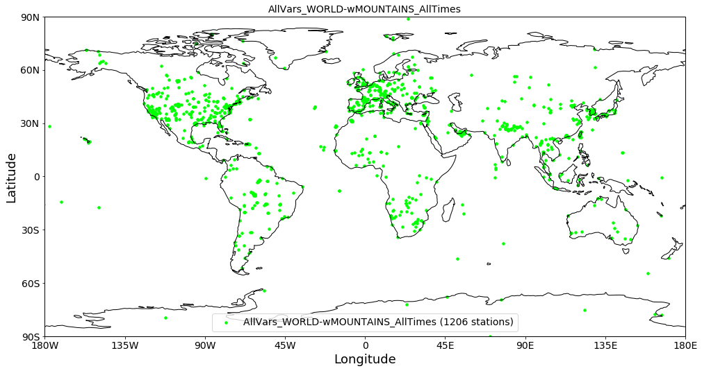
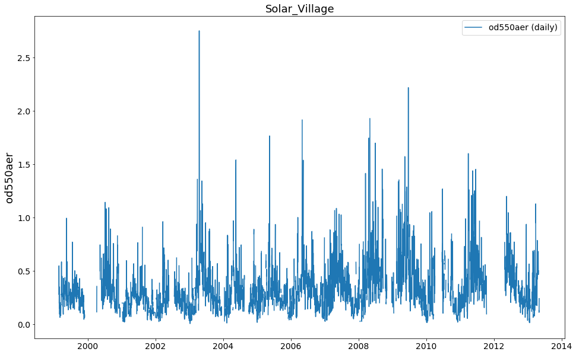

Reading of ungridded observation datasets in pyaerocom
~~~~~~~~~~~~~~~~~~~~~~~~~~~~~~~~~~~~~~~~~~~~~~~~~~~~~~

Primer on observation datasets
^^^^^^^^^^^^^^^^^^^^^^^^^^^^^^

-  Observation data is often provided ungridded in the form of ASCII
   text files that contain both the data and relevant metadata.
-  In **pyaerocom** such datasets are referred to as **ungridded data**
   since it is sparse observations at different locations and at
   different times.
-  The format of the files can be very different between different
   observation networks but is usually the same for all data files that
   belong to one network.
-  The data files are often provided **per station**, that is, **one
   data file** contains data (i.e. time-series data of one or more
   variables and metadata such as *station name, latitude, longitude,
   altitude, PI* **from a single station**

   -  Other than model data (which often follows certain file standards,
      e.g. NetCDF files and naming conventions, e.g.
      `CF-conventions <http://cfconventions.org/>`__

-  For some databases, there is exactly one file per station (containing
   all available data from that station). This is the case in the
   example dataset shown below (Aeronet Sun version 3 level2 daily
   data). However, the general case is that there may be more than one
   file per station (the `EBAS <http://ebas.nilu.no/>`__ database is
   such an example, where there can be multiple data files per station,
   `see this
   notebook <https://pyaerocom.met.no/tutorials.html#merging-of-several-stationdata-objects-into-one>`__
   for an example of how complicated it may get).

Data access
^^^^^^^^^^^

Both the model and the observation datasets related to the AeroCom
project are stored on internal servers at the Norwegian Meteorological
Institute (METNO). On import, pyaerocom automatically checks if it can
access the METNO servers containing the data.

The data directory of each dataset can be accessed via an *unique ID*
for the dataset. These ID’s can be a little cryptic sometimes and parts
of this tutorial show, how to find the data you search for, regardless
whether you know the exact pyaerocom ID or not.

For instance, below we are going to work with AERONET Sun photometer
data, using the version 3, level 2 daily data product. The corresponding
ID for this dataset in pyaerocom is **AeronetSunV3Lev2.daily**.

**NOTE**
^^^^^^^^

**This notebook requires access to the AeroCom database and will not
work if you do not have access to the AeroCom servers at METNO**

More info about pyaerocom
^^^^^^^^^^^^^^^^^^^^^^^^^

-  Website and code documentation (API): https://pyaerocom.met.no/
-  GitHub: https://github.com/metno/pyaerocom

If you run into problems
^^^^^^^^^^^^^^^^^^^^^^^^

Please `create an issue <https://github.com/metno/pyaerocom/issues>`__
if you run into problems or have suggestions for improvements.

Reading of and investigating Aeronet Sun AODs (version 3, level 2 data)
^^^^^^^^^^^^^^^^^^^^^^^^^^^^^^^^^^^^^^^^^^^^^^^^^^^^^^^^^^^^^^^^^^^^^^^

.. code:: ipython3

    import pyaerocom as pya

.. parsed-literal::

    Initating pyaerocom configuration
    Checking database access...
    Checking access to: /lustre/storeA
    Access to lustre database: True
    Init data paths for lustre
    Expired time: 0.021 s

Check version of pyaerocom:

.. code:: ipython3

    pya.__version__ #0.8.0.dev6

.. parsed-literal::

    '0.8.0.dev19'

Search data ID for Aeronet Sun version 2 level 2, daily data
^^^^^^^^^^^^^^^^^^^^^^^^^^^^^^^^^^^^^^^^^^^^^^^^^^^^^^^^^^^^

The ``browse_database`` method helps you to find model or observation
datasets.

.. code:: ipython3

    pya.browse_database('Aeronet*Sun*V3*')

.. parsed-literal::

    
    Dataset name: AeronetSunV3Lev1.5.daily
    Data directory: /lustre/storeA/project/aerocom/aerocom1/AEROCOM_OBSDATA/AeronetSunV3Lev1.5.daily/renamed
    Supported variables: ['od340aer', 'od440aer', 'od500aer', 'od870aer', 'ang4487aer', 'ang4487aer_calc', 'od550aer']
    Last revision: 20190311
    
    Dataset name: AeronetSunV3Lev1.5.AP
    Data directory: /lustre/storeA/project/aerocom/aerocom1/AEROCOM_OBSDATA/AeronetSunV3Lev1.5.AP/renamed
    Supported variables: ['od340aer', 'od440aer', 'od500aer', 'od870aer', 'ang4487aer', 'ang4487aer_calc', 'od550aer']
    Last revision: 20190402
    
    Dataset name: AeronetSunV3Lev2.daily
    Data directory: /lustre/storeA/project/aerocom/aerocom1/AEROCOM_OBSDATA/AeronetSunV3Lev2.0.daily/renamed
    Supported variables: ['od340aer', 'od440aer', 'od500aer', 'od870aer', 'ang4487aer', 'ang4487aer_calc', 'od550aer']
    Last revision: 20190311
    Reading failed for AeronetSunV3Lev2.AP. Error: OSError('Data directory /lustre/storeA/project/aerocom/aerocom1/AEROCOM_OBSDATA/AeronetSunV3Lev2.0.AP/renamed of observation network AeronetSunV3Lev2.AP does not exists',)

You can see that there are three matches that can be read. The attribute
``dataset_name`` specifies the ID that we are looking for that is
required to read the data.

Below, we are interested in the following dataset:

.. code:: ipython3

    DATA_ID = 'AeronetSunV3Lev2.daily'

Pick one (or more) variable(s) of interest
^^^^^^^^^^^^^^^^^^^^^^^^^^^^^^^^^^^^^^^^^^

From the output above, you can also see which variables the individual
datasets provide. The variable names follow AeroCom conventions and you
can find more information (e.g. CF standard names) about each variable
`here <https://pyaerocom.met.no/config_files.html#variables>`__.

In the following we will import the aerosol optical depth data at 550 nm
(``od550aer``)

.. code:: ipython3

    VAR_TO_READ = 'od550aer' # you can also use a list of supported variables if you like, e.g. (od550aer, od440aer)

Read the AODs from the whole database (all available stations / times) using the ReadUngridded class
^^^^^^^^^^^^^^^^^^^^^^^^^^^^^^^^^^^^^^^^^^^^^^^^^^^^^^^^^^^^^^^^^^^^^^^^^^^^^^^^^^^^^^^^^^^^^^^^^^^^

Since the dataformats are usually specific for each observation dataset
/ network, each supported dataset has it’s own reading routine in
pyaerocom. The individual reading routines can be found in the
``pyaerocom.io`` module. For instance, the class

.. code:: ipython3

    pya.io.ReadAeronetSunV3

.. parsed-literal::

    pyaerocom.io.read_aeronet_sunv3.ReadAeronetSunV3

contains the reading methods for the Aeronet Sun version 3 dataset that
we are interested in.

However in order to make life easier for everyone, all implemented
*individual reading routines* for *each individual dataset* are
registered in the
`ReadUngridded <https://pyaerocom.met.no/api.html?highlight=readungridded#pyaerocom.io.readungridded.ReadUngridded>`__
factory class, which has registered these *individual reading routines*
(this works, becuase the invididual reading routines are all based on
the same API
`template <https://pyaerocom.met.no/api.html?highlight=readungridded#pyaerocom.io.readungriddedbase.ReadUngriddedBase>`__).

Here, *registered* means, that the *dataset ID* of one network is linked
with the corresponding reading class.

Having said that, it means that calling

.. code:: python

   data = pya.io.ReadAeronetSunV3(vars_to_read='od550aer')

will give you exactly the same result as calling:

.. code:: python

   data = pya.io.ReadUngridded(dataset_to_read='AeronetSunV3Lev2.daily',
                               vars_to_read='od550aer')

The returned data object is an instance of the
`UngriddedData <https://pyaerocom.met.no/api.html?highlight=ungriddeddata#pyaerocom.ungriddeddata.UngriddedData>`__
class which is the pyaerocom standard object for ungridded data and
which is designed to hold a whole dataset of observation records
(i.e. data from all stations).

Create instance of ReadUngridded class
^^^^^^^^^^^^^^^^^^^^^^^^^^^^^^^^^^^^^^

.. code:: ipython3

    reader = pya.io.ReadUngridded(DATA_ID)
    print(reader)

.. parsed-literal::

    
    Dataset name: AeronetSunV3Lev2.daily
    Data directory: /lustre/storeA/project/aerocom/aerocom1/AEROCOM_OBSDATA/AeronetSunV3Lev2.0.daily/renamed
    Supported variables: ['od340aer', 'od440aer', 'od500aer', 'od870aer', 'ang4487aer', 'ang4487aer_calc', 'od550aer']
    Last revision: 20190311

You may also check, which other datasets are supported by the
``ReadUngridded`` class:

.. code:: ipython3

    reader.supported_datasets

.. parsed-literal::

    ['AeronetInvV3Lev2.daily',
     'AeronetInvV3Lev1.5.daily',
     'AeronetInvV2Lev2.daily',
     'AeronetInvV2Lev1.5.daily',
     'AeronetSDAV2Lev2.daily',
     'AeronetSDAV3Lev1.5.daily',
     'AeronetSDAV3Lev2.daily',
     'AeronetSunV2Lev2.daily',
     'AeronetSunV2Lev2.AP',
     'AeronetSunV3Lev1.5.daily',
     'AeronetSunV3Lev1.5.AP',
     'AeronetSunV3Lev2.daily',
     'AeronetSunV3Lev2.AP',
     'EARLINET',
     'EBASMC']

Read the dataset
^^^^^^^^^^^^^^^^

The ``read`` method loops over all files that exist for this dataset and
reads them into one data object (``data``) which contains the whole
dataset.

**NOTE**: this can take a while as it has to read ~1000 files.

.. code:: ipython3

    data = reader.read(vars_to_retrieve=VAR_TO_READ)
    print(data)

.. parsed-literal::

    Found Cache match for AeronetSunV3Lev2.daily

.. parsed-literal::

    
    Pyaerocom UngriddedData
    -----------------------
    Contains networks: ['AeronetSunV3Lev2.daily']
    Contains variables: ['od550aer']
    Contains instruments: ['sun_photometer']
    Total no. of meta-blocks: 1206

That’s it! That is all that is required to import an ungridded dataset.

The data object that is returned by the ``read`` method is an instance
of the
`pyaerocom.UngriddedData <https://pyaerocom.met.no/api.html?highlight=ungriddeddata#pyaerocom.ungriddeddata.UngriddedData>`__
class.

The ``UngriddedData`` object provides an interface that can be used to
work with the data and further analyse it.

From the output above, you can see that this datasets contains 1199
*meta-blocks*, that is, one meta block per data file that was read.
Since for this database, each station has exactly one datafile, this
means that each meta-block corresponds to one station.

The next tutorial is based on this tutorial and will introduce the
``UngriddedData`` class and furthermore, the ``StationData`` class.

However, before ending this tutorial without a plot, let’s have a
glimpse at the features of the ``UngriddedData`` object that we just
created:

.. code:: ipython3

    data.plot_station_coordinates(markersize=12, color='lime');

.. code:: ipython3

    data.plot_station_timeseries('Solar*', 'od550aer');

Finally, store the data object so that it can be used in the next
tutorial:

.. code:: ipython3

    %store data

.. parsed-literal::

    Stored 'data' (UngriddedData)

