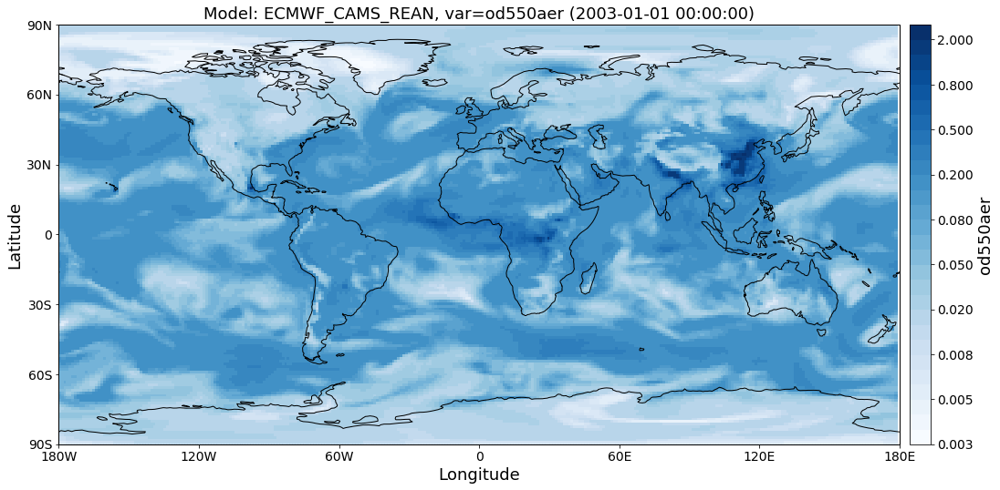

Collocating gridded data with discrete observations
~~~~~~~~~~~~~~~~~~~~~~~~~~~~~~~~~~~~~~~~~~~~~~~~~~~

This notebook gives an introduction into collocation of gridded data
with observations. Here, AODs of the ECMWF CAMS reanalysis model are
compared with global daily observations from the AeroNet V2 (Level 2)
for the years of 2010-2018.

NOTE
^^^^

 This notebook is currently under development

Import setup and imports
^^^^^^^^^^^^^^^^^^^^^^^^

.. code:: ipython3

    import pyaerocom
    
    start=2000
    stop=2018
    
    variables = ["od550aer"]
    
    ts_type = "daily"
    
    model_id = "ECMWF_CAMS_REAN"
    obs_id = pyaerocom.const.AERONET_SUN_V2L2_AOD_DAILY_NAME
    obs_id

.. parsed-literal::

    'AeronetSunV2Lev2.daily'

Import of model data
^^^^^^^^^^^^^^^^^^^^

.. code:: ipython3

    model_io = pyaerocom.io.ReadGridded(model_id, start_time=start, stop_time=stop, verbose=False)
    print(model_io)

.. parsed-literal::

    
    Pyaerocom ReadGridded
    ---------------------
    Model ID: ECMWF_CAMS_REAN
    Available variables: ['ang4487aer', 'od440aer', 'od550aer', 'od550bc', 'od550dust', 'od550oa', 'od550so4', 'od550ss', 'od865aer']
    Available years: [2003, 2004, 2005, 2006, 2007, 2008, 2009, 2010, 2011, 2012, 2013, 2014, 2015, 2016, 9999]

.. code:: ipython3

    for var in variables:
        model_io.read_var(var)

.. code:: ipython3

    print(model_io)

.. parsed-literal::

    
    Pyaerocom ReadGridded
    ---------------------
    Model ID: ECMWF_CAMS_REAN
    Available variables: ['ang4487aer', 'od440aer', 'od550aer', 'od550bc', 'od550dust', 'od550oa', 'od550so4', 'od550ss', 'od865aer']
    Available years: [2003, 2004, 2005, 2006, 2007, 2008, 2009, 2010, 2011, 2012, 2013, 2014, 2015, 2016, 9999]
    
    Loaded GriddedData objects:
    
    Pyaerocom GriddedData
    ---------------------
    Variable: od550aer
    Temporal resolution: daily
    Start / Stop: 2003-01-01T00:00:00.000000 - 2016-12-31T00:00:00.000000

.. code:: ipython3

    model_data = model_io["od550aer"]

.. code:: ipython3

    fig = model_data.quickplot_map()

Import of AeroNet V2 data (Level 2)
^^^^^^^^^^^^^^^^^^^^^^^^^^^^^^^^^^^

The following cell imports all available data from the AeroNet network.
This might take a while in case the data has not been cached before.

.. code:: ipython3

    read = pyaerocom.io.ReadAeronetSunV2(verbose=True)
    obs_data = read.read()

.. parsed-literal::

    searching for data files. This might take a while...
    /lustre/storeA/project/aerocom/aerocom1/AEROCOM_OBSDATA/AeronetRaw2.0/renamed/920801_180519_AOE_Baotou.lev20
    /lustre/storeA/project/aerocom/aerocom1/AEROCOM_OBSDATA/AeronetRaw2.0/renamed/920801_180519_ARM_Ascension_Is.lev20
    /lustre/storeA/project/aerocom/aerocom1/AEROCOM_OBSDATA/AeronetRaw2.0/renamed/920801_180519_ARM_Barnstable_MA.lev20
    /lustre/storeA/project/aerocom/aerocom1/AEROCOM_OBSDATA/AeronetRaw2.0/renamed/920801_180519_ARM_Darwin.lev20
    /lustre/storeA/project/aerocom/aerocom1/AEROCOM_OBSDATA/AeronetRaw2.0/renamed/920801_180519_ARM_Gan_Island.lev20
    /lustre/storeA/project/aerocom/aerocom1/AEROCOM_OBSDATA/AeronetRaw2.0/renamed/920801_180519_ARM_Graciosa.lev20
    /lustre/storeA/project/aerocom/aerocom1/AEROCOM_OBSDATA/AeronetRaw2.0/renamed/920801_180519_ARM_Highlands_MA.lev20
    /lustre/storeA/project/aerocom/aerocom1/AEROCOM_OBSDATA/AeronetRaw2.0/renamed/920801_180519_ARM_HyytialaFinland.lev20
    /lustre/storeA/project/aerocom/aerocom1/AEROCOM_OBSDATA/AeronetRaw2.0/renamed/920801_180519_ARM_Manacapuru.lev20
    /lustre/storeA/project/aerocom/aerocom1/AEROCOM_OBSDATA/AeronetRaw2.0/renamed/920801_180519_ARM_McMurdo.lev20
    /lustre/storeA/project/aerocom/aerocom1/AEROCOM_OBSDATA/AeronetRaw2.0/renamed/920801_180519_ARM_Nainital.lev20
    /lustre/storeA/project/aerocom/aerocom1/AEROCOM_OBSDATA/AeronetRaw2.0/renamed/920801_180519_ARM_Oliktok_AK.lev20
    /lustre/storeA/project/aerocom/aerocom1/AEROCOM_OBSDATA/AeronetRaw2.0/renamed/920801_180519_ARM_WAIS.lev20
    /lustre/storeA/project/aerocom/aerocom1/AEROCOM_OBSDATA/AeronetRaw2.0/renamed/920801_180519_ATHENS-NOA.lev20

.. parsed-literal::

    /lustre/storeA/project/aerocom/aerocom1/AEROCOM_OBSDATA/AeronetRaw2.0/renamed/920801_180519_AOE_Baotou.lev20
    /lustre/storeA/project/aerocom/aerocom1/AEROCOM_OBSDATA/AeronetRaw2.0/renamed/920801_180519_ARM_Ascension_Is.lev20
    /lustre/storeA/project/aerocom/aerocom1/AEROCOM_OBSDATA/AeronetRaw2.0/renamed/920801_180519_ARM_Barnstable_MA.lev20
    /lustre/storeA/project/aerocom/aerocom1/AEROCOM_OBSDATA/AeronetRaw2.0/renamed/920801_180519_ARM_Darwin.lev20
    /lustre/storeA/project/aerocom/aerocom1/AEROCOM_OBSDATA/AeronetRaw2.0/renamed/920801_180519_ARM_Gan_Island.lev20
    /lustre/storeA/project/aerocom/aerocom1/AEROCOM_OBSDATA/AeronetRaw2.0/renamed/920801_180519_ARM_Graciosa.lev20
    /lustre/storeA/project/aerocom/aerocom1/AEROCOM_OBSDATA/AeronetRaw2.0/renamed/920801_180519_ARM_Highlands_MA.lev20
    /lustre/storeA/project/aerocom/aerocom1/AEROCOM_OBSDATA/AeronetRaw2.0/renamed/920801_180519_ARM_HyytialaFinland.lev20
    /lustre/storeA/project/aerocom/aerocom1/AEROCOM_OBSDATA/AeronetRaw2.0/renamed/920801_180519_ARM_Manacapuru.lev20
    /lustre/storeA/project/aerocom/aerocom1/AEROCOM_OBSDATA/AeronetRaw2.0/renamed/920801_180519_ARM_McMurdo.lev20
    /lustre/storeA/project/aerocom/aerocom1/AEROCOM_OBSDATA/AeronetRaw2.0/renamed/920801_180519_ARM_Nainital.lev20
    /lustre/storeA/project/aerocom/aerocom1/AEROCOM_OBSDATA/AeronetRaw2.0/renamed/920801_180519_ARM_Oliktok_AK.lev20
    /lustre/storeA/project/aerocom/aerocom1/AEROCOM_OBSDATA/AeronetRaw2.0/renamed/920801_180519_ARM_WAIS.lev20
    /lustre/storeA/project/aerocom/aerocom1/AEROCOM_OBSDATA/AeronetRaw2.0/renamed/920801_180519_ATHENS-NOA.lev20
    /lustre/storeA/project/aerocom/aerocom1/AEROCOM_OBSDATA/AeronetRaw2.0/renamed/920801_180519_Abisko.lev20
    /lustre/storeA/project/aerocom/aerocom1/AEROCOM_OBSDATA/AeronetRaw2.0/renamed/920801_180519_Abracos_Hill.lev20
    /lustre/storeA/project/aerocom/aerocom1/AEROCOM_OBSDATA/AeronetRaw2.0/renamed/920801_180519_Abu_Al_Bukhoosh.lev20
    /lustre/storeA/project/aerocom/aerocom1/AEROCOM_OBSDATA/AeronetRaw2.0/renamed/920801_180519_Abu_Dhabi.lev20
    /lustre/storeA/project/aerocom/aerocom1/AEROCOM_OBSDATA/AeronetRaw2.0/renamed/920801_180519_Adelaide_Site_7.lev20
    /lustre/storeA/project/aerocom/aerocom1/AEROCOM_OBSDATA/AeronetRaw2.0/renamed/920801_180519_AgiaMarina_Xyliatou.lev20
    /lustre/storeA/project/aerocom/aerocom1/AEROCOM_OBSDATA/AeronetRaw2.0/renamed/920801_180519_Agoufou.lev20
    /lustre/storeA/project/aerocom/aerocom1/AEROCOM_OBSDATA/AeronetRaw2.0/renamed/920801_180519_Aguas_Emendadas.lev20

.. parsed-literal::

    /lustre/storeA/project/aerocom/aerocom1/AEROCOM_OBSDATA/AeronetRaw2.0/renamed/920801_180519_Abisko.lev20
    /lustre/storeA/project/aerocom/aerocom1/AEROCOM_OBSDATA/AeronetRaw2.0/renamed/920801_180519_Abracos_Hill.lev20
    /lustre/storeA/project/aerocom/aerocom1/AEROCOM_OBSDATA/AeronetRaw2.0/renamed/920801_180519_Abu_Al_Bukhoosh.lev20
    /lustre/storeA/project/aerocom/aerocom1/AEROCOM_OBSDATA/AeronetRaw2.0/renamed/920801_180519_Abu_Dhabi.lev20
    /lustre/storeA/project/aerocom/aerocom1/AEROCOM_OBSDATA/AeronetRaw2.0/renamed/920801_180519_Adelaide_Site_7.lev20
    /lustre/storeA/project/aerocom/aerocom1/AEROCOM_OBSDATA/AeronetRaw2.0/renamed/920801_180519_AgiaMarina_Xyliatou.lev20
    /lustre/storeA/project/aerocom/aerocom1/AEROCOM_OBSDATA/AeronetRaw2.0/renamed/920801_180519_Agoufou.lev20
    /lustre/storeA/project/aerocom/aerocom1/AEROCOM_OBSDATA/AeronetRaw2.0/renamed/920801_180519_Aguas_Emendadas.lev20
    /lustre/storeA/project/aerocom/aerocom1/AEROCOM_OBSDATA/AeronetRaw2.0/renamed/920801_180519_Ahi_De_Cara.lev20
    /lustre/storeA/project/aerocom/aerocom1/AEROCOM_OBSDATA/AeronetRaw2.0/renamed/920801_180519_Aire_Adour.lev20
    /lustre/storeA/project/aerocom/aerocom1/AEROCOM_OBSDATA/AeronetRaw2.0/renamed/920801_180519_Al_Ain.lev20
    /lustre/storeA/project/aerocom/aerocom1/AEROCOM_OBSDATA/AeronetRaw2.0/renamed/920801_180519_Al_Dhafra.lev20
    /lustre/storeA/project/aerocom/aerocom1/AEROCOM_OBSDATA/AeronetRaw2.0/renamed/920801_180519_Al_Khaznah.lev20
    /lustre/storeA/project/aerocom/aerocom1/AEROCOM_OBSDATA/AeronetRaw2.0/renamed/920801_180519_Al_Qlaa.lev20
    /lustre/storeA/project/aerocom/aerocom1/AEROCOM_OBSDATA/AeronetRaw2.0/renamed/920801_180519_Albany_Oregon.lev20
    /lustre/storeA/project/aerocom/aerocom1/AEROCOM_OBSDATA/AeronetRaw2.0/renamed/920801_180519_Albergue_UGR.lev20
    /lustre/storeA/project/aerocom/aerocom1/AEROCOM_OBSDATA/AeronetRaw2.0/renamed/920801_180519_Alboran.lev20
    /lustre/storeA/project/aerocom/aerocom1/AEROCOM_OBSDATA/AeronetRaw2.0/renamed/920801_180519_Alishan.lev20
    /lustre/storeA/project/aerocom/aerocom1/AEROCOM_OBSDATA/AeronetRaw2.0/renamed/920801_180519_Alta_Floresta.lev20
    adding chunk, new array size ((11000, 11))
    adding chunk, new array size ((12000, 11))
    adding chunk, new array size ((13000, 11))
    adding chunk, new array size ((14000, 11))
    /lustre/storeA/project/aerocom/aerocom1/AEROCOM_OBSDATA/AeronetRaw2.0/renamed/920801_180519_Amazon_ATTO_Tower.lev20
    /lustre/storeA/project/aerocom/aerocom1/AEROCOM_OBSDATA/AeronetRaw2.0/renamed/920801_180519_American_Samoa.lev20
    /lustre/storeA/project/aerocom/aerocom1/AEROCOM_OBSDATA/AeronetRaw2.0/renamed/920801_180519_Ames.lev20

.. parsed-literal::

    /lustre/storeA/project/aerocom/aerocom1/AEROCOM_OBSDATA/AeronetRaw2.0/renamed/920801_180519_Ahi_De_Cara.lev20
    /lustre/storeA/project/aerocom/aerocom1/AEROCOM_OBSDATA/AeronetRaw2.0/renamed/920801_180519_Aire_Adour.lev20
    /lustre/storeA/project/aerocom/aerocom1/AEROCOM_OBSDATA/AeronetRaw2.0/renamed/920801_180519_Al_Ain.lev20
    /lustre/storeA/project/aerocom/aerocom1/AEROCOM_OBSDATA/AeronetRaw2.0/renamed/920801_180519_Al_Dhafra.lev20
    /lustre/storeA/project/aerocom/aerocom1/AEROCOM_OBSDATA/AeronetRaw2.0/renamed/920801_180519_Al_Khaznah.lev20
    /lustre/storeA/project/aerocom/aerocom1/AEROCOM_OBSDATA/AeronetRaw2.0/renamed/920801_180519_Al_Qlaa.lev20
    /lustre/storeA/project/aerocom/aerocom1/AEROCOM_OBSDATA/AeronetRaw2.0/renamed/920801_180519_Albany_Oregon.lev20
    /lustre/storeA/project/aerocom/aerocom1/AEROCOM_OBSDATA/AeronetRaw2.0/renamed/920801_180519_Albergue_UGR.lev20
    /lustre/storeA/project/aerocom/aerocom1/AEROCOM_OBSDATA/AeronetRaw2.0/renamed/920801_180519_Alboran.lev20
    /lustre/storeA/project/aerocom/aerocom1/AEROCOM_OBSDATA/AeronetRaw2.0/renamed/920801_180519_Alishan.lev20
    /lustre/storeA/project/aerocom/aerocom1/AEROCOM_OBSDATA/AeronetRaw2.0/renamed/920801_180519_Alta_Floresta.lev20
    /lustre/storeA/project/aerocom/aerocom1/AEROCOM_OBSDATA/AeronetRaw2.0/renamed/920801_180519_Amazon_ATTO_Tower.lev20
    /lustre/storeA/project/aerocom/aerocom1/AEROCOM_OBSDATA/AeronetRaw2.0/renamed/920801_180519_American_Samoa.lev20
    /lustre/storeA/project/aerocom/aerocom1/AEROCOM_OBSDATA/AeronetRaw2.0/renamed/920801_180519_Ames.lev20
    /lustre/storeA/project/aerocom/aerocom1/AEROCOM_OBSDATA/AeronetRaw2.0/renamed/920801_180519_Amsterdam_Island.lev20
    /lustre/storeA/project/aerocom/aerocom1/AEROCOM_OBSDATA/AeronetRaw2.0/renamed/920801_180519_Andenes.lev20
    /lustre/storeA/project/aerocom/aerocom1/AEROCOM_OBSDATA/AeronetRaw2.0/renamed/920801_180519_Andros_Island.lev20

.. parsed-literal::

    adding chunk, new array size ((15000, 11))
    adding chunk, new array size ((16000, 11))
    /lustre/storeA/project/aerocom/aerocom1/AEROCOM_OBSDATA/AeronetRaw2.0/renamed/920801_180519_Amsterdam_Island.lev20
    adding chunk, new array size ((17000, 11))
    /lustre/storeA/project/aerocom/aerocom1/AEROCOM_OBSDATA/AeronetRaw2.0/renamed/920801_180519_Andenes.lev20
    /lustre/storeA/project/aerocom/aerocom1/AEROCOM_OBSDATA/AeronetRaw2.0/renamed/920801_180519_Andros_Island.lev20
    /lustre/storeA/project/aerocom/aerocom1/AEROCOM_OBSDATA/AeronetRaw2.0/renamed/920801_180519_Angiola.lev20
    /lustre/storeA/project/aerocom/aerocom1/AEROCOM_OBSDATA/AeronetRaw2.0/renamed/920801_180519_Anmyon.lev20
    adding chunk, new array size ((18000, 11))
    adding chunk, new array size ((19000, 11))
    /lustre/storeA/project/aerocom/aerocom1/AEROCOM_OBSDATA/AeronetRaw2.0/renamed/920801_180519_Appalachian_State.lev20

.. parsed-literal::

    /lustre/storeA/project/aerocom/aerocom1/AEROCOM_OBSDATA/AeronetRaw2.0/renamed/920801_180519_Angiola.lev20
    /lustre/storeA/project/aerocom/aerocom1/AEROCOM_OBSDATA/AeronetRaw2.0/renamed/920801_180519_Anmyon.lev20
    /lustre/storeA/project/aerocom/aerocom1/AEROCOM_OBSDATA/AeronetRaw2.0/renamed/920801_180519_Appalachian_State.lev20

.. parsed-literal::

    adding chunk, new array size ((20000, 11))
    /lustre/storeA/project/aerocom/aerocom1/AEROCOM_OBSDATA/AeronetRaw2.0/renamed/920801_180519_Appledore_Island.lev20
    /lustre/storeA/project/aerocom/aerocom1/AEROCOM_OBSDATA/AeronetRaw2.0/renamed/920801_180519_Aras_de_los_Olmos.lev20
    /lustre/storeA/project/aerocom/aerocom1/AEROCOM_OBSDATA/AeronetRaw2.0/renamed/920801_180519_Arcachon.lev20
    adding chunk, new array size ((21000, 11))
    adding chunk, new array size ((22000, 11))
    /lustre/storeA/project/aerocom/aerocom1/AEROCOM_OBSDATA/AeronetRaw2.0/renamed/920801_180519_Arica.lev20
    adding chunk, new array size ((23000, 11))
    adding chunk, new array size ((24000, 11))
    adding chunk, new array size ((25000, 11))
    /lustre/storeA/project/aerocom/aerocom1/AEROCOM_OBSDATA/AeronetRaw2.0/renamed/920801_180519_Ariquiums.lev20
    /lustre/storeA/project/aerocom/aerocom1/AEROCOM_OBSDATA/AeronetRaw2.0/renamed/920801_180519_Armilla.lev20
    /lustre/storeA/project/aerocom/aerocom1/AEROCOM_OBSDATA/AeronetRaw2.0/renamed/920801_180519_Ascension_Island.lev20
    adding chunk, new array size ((26000, 11))
    adding chunk, new array size ((27000, 11))
    adding chunk, new array size ((28000, 11))
    /lustre/storeA/project/aerocom/aerocom1/AEROCOM_OBSDATA/AeronetRaw2.0/renamed/920801_180519_Aubiere_LAMP.lev20
    adding chunk, new array size ((29000, 11))
    adding chunk, new array size ((30000, 11))
    /lustre/storeA/project/aerocom/aerocom1/AEROCOM_OBSDATA/AeronetRaw2.0/renamed/920801_180519_Autilla.lev20

.. parsed-literal::

    /lustre/storeA/project/aerocom/aerocom1/AEROCOM_OBSDATA/AeronetRaw2.0/renamed/920801_180519_Appledore_Island.lev20
    /lustre/storeA/project/aerocom/aerocom1/AEROCOM_OBSDATA/AeronetRaw2.0/renamed/920801_180519_Aras_de_los_Olmos.lev20
    /lustre/storeA/project/aerocom/aerocom1/AEROCOM_OBSDATA/AeronetRaw2.0/renamed/920801_180519_Arcachon.lev20
    /lustre/storeA/project/aerocom/aerocom1/AEROCOM_OBSDATA/AeronetRaw2.0/renamed/920801_180519_Arica.lev20
    /lustre/storeA/project/aerocom/aerocom1/AEROCOM_OBSDATA/AeronetRaw2.0/renamed/920801_180519_Ariquiums.lev20
    /lustre/storeA/project/aerocom/aerocom1/AEROCOM_OBSDATA/AeronetRaw2.0/renamed/920801_180519_Armilla.lev20
    /lustre/storeA/project/aerocom/aerocom1/AEROCOM_OBSDATA/AeronetRaw2.0/renamed/920801_180519_Ascension_Island.lev20
    /lustre/storeA/project/aerocom/aerocom1/AEROCOM_OBSDATA/AeronetRaw2.0/renamed/920801_180519_Aubiere_LAMP.lev20
    /lustre/storeA/project/aerocom/aerocom1/AEROCOM_OBSDATA/AeronetRaw2.0/renamed/920801_180519_Autilla.lev20

.. parsed-literal::

    adding chunk, new array size ((31000, 11))
    /lustre/storeA/project/aerocom/aerocom1/AEROCOM_OBSDATA/AeronetRaw2.0/renamed/920801_180519_Avignon.lev20
    adding chunk, new array size ((32000, 11))
    adding chunk, new array size ((33000, 11))
    adding chunk, new array size ((34000, 11))
    /lustre/storeA/project/aerocom/aerocom1/AEROCOM_OBSDATA/AeronetRaw2.0/renamed/920801_180519_Azores.lev20
    adding chunk, new array size ((35000, 11))
    /lustre/storeA/project/aerocom/aerocom1/AEROCOM_OBSDATA/AeronetRaw2.0/renamed/920801_180519_BONDVILLE.lev20
    adding chunk, new array size ((36000, 11))
    adding chunk, new array size ((37000, 11))
    adding chunk, new array size ((38000, 11))
    /lustre/storeA/project/aerocom/aerocom1/AEROCOM_OBSDATA/AeronetRaw2.0/renamed/920801_180519_BORDEAUX.lev20
    /lustre/storeA/project/aerocom/aerocom1/AEROCOM_OBSDATA/AeronetRaw2.0/renamed/920801_180519_BSRN_BAO_Boulder.lev20
    adding chunk, new array size ((39000, 11))
    adding chunk, new array size ((40000, 11))
    adding chunk, new array size ((41000, 11))
    adding chunk, new array size ((42000, 11))
    /lustre/storeA/project/aerocom/aerocom1/AEROCOM_OBSDATA/AeronetRaw2.0/renamed/920801_180519_Bac_Giang.lev20
    adding chunk, new array size ((43000, 11))
    /lustre/storeA/project/aerocom/aerocom1/AEROCOM_OBSDATA/AeronetRaw2.0/renamed/920801_180519_Bac_Lieu.lev20
    adding chunk, new array size ((44000, 11))
    /lustre/storeA/project/aerocom/aerocom1/AEROCOM_OBSDATA/AeronetRaw2.0/renamed/920801_180519_Bach_Long_Vy.lev20

.. parsed-literal::

    /lustre/storeA/project/aerocom/aerocom1/AEROCOM_OBSDATA/AeronetRaw2.0/renamed/920801_180519_Avignon.lev20
    /lustre/storeA/project/aerocom/aerocom1/AEROCOM_OBSDATA/AeronetRaw2.0/renamed/920801_180519_Azores.lev20
    /lustre/storeA/project/aerocom/aerocom1/AEROCOM_OBSDATA/AeronetRaw2.0/renamed/920801_180519_BONDVILLE.lev20
    /lustre/storeA/project/aerocom/aerocom1/AEROCOM_OBSDATA/AeronetRaw2.0/renamed/920801_180519_BORDEAUX.lev20
    /lustre/storeA/project/aerocom/aerocom1/AEROCOM_OBSDATA/AeronetRaw2.0/renamed/920801_180519_BSRN_BAO_Boulder.lev20
    /lustre/storeA/project/aerocom/aerocom1/AEROCOM_OBSDATA/AeronetRaw2.0/renamed/920801_180519_Bac_Giang.lev20
    /lustre/storeA/project/aerocom/aerocom1/AEROCOM_OBSDATA/AeronetRaw2.0/renamed/920801_180519_Bac_Lieu.lev20
    /lustre/storeA/project/aerocom/aerocom1/AEROCOM_OBSDATA/AeronetRaw2.0/renamed/920801_180519_Bach_Long_Vy.lev20

.. parsed-literal::

    /lustre/storeA/project/aerocom/aerocom1/AEROCOM_OBSDATA/AeronetRaw2.0/renamed/920801_180519_BackGarden_GZ.lev20
    /lustre/storeA/project/aerocom/aerocom1/AEROCOM_OBSDATA/AeronetRaw2.0/renamed/920801_180519_Badajoz.lev20
    adding chunk, new array size ((45000, 11))
    /lustre/storeA/project/aerocom/aerocom1/AEROCOM_OBSDATA/AeronetRaw2.0/renamed/920801_180519_Baengnyeong.lev20
    adding chunk, new array size ((46000, 11))
    /lustre/storeA/project/aerocom/aerocom1/AEROCOM_OBSDATA/AeronetRaw2.0/renamed/920801_180519_Bahrain.lev20
    adding chunk, new array size ((47000, 11))
    /lustre/storeA/project/aerocom/aerocom1/AEROCOM_OBSDATA/AeronetRaw2.0/renamed/920801_180519_Bakersfield.lev20
    /lustre/storeA/project/aerocom/aerocom1/AEROCOM_OBSDATA/AeronetRaw2.0/renamed/920801_180519_Balbina.lev20
    adding chunk, new array size ((48000, 11))
    /lustre/storeA/project/aerocom/aerocom1/AEROCOM_OBSDATA/AeronetRaw2.0/renamed/920801_180519_Bambey-ISRA.lev20
    /lustre/storeA/project/aerocom/aerocom1/AEROCOM_OBSDATA/AeronetRaw2.0/renamed/920801_180519_Bamboo.lev20
    /lustre/storeA/project/aerocom/aerocom1/AEROCOM_OBSDATA/AeronetRaw2.0/renamed/920801_180519_Bandung.lev20
    adding chunk, new array size ((49000, 11))
    /lustre/storeA/project/aerocom/aerocom1/AEROCOM_OBSDATA/AeronetRaw2.0/renamed/920801_180519_Baneasa.lev20
    /lustre/storeA/project/aerocom/aerocom1/AEROCOM_OBSDATA/AeronetRaw2.0/renamed/920801_180519_Banizoumbou.lev20
    adding chunk, new array size ((50000, 11))
    adding chunk, new array size ((51000, 11))
    adding chunk, new array size ((52000, 11))
    adding chunk, new array size ((53000, 11))
    adding chunk, new array size ((54000, 11))
    /lustre/storeA/project/aerocom/aerocom1/AEROCOM_OBSDATA/AeronetRaw2.0/renamed/920801_180519_Barbados.lev20

.. parsed-literal::

    /lustre/storeA/project/aerocom/aerocom1/AEROCOM_OBSDATA/AeronetRaw2.0/renamed/920801_180519_BackGarden_GZ.lev20
    /lustre/storeA/project/aerocom/aerocom1/AEROCOM_OBSDATA/AeronetRaw2.0/renamed/920801_180519_Badajoz.lev20
    /lustre/storeA/project/aerocom/aerocom1/AEROCOM_OBSDATA/AeronetRaw2.0/renamed/920801_180519_Baengnyeong.lev20
    /lustre/storeA/project/aerocom/aerocom1/AEROCOM_OBSDATA/AeronetRaw2.0/renamed/920801_180519_Bahrain.lev20
    /lustre/storeA/project/aerocom/aerocom1/AEROCOM_OBSDATA/AeronetRaw2.0/renamed/920801_180519_Bakersfield.lev20
    /lustre/storeA/project/aerocom/aerocom1/AEROCOM_OBSDATA/AeronetRaw2.0/renamed/920801_180519_Balbina.lev20
    /lustre/storeA/project/aerocom/aerocom1/AEROCOM_OBSDATA/AeronetRaw2.0/renamed/920801_180519_Bambey-ISRA.lev20
    /lustre/storeA/project/aerocom/aerocom1/AEROCOM_OBSDATA/AeronetRaw2.0/renamed/920801_180519_Bamboo.lev20
    /lustre/storeA/project/aerocom/aerocom1/AEROCOM_OBSDATA/AeronetRaw2.0/renamed/920801_180519_Bandung.lev20
    /lustre/storeA/project/aerocom/aerocom1/AEROCOM_OBSDATA/AeronetRaw2.0/renamed/920801_180519_Baneasa.lev20
    /lustre/storeA/project/aerocom/aerocom1/AEROCOM_OBSDATA/AeronetRaw2.0/renamed/920801_180519_Banizoumbou.lev20
    /lustre/storeA/project/aerocom/aerocom1/AEROCOM_OBSDATA/AeronetRaw2.0/renamed/920801_180519_Barbados.lev20

.. parsed-literal::

    adding chunk, new array size ((55000, 11))
    /lustre/storeA/project/aerocom/aerocom1/AEROCOM_OBSDATA/AeronetRaw2.0/renamed/920801_180519_Barbados_SALTRACE.lev20
    /lustre/storeA/project/aerocom/aerocom1/AEROCOM_OBSDATA/AeronetRaw2.0/renamed/920801_180519_Barcelona.lev20
    adding chunk, new array size ((56000, 11))
    adding chunk, new array size ((57000, 11))
    adding chunk, new array size ((58000, 11))
    /lustre/storeA/project/aerocom/aerocom1/AEROCOM_OBSDATA/AeronetRaw2.0/renamed/920801_180519_Bareilly.lev20
    /lustre/storeA/project/aerocom/aerocom1/AEROCOM_OBSDATA/AeronetRaw2.0/renamed/920801_180519_Bari_University.lev20
    adding chunk, new array size ((59000, 11))
    /lustre/storeA/project/aerocom/aerocom1/AEROCOM_OBSDATA/AeronetRaw2.0/renamed/920801_180519_Barrow.lev20
    /lustre/storeA/project/aerocom/aerocom1/AEROCOM_OBSDATA/AeronetRaw2.0/renamed/920801_180519_Baskin.lev20
    /lustre/storeA/project/aerocom/aerocom1/AEROCOM_OBSDATA/AeronetRaw2.0/renamed/920801_180519_Bayfordbury.lev20
    adding chunk, new array size ((60000, 11))
    /lustre/storeA/project/aerocom/aerocom1/AEROCOM_OBSDATA/AeronetRaw2.0/renamed/920801_180519_Beijing-CAMS.lev20
    adding chunk, new array size ((61000, 11))
    /lustre/storeA/project/aerocom/aerocom1/AEROCOM_OBSDATA/AeronetRaw2.0/renamed/920801_180519_Beijing.lev20
    adding chunk, new array size ((62000, 11))
    adding chunk, new array size ((63000, 11))
    adding chunk, new array size ((64000, 11))
    /lustre/storeA/project/aerocom/aerocom1/AEROCOM_OBSDATA/AeronetRaw2.0/renamed/920801_180519_Belsk.lev20

.. parsed-literal::

    /lustre/storeA/project/aerocom/aerocom1/AEROCOM_OBSDATA/AeronetRaw2.0/renamed/920801_180519_Barbados_SALTRACE.lev20
    /lustre/storeA/project/aerocom/aerocom1/AEROCOM_OBSDATA/AeronetRaw2.0/renamed/920801_180519_Barcelona.lev20
    /lustre/storeA/project/aerocom/aerocom1/AEROCOM_OBSDATA/AeronetRaw2.0/renamed/920801_180519_Bareilly.lev20
    /lustre/storeA/project/aerocom/aerocom1/AEROCOM_OBSDATA/AeronetRaw2.0/renamed/920801_180519_Bari_University.lev20
    /lustre/storeA/project/aerocom/aerocom1/AEROCOM_OBSDATA/AeronetRaw2.0/renamed/920801_180519_Barrow.lev20
    /lustre/storeA/project/aerocom/aerocom1/AEROCOM_OBSDATA/AeronetRaw2.0/renamed/920801_180519_Baskin.lev20
    /lustre/storeA/project/aerocom/aerocom1/AEROCOM_OBSDATA/AeronetRaw2.0/renamed/920801_180519_Bayfordbury.lev20
    /lustre/storeA/project/aerocom/aerocom1/AEROCOM_OBSDATA/AeronetRaw2.0/renamed/920801_180519_Beijing-CAMS.lev20
    /lustre/storeA/project/aerocom/aerocom1/AEROCOM_OBSDATA/AeronetRaw2.0/renamed/920801_180519_Beijing.lev20
    /lustre/storeA/project/aerocom/aerocom1/AEROCOM_OBSDATA/AeronetRaw2.0/renamed/920801_180519_Belsk.lev20

.. parsed-literal::

    adding chunk, new array size ((65000, 11))
    adding chunk, new array size ((66000, 11))
    adding chunk, new array size ((67000, 11))
    /lustre/storeA/project/aerocom/aerocom1/AEROCOM_OBSDATA/AeronetRaw2.0/renamed/920801_180519_Belterra.lev20
    /lustre/storeA/project/aerocom/aerocom1/AEROCOM_OBSDATA/AeronetRaw2.0/renamed/920801_180519_Ben_Salem.lev20
    adding chunk, new array size ((68000, 11))
    /lustre/storeA/project/aerocom/aerocom1/AEROCOM_OBSDATA/AeronetRaw2.0/renamed/920801_180519_Berlin_FUB.lev20
    /lustre/storeA/project/aerocom/aerocom1/AEROCOM_OBSDATA/AeronetRaw2.0/renamed/920801_180519_Bermuda.lev20
    adding chunk, new array size ((69000, 11))
    /lustre/storeA/project/aerocom/aerocom1/AEROCOM_OBSDATA/AeronetRaw2.0/renamed/920801_180519_Bethlehem.lev20
    adding chunk, new array size ((70000, 11))
    /lustre/storeA/project/aerocom/aerocom1/AEROCOM_OBSDATA/AeronetRaw2.0/renamed/920801_180519_Bhola.lev20
    /lustre/storeA/project/aerocom/aerocom1/AEROCOM_OBSDATA/AeronetRaw2.0/renamed/920801_180519_Biarritz.lev20
    /lustre/storeA/project/aerocom/aerocom1/AEROCOM_OBSDATA/AeronetRaw2.0/renamed/920801_180519_Bidi_Bahn.lev20
    adding chunk, new array size ((71000, 11))
    /lustre/storeA/project/aerocom/aerocom1/AEROCOM_OBSDATA/AeronetRaw2.0/renamed/920801_180519_Big_Meadows.lev20
    /lustre/storeA/project/aerocom/aerocom1/AEROCOM_OBSDATA/AeronetRaw2.0/renamed/920801_180519_Billerica.lev20
    adding chunk, new array size ((72000, 11))
    adding chunk, new array size ((73000, 11))
    /lustre/storeA/project/aerocom/aerocom1/AEROCOM_OBSDATA/AeronetRaw2.0/renamed/920801_180519_Birdsville.lev20

.. parsed-literal::

    /lustre/storeA/project/aerocom/aerocom1/AEROCOM_OBSDATA/AeronetRaw2.0/renamed/920801_180519_Belterra.lev20
    /lustre/storeA/project/aerocom/aerocom1/AEROCOM_OBSDATA/AeronetRaw2.0/renamed/920801_180519_Ben_Salem.lev20
    /lustre/storeA/project/aerocom/aerocom1/AEROCOM_OBSDATA/AeronetRaw2.0/renamed/920801_180519_Berlin_FUB.lev20
    /lustre/storeA/project/aerocom/aerocom1/AEROCOM_OBSDATA/AeronetRaw2.0/renamed/920801_180519_Bermuda.lev20
    /lustre/storeA/project/aerocom/aerocom1/AEROCOM_OBSDATA/AeronetRaw2.0/renamed/920801_180519_Bethlehem.lev20
    /lustre/storeA/project/aerocom/aerocom1/AEROCOM_OBSDATA/AeronetRaw2.0/renamed/920801_180519_Bhola.lev20
    /lustre/storeA/project/aerocom/aerocom1/AEROCOM_OBSDATA/AeronetRaw2.0/renamed/920801_180519_Biarritz.lev20
    /lustre/storeA/project/aerocom/aerocom1/AEROCOM_OBSDATA/AeronetRaw2.0/renamed/920801_180519_Bidi_Bahn.lev20
    /lustre/storeA/project/aerocom/aerocom1/AEROCOM_OBSDATA/AeronetRaw2.0/renamed/920801_180519_Big_Meadows.lev20
    /lustre/storeA/project/aerocom/aerocom1/AEROCOM_OBSDATA/AeronetRaw2.0/renamed/920801_180519_Billerica.lev20
    /lustre/storeA/project/aerocom/aerocom1/AEROCOM_OBSDATA/AeronetRaw2.0/renamed/920801_180519_Birdsville.lev20

.. parsed-literal::

    adding chunk, new array size ((74000, 11))
    adding chunk, new array size ((75000, 11))
    /lustre/storeA/project/aerocom/aerocom1/AEROCOM_OBSDATA/AeronetRaw2.0/renamed/920801_180519_Birkenes.lev20
    adding chunk, new array size ((76000, 11))
    /lustre/storeA/project/aerocom/aerocom1/AEROCOM_OBSDATA/AeronetRaw2.0/renamed/920801_180519_Black_Forest_AMF.lev20
    /lustre/storeA/project/aerocom/aerocom1/AEROCOM_OBSDATA/AeronetRaw2.0/renamed/920801_180519_Blida.lev20
    adding chunk, new array size ((77000, 11))
    adding chunk, new array size ((78000, 11))
    /lustre/storeA/project/aerocom/aerocom1/AEROCOM_OBSDATA/AeronetRaw2.0/renamed/920801_180519_Blyth_NOAH.lev20
    /lustre/storeA/project/aerocom/aerocom1/AEROCOM_OBSDATA/AeronetRaw2.0/renamed/920801_180519_Bodele.lev20
    /lustre/storeA/project/aerocom/aerocom1/AEROCOM_OBSDATA/AeronetRaw2.0/renamed/920801_180519_Bolzano.lev20
    /lustre/storeA/project/aerocom/aerocom1/AEROCOM_OBSDATA/AeronetRaw2.0/renamed/920801_180519_Bonanza_Creek.lev20
    adding chunk, new array size ((79000, 11))
    adding chunk, new array size ((80000, 11))
    /lustre/storeA/project/aerocom/aerocom1/AEROCOM_OBSDATA/AeronetRaw2.0/renamed/920801_180519_Bondoukoui.lev20
    /lustre/storeA/project/aerocom/aerocom1/AEROCOM_OBSDATA/AeronetRaw2.0/renamed/920801_180519_Bordj_Badji_Mokhtar.lev20
    /lustre/storeA/project/aerocom/aerocom1/AEROCOM_OBSDATA/AeronetRaw2.0/renamed/920801_180519_Bordman.lev20
    /lustre/storeA/project/aerocom/aerocom1/AEROCOM_OBSDATA/AeronetRaw2.0/renamed/920801_180519_Bose_Institute.lev20
    /lustre/storeA/project/aerocom/aerocom1/AEROCOM_OBSDATA/AeronetRaw2.0/renamed/920801_180519_Boulder.lev20
    /lustre/storeA/project/aerocom/aerocom1/AEROCOM_OBSDATA/AeronetRaw2.0/renamed/920801_180519_Boyd_County_MS.lev20
    /lustre/storeA/project/aerocom/aerocom1/AEROCOM_OBSDATA/AeronetRaw2.0/renamed/920801_180519_Bozeman.lev20
    adding chunk, new array size ((81000, 11))
    adding chunk, new array size ((82000, 11))
    /lustre/storeA/project/aerocom/aerocom1/AEROCOM_OBSDATA/AeronetRaw2.0/renamed/920801_180519_Bragansa.lev20
    /lustre/storeA/project/aerocom/aerocom1/AEROCOM_OBSDATA/AeronetRaw2.0/renamed/920801_180519_Brasilia.lev20
    adding chunk, new array size ((83000, 11))
    /lustre/storeA/project/aerocom/aerocom1/AEROCOM_OBSDATA/AeronetRaw2.0/renamed/920801_180519_Bratts_Lake.lev20

.. parsed-literal::

    /lustre/storeA/project/aerocom/aerocom1/AEROCOM_OBSDATA/AeronetRaw2.0/renamed/920801_180519_Birkenes.lev20
    /lustre/storeA/project/aerocom/aerocom1/AEROCOM_OBSDATA/AeronetRaw2.0/renamed/920801_180519_Black_Forest_AMF.lev20
    /lustre/storeA/project/aerocom/aerocom1/AEROCOM_OBSDATA/AeronetRaw2.0/renamed/920801_180519_Blida.lev20
    /lustre/storeA/project/aerocom/aerocom1/AEROCOM_OBSDATA/AeronetRaw2.0/renamed/920801_180519_Blyth_NOAH.lev20
    /lustre/storeA/project/aerocom/aerocom1/AEROCOM_OBSDATA/AeronetRaw2.0/renamed/920801_180519_Bodele.lev20
    /lustre/storeA/project/aerocom/aerocom1/AEROCOM_OBSDATA/AeronetRaw2.0/renamed/920801_180519_Bolzano.lev20
    /lustre/storeA/project/aerocom/aerocom1/AEROCOM_OBSDATA/AeronetRaw2.0/renamed/920801_180519_Bonanza_Creek.lev20
    /lustre/storeA/project/aerocom/aerocom1/AEROCOM_OBSDATA/AeronetRaw2.0/renamed/920801_180519_Bondoukoui.lev20
    /lustre/storeA/project/aerocom/aerocom1/AEROCOM_OBSDATA/AeronetRaw2.0/renamed/920801_180519_Bordj_Badji_Mokhtar.lev20
    /lustre/storeA/project/aerocom/aerocom1/AEROCOM_OBSDATA/AeronetRaw2.0/renamed/920801_180519_Bordman.lev20
    /lustre/storeA/project/aerocom/aerocom1/AEROCOM_OBSDATA/AeronetRaw2.0/renamed/920801_180519_Bose_Institute.lev20
    /lustre/storeA/project/aerocom/aerocom1/AEROCOM_OBSDATA/AeronetRaw2.0/renamed/920801_180519_Boulder.lev20
    /lustre/storeA/project/aerocom/aerocom1/AEROCOM_OBSDATA/AeronetRaw2.0/renamed/920801_180519_Boyd_County_MS.lev20
    /lustre/storeA/project/aerocom/aerocom1/AEROCOM_OBSDATA/AeronetRaw2.0/renamed/920801_180519_Bozeman.lev20
    /lustre/storeA/project/aerocom/aerocom1/AEROCOM_OBSDATA/AeronetRaw2.0/renamed/920801_180519_Bragansa.lev20
    /lustre/storeA/project/aerocom/aerocom1/AEROCOM_OBSDATA/AeronetRaw2.0/renamed/920801_180519_Brasilia.lev20
    /lustre/storeA/project/aerocom/aerocom1/AEROCOM_OBSDATA/AeronetRaw2.0/renamed/920801_180519_Bratts_Lake.lev20

.. parsed-literal::

    adding chunk, new array size ((84000, 11))
    adding chunk, new array size ((85000, 11))
    /lustre/storeA/project/aerocom/aerocom1/AEROCOM_OBSDATA/AeronetRaw2.0/renamed/920801_180519_Brisbane-Uni_of_QLD.lev20
    adding chunk, new array size ((86000, 11))
    /lustre/storeA/project/aerocom/aerocom1/AEROCOM_OBSDATA/AeronetRaw2.0/renamed/920801_180519_Brookhaven.lev20
    /lustre/storeA/project/aerocom/aerocom1/AEROCOM_OBSDATA/AeronetRaw2.0/renamed/920801_180519_Brussels.lev20
    adding chunk, new array size ((87000, 11))
    /lustre/storeA/project/aerocom/aerocom1/AEROCOM_OBSDATA/AeronetRaw2.0/renamed/920801_180519_Bucarest.lev20
    adding chunk, new array size ((88000, 11))
    /lustre/storeA/project/aerocom/aerocom1/AEROCOM_OBSDATA/AeronetRaw2.0/renamed/920801_180519_Bucharest_Inoe.lev20
    adding chunk, new array size ((89000, 11))
    /lustre/storeA/project/aerocom/aerocom1/AEROCOM_OBSDATA/AeronetRaw2.0/renamed/920801_180519_Buesum.lev20
    /lustre/storeA/project/aerocom/aerocom1/AEROCOM_OBSDATA/AeronetRaw2.0/renamed/920801_180519_Bujumbura.lev20
    adding chunk, new array size ((90000, 11))
    /lustre/storeA/project/aerocom/aerocom1/AEROCOM_OBSDATA/AeronetRaw2.0/renamed/920801_180519_Bukit_Kototabang.lev20
    /lustre/storeA/project/aerocom/aerocom1/AEROCOM_OBSDATA/AeronetRaw2.0/renamed/920801_180519_Bure_OPE.lev20
    adding chunk, new array size ((91000, 11))
    /lustre/storeA/project/aerocom/aerocom1/AEROCOM_OBSDATA/AeronetRaw2.0/renamed/920801_180519_Burjassot.lev20
    adding chunk, new array size ((92000, 11))
    adding chunk, new array size ((93000, 11))
    /lustre/storeA/project/aerocom/aerocom1/AEROCOM_OBSDATA/AeronetRaw2.0/renamed/920801_180519_Burtonsville.lev20
    /lustre/storeA/project/aerocom/aerocom1/AEROCOM_OBSDATA/AeronetRaw2.0/renamed/920801_180519_Bushland.lev20
    /lustre/storeA/project/aerocom/aerocom1/AEROCOM_OBSDATA/AeronetRaw2.0/renamed/920801_180519_CANDLE_LAKE.lev20

.. parsed-literal::

    /lustre/storeA/project/aerocom/aerocom1/AEROCOM_OBSDATA/AeronetRaw2.0/renamed/920801_180519_Brisbane-Uni_of_QLD.lev20
    /lustre/storeA/project/aerocom/aerocom1/AEROCOM_OBSDATA/AeronetRaw2.0/renamed/920801_180519_Brookhaven.lev20
    /lustre/storeA/project/aerocom/aerocom1/AEROCOM_OBSDATA/AeronetRaw2.0/renamed/920801_180519_Brussels.lev20
    /lustre/storeA/project/aerocom/aerocom1/AEROCOM_OBSDATA/AeronetRaw2.0/renamed/920801_180519_Bucarest.lev20
    /lustre/storeA/project/aerocom/aerocom1/AEROCOM_OBSDATA/AeronetRaw2.0/renamed/920801_180519_Bucharest_Inoe.lev20
    /lustre/storeA/project/aerocom/aerocom1/AEROCOM_OBSDATA/AeronetRaw2.0/renamed/920801_180519_Buesum.lev20
    /lustre/storeA/project/aerocom/aerocom1/AEROCOM_OBSDATA/AeronetRaw2.0/renamed/920801_180519_Bujumbura.lev20
    /lustre/storeA/project/aerocom/aerocom1/AEROCOM_OBSDATA/AeronetRaw2.0/renamed/920801_180519_Bukit_Kototabang.lev20
    /lustre/storeA/project/aerocom/aerocom1/AEROCOM_OBSDATA/AeronetRaw2.0/renamed/920801_180519_Bure_OPE.lev20
    /lustre/storeA/project/aerocom/aerocom1/AEROCOM_OBSDATA/AeronetRaw2.0/renamed/920801_180519_Burjassot.lev20
    /lustre/storeA/project/aerocom/aerocom1/AEROCOM_OBSDATA/AeronetRaw2.0/renamed/920801_180519_Burtonsville.lev20
    /lustre/storeA/project/aerocom/aerocom1/AEROCOM_OBSDATA/AeronetRaw2.0/renamed/920801_180519_Bushland.lev20
    /lustre/storeA/project/aerocom/aerocom1/AEROCOM_OBSDATA/AeronetRaw2.0/renamed/920801_180519_CANDLE_LAKE.lev20
    /lustre/storeA/project/aerocom/aerocom1/AEROCOM_OBSDATA/AeronetRaw2.0/renamed/920801_180519_CARTEL.lev20

.. parsed-literal::

    /lustre/storeA/project/aerocom/aerocom1/AEROCOM_OBSDATA/AeronetRaw2.0/renamed/920801_180519_CARTEL.lev20
    adding chunk, new array size ((94000, 11))
    adding chunk, new array size ((95000, 11))
    /lustre/storeA/project/aerocom/aerocom1/AEROCOM_OBSDATA/AeronetRaw2.0/renamed/920801_180519_CART_SITE.lev20
    /lustre/storeA/project/aerocom/aerocom1/AEROCOM_OBSDATA/AeronetRaw2.0/renamed/920801_180519_CASLEO.lev20
    adding chunk, new array size ((96000, 11))
    adding chunk, new array size ((97000, 11))
    /lustre/storeA/project/aerocom/aerocom1/AEROCOM_OBSDATA/AeronetRaw2.0/renamed/920801_180519_CATUC_Bamenda.lev20
    /lustre/storeA/project/aerocom/aerocom1/AEROCOM_OBSDATA/AeronetRaw2.0/renamed/920801_180519_CBBT.lev20
    /lustre/storeA/project/aerocom/aerocom1/AEROCOM_OBSDATA/AeronetRaw2.0/renamed/920801_180519_CCNY.lev20
    adding chunk, new array size ((98000, 11))
    adding chunk, new array size ((99000, 11))
    /lustre/storeA/project/aerocom/aerocom1/AEROCOM_OBSDATA/AeronetRaw2.0/renamed/920801_180519_CEILAP-BA.lev20
    adding chunk, new array size ((100000, 11))
    adding chunk, new array size ((101000, 11))
    adding chunk, new array size ((102000, 11))
    /lustre/storeA/project/aerocom/aerocom1/AEROCOM_OBSDATA/AeronetRaw2.0/renamed/920801_180519_CEILAP-Bariloche.lev20
    adding chunk, new array size ((103000, 11))
    /lustre/storeA/project/aerocom/aerocom1/AEROCOM_OBSDATA/AeronetRaw2.0/renamed/920801_180519_CEILAP-Comodoro.lev20
    adding chunk, new array size ((104000, 11))
    /lustre/storeA/project/aerocom/aerocom1/AEROCOM_OBSDATA/AeronetRaw2.0/renamed/920801_180519_CEILAP-Neuquen.lev20

.. parsed-literal::

    /lustre/storeA/project/aerocom/aerocom1/AEROCOM_OBSDATA/AeronetRaw2.0/renamed/920801_180519_CART_SITE.lev20
    /lustre/storeA/project/aerocom/aerocom1/AEROCOM_OBSDATA/AeronetRaw2.0/renamed/920801_180519_CASLEO.lev20
    /lustre/storeA/project/aerocom/aerocom1/AEROCOM_OBSDATA/AeronetRaw2.0/renamed/920801_180519_CATUC_Bamenda.lev20
    /lustre/storeA/project/aerocom/aerocom1/AEROCOM_OBSDATA/AeronetRaw2.0/renamed/920801_180519_CBBT.lev20
    /lustre/storeA/project/aerocom/aerocom1/AEROCOM_OBSDATA/AeronetRaw2.0/renamed/920801_180519_CCNY.lev20
    /lustre/storeA/project/aerocom/aerocom1/AEROCOM_OBSDATA/AeronetRaw2.0/renamed/920801_180519_CEILAP-BA.lev20
    /lustre/storeA/project/aerocom/aerocom1/AEROCOM_OBSDATA/AeronetRaw2.0/renamed/920801_180519_CEILAP-Bariloche.lev20
    /lustre/storeA/project/aerocom/aerocom1/AEROCOM_OBSDATA/AeronetRaw2.0/renamed/920801_180519_CEILAP-Comodoro.lev20
    /lustre/storeA/project/aerocom/aerocom1/AEROCOM_OBSDATA/AeronetRaw2.0/renamed/920801_180519_CEILAP-Neuquen.lev20
    /lustre/storeA/project/aerocom/aerocom1/AEROCOM_OBSDATA/AeronetRaw2.0/renamed/920801_180519_CEILAP-RG.lev20

.. parsed-literal::

    /lustre/storeA/project/aerocom/aerocom1/AEROCOM_OBSDATA/AeronetRaw2.0/renamed/920801_180519_CEILAP-RG.lev20
    adding chunk, new array size ((105000, 11))
    adding chunk, new array size ((106000, 11))
    /lustre/storeA/project/aerocom/aerocom1/AEROCOM_OBSDATA/AeronetRaw2.0/renamed/920801_180519_CEILAP-UTN.lev20
    /lustre/storeA/project/aerocom/aerocom1/AEROCOM_OBSDATA/AeronetRaw2.0/renamed/920801_180519_CLUJ_UBB.lev20
    adding chunk, new array size ((107000, 11))
    /lustre/storeA/project/aerocom/aerocom1/AEROCOM_OBSDATA/AeronetRaw2.0/renamed/920801_180519_COVE.lev20
    adding chunk, new array size ((108000, 11))
    /lustre/storeA/project/aerocom/aerocom1/AEROCOM_OBSDATA/AeronetRaw2.0/renamed/920801_180519_COVE_SEAPRISM.lev20
    adding chunk, new array size ((109000, 11))
    adding chunk, new array size ((110000, 11))
    /lustre/storeA/project/aerocom/aerocom1/AEROCOM_OBSDATA/AeronetRaw2.0/renamed/920801_180519_CRPSM_Malindi.lev20
    adding chunk, new array size ((111000, 11))
    /lustre/storeA/project/aerocom/aerocom1/AEROCOM_OBSDATA/AeronetRaw2.0/renamed/920801_180519_CRYSTAL_FACE.lev20
    /lustre/storeA/project/aerocom/aerocom1/AEROCOM_OBSDATA/AeronetRaw2.0/renamed/920801_180519_CUIABA-MIRANDA.lev20
    adding chunk, new array size ((112000, 11))

.. parsed-literal::

    /lustre/storeA/project/aerocom/aerocom1/AEROCOM_OBSDATA/AeronetRaw2.0/renamed/920801_180519_CEILAP-UTN.lev20
    /lustre/storeA/project/aerocom/aerocom1/AEROCOM_OBSDATA/AeronetRaw2.0/renamed/920801_180519_CLUJ_UBB.lev20
    /lustre/storeA/project/aerocom/aerocom1/AEROCOM_OBSDATA/AeronetRaw2.0/renamed/920801_180519_COVE.lev20
    /lustre/storeA/project/aerocom/aerocom1/AEROCOM_OBSDATA/AeronetRaw2.0/renamed/920801_180519_COVE_SEAPRISM.lev20
    /lustre/storeA/project/aerocom/aerocom1/AEROCOM_OBSDATA/AeronetRaw2.0/renamed/920801_180519_CRPSM_Malindi.lev20
    /lustre/storeA/project/aerocom/aerocom1/AEROCOM_OBSDATA/AeronetRaw2.0/renamed/920801_180519_CRYSTAL_FACE.lev20
    /lustre/storeA/project/aerocom/aerocom1/AEROCOM_OBSDATA/AeronetRaw2.0/renamed/920801_180519_CUIABA-MIRANDA.lev20
    /lustre/storeA/project/aerocom/aerocom1/AEROCOM_OBSDATA/AeronetRaw2.0/renamed/920801_180519_CUT-TEPAK.lev20

.. parsed-literal::

    adding chunk, new array size ((113000, 11))
    adding chunk, new array size ((114000, 11))
    /lustre/storeA/project/aerocom/aerocom1/AEROCOM_OBSDATA/AeronetRaw2.0/renamed/920801_180519_CUT-TEPAK.lev20
    adding chunk, new array size ((115000, 11))
    /lustre/storeA/project/aerocom/aerocom1/AEROCOM_OBSDATA/AeronetRaw2.0/renamed/920801_180519_Cabauw.lev20
    adding chunk, new array size ((116000, 11))
    adding chunk, new array size ((117000, 11))
    /lustre/storeA/project/aerocom/aerocom1/AEROCOM_OBSDATA/AeronetRaw2.0/renamed/920801_180519_Cabo_Raso.lev20
    /lustre/storeA/project/aerocom/aerocom1/AEROCOM_OBSDATA/AeronetRaw2.0/renamed/920801_180519_Cabo_da_Roca.lev20
    adding chunk, new array size ((118000, 11))
    adding chunk, new array size ((119000, 11))
    /lustre/storeA/project/aerocom/aerocom1/AEROCOM_OBSDATA/AeronetRaw2.0/renamed/920801_180519_Caceres.lev20
    adding chunk, new array size ((120000, 11))
    adding chunk, new array size ((121000, 11))
    /lustre/storeA/project/aerocom/aerocom1/AEROCOM_OBSDATA/AeronetRaw2.0/renamed/920801_180519_Cairo_EMA.lev20
    /lustre/storeA/project/aerocom/aerocom1/AEROCOM_OBSDATA/AeronetRaw2.0/renamed/920801_180519_Cairo_EMA_2.lev20
    adding chunk, new array size ((122000, 11))
    /lustre/storeA/project/aerocom/aerocom1/AEROCOM_OBSDATA/AeronetRaw2.0/renamed/920801_180519_Cairo_University.lev20
    /lustre/storeA/project/aerocom/aerocom1/AEROCOM_OBSDATA/AeronetRaw2.0/renamed/920801_180519_CalTech.lev20

.. parsed-literal::

    /lustre/storeA/project/aerocom/aerocom1/AEROCOM_OBSDATA/AeronetRaw2.0/renamed/920801_180519_Cabauw.lev20
    /lustre/storeA/project/aerocom/aerocom1/AEROCOM_OBSDATA/AeronetRaw2.0/renamed/920801_180519_Cabo_Raso.lev20
    /lustre/storeA/project/aerocom/aerocom1/AEROCOM_OBSDATA/AeronetRaw2.0/renamed/920801_180519_Cabo_da_Roca.lev20
    /lustre/storeA/project/aerocom/aerocom1/AEROCOM_OBSDATA/AeronetRaw2.0/renamed/920801_180519_Caceres.lev20
    /lustre/storeA/project/aerocom/aerocom1/AEROCOM_OBSDATA/AeronetRaw2.0/renamed/920801_180519_Cairo_EMA.lev20
    /lustre/storeA/project/aerocom/aerocom1/AEROCOM_OBSDATA/AeronetRaw2.0/renamed/920801_180519_Cairo_EMA_2.lev20
    /lustre/storeA/project/aerocom/aerocom1/AEROCOM_OBSDATA/AeronetRaw2.0/renamed/920801_180519_Cairo_University.lev20
    /lustre/storeA/project/aerocom/aerocom1/AEROCOM_OBSDATA/AeronetRaw2.0/renamed/920801_180519_CalTech.lev20
    /lustre/storeA/project/aerocom/aerocom1/AEROCOM_OBSDATA/AeronetRaw2.0/renamed/920801_180519_Caldwell_Parish_HS.lev20
    /lustre/storeA/project/aerocom/aerocom1/AEROCOM_OBSDATA/AeronetRaw2.0/renamed/920801_180519_Calern_OCA.lev20

.. parsed-literal::

    adding chunk, new array size ((123000, 11))
    adding chunk, new array size ((124000, 11))
    /lustre/storeA/project/aerocom/aerocom1/AEROCOM_OBSDATA/AeronetRaw2.0/renamed/920801_180519_Caldwell_Parish_HS.lev20
    /lustre/storeA/project/aerocom/aerocom1/AEROCOM_OBSDATA/AeronetRaw2.0/renamed/920801_180519_Calern_OCA.lev20
    /lustre/storeA/project/aerocom/aerocom1/AEROCOM_OBSDATA/AeronetRaw2.0/renamed/920801_180519_Calhau.lev20
    /lustre/storeA/project/aerocom/aerocom1/AEROCOM_OBSDATA/AeronetRaw2.0/renamed/920801_180519_Calipso_Carthage.lev20
    /lustre/storeA/project/aerocom/aerocom1/AEROCOM_OBSDATA/AeronetRaw2.0/renamed/920801_180519_Calipso_Ridgely.lev20
    /lustre/storeA/project/aerocom/aerocom1/AEROCOM_OBSDATA/AeronetRaw2.0/renamed/920801_180519_Calipso_Sabine_Frst.lev20
    /lustre/storeA/project/aerocom/aerocom1/AEROCOM_OBSDATA/AeronetRaw2.0/renamed/920801_180519_Calipso_West_Denton.lev20
    /lustre/storeA/project/aerocom/aerocom1/AEROCOM_OBSDATA/AeronetRaw2.0/renamed/920801_180519_Calipso_Zion.lev20
    /lustre/storeA/project/aerocom/aerocom1/AEROCOM_OBSDATA/AeronetRaw2.0/renamed/920801_180519_Camaguey.lev20
    adding chunk, new array size ((125000, 11))
    adding chunk, new array size ((126000, 11))
    /lustre/storeA/project/aerocom/aerocom1/AEROCOM_OBSDATA/AeronetRaw2.0/renamed/920801_180519_Camborne_MO.lev20
    /lustre/storeA/project/aerocom/aerocom1/AEROCOM_OBSDATA/AeronetRaw2.0/renamed/920801_180519_Campo_Grande.lev20
    /lustre/storeA/project/aerocom/aerocom1/AEROCOM_OBSDATA/AeronetRaw2.0/renamed/920801_180519_Campo_Grande_SONDA.lev20
    adding chunk, new array size ((127000, 11))
    adding chunk, new array size ((128000, 11))
    /lustre/storeA/project/aerocom/aerocom1/AEROCOM_OBSDATA/AeronetRaw2.0/renamed/920801_180519_Canberra.lev20
    adding chunk, new array size ((129000, 11))
    adding chunk, new array size ((130000, 11))
    adding chunk, new array size ((131000, 11))
    /lustre/storeA/project/aerocom/aerocom1/AEROCOM_OBSDATA/AeronetRaw2.0/renamed/920801_180519_Cap_d_En_Font.lev20

.. parsed-literal::

    /lustre/storeA/project/aerocom/aerocom1/AEROCOM_OBSDATA/AeronetRaw2.0/renamed/920801_180519_Calhau.lev20
    /lustre/storeA/project/aerocom/aerocom1/AEROCOM_OBSDATA/AeronetRaw2.0/renamed/920801_180519_Calipso_Carthage.lev20
    /lustre/storeA/project/aerocom/aerocom1/AEROCOM_OBSDATA/AeronetRaw2.0/renamed/920801_180519_Calipso_Ridgely.lev20
    /lustre/storeA/project/aerocom/aerocom1/AEROCOM_OBSDATA/AeronetRaw2.0/renamed/920801_180519_Calipso_Sabine_Frst.lev20
    /lustre/storeA/project/aerocom/aerocom1/AEROCOM_OBSDATA/AeronetRaw2.0/renamed/920801_180519_Calipso_West_Denton.lev20
    /lustre/storeA/project/aerocom/aerocom1/AEROCOM_OBSDATA/AeronetRaw2.0/renamed/920801_180519_Calipso_Zion.lev20
    /lustre/storeA/project/aerocom/aerocom1/AEROCOM_OBSDATA/AeronetRaw2.0/renamed/920801_180519_Camaguey.lev20
    /lustre/storeA/project/aerocom/aerocom1/AEROCOM_OBSDATA/AeronetRaw2.0/renamed/920801_180519_Camborne_MO.lev20
    /lustre/storeA/project/aerocom/aerocom1/AEROCOM_OBSDATA/AeronetRaw2.0/renamed/920801_180519_Campo_Grande.lev20
    /lustre/storeA/project/aerocom/aerocom1/AEROCOM_OBSDATA/AeronetRaw2.0/renamed/920801_180519_Campo_Grande_SONDA.lev20
    /lustre/storeA/project/aerocom/aerocom1/AEROCOM_OBSDATA/AeronetRaw2.0/renamed/920801_180519_Canberra.lev20
    /lustre/storeA/project/aerocom/aerocom1/AEROCOM_OBSDATA/AeronetRaw2.0/renamed/920801_180519_Cap_d_En_Font.lev20
    /lustre/storeA/project/aerocom/aerocom1/AEROCOM_OBSDATA/AeronetRaw2.0/renamed/920801_180519_Cape_Romain.lev20

.. parsed-literal::

    /lustre/storeA/project/aerocom/aerocom1/AEROCOM_OBSDATA/AeronetRaw2.0/renamed/920801_180519_Cape_Romain.lev20
    /lustre/storeA/project/aerocom/aerocom1/AEROCOM_OBSDATA/AeronetRaw2.0/renamed/920801_180519_Cape_San_Juan.lev20
    adding chunk, new array size ((132000, 11))
    adding chunk, new array size ((133000, 11))
    /lustre/storeA/project/aerocom/aerocom1/AEROCOM_OBSDATA/AeronetRaw2.0/renamed/920801_180519_Capo_Verde.lev20
    adding chunk, new array size ((134000, 11))
    adding chunk, new array size ((135000, 11))
    adding chunk, new array size ((136000, 11))
    adding chunk, new array size ((137000, 11))
    adding chunk, new array size ((138000, 11))
    /lustre/storeA/project/aerocom/aerocom1/AEROCOM_OBSDATA/AeronetRaw2.0/renamed/920801_180519_Carlsbad.lev20
    /lustre/storeA/project/aerocom/aerocom1/AEROCOM_OBSDATA/AeronetRaw2.0/renamed/920801_180519_Carpentras.lev20
    adding chunk, new array size ((139000, 11))
    adding chunk, new array size ((140000, 11))
    adding chunk, new array size ((141000, 11))

.. parsed-literal::

    /lustre/storeA/project/aerocom/aerocom1/AEROCOM_OBSDATA/AeronetRaw2.0/renamed/920801_180519_Cape_San_Juan.lev20
    /lustre/storeA/project/aerocom/aerocom1/AEROCOM_OBSDATA/AeronetRaw2.0/renamed/920801_180519_Capo_Verde.lev20
    /lustre/storeA/project/aerocom/aerocom1/AEROCOM_OBSDATA/AeronetRaw2.0/renamed/920801_180519_Carlsbad.lev20
    /lustre/storeA/project/aerocom/aerocom1/AEROCOM_OBSDATA/AeronetRaw2.0/renamed/920801_180519_Carpentras.lev20
    /lustre/storeA/project/aerocom/aerocom1/AEROCOM_OBSDATA/AeronetRaw2.0/renamed/920801_180519_Cart_Site.lev20

.. parsed-literal::

    adding chunk, new array size ((142000, 11))
    /lustre/storeA/project/aerocom/aerocom1/AEROCOM_OBSDATA/AeronetRaw2.0/renamed/920801_180519_Cart_Site.lev20
    /lustre/storeA/project/aerocom/aerocom1/AEROCOM_OBSDATA/AeronetRaw2.0/renamed/920801_180519_Cartel_X.lev20
    /lustre/storeA/project/aerocom/aerocom1/AEROCOM_OBSDATA/AeronetRaw2.0/renamed/920801_180519_Cat_Spring.lev20
    /lustre/storeA/project/aerocom/aerocom1/AEROCOM_OBSDATA/AeronetRaw2.0/renamed/920801_180519_Cerro_Poyos.lev20
    /lustre/storeA/project/aerocom/aerocom1/AEROCOM_OBSDATA/AeronetRaw2.0/renamed/920801_180519_Chao_Jou.lev20
    /lustre/storeA/project/aerocom/aerocom1/AEROCOM_OBSDATA/AeronetRaw2.0/renamed/920801_180519_Chapais.lev20
    adding chunk, new array size ((143000, 11))
    adding chunk, new array size ((144000, 11))
    /lustre/storeA/project/aerocom/aerocom1/AEROCOM_OBSDATA/AeronetRaw2.0/renamed/920801_180519_Chebogue_Point.lev20
    /lustre/storeA/project/aerocom/aerocom1/AEROCOM_OBSDATA/AeronetRaw2.0/renamed/920801_180519_Chen-Kung_Univ.lev20
    adding chunk, new array size ((145000, 11))
    /lustre/storeA/project/aerocom/aerocom1/AEROCOM_OBSDATA/AeronetRaw2.0/renamed/920801_180519_Chequamegon.lev20
    adding chunk, new array size ((146000, 11))
    /lustre/storeA/project/aerocom/aerocom1/AEROCOM_OBSDATA/AeronetRaw2.0/renamed/920801_180519_Cheritan.lev20
    /lustre/storeA/project/aerocom/aerocom1/AEROCOM_OBSDATA/AeronetRaw2.0/renamed/920801_180519_Chiang_Mai.lev20
    /lustre/storeA/project/aerocom/aerocom1/AEROCOM_OBSDATA/AeronetRaw2.0/renamed/920801_180519_Chiang_Mai_Met_Sta.lev20
    adding chunk, new array size ((147000, 11))
    adding chunk, new array size ((148000, 11))
    /lustre/storeA/project/aerocom/aerocom1/AEROCOM_OBSDATA/AeronetRaw2.0/renamed/920801_180519_Chiayi.lev20

.. parsed-literal::

    /lustre/storeA/project/aerocom/aerocom1/AEROCOM_OBSDATA/AeronetRaw2.0/renamed/920801_180519_Cartel_X.lev20
    /lustre/storeA/project/aerocom/aerocom1/AEROCOM_OBSDATA/AeronetRaw2.0/renamed/920801_180519_Cat_Spring.lev20
    /lustre/storeA/project/aerocom/aerocom1/AEROCOM_OBSDATA/AeronetRaw2.0/renamed/920801_180519_Cerro_Poyos.lev20
    /lustre/storeA/project/aerocom/aerocom1/AEROCOM_OBSDATA/AeronetRaw2.0/renamed/920801_180519_Chao_Jou.lev20
    /lustre/storeA/project/aerocom/aerocom1/AEROCOM_OBSDATA/AeronetRaw2.0/renamed/920801_180519_Chapais.lev20
    /lustre/storeA/project/aerocom/aerocom1/AEROCOM_OBSDATA/AeronetRaw2.0/renamed/920801_180519_Chebogue_Point.lev20
    /lustre/storeA/project/aerocom/aerocom1/AEROCOM_OBSDATA/AeronetRaw2.0/renamed/920801_180519_Chen-Kung_Univ.lev20
    /lustre/storeA/project/aerocom/aerocom1/AEROCOM_OBSDATA/AeronetRaw2.0/renamed/920801_180519_Chequamegon.lev20
    /lustre/storeA/project/aerocom/aerocom1/AEROCOM_OBSDATA/AeronetRaw2.0/renamed/920801_180519_Cheritan.lev20
    /lustre/storeA/project/aerocom/aerocom1/AEROCOM_OBSDATA/AeronetRaw2.0/renamed/920801_180519_Chiang_Mai.lev20
    /lustre/storeA/project/aerocom/aerocom1/AEROCOM_OBSDATA/AeronetRaw2.0/renamed/920801_180519_Chiang_Mai_Met_Sta.lev20
    /lustre/storeA/project/aerocom/aerocom1/AEROCOM_OBSDATA/AeronetRaw2.0/renamed/920801_180519_Chiayi.lev20
    /lustre/storeA/project/aerocom/aerocom1/AEROCOM_OBSDATA/AeronetRaw2.0/renamed/920801_180519_Chiba_University.lev20

.. parsed-literal::

    /lustre/storeA/project/aerocom/aerocom1/AEROCOM_OBSDATA/AeronetRaw2.0/renamed/920801_180519_Chiba_University.lev20
    adding chunk, new array size ((149000, 11))
    /lustre/storeA/project/aerocom/aerocom1/AEROCOM_OBSDATA/AeronetRaw2.0/renamed/920801_180519_Chilbolton.lev20
    adding chunk, new array size ((150000, 11))
    /lustre/storeA/project/aerocom/aerocom1/AEROCOM_OBSDATA/AeronetRaw2.0/renamed/920801_180519_China_Lake.lev20
    /lustre/storeA/project/aerocom/aerocom1/AEROCOM_OBSDATA/AeronetRaw2.0/renamed/920801_180519_Chinhae.lev20
    /lustre/storeA/project/aerocom/aerocom1/AEROCOM_OBSDATA/AeronetRaw2.0/renamed/920801_180519_Chulalongkorn.lev20
    adding chunk, new array size ((151000, 11))
    /lustre/storeA/project/aerocom/aerocom1/AEROCOM_OBSDATA/AeronetRaw2.0/renamed/920801_180519_Churchill.lev20
    adding chunk, new array size ((152000, 11))
    /lustre/storeA/project/aerocom/aerocom1/AEROCOM_OBSDATA/AeronetRaw2.0/renamed/920801_180519_City_GZ.lev20
    /lustre/storeA/project/aerocom/aerocom1/AEROCOM_OBSDATA/AeronetRaw2.0/renamed/920801_180519_Clermont_Ferrand.lev20
    /lustre/storeA/project/aerocom/aerocom1/AEROCOM_OBSDATA/AeronetRaw2.0/renamed/920801_180519_Coconut_Island.lev20

.. parsed-literal::

    /lustre/storeA/project/aerocom/aerocom1/AEROCOM_OBSDATA/AeronetRaw2.0/renamed/920801_180519_Chilbolton.lev20
    /lustre/storeA/project/aerocom/aerocom1/AEROCOM_OBSDATA/AeronetRaw2.0/renamed/920801_180519_China_Lake.lev20
    /lustre/storeA/project/aerocom/aerocom1/AEROCOM_OBSDATA/AeronetRaw2.0/renamed/920801_180519_Chinhae.lev20
    /lustre/storeA/project/aerocom/aerocom1/AEROCOM_OBSDATA/AeronetRaw2.0/renamed/920801_180519_Chulalongkorn.lev20
    /lustre/storeA/project/aerocom/aerocom1/AEROCOM_OBSDATA/AeronetRaw2.0/renamed/920801_180519_Churchill.lev20
    /lustre/storeA/project/aerocom/aerocom1/AEROCOM_OBSDATA/AeronetRaw2.0/renamed/920801_180519_City_GZ.lev20
    /lustre/storeA/project/aerocom/aerocom1/AEROCOM_OBSDATA/AeronetRaw2.0/renamed/920801_180519_Clermont_Ferrand.lev20
    /lustre/storeA/project/aerocom/aerocom1/AEROCOM_OBSDATA/AeronetRaw2.0/renamed/920801_180519_Coconut_Island.lev20
    /lustre/storeA/project/aerocom/aerocom1/AEROCOM_OBSDATA/AeronetRaw2.0/renamed/920801_180519_Cold_Lake.lev20
    /lustre/storeA/project/aerocom/aerocom1/AEROCOM_OBSDATA/AeronetRaw2.0/renamed/920801_180519_Coleambally.lev20
    /lustre/storeA/project/aerocom/aerocom1/AEROCOM_OBSDATA/AeronetRaw2.0/renamed/920801_180519_Columbia_SC.lev20

.. parsed-literal::

    adding chunk, new array size ((153000, 11))
    /lustre/storeA/project/aerocom/aerocom1/AEROCOM_OBSDATA/AeronetRaw2.0/renamed/920801_180519_Cold_Lake.lev20
    /lustre/storeA/project/aerocom/aerocom1/AEROCOM_OBSDATA/AeronetRaw2.0/renamed/920801_180519_Coleambally.lev20
    /lustre/storeA/project/aerocom/aerocom1/AEROCOM_OBSDATA/AeronetRaw2.0/renamed/920801_180519_Columbia_SC.lev20
    /lustre/storeA/project/aerocom/aerocom1/AEROCOM_OBSDATA/AeronetRaw2.0/renamed/920801_180519_Concepcion.lev20
    /lustre/storeA/project/aerocom/aerocom1/AEROCOM_OBSDATA/AeronetRaw2.0/renamed/920801_180519_Corcoran.lev20
    adding chunk, new array size ((154000, 11))
    /lustre/storeA/project/aerocom/aerocom1/AEROCOM_OBSDATA/AeronetRaw2.0/renamed/920801_180519_Cordoba-CETT.lev20
    adding chunk, new array size ((155000, 11))
    /lustre/storeA/project/aerocom/aerocom1/AEROCOM_OBSDATA/AeronetRaw2.0/renamed/920801_180519_Cork_UCC.lev20
    /lustre/storeA/project/aerocom/aerocom1/AEROCOM_OBSDATA/AeronetRaw2.0/renamed/920801_180519_Coruna.lev20
    adding chunk, new array size ((156000, 11))
    /lustre/storeA/project/aerocom/aerocom1/AEROCOM_OBSDATA/AeronetRaw2.0/renamed/920801_180519_Creteil.lev20
    /lustre/storeA/project/aerocom/aerocom1/AEROCOM_OBSDATA/AeronetRaw2.0/renamed/920801_180519_Crozet_Island.lev20
    adding chunk, new array size ((157000, 11))
    /lustre/storeA/project/aerocom/aerocom1/AEROCOM_OBSDATA/AeronetRaw2.0/renamed/920801_180519_Crucero.lev20
    /lustre/storeA/project/aerocom/aerocom1/AEROCOM_OBSDATA/AeronetRaw2.0/renamed/920801_180519_Cuiaba.lev20
    /lustre/storeA/project/aerocom/aerocom1/AEROCOM_OBSDATA/AeronetRaw2.0/renamed/920801_180519_DMN_Maine_Soroa.lev20
    adding chunk, new array size ((158000, 11))
    /lustre/storeA/project/aerocom/aerocom1/AEROCOM_OBSDATA/AeronetRaw2.0/renamed/920801_180519_DRAGON_ABERD.lev20
    /lustre/storeA/project/aerocom/aerocom1/AEROCOM_OBSDATA/AeronetRaw2.0/renamed/920801_180519_DRAGON_ANNEA.lev20

.. parsed-literal::

    /lustre/storeA/project/aerocom/aerocom1/AEROCOM_OBSDATA/AeronetRaw2.0/renamed/920801_180519_Concepcion.lev20
    /lustre/storeA/project/aerocom/aerocom1/AEROCOM_OBSDATA/AeronetRaw2.0/renamed/920801_180519_Corcoran.lev20
    /lustre/storeA/project/aerocom/aerocom1/AEROCOM_OBSDATA/AeronetRaw2.0/renamed/920801_180519_Cordoba-CETT.lev20
    /lustre/storeA/project/aerocom/aerocom1/AEROCOM_OBSDATA/AeronetRaw2.0/renamed/920801_180519_Cork_UCC.lev20
    /lustre/storeA/project/aerocom/aerocom1/AEROCOM_OBSDATA/AeronetRaw2.0/renamed/920801_180519_Coruna.lev20
    /lustre/storeA/project/aerocom/aerocom1/AEROCOM_OBSDATA/AeronetRaw2.0/renamed/920801_180519_Creteil.lev20
    /lustre/storeA/project/aerocom/aerocom1/AEROCOM_OBSDATA/AeronetRaw2.0/renamed/920801_180519_Crozet_Island.lev20
    /lustre/storeA/project/aerocom/aerocom1/AEROCOM_OBSDATA/AeronetRaw2.0/renamed/920801_180519_Crucero.lev20
    /lustre/storeA/project/aerocom/aerocom1/AEROCOM_OBSDATA/AeronetRaw2.0/renamed/920801_180519_Cuiaba.lev20
    /lustre/storeA/project/aerocom/aerocom1/AEROCOM_OBSDATA/AeronetRaw2.0/renamed/920801_180519_DMN_Maine_Soroa.lev20
    /lustre/storeA/project/aerocom/aerocom1/AEROCOM_OBSDATA/AeronetRaw2.0/renamed/920801_180519_DRAGON_ABERD.lev20
    /lustre/storeA/project/aerocom/aerocom1/AEROCOM_OBSDATA/AeronetRaw2.0/renamed/920801_180519_DRAGON_ANNEA.lev20
    /lustre/storeA/project/aerocom/aerocom1/AEROCOM_OBSDATA/AeronetRaw2.0/renamed/920801_180519_DRAGON_ARNCC.lev20
    /lustre/storeA/project/aerocom/aerocom1/AEROCOM_OBSDATA/AeronetRaw2.0/renamed/920801_180519_DRAGON_ARNLS.lev20
    /lustre/storeA/project/aerocom/aerocom1/AEROCOM_OBSDATA/AeronetRaw2.0/renamed/920801_180519_DRAGON_Aldine.lev20
    /lustre/storeA/project/aerocom/aerocom1/AEROCOM_OBSDATA/AeronetRaw2.0/renamed/920801_180519_DRAGON_Aldino.lev20

.. parsed-literal::

    /lustre/storeA/project/aerocom/aerocom1/AEROCOM_OBSDATA/AeronetRaw2.0/renamed/920801_180519_DRAGON_ARNCC.lev20
    adding chunk, new array size ((159000, 11))
    /lustre/storeA/project/aerocom/aerocom1/AEROCOM_OBSDATA/AeronetRaw2.0/renamed/920801_180519_DRAGON_ARNLS.lev20
    /lustre/storeA/project/aerocom/aerocom1/AEROCOM_OBSDATA/AeronetRaw2.0/renamed/920801_180519_DRAGON_Aldine.lev20
    /lustre/storeA/project/aerocom/aerocom1/AEROCOM_OBSDATA/AeronetRaw2.0/renamed/920801_180519_DRAGON_Aldino.lev20
    /lustre/storeA/project/aerocom/aerocom1/AEROCOM_OBSDATA/AeronetRaw2.0/renamed/920801_180519_DRAGON_Anmyeon.lev20
    /lustre/storeA/project/aerocom/aerocom1/AEROCOM_OBSDATA/AeronetRaw2.0/renamed/920801_180519_DRAGON_Arvin.lev20
    /lustre/storeA/project/aerocom/aerocom1/AEROCOM_OBSDATA/AeronetRaw2.0/renamed/920801_180519_DRAGON_Aurora_East.lev20
    /lustre/storeA/project/aerocom/aerocom1/AEROCOM_OBSDATA/AeronetRaw2.0/renamed/920801_180519_DRAGON_BATMR.lev20
    /lustre/storeA/project/aerocom/aerocom1/AEROCOM_OBSDATA/AeronetRaw2.0/renamed/920801_180519_DRAGON_BLDND.lev20
    /lustre/storeA/project/aerocom/aerocom1/AEROCOM_OBSDATA/AeronetRaw2.0/renamed/920801_180519_DRAGON_BLLRT.lev20
    /lustre/storeA/project/aerocom/aerocom1/AEROCOM_OBSDATA/AeronetRaw2.0/renamed/920801_180519_DRAGON_BLTCC.lev20
    /lustre/storeA/project/aerocom/aerocom1/AEROCOM_OBSDATA/AeronetRaw2.0/renamed/920801_180519_DRAGON_BLTIM.lev20
    /lustre/storeA/project/aerocom/aerocom1/AEROCOM_OBSDATA/AeronetRaw2.0/renamed/920801_180519_DRAGON_BLTNR.lev20
    /lustre/storeA/project/aerocom/aerocom1/AEROCOM_OBSDATA/AeronetRaw2.0/renamed/920801_180519_DRAGON_BOWEM.lev20
    /lustre/storeA/project/aerocom/aerocom1/AEROCOM_OBSDATA/AeronetRaw2.0/renamed/920801_180519_DRAGON_BTMDL.lev20
    /lustre/storeA/project/aerocom/aerocom1/AEROCOM_OBSDATA/AeronetRaw2.0/renamed/920801_180519_DRAGON_Bakersfield.lev20
    adding chunk, new array size ((160000, 11))
    /lustre/storeA/project/aerocom/aerocom1/AEROCOM_OBSDATA/AeronetRaw2.0/renamed/920801_180519_DRAGON_BelAir.lev20
    /lustre/storeA/project/aerocom/aerocom1/AEROCOM_OBSDATA/AeronetRaw2.0/renamed/920801_180519_DRAGON_Beltsville.lev20
    /lustre/storeA/project/aerocom/aerocom1/AEROCOM_OBSDATA/AeronetRaw2.0/renamed/920801_180519_DRAGON_Bokjeong.lev20
    /lustre/storeA/project/aerocom/aerocom1/AEROCOM_OBSDATA/AeronetRaw2.0/renamed/920801_180519_DRAGON_Boulder.lev20
    /lustre/storeA/project/aerocom/aerocom1/AEROCOM_OBSDATA/AeronetRaw2.0/renamed/920801_180519_DRAGON_CHASE.lev20
    /lustre/storeA/project/aerocom/aerocom1/AEROCOM_OBSDATA/AeronetRaw2.0/renamed/920801_180519_DRAGON_CLLGP.lev20
    /lustre/storeA/project/aerocom/aerocom1/AEROCOM_OBSDATA/AeronetRaw2.0/renamed/920801_180519_DRAGON_CLRST.lev20
    /lustre/storeA/project/aerocom/aerocom1/AEROCOM_OBSDATA/AeronetRaw2.0/renamed/920801_180519_DRAGON_CPSDN.lev20

.. parsed-literal::

    /lustre/storeA/project/aerocom/aerocom1/AEROCOM_OBSDATA/AeronetRaw2.0/renamed/920801_180519_DRAGON_Anmyeon.lev20
    /lustre/storeA/project/aerocom/aerocom1/AEROCOM_OBSDATA/AeronetRaw2.0/renamed/920801_180519_DRAGON_Arvin.lev20
    /lustre/storeA/project/aerocom/aerocom1/AEROCOM_OBSDATA/AeronetRaw2.0/renamed/920801_180519_DRAGON_Aurora_East.lev20
    /lustre/storeA/project/aerocom/aerocom1/AEROCOM_OBSDATA/AeronetRaw2.0/renamed/920801_180519_DRAGON_BATMR.lev20
    /lustre/storeA/project/aerocom/aerocom1/AEROCOM_OBSDATA/AeronetRaw2.0/renamed/920801_180519_DRAGON_BLDND.lev20
    /lustre/storeA/project/aerocom/aerocom1/AEROCOM_OBSDATA/AeronetRaw2.0/renamed/920801_180519_DRAGON_BLLRT.lev20
    /lustre/storeA/project/aerocom/aerocom1/AEROCOM_OBSDATA/AeronetRaw2.0/renamed/920801_180519_DRAGON_BLTCC.lev20
    /lustre/storeA/project/aerocom/aerocom1/AEROCOM_OBSDATA/AeronetRaw2.0/renamed/920801_180519_DRAGON_BLTIM.lev20
    /lustre/storeA/project/aerocom/aerocom1/AEROCOM_OBSDATA/AeronetRaw2.0/renamed/920801_180519_DRAGON_BLTNR.lev20
    /lustre/storeA/project/aerocom/aerocom1/AEROCOM_OBSDATA/AeronetRaw2.0/renamed/920801_180519_DRAGON_BOWEM.lev20
    /lustre/storeA/project/aerocom/aerocom1/AEROCOM_OBSDATA/AeronetRaw2.0/renamed/920801_180519_DRAGON_BTMDL.lev20
    /lustre/storeA/project/aerocom/aerocom1/AEROCOM_OBSDATA/AeronetRaw2.0/renamed/920801_180519_DRAGON_Bakersfield.lev20
    /lustre/storeA/project/aerocom/aerocom1/AEROCOM_OBSDATA/AeronetRaw2.0/renamed/920801_180519_DRAGON_BelAir.lev20
    /lustre/storeA/project/aerocom/aerocom1/AEROCOM_OBSDATA/AeronetRaw2.0/renamed/920801_180519_DRAGON_Beltsville.lev20
    /lustre/storeA/project/aerocom/aerocom1/AEROCOM_OBSDATA/AeronetRaw2.0/renamed/920801_180519_DRAGON_Bokjeong.lev20
    /lustre/storeA/project/aerocom/aerocom1/AEROCOM_OBSDATA/AeronetRaw2.0/renamed/920801_180519_DRAGON_Boulder.lev20
    /lustre/storeA/project/aerocom/aerocom1/AEROCOM_OBSDATA/AeronetRaw2.0/renamed/920801_180519_DRAGON_CHASE.lev20
    /lustre/storeA/project/aerocom/aerocom1/AEROCOM_OBSDATA/AeronetRaw2.0/renamed/920801_180519_DRAGON_CLLGP.lev20
    /lustre/storeA/project/aerocom/aerocom1/AEROCOM_OBSDATA/AeronetRaw2.0/renamed/920801_180519_DRAGON_CLRST.lev20
    /lustre/storeA/project/aerocom/aerocom1/AEROCOM_OBSDATA/AeronetRaw2.0/renamed/920801_180519_DRAGON_CPSDN.lev20
    /lustre/storeA/project/aerocom/aerocom1/AEROCOM_OBSDATA/AeronetRaw2.0/renamed/920801_180519_DRAGON_CTNVL.lev20
    /lustre/storeA/project/aerocom/aerocom1/AEROCOM_OBSDATA/AeronetRaw2.0/renamed/920801_180519_DRAGON_Channel_View.lev20
    /lustre/storeA/project/aerocom/aerocom1/AEROCOM_OBSDATA/AeronetRaw2.0/renamed/920801_180519_DRAGON_Chatfield_Pk.lev20
    /lustre/storeA/project/aerocom/aerocom1/AEROCOM_OBSDATA/AeronetRaw2.0/renamed/920801_180519_DRAGON_Clinton.lev20
    /lustre/storeA/project/aerocom/aerocom1/AEROCOM_OBSDATA/AeronetRaw2.0/renamed/920801_180519_DRAGON_Clovis.lev20

.. parsed-literal::

    /lustre/storeA/project/aerocom/aerocom1/AEROCOM_OBSDATA/AeronetRaw2.0/renamed/920801_180519_DRAGON_CTNVL.lev20
    /lustre/storeA/project/aerocom/aerocom1/AEROCOM_OBSDATA/AeronetRaw2.0/renamed/920801_180519_DRAGON_Channel_View.lev20
    /lustre/storeA/project/aerocom/aerocom1/AEROCOM_OBSDATA/AeronetRaw2.0/renamed/920801_180519_DRAGON_Chatfield_Pk.lev20
    /lustre/storeA/project/aerocom/aerocom1/AEROCOM_OBSDATA/AeronetRaw2.0/renamed/920801_180519_DRAGON_Clinton.lev20
    /lustre/storeA/project/aerocom/aerocom1/AEROCOM_OBSDATA/AeronetRaw2.0/renamed/920801_180519_DRAGON_Clovis.lev20
    /lustre/storeA/project/aerocom/aerocom1/AEROCOM_OBSDATA/AeronetRaw2.0/renamed/920801_180519_DRAGON_Conroe.lev20
    adding chunk, new array size ((161000, 11))
    /lustre/storeA/project/aerocom/aerocom1/AEROCOM_OBSDATA/AeronetRaw2.0/renamed/920801_180519_DRAGON_Corcoran.lev20
    /lustre/storeA/project/aerocom/aerocom1/AEROCOM_OBSDATA/AeronetRaw2.0/renamed/920801_180519_DRAGON_Deer_Park.lev20
    /lustre/storeA/project/aerocom/aerocom1/AEROCOM_OBSDATA/AeronetRaw2.0/renamed/920801_180519_DRAGON_DenverLaCasa.lev20
    /lustre/storeA/project/aerocom/aerocom1/AEROCOM_OBSDATA/AeronetRaw2.0/renamed/920801_180519_DRAGON_Drummond.lev20
    /lustre/storeA/project/aerocom/aerocom1/AEROCOM_OBSDATA/AeronetRaw2.0/renamed/920801_180519_DRAGON_EDCMS.lev20
    adding chunk, new array size ((162000, 11))
    /lustre/storeA/project/aerocom/aerocom1/AEROCOM_OBSDATA/AeronetRaw2.0/renamed/920801_180519_DRAGON_ELLCT.lev20
    /lustre/storeA/project/aerocom/aerocom1/AEROCOM_OBSDATA/AeronetRaw2.0/renamed/920801_180519_DRAGON_EaglePoint.lev20
    /lustre/storeA/project/aerocom/aerocom1/AEROCOM_OBSDATA/AeronetRaw2.0/renamed/920801_180519_DRAGON_Edgewood.lev20
    /lustre/storeA/project/aerocom/aerocom1/AEROCOM_OBSDATA/AeronetRaw2.0/renamed/920801_180519_DRAGON_Essex.lev20
    /lustre/storeA/project/aerocom/aerocom1/AEROCOM_OBSDATA/AeronetRaw2.0/renamed/920801_180519_DRAGON_FLLST.lev20
    /lustre/storeA/project/aerocom/aerocom1/AEROCOM_OBSDATA/AeronetRaw2.0/renamed/920801_180519_DRAGON_FairHill.lev20
    /lustre/storeA/project/aerocom/aerocom1/AEROCOM_OBSDATA/AeronetRaw2.0/renamed/920801_180519_DRAGON_Fort_Collins.lev20

.. parsed-literal::

    /lustre/storeA/project/aerocom/aerocom1/AEROCOM_OBSDATA/AeronetRaw2.0/renamed/920801_180519_DRAGON_Conroe.lev20
    /lustre/storeA/project/aerocom/aerocom1/AEROCOM_OBSDATA/AeronetRaw2.0/renamed/920801_180519_DRAGON_Corcoran.lev20
    /lustre/storeA/project/aerocom/aerocom1/AEROCOM_OBSDATA/AeronetRaw2.0/renamed/920801_180519_DRAGON_Deer_Park.lev20
    /lustre/storeA/project/aerocom/aerocom1/AEROCOM_OBSDATA/AeronetRaw2.0/renamed/920801_180519_DRAGON_DenverLaCasa.lev20
    /lustre/storeA/project/aerocom/aerocom1/AEROCOM_OBSDATA/AeronetRaw2.0/renamed/920801_180519_DRAGON_Drummond.lev20
    /lustre/storeA/project/aerocom/aerocom1/AEROCOM_OBSDATA/AeronetRaw2.0/renamed/920801_180519_DRAGON_EDCMS.lev20
    /lustre/storeA/project/aerocom/aerocom1/AEROCOM_OBSDATA/AeronetRaw2.0/renamed/920801_180519_DRAGON_ELLCT.lev20
    /lustre/storeA/project/aerocom/aerocom1/AEROCOM_OBSDATA/AeronetRaw2.0/renamed/920801_180519_DRAGON_EaglePoint.lev20
    /lustre/storeA/project/aerocom/aerocom1/AEROCOM_OBSDATA/AeronetRaw2.0/renamed/920801_180519_DRAGON_Edgewood.lev20
    /lustre/storeA/project/aerocom/aerocom1/AEROCOM_OBSDATA/AeronetRaw2.0/renamed/920801_180519_DRAGON_Essex.lev20
    /lustre/storeA/project/aerocom/aerocom1/AEROCOM_OBSDATA/AeronetRaw2.0/renamed/920801_180519_DRAGON_FLLST.lev20
    /lustre/storeA/project/aerocom/aerocom1/AEROCOM_OBSDATA/AeronetRaw2.0/renamed/920801_180519_DRAGON_FairHill.lev20
    /lustre/storeA/project/aerocom/aerocom1/AEROCOM_OBSDATA/AeronetRaw2.0/renamed/920801_180519_DRAGON_Fort_Collins.lev20
    /lustre/storeA/project/aerocom/aerocom1/AEROCOM_OBSDATA/AeronetRaw2.0/renamed/920801_180519_DRAGON_Fukue.lev20
    /lustre/storeA/project/aerocom/aerocom1/AEROCOM_OBSDATA/AeronetRaw2.0/renamed/920801_180519_DRAGON_Fukue_2.lev20
    /lustre/storeA/project/aerocom/aerocom1/AEROCOM_OBSDATA/AeronetRaw2.0/renamed/920801_180519_DRAGON_Fukue_3.lev20
    /lustre/storeA/project/aerocom/aerocom1/AEROCOM_OBSDATA/AeronetRaw2.0/renamed/920801_180519_DRAGON_Fukuoka.lev20
    /lustre/storeA/project/aerocom/aerocom1/AEROCOM_OBSDATA/AeronetRaw2.0/renamed/920801_180519_DRAGON_Galveston.lev20

.. parsed-literal::

    /lustre/storeA/project/aerocom/aerocom1/AEROCOM_OBSDATA/AeronetRaw2.0/renamed/920801_180519_DRAGON_Fukue.lev20
    /lustre/storeA/project/aerocom/aerocom1/AEROCOM_OBSDATA/AeronetRaw2.0/renamed/920801_180519_DRAGON_Fukue_2.lev20
    /lustre/storeA/project/aerocom/aerocom1/AEROCOM_OBSDATA/AeronetRaw2.0/renamed/920801_180519_DRAGON_Fukue_3.lev20
    /lustre/storeA/project/aerocom/aerocom1/AEROCOM_OBSDATA/AeronetRaw2.0/renamed/920801_180519_DRAGON_Fukuoka.lev20
    /lustre/storeA/project/aerocom/aerocom1/AEROCOM_OBSDATA/AeronetRaw2.0/renamed/920801_180519_DRAGON_Galveston.lev20
    /lustre/storeA/project/aerocom/aerocom1/AEROCOM_OBSDATA/AeronetRaw2.0/renamed/920801_180519_DRAGON_Galveston_DP.lev20
    /lustre/storeA/project/aerocom/aerocom1/AEROCOM_OBSDATA/AeronetRaw2.0/renamed/920801_180519_DRAGON_GangneungWNU.lev20
    /lustre/storeA/project/aerocom/aerocom1/AEROCOM_OBSDATA/AeronetRaw2.0/renamed/920801_180519_DRAGON_Garland.lev20
    /lustre/storeA/project/aerocom/aerocom1/AEROCOM_OBSDATA/AeronetRaw2.0/renamed/920801_180519_DRAGON_Guwol.lev20
    /lustre/storeA/project/aerocom/aerocom1/AEROCOM_OBSDATA/AeronetRaw2.0/renamed/920801_180519_DRAGON_Gwangju_GIST.lev20
    /lustre/storeA/project/aerocom/aerocom1/AEROCOM_OBSDATA/AeronetRaw2.0/renamed/920801_180519_DRAGON_Hanford.lev20
    /lustre/storeA/project/aerocom/aerocom1/AEROCOM_OBSDATA/AeronetRaw2.0/renamed/920801_180519_DRAGON_Hankuk_UFS.lev20
    /lustre/storeA/project/aerocom/aerocom1/AEROCOM_OBSDATA/AeronetRaw2.0/renamed/920801_180519_DRAGON_Henties_1.lev20
    /lustre/storeA/project/aerocom/aerocom1/AEROCOM_OBSDATA/AeronetRaw2.0/renamed/920801_180519_DRAGON_Henties_2.lev20
    /lustre/storeA/project/aerocom/aerocom1/AEROCOM_OBSDATA/AeronetRaw2.0/renamed/920801_180519_DRAGON_Henties_3.lev20
    adding chunk, new array size ((163000, 11))
    /lustre/storeA/project/aerocom/aerocom1/AEROCOM_OBSDATA/AeronetRaw2.0/renamed/920801_180519_DRAGON_Henties_4.lev20
    /lustre/storeA/project/aerocom/aerocom1/AEROCOM_OBSDATA/AeronetRaw2.0/renamed/920801_180519_DRAGON_Henties_5.lev20
    /lustre/storeA/project/aerocom/aerocom1/AEROCOM_OBSDATA/AeronetRaw2.0/renamed/920801_180519_DRAGON_Henties_6.lev20
    /lustre/storeA/project/aerocom/aerocom1/AEROCOM_OBSDATA/AeronetRaw2.0/renamed/920801_180519_DRAGON_Huron.lev20
    /lustre/storeA/project/aerocom/aerocom1/AEROCOM_OBSDATA/AeronetRaw2.0/renamed/920801_180519_DRAGON_Jalan_ChainF.lev20
    /lustre/storeA/project/aerocom/aerocom1/AEROCOM_OBSDATA/AeronetRaw2.0/renamed/920801_180519_DRAGON_KampungBharu.lev20
    /lustre/storeA/project/aerocom/aerocom1/AEROCOM_OBSDATA/AeronetRaw2.0/renamed/920801_180519_DRAGON_KentIsland.lev20
    /lustre/storeA/project/aerocom/aerocom1/AEROCOM_OBSDATA/AeronetRaw2.0/renamed/920801_180519_DRAGON_Kobe.lev20
    /lustre/storeA/project/aerocom/aerocom1/AEROCOM_OBSDATA/AeronetRaw2.0/renamed/920801_180519_DRAGON_Kohriyama.lev20
    /lustre/storeA/project/aerocom/aerocom1/AEROCOM_OBSDATA/AeronetRaw2.0/renamed/920801_180519_DRAGON_Kongju_NU.lev20
    /lustre/storeA/project/aerocom/aerocom1/AEROCOM_OBSDATA/AeronetRaw2.0/renamed/920801_180519_DRAGON_Konkuk_Univ.lev20

.. parsed-literal::

    /lustre/storeA/project/aerocom/aerocom1/AEROCOM_OBSDATA/AeronetRaw2.0/renamed/920801_180519_DRAGON_Galveston_DP.lev20
    /lustre/storeA/project/aerocom/aerocom1/AEROCOM_OBSDATA/AeronetRaw2.0/renamed/920801_180519_DRAGON_GangneungWNU.lev20
    /lustre/storeA/project/aerocom/aerocom1/AEROCOM_OBSDATA/AeronetRaw2.0/renamed/920801_180519_DRAGON_Garland.lev20
    /lustre/storeA/project/aerocom/aerocom1/AEROCOM_OBSDATA/AeronetRaw2.0/renamed/920801_180519_DRAGON_Guwol.lev20
    /lustre/storeA/project/aerocom/aerocom1/AEROCOM_OBSDATA/AeronetRaw2.0/renamed/920801_180519_DRAGON_Gwangju_GIST.lev20
    /lustre/storeA/project/aerocom/aerocom1/AEROCOM_OBSDATA/AeronetRaw2.0/renamed/920801_180519_DRAGON_Hanford.lev20
    /lustre/storeA/project/aerocom/aerocom1/AEROCOM_OBSDATA/AeronetRaw2.0/renamed/920801_180519_DRAGON_Hankuk_UFS.lev20
    /lustre/storeA/project/aerocom/aerocom1/AEROCOM_OBSDATA/AeronetRaw2.0/renamed/920801_180519_DRAGON_Henties_1.lev20
    /lustre/storeA/project/aerocom/aerocom1/AEROCOM_OBSDATA/AeronetRaw2.0/renamed/920801_180519_DRAGON_Henties_2.lev20
    /lustre/storeA/project/aerocom/aerocom1/AEROCOM_OBSDATA/AeronetRaw2.0/renamed/920801_180519_DRAGON_Henties_3.lev20
    /lustre/storeA/project/aerocom/aerocom1/AEROCOM_OBSDATA/AeronetRaw2.0/renamed/920801_180519_DRAGON_Henties_4.lev20
    /lustre/storeA/project/aerocom/aerocom1/AEROCOM_OBSDATA/AeronetRaw2.0/renamed/920801_180519_DRAGON_Henties_5.lev20
    /lustre/storeA/project/aerocom/aerocom1/AEROCOM_OBSDATA/AeronetRaw2.0/renamed/920801_180519_DRAGON_Henties_6.lev20
    /lustre/storeA/project/aerocom/aerocom1/AEROCOM_OBSDATA/AeronetRaw2.0/renamed/920801_180519_DRAGON_Huron.lev20
    /lustre/storeA/project/aerocom/aerocom1/AEROCOM_OBSDATA/AeronetRaw2.0/renamed/920801_180519_DRAGON_Jalan_ChainF.lev20
    /lustre/storeA/project/aerocom/aerocom1/AEROCOM_OBSDATA/AeronetRaw2.0/renamed/920801_180519_DRAGON_KampungBharu.lev20
    /lustre/storeA/project/aerocom/aerocom1/AEROCOM_OBSDATA/AeronetRaw2.0/renamed/920801_180519_DRAGON_KentIsland.lev20
    /lustre/storeA/project/aerocom/aerocom1/AEROCOM_OBSDATA/AeronetRaw2.0/renamed/920801_180519_DRAGON_Kobe.lev20
    /lustre/storeA/project/aerocom/aerocom1/AEROCOM_OBSDATA/AeronetRaw2.0/renamed/920801_180519_DRAGON_Kohriyama.lev20
    /lustre/storeA/project/aerocom/aerocom1/AEROCOM_OBSDATA/AeronetRaw2.0/renamed/920801_180519_DRAGON_Kongju_NU.lev20
    /lustre/storeA/project/aerocom/aerocom1/AEROCOM_OBSDATA/AeronetRaw2.0/renamed/920801_180519_DRAGON_Konkuk_Univ.lev20
    /lustre/storeA/project/aerocom/aerocom1/AEROCOM_OBSDATA/AeronetRaw2.0/renamed/920801_180519_DRAGON_Korea_Univ.lev20
    /lustre/storeA/project/aerocom/aerocom1/AEROCOM_OBSDATA/AeronetRaw2.0/renamed/920801_180519_DRAGON_Kunsan_NU.lev20
    /lustre/storeA/project/aerocom/aerocom1/AEROCOM_OBSDATA/AeronetRaw2.0/renamed/920801_180519_DRAGON_Kyoto.lev20
    /lustre/storeA/project/aerocom/aerocom1/AEROCOM_OBSDATA/AeronetRaw2.0/renamed/920801_180519_DRAGON_Kyungil_Univ.lev20

.. parsed-literal::

    /lustre/storeA/project/aerocom/aerocom1/AEROCOM_OBSDATA/AeronetRaw2.0/renamed/920801_180519_DRAGON_Korea_Univ.lev20
    /lustre/storeA/project/aerocom/aerocom1/AEROCOM_OBSDATA/AeronetRaw2.0/renamed/920801_180519_DRAGON_Kunsan_NU.lev20
    /lustre/storeA/project/aerocom/aerocom1/AEROCOM_OBSDATA/AeronetRaw2.0/renamed/920801_180519_DRAGON_Kyoto.lev20
    /lustre/storeA/project/aerocom/aerocom1/AEROCOM_OBSDATA/AeronetRaw2.0/renamed/920801_180519_DRAGON_Kyungil_Univ.lev20
    /lustre/storeA/project/aerocom/aerocom1/AEROCOM_OBSDATA/AeronetRaw2.0/renamed/920801_180519_DRAGON_LAREL.lev20
    /lustre/storeA/project/aerocom/aerocom1/AEROCOM_OBSDATA/AeronetRaw2.0/renamed/920801_180519_DRAGON_LAUMD.lev20
    /lustre/storeA/project/aerocom/aerocom1/AEROCOM_OBSDATA/AeronetRaw2.0/renamed/920801_180519_DRAGON_MEWR_Central.lev20
    /lustre/storeA/project/aerocom/aerocom1/AEROCOM_OBSDATA/AeronetRaw2.0/renamed/920801_180519_DRAGON_MNKTN.lev20
    /lustre/storeA/project/aerocom/aerocom1/AEROCOM_OBSDATA/AeronetRaw2.0/renamed/920801_180519_DRAGON_Madera_City.lev20
    /lustre/storeA/project/aerocom/aerocom1/AEROCOM_OBSDATA/AeronetRaw2.0/renamed/920801_180519_DRAGON_ManvelCroix.lev20
    adding chunk, new array size ((164000, 11))
    /lustre/storeA/project/aerocom/aerocom1/AEROCOM_OBSDATA/AeronetRaw2.0/renamed/920801_180519_DRAGON_Matsue.lev20
    /lustre/storeA/project/aerocom/aerocom1/AEROCOM_OBSDATA/AeronetRaw2.0/renamed/920801_180519_DRAGON_Mokpo_NU.lev20
    /lustre/storeA/project/aerocom/aerocom1/AEROCOM_OBSDATA/AeronetRaw2.0/renamed/920801_180519_DRAGON_Mt_Ikoma.lev20
    /lustre/storeA/project/aerocom/aerocom1/AEROCOM_OBSDATA/AeronetRaw2.0/renamed/920801_180519_DRAGON_Mt_Rokko.lev20
    /lustre/storeA/project/aerocom/aerocom1/AEROCOM_OBSDATA/AeronetRaw2.0/renamed/920801_180519_DRAGON_NIER.lev20
    /lustre/storeA/project/aerocom/aerocom1/AEROCOM_OBSDATA/AeronetRaw2.0/renamed/920801_180519_DRAGON_NREL-Golden.lev20
    /lustre/storeA/project/aerocom/aerocom1/AEROCOM_OBSDATA/AeronetRaw2.0/renamed/920801_180519_DRAGON_NW_Harris_CO.lev20
    /lustre/storeA/project/aerocom/aerocom1/AEROCOM_OBSDATA/AeronetRaw2.0/renamed/920801_180519_DRAGON_Nara.lev20
    /lustre/storeA/project/aerocom/aerocom1/AEROCOM_OBSDATA/AeronetRaw2.0/renamed/920801_180519_DRAGON_Nishiharima.lev20
    /lustre/storeA/project/aerocom/aerocom1/AEROCOM_OBSDATA/AeronetRaw2.0/renamed/920801_180519_DRAGON_Niwot_Ridge.lev20
    /lustre/storeA/project/aerocom/aerocom1/AEROCOM_OBSDATA/AeronetRaw2.0/renamed/920801_180519_DRAGON_OLNES.lev20
    /lustre/storeA/project/aerocom/aerocom1/AEROCOM_OBSDATA/AeronetRaw2.0/renamed/920801_180519_DRAGON_ONNGS.lev20
    /lustre/storeA/project/aerocom/aerocom1/AEROCOM_OBSDATA/AeronetRaw2.0/renamed/920801_180519_DRAGON_Osaka-North.lev20
    /lustre/storeA/project/aerocom/aerocom1/AEROCOM_OBSDATA/AeronetRaw2.0/renamed/920801_180519_DRAGON_Osaka-South.lev20

.. parsed-literal::

    /lustre/storeA/project/aerocom/aerocom1/AEROCOM_OBSDATA/AeronetRaw2.0/renamed/920801_180519_DRAGON_LAREL.lev20
    /lustre/storeA/project/aerocom/aerocom1/AEROCOM_OBSDATA/AeronetRaw2.0/renamed/920801_180519_DRAGON_LAUMD.lev20
    /lustre/storeA/project/aerocom/aerocom1/AEROCOM_OBSDATA/AeronetRaw2.0/renamed/920801_180519_DRAGON_MEWR_Central.lev20
    /lustre/storeA/project/aerocom/aerocom1/AEROCOM_OBSDATA/AeronetRaw2.0/renamed/920801_180519_DRAGON_MNKTN.lev20
    /lustre/storeA/project/aerocom/aerocom1/AEROCOM_OBSDATA/AeronetRaw2.0/renamed/920801_180519_DRAGON_Madera_City.lev20
    /lustre/storeA/project/aerocom/aerocom1/AEROCOM_OBSDATA/AeronetRaw2.0/renamed/920801_180519_DRAGON_ManvelCroix.lev20
    /lustre/storeA/project/aerocom/aerocom1/AEROCOM_OBSDATA/AeronetRaw2.0/renamed/920801_180519_DRAGON_Matsue.lev20
    /lustre/storeA/project/aerocom/aerocom1/AEROCOM_OBSDATA/AeronetRaw2.0/renamed/920801_180519_DRAGON_Mokpo_NU.lev20
    /lustre/storeA/project/aerocom/aerocom1/AEROCOM_OBSDATA/AeronetRaw2.0/renamed/920801_180519_DRAGON_Mt_Ikoma.lev20
    /lustre/storeA/project/aerocom/aerocom1/AEROCOM_OBSDATA/AeronetRaw2.0/renamed/920801_180519_DRAGON_Mt_Rokko.lev20
    /lustre/storeA/project/aerocom/aerocom1/AEROCOM_OBSDATA/AeronetRaw2.0/renamed/920801_180519_DRAGON_NIER.lev20
    /lustre/storeA/project/aerocom/aerocom1/AEROCOM_OBSDATA/AeronetRaw2.0/renamed/920801_180519_DRAGON_NREL-Golden.lev20
    /lustre/storeA/project/aerocom/aerocom1/AEROCOM_OBSDATA/AeronetRaw2.0/renamed/920801_180519_DRAGON_NW_Harris_CO.lev20
    /lustre/storeA/project/aerocom/aerocom1/AEROCOM_OBSDATA/AeronetRaw2.0/renamed/920801_180519_DRAGON_Nara.lev20
    /lustre/storeA/project/aerocom/aerocom1/AEROCOM_OBSDATA/AeronetRaw2.0/renamed/920801_180519_DRAGON_Nishiharima.lev20
    /lustre/storeA/project/aerocom/aerocom1/AEROCOM_OBSDATA/AeronetRaw2.0/renamed/920801_180519_DRAGON_Niwot_Ridge.lev20
    /lustre/storeA/project/aerocom/aerocom1/AEROCOM_OBSDATA/AeronetRaw2.0/renamed/920801_180519_DRAGON_OLNES.lev20
    /lustre/storeA/project/aerocom/aerocom1/AEROCOM_OBSDATA/AeronetRaw2.0/renamed/920801_180519_DRAGON_ONNGS.lev20
    /lustre/storeA/project/aerocom/aerocom1/AEROCOM_OBSDATA/AeronetRaw2.0/renamed/920801_180519_DRAGON_Osaka-North.lev20
    /lustre/storeA/project/aerocom/aerocom1/AEROCOM_OBSDATA/AeronetRaw2.0/renamed/920801_180519_DRAGON_Osaka-South.lev20
    /lustre/storeA/project/aerocom/aerocom1/AEROCOM_OBSDATA/AeronetRaw2.0/renamed/920801_180519_DRAGON_Osaka_Center.lev20
    /lustre/storeA/project/aerocom/aerocom1/AEROCOM_OBSDATA/AeronetRaw2.0/renamed/920801_180519_DRAGON_PATUX.lev20
    /lustre/storeA/project/aerocom/aerocom1/AEROCOM_OBSDATA/AeronetRaw2.0/renamed/920801_180519_DRAGON_Padonia.lev20
    /lustre/storeA/project/aerocom/aerocom1/AEROCOM_OBSDATA/AeronetRaw2.0/renamed/920801_180519_DRAGON_Pandan_Resrv.lev20
    /lustre/storeA/project/aerocom/aerocom1/AEROCOM_OBSDATA/AeronetRaw2.0/renamed/920801_180519_DRAGON_Parlier.lev20
    /lustre/storeA/project/aerocom/aerocom1/AEROCOM_OBSDATA/AeronetRaw2.0/renamed/920801_180519_DRAGON_Pasadena.lev20

.. parsed-literal::

    /lustre/storeA/project/aerocom/aerocom1/AEROCOM_OBSDATA/AeronetRaw2.0/renamed/920801_180519_DRAGON_Osaka_Center.lev20
    /lustre/storeA/project/aerocom/aerocom1/AEROCOM_OBSDATA/AeronetRaw2.0/renamed/920801_180519_DRAGON_PATUX.lev20
    /lustre/storeA/project/aerocom/aerocom1/AEROCOM_OBSDATA/AeronetRaw2.0/renamed/920801_180519_DRAGON_Padonia.lev20
    /lustre/storeA/project/aerocom/aerocom1/AEROCOM_OBSDATA/AeronetRaw2.0/renamed/920801_180519_DRAGON_Pandan_Resrv.lev20
    /lustre/storeA/project/aerocom/aerocom1/AEROCOM_OBSDATA/AeronetRaw2.0/renamed/920801_180519_DRAGON_Parlier.lev20
    adding chunk, new array size ((165000, 11))
    /lustre/storeA/project/aerocom/aerocom1/AEROCOM_OBSDATA/AeronetRaw2.0/renamed/920801_180519_DRAGON_Pasadena.lev20
    /lustre/storeA/project/aerocom/aerocom1/AEROCOM_OBSDATA/AeronetRaw2.0/renamed/920801_180519_DRAGON_PayaTerubong.lev20
    /lustre/storeA/project/aerocom/aerocom1/AEROCOM_OBSDATA/AeronetRaw2.0/renamed/920801_180519_DRAGON_Permatang_DL.lev20
    /lustre/storeA/project/aerocom/aerocom1/AEROCOM_OBSDATA/AeronetRaw2.0/renamed/920801_180519_DRAGON_PineyOrchard.lev20
    /lustre/storeA/project/aerocom/aerocom1/AEROCOM_OBSDATA/AeronetRaw2.0/renamed/920801_180519_DRAGON_Platteville.lev20
    /lustre/storeA/project/aerocom/aerocom1/AEROCOM_OBSDATA/AeronetRaw2.0/renamed/920801_180519_DRAGON_Pondok_Upeh.lev20
    /lustre/storeA/project/aerocom/aerocom1/AEROCOM_OBSDATA/AeronetRaw2.0/renamed/920801_180519_DRAGON_Porterville.lev20
    /lustre/storeA/project/aerocom/aerocom1/AEROCOM_OBSDATA/AeronetRaw2.0/renamed/920801_180519_DRAGON_Pusan_NU.lev20
    /lustre/storeA/project/aerocom/aerocom1/AEROCOM_OBSDATA/AeronetRaw2.0/renamed/920801_180519_DRAGON_Pylesville.lev20
    /lustre/storeA/project/aerocom/aerocom1/AEROCOM_OBSDATA/AeronetRaw2.0/renamed/920801_180519_DRAGON_RCKMD.lev20
    /lustre/storeA/project/aerocom/aerocom1/AEROCOM_OBSDATA/AeronetRaw2.0/renamed/920801_180519_DRAGON_Rocky_Flats.lev20
    /lustre/storeA/project/aerocom/aerocom1/AEROCOM_OBSDATA/AeronetRaw2.0/renamed/920801_180519_DRAGON_SPBRK.lev20
    /lustre/storeA/project/aerocom/aerocom1/AEROCOM_OBSDATA/AeronetRaw2.0/renamed/920801_180519_DRAGON_Sanggye.lev20
    /lustre/storeA/project/aerocom/aerocom1/AEROCOM_OBSDATA/AeronetRaw2.0/renamed/920801_180519_DRAGON_SeabrookPark.lev20
    /lustre/storeA/project/aerocom/aerocom1/AEROCOM_OBSDATA/AeronetRaw2.0/renamed/920801_180519_DRAGON_Shafter.lev20
    /lustre/storeA/project/aerocom/aerocom1/AEROCOM_OBSDATA/AeronetRaw2.0/renamed/920801_180519_DRAGON_Sinjeong.lev20
    /lustre/storeA/project/aerocom/aerocom1/AEROCOM_OBSDATA/AeronetRaw2.0/renamed/920801_180519_DRAGON_Smith_Point.lev20
    /lustre/storeA/project/aerocom/aerocom1/AEROCOM_OBSDATA/AeronetRaw2.0/renamed/920801_180519_DRAGON_Soha.lev20
    /lustre/storeA/project/aerocom/aerocom1/AEROCOM_OBSDATA/AeronetRaw2.0/renamed/920801_180519_DRAGON_St_Johns_Is.lev20
    adding chunk, new array size ((166000, 11))
    /lustre/storeA/project/aerocom/aerocom1/AEROCOM_OBSDATA/AeronetRaw2.0/renamed/920801_180519_DRAGON_TKMPR.lev20
    /lustre/storeA/project/aerocom/aerocom1/AEROCOM_OBSDATA/AeronetRaw2.0/renamed/920801_180519_DRAGON_Temasek_Poly.lev20
    /lustre/storeA/project/aerocom/aerocom1/AEROCOM_OBSDATA/AeronetRaw2.0/renamed/920801_180519_DRAGON_Tranquility.lev20

.. parsed-literal::

    /lustre/storeA/project/aerocom/aerocom1/AEROCOM_OBSDATA/AeronetRaw2.0/renamed/920801_180519_DRAGON_PayaTerubong.lev20
    /lustre/storeA/project/aerocom/aerocom1/AEROCOM_OBSDATA/AeronetRaw2.0/renamed/920801_180519_DRAGON_Permatang_DL.lev20
    /lustre/storeA/project/aerocom/aerocom1/AEROCOM_OBSDATA/AeronetRaw2.0/renamed/920801_180519_DRAGON_PineyOrchard.lev20
    /lustre/storeA/project/aerocom/aerocom1/AEROCOM_OBSDATA/AeronetRaw2.0/renamed/920801_180519_DRAGON_Platteville.lev20
    /lustre/storeA/project/aerocom/aerocom1/AEROCOM_OBSDATA/AeronetRaw2.0/renamed/920801_180519_DRAGON_Pondok_Upeh.lev20
    /lustre/storeA/project/aerocom/aerocom1/AEROCOM_OBSDATA/AeronetRaw2.0/renamed/920801_180519_DRAGON_Porterville.lev20
    /lustre/storeA/project/aerocom/aerocom1/AEROCOM_OBSDATA/AeronetRaw2.0/renamed/920801_180519_DRAGON_Pusan_NU.lev20
    /lustre/storeA/project/aerocom/aerocom1/AEROCOM_OBSDATA/AeronetRaw2.0/renamed/920801_180519_DRAGON_Pylesville.lev20
    /lustre/storeA/project/aerocom/aerocom1/AEROCOM_OBSDATA/AeronetRaw2.0/renamed/920801_180519_DRAGON_RCKMD.lev20
    /lustre/storeA/project/aerocom/aerocom1/AEROCOM_OBSDATA/AeronetRaw2.0/renamed/920801_180519_DRAGON_Rocky_Flats.lev20
    /lustre/storeA/project/aerocom/aerocom1/AEROCOM_OBSDATA/AeronetRaw2.0/renamed/920801_180519_DRAGON_SPBRK.lev20
    /lustre/storeA/project/aerocom/aerocom1/AEROCOM_OBSDATA/AeronetRaw2.0/renamed/920801_180519_DRAGON_Sanggye.lev20
    /lustre/storeA/project/aerocom/aerocom1/AEROCOM_OBSDATA/AeronetRaw2.0/renamed/920801_180519_DRAGON_SeabrookPark.lev20
    /lustre/storeA/project/aerocom/aerocom1/AEROCOM_OBSDATA/AeronetRaw2.0/renamed/920801_180519_DRAGON_Shafter.lev20
    /lustre/storeA/project/aerocom/aerocom1/AEROCOM_OBSDATA/AeronetRaw2.0/renamed/920801_180519_DRAGON_Sinjeong.lev20
    /lustre/storeA/project/aerocom/aerocom1/AEROCOM_OBSDATA/AeronetRaw2.0/renamed/920801_180519_DRAGON_Smith_Point.lev20
    /lustre/storeA/project/aerocom/aerocom1/AEROCOM_OBSDATA/AeronetRaw2.0/renamed/920801_180519_DRAGON_Soha.lev20
    /lustre/storeA/project/aerocom/aerocom1/AEROCOM_OBSDATA/AeronetRaw2.0/renamed/920801_180519_DRAGON_St_Johns_Is.lev20
    /lustre/storeA/project/aerocom/aerocom1/AEROCOM_OBSDATA/AeronetRaw2.0/renamed/920801_180519_DRAGON_TKMPR.lev20
    /lustre/storeA/project/aerocom/aerocom1/AEROCOM_OBSDATA/AeronetRaw2.0/renamed/920801_180519_DRAGON_Temasek_Poly.lev20
    /lustre/storeA/project/aerocom/aerocom1/AEROCOM_OBSDATA/AeronetRaw2.0/renamed/920801_180519_DRAGON_Tranquility.lev20
    /lustre/storeA/project/aerocom/aerocom1/AEROCOM_OBSDATA/AeronetRaw2.0/renamed/920801_180519_DRAGON_Tsukuba.lev20
    /lustre/storeA/project/aerocom/aerocom1/AEROCOM_OBSDATA/AeronetRaw2.0/renamed/920801_180519_DRAGON_UH_Sugarland.lev20
    /lustre/storeA/project/aerocom/aerocom1/AEROCOM_OBSDATA/AeronetRaw2.0/renamed/920801_180519_DRAGON_UH_W_Liberty.lev20
    /lustre/storeA/project/aerocom/aerocom1/AEROCOM_OBSDATA/AeronetRaw2.0/renamed/920801_180519_DRAGON_UMRLB.lev20
    /lustre/storeA/project/aerocom/aerocom1/AEROCOM_OBSDATA/AeronetRaw2.0/renamed/920801_180519_DRAGON_UiTM.lev20

.. parsed-literal::

    /lustre/storeA/project/aerocom/aerocom1/AEROCOM_OBSDATA/AeronetRaw2.0/renamed/920801_180519_DRAGON_Tsukuba.lev20
    /lustre/storeA/project/aerocom/aerocom1/AEROCOM_OBSDATA/AeronetRaw2.0/renamed/920801_180519_DRAGON_UH_Sugarland.lev20
    /lustre/storeA/project/aerocom/aerocom1/AEROCOM_OBSDATA/AeronetRaw2.0/renamed/920801_180519_DRAGON_UH_W_Liberty.lev20
    /lustre/storeA/project/aerocom/aerocom1/AEROCOM_OBSDATA/AeronetRaw2.0/renamed/920801_180519_DRAGON_UMRLB.lev20
    /lustre/storeA/project/aerocom/aerocom1/AEROCOM_OBSDATA/AeronetRaw2.0/renamed/920801_180519_DRAGON_UiTM.lev20
    /lustre/storeA/project/aerocom/aerocom1/AEROCOM_OBSDATA/AeronetRaw2.0/renamed/920801_180519_DRAGON_Visalia.lev20
    /lustre/storeA/project/aerocom/aerocom1/AEROCOM_OBSDATA/AeronetRaw2.0/renamed/920801_180519_DRAGON_WSTFD.lev20
    /lustre/storeA/project/aerocom/aerocom1/AEROCOM_OBSDATA/AeronetRaw2.0/renamed/920801_180519_DRAGON_Welch.lev20
    /lustre/storeA/project/aerocom/aerocom1/AEROCOM_OBSDATA/AeronetRaw2.0/renamed/920801_180519_DRAGON_Weld_Co_Twr.lev20
    /lustre/storeA/project/aerocom/aerocom1/AEROCOM_OBSDATA/AeronetRaw2.0/renamed/920801_180519_DRAGON_West_Houston.lev20
    /lustre/storeA/project/aerocom/aerocom1/AEROCOM_OBSDATA/AeronetRaw2.0/renamed/920801_180519_DRAGON_WileyFord.lev20
    /lustre/storeA/project/aerocom/aerocom1/AEROCOM_OBSDATA/AeronetRaw2.0/renamed/920801_180519_DRAGON_Worton.lev20
    /lustre/storeA/project/aerocom/aerocom1/AEROCOM_OBSDATA/AeronetRaw2.0/renamed/920801_180519_DRAGON_Yishun_ITE.lev20
    /lustre/storeA/project/aerocom/aerocom1/AEROCOM_OBSDATA/AeronetRaw2.0/renamed/920801_180519_Dahkla.lev20
    adding chunk, new array size ((167000, 11))
    /lustre/storeA/project/aerocom/aerocom1/AEROCOM_OBSDATA/AeronetRaw2.0/renamed/920801_180519_Dakar.lev20
    adding chunk, new array size ((168000, 11))
    adding chunk, new array size ((169000, 11))
    adding chunk, new array size ((170000, 11))

.. parsed-literal::

    /lustre/storeA/project/aerocom/aerocom1/AEROCOM_OBSDATA/AeronetRaw2.0/renamed/920801_180519_DRAGON_Visalia.lev20
    /lustre/storeA/project/aerocom/aerocom1/AEROCOM_OBSDATA/AeronetRaw2.0/renamed/920801_180519_DRAGON_WSTFD.lev20
    /lustre/storeA/project/aerocom/aerocom1/AEROCOM_OBSDATA/AeronetRaw2.0/renamed/920801_180519_DRAGON_Welch.lev20
    /lustre/storeA/project/aerocom/aerocom1/AEROCOM_OBSDATA/AeronetRaw2.0/renamed/920801_180519_DRAGON_Weld_Co_Twr.lev20
    /lustre/storeA/project/aerocom/aerocom1/AEROCOM_OBSDATA/AeronetRaw2.0/renamed/920801_180519_DRAGON_West_Houston.lev20
    /lustre/storeA/project/aerocom/aerocom1/AEROCOM_OBSDATA/AeronetRaw2.0/renamed/920801_180519_DRAGON_WileyFord.lev20
    /lustre/storeA/project/aerocom/aerocom1/AEROCOM_OBSDATA/AeronetRaw2.0/renamed/920801_180519_DRAGON_Worton.lev20
    /lustre/storeA/project/aerocom/aerocom1/AEROCOM_OBSDATA/AeronetRaw2.0/renamed/920801_180519_DRAGON_Yishun_ITE.lev20
    /lustre/storeA/project/aerocom/aerocom1/AEROCOM_OBSDATA/AeronetRaw2.0/renamed/920801_180519_Dahkla.lev20
    /lustre/storeA/project/aerocom/aerocom1/AEROCOM_OBSDATA/AeronetRaw2.0/renamed/920801_180519_Dakar.lev20
    /lustre/storeA/project/aerocom/aerocom1/AEROCOM_OBSDATA/AeronetRaw2.0/renamed/920801_180519_Dalanzadgad.lev20

.. parsed-literal::

    adding chunk, new array size ((171000, 11))
    /lustre/storeA/project/aerocom/aerocom1/AEROCOM_OBSDATA/AeronetRaw2.0/renamed/920801_180519_Dalanzadgad.lev20
    adding chunk, new array size ((172000, 11))
    adding chunk, new array size ((173000, 11))
    adding chunk, new array size ((174000, 11))
    adding chunk, new array size ((175000, 11))
    /lustre/storeA/project/aerocom/aerocom1/AEROCOM_OBSDATA/AeronetRaw2.0/renamed/920801_180519_Dalma.lev20
    /lustre/storeA/project/aerocom/aerocom1/AEROCOM_OBSDATA/AeronetRaw2.0/renamed/920801_180519_Darwin.lev20
    adding chunk, new array size ((176000, 11))
    /lustre/storeA/project/aerocom/aerocom1/AEROCOM_OBSDATA/AeronetRaw2.0/renamed/920801_180519_Davos.lev20
    adding chunk, new array size ((177000, 11))
    adding chunk, new array size ((178000, 11))
    /lustre/storeA/project/aerocom/aerocom1/AEROCOM_OBSDATA/AeronetRaw2.0/renamed/920801_180519_Dayton.lev20
    adding chunk, new array size ((179000, 11))
    /lustre/storeA/project/aerocom/aerocom1/AEROCOM_OBSDATA/AeronetRaw2.0/renamed/920801_180519_Dead_Sea.lev20
    /lustre/storeA/project/aerocom/aerocom1/AEROCOM_OBSDATA/AeronetRaw2.0/renamed/920801_180519_Dhabi.lev20

.. parsed-literal::

    /lustre/storeA/project/aerocom/aerocom1/AEROCOM_OBSDATA/AeronetRaw2.0/renamed/920801_180519_Dalma.lev20
    /lustre/storeA/project/aerocom/aerocom1/AEROCOM_OBSDATA/AeronetRaw2.0/renamed/920801_180519_Darwin.lev20
    /lustre/storeA/project/aerocom/aerocom1/AEROCOM_OBSDATA/AeronetRaw2.0/renamed/920801_180519_Davos.lev20
    /lustre/storeA/project/aerocom/aerocom1/AEROCOM_OBSDATA/AeronetRaw2.0/renamed/920801_180519_Dayton.lev20
    /lustre/storeA/project/aerocom/aerocom1/AEROCOM_OBSDATA/AeronetRaw2.0/renamed/920801_180519_Dead_Sea.lev20
    /lustre/storeA/project/aerocom/aerocom1/AEROCOM_OBSDATA/AeronetRaw2.0/renamed/920801_180519_Dhabi.lev20
    /lustre/storeA/project/aerocom/aerocom1/AEROCOM_OBSDATA/AeronetRaw2.0/renamed/920801_180519_Dhadnah.lev20
    /lustre/storeA/project/aerocom/aerocom1/AEROCOM_OBSDATA/AeronetRaw2.0/renamed/920801_180519_Dhaka_University.lev20
    /lustre/storeA/project/aerocom/aerocom1/AEROCOM_OBSDATA/AeronetRaw2.0/renamed/920801_180519_Dharwar.lev20
    /lustre/storeA/project/aerocom/aerocom1/AEROCOM_OBSDATA/AeronetRaw2.0/renamed/920801_180519_Djougou.lev20

.. parsed-literal::

    adding chunk, new array size ((180000, 11))
    /lustre/storeA/project/aerocom/aerocom1/AEROCOM_OBSDATA/AeronetRaw2.0/renamed/920801_180519_Dhadnah.lev20
    adding chunk, new array size ((181000, 11))
    /lustre/storeA/project/aerocom/aerocom1/AEROCOM_OBSDATA/AeronetRaw2.0/renamed/920801_180519_Dhaka_University.lev20
    adding chunk, new array size ((182000, 11))
    /lustre/storeA/project/aerocom/aerocom1/AEROCOM_OBSDATA/AeronetRaw2.0/renamed/920801_180519_Dharwar.lev20
    /lustre/storeA/project/aerocom/aerocom1/AEROCOM_OBSDATA/AeronetRaw2.0/renamed/920801_180519_Djougou.lev20
    adding chunk, new array size ((183000, 11))
    /lustre/storeA/project/aerocom/aerocom1/AEROCOM_OBSDATA/AeronetRaw2.0/renamed/920801_180519_Doi_Ang_Khang.lev20
    /lustre/storeA/project/aerocom/aerocom1/AEROCOM_OBSDATA/AeronetRaw2.0/renamed/920801_180519_Dolly_Sods.lev20
    /lustre/storeA/project/aerocom/aerocom1/AEROCOM_OBSDATA/AeronetRaw2.0/renamed/920801_180519_Donetsk.lev20
    /lustre/storeA/project/aerocom/aerocom1/AEROCOM_OBSDATA/AeronetRaw2.0/renamed/920801_180519_Dongsha_Island.lev20
    adding chunk, new array size ((184000, 11))
    /lustre/storeA/project/aerocom/aerocom1/AEROCOM_OBSDATA/AeronetRaw2.0/renamed/920801_180519_Douliu.lev20
    /lustre/storeA/project/aerocom/aerocom1/AEROCOM_OBSDATA/AeronetRaw2.0/renamed/920801_180519_Dry_Tortugas.lev20
    adding chunk, new array size ((185000, 11))
    /lustre/storeA/project/aerocom/aerocom1/AEROCOM_OBSDATA/AeronetRaw2.0/renamed/920801_180519_Dunedin.lev20
    adding chunk, new array size ((186000, 11))
    /lustre/storeA/project/aerocom/aerocom1/AEROCOM_OBSDATA/AeronetRaw2.0/renamed/920801_180519_Dunhuang.lev20
    /lustre/storeA/project/aerocom/aerocom1/AEROCOM_OBSDATA/AeronetRaw2.0/renamed/920801_180519_Dunhuang_LZU.lev20

.. parsed-literal::

    /lustre/storeA/project/aerocom/aerocom1/AEROCOM_OBSDATA/AeronetRaw2.0/renamed/920801_180519_Doi_Ang_Khang.lev20
    /lustre/storeA/project/aerocom/aerocom1/AEROCOM_OBSDATA/AeronetRaw2.0/renamed/920801_180519_Dolly_Sods.lev20
    /lustre/storeA/project/aerocom/aerocom1/AEROCOM_OBSDATA/AeronetRaw2.0/renamed/920801_180519_Donetsk.lev20
    /lustre/storeA/project/aerocom/aerocom1/AEROCOM_OBSDATA/AeronetRaw2.0/renamed/920801_180519_Dongsha_Island.lev20
    /lustre/storeA/project/aerocom/aerocom1/AEROCOM_OBSDATA/AeronetRaw2.0/renamed/920801_180519_Douliu.lev20
    /lustre/storeA/project/aerocom/aerocom1/AEROCOM_OBSDATA/AeronetRaw2.0/renamed/920801_180519_Dry_Tortugas.lev20
    /lustre/storeA/project/aerocom/aerocom1/AEROCOM_OBSDATA/AeronetRaw2.0/renamed/920801_180519_Dunedin.lev20
    /lustre/storeA/project/aerocom/aerocom1/AEROCOM_OBSDATA/AeronetRaw2.0/renamed/920801_180519_Dunhuang.lev20
    /lustre/storeA/project/aerocom/aerocom1/AEROCOM_OBSDATA/AeronetRaw2.0/renamed/920801_180519_Dunhuang_LZU.lev20
    /lustre/storeA/project/aerocom/aerocom1/AEROCOM_OBSDATA/AeronetRaw2.0/renamed/920801_180519_Dunkerque.lev20
    /lustre/storeA/project/aerocom/aerocom1/AEROCOM_OBSDATA/AeronetRaw2.0/renamed/920801_180519_Durban_UKZN.lev20
    /lustre/storeA/project/aerocom/aerocom1/AEROCOM_OBSDATA/AeronetRaw2.0/renamed/920801_180519_Dushanbe.lev20

.. parsed-literal::

    /lustre/storeA/project/aerocom/aerocom1/AEROCOM_OBSDATA/AeronetRaw2.0/renamed/920801_180519_Dunkerque.lev20
    adding chunk, new array size ((187000, 11))
    adding chunk, new array size ((188000, 11))
    /lustre/storeA/project/aerocom/aerocom1/AEROCOM_OBSDATA/AeronetRaw2.0/renamed/920801_180519_Durban_UKZN.lev20
    /lustre/storeA/project/aerocom/aerocom1/AEROCOM_OBSDATA/AeronetRaw2.0/renamed/920801_180519_Dushanbe.lev20
    adding chunk, new array size ((189000, 11))
    adding chunk, new array size ((190000, 11))
    /lustre/storeA/project/aerocom/aerocom1/AEROCOM_OBSDATA/AeronetRaw2.0/renamed/920801_180519_EIM-Sindos.lev20
    /lustre/storeA/project/aerocom/aerocom1/AEROCOM_OBSDATA/AeronetRaw2.0/renamed/920801_180519_EOPACE1.lev20
    /lustre/storeA/project/aerocom/aerocom1/AEROCOM_OBSDATA/AeronetRaw2.0/renamed/920801_180519_EOPACE2.lev20
    /lustre/storeA/project/aerocom/aerocom1/AEROCOM_OBSDATA/AeronetRaw2.0/renamed/920801_180519_EPA-NCU.lev20
    adding chunk, new array size ((191000, 11))
    /lustre/storeA/project/aerocom/aerocom1/AEROCOM_OBSDATA/AeronetRaw2.0/renamed/920801_180519_EPA-Res_Triangle_Pk.lev20
    adding chunk, new array size ((192000, 11))
    /lustre/storeA/project/aerocom/aerocom1/AEROCOM_OBSDATA/AeronetRaw2.0/renamed/920801_180519_ETNA.lev20
    adding chunk, new array size ((193000, 11))
    /lustre/storeA/project/aerocom/aerocom1/AEROCOM_OBSDATA/AeronetRaw2.0/renamed/920801_180519_EVK2-CNR.lev20

.. parsed-literal::

    /lustre/storeA/project/aerocom/aerocom1/AEROCOM_OBSDATA/AeronetRaw2.0/renamed/920801_180519_EIM-Sindos.lev20
    /lustre/storeA/project/aerocom/aerocom1/AEROCOM_OBSDATA/AeronetRaw2.0/renamed/920801_180519_EOPACE1.lev20
    /lustre/storeA/project/aerocom/aerocom1/AEROCOM_OBSDATA/AeronetRaw2.0/renamed/920801_180519_EOPACE2.lev20
    /lustre/storeA/project/aerocom/aerocom1/AEROCOM_OBSDATA/AeronetRaw2.0/renamed/920801_180519_EPA-NCU.lev20
    /lustre/storeA/project/aerocom/aerocom1/AEROCOM_OBSDATA/AeronetRaw2.0/renamed/920801_180519_EPA-Res_Triangle_Pk.lev20
    /lustre/storeA/project/aerocom/aerocom1/AEROCOM_OBSDATA/AeronetRaw2.0/renamed/920801_180519_ETNA.lev20
    /lustre/storeA/project/aerocom/aerocom1/AEROCOM_OBSDATA/AeronetRaw2.0/renamed/920801_180519_EVK2-CNR.lev20
    /lustre/storeA/project/aerocom/aerocom1/AEROCOM_OBSDATA/AeronetRaw2.0/renamed/920801_180519_EastMalling_MO.lev20
    /lustre/storeA/project/aerocom/aerocom1/AEROCOM_OBSDATA/AeronetRaw2.0/renamed/920801_180519_Easton-MDE.lev20
    /lustre/storeA/project/aerocom/aerocom1/AEROCOM_OBSDATA/AeronetRaw2.0/renamed/920801_180519_Easton_Airport.lev20
    /lustre/storeA/project/aerocom/aerocom1/AEROCOM_OBSDATA/AeronetRaw2.0/renamed/920801_180519_Edinburgh.lev20
    /lustre/storeA/project/aerocom/aerocom1/AEROCOM_OBSDATA/AeronetRaw2.0/renamed/920801_180519_Eforie.lev20

.. parsed-literal::

    adding chunk, new array size ((194000, 11))
    /lustre/storeA/project/aerocom/aerocom1/AEROCOM_OBSDATA/AeronetRaw2.0/renamed/920801_180519_EastMalling_MO.lev20
    /lustre/storeA/project/aerocom/aerocom1/AEROCOM_OBSDATA/AeronetRaw2.0/renamed/920801_180519_Easton-MDE.lev20
    /lustre/storeA/project/aerocom/aerocom1/AEROCOM_OBSDATA/AeronetRaw2.0/renamed/920801_180519_Easton_Airport.lev20
    adding chunk, new array size ((195000, 11))
    /lustre/storeA/project/aerocom/aerocom1/AEROCOM_OBSDATA/AeronetRaw2.0/renamed/920801_180519_Edinburgh.lev20
    /lustre/storeA/project/aerocom/aerocom1/AEROCOM_OBSDATA/AeronetRaw2.0/renamed/920801_180519_Eforie.lev20
    adding chunk, new array size ((196000, 11))
    /lustre/storeA/project/aerocom/aerocom1/AEROCOM_OBSDATA/AeronetRaw2.0/renamed/920801_180519_Egbert.lev20
    adding chunk, new array size ((197000, 11))
    adding chunk, new array size ((198000, 11))
    adding chunk, new array size ((199000, 11))
    /lustre/storeA/project/aerocom/aerocom1/AEROCOM_OBSDATA/AeronetRaw2.0/renamed/920801_180519_Egbert_X.lev20
    /lustre/storeA/project/aerocom/aerocom1/AEROCOM_OBSDATA/AeronetRaw2.0/renamed/920801_180519_Eilat.lev20
    adding chunk, new array size ((200000, 11))
    adding chunk, new array size ((201000, 11))
    /lustre/storeA/project/aerocom/aerocom1/AEROCOM_OBSDATA/AeronetRaw2.0/renamed/920801_180519_El_Arenosillo.lev20

.. parsed-literal::

    /lustre/storeA/project/aerocom/aerocom1/AEROCOM_OBSDATA/AeronetRaw2.0/renamed/920801_180519_Egbert.lev20
    /lustre/storeA/project/aerocom/aerocom1/AEROCOM_OBSDATA/AeronetRaw2.0/renamed/920801_180519_Egbert_X.lev20
    /lustre/storeA/project/aerocom/aerocom1/AEROCOM_OBSDATA/AeronetRaw2.0/renamed/920801_180519_Eilat.lev20
    /lustre/storeA/project/aerocom/aerocom1/AEROCOM_OBSDATA/AeronetRaw2.0/renamed/920801_180519_El_Arenosillo.lev20
    /lustre/storeA/project/aerocom/aerocom1/AEROCOM_OBSDATA/AeronetRaw2.0/renamed/920801_180519_El_Farafra.lev20
    /lustre/storeA/project/aerocom/aerocom1/AEROCOM_OBSDATA/AeronetRaw2.0/renamed/920801_180519_El_Nido_Airport.lev20
    /lustre/storeA/project/aerocom/aerocom1/AEROCOM_OBSDATA/AeronetRaw2.0/renamed/920801_180519_El_Refugio.lev20
    /lustre/storeA/project/aerocom/aerocom1/AEROCOM_OBSDATA/AeronetRaw2.0/renamed/920801_180519_El_Segundo.lev20

.. parsed-literal::

    adding chunk, new array size ((202000, 11))
    adding chunk, new array size ((203000, 11))
    /lustre/storeA/project/aerocom/aerocom1/AEROCOM_OBSDATA/AeronetRaw2.0/renamed/920801_180519_El_Farafra.lev20
    adding chunk, new array size ((204000, 11))
    /lustre/storeA/project/aerocom/aerocom1/AEROCOM_OBSDATA/AeronetRaw2.0/renamed/920801_180519_El_Nido_Airport.lev20
    adding chunk, new array size ((205000, 11))
    /lustre/storeA/project/aerocom/aerocom1/AEROCOM_OBSDATA/AeronetRaw2.0/renamed/920801_180519_El_Refugio.lev20
    /lustre/storeA/project/aerocom/aerocom1/AEROCOM_OBSDATA/AeronetRaw2.0/renamed/920801_180519_El_Segundo.lev20
    adding chunk, new array size ((206000, 11))
    /lustre/storeA/project/aerocom/aerocom1/AEROCOM_OBSDATA/AeronetRaw2.0/renamed/920801_180519_Elandsfontein.lev20
    /lustre/storeA/project/aerocom/aerocom1/AEROCOM_OBSDATA/AeronetRaw2.0/renamed/920801_180519_Epanomi.lev20
    /lustre/storeA/project/aerocom/aerocom1/AEROCOM_OBSDATA/AeronetRaw2.0/renamed/920801_180519_Ersa.lev20
    adding chunk, new array size ((207000, 11))
    adding chunk, new array size ((208000, 11))
    /lustre/storeA/project/aerocom/aerocom1/AEROCOM_OBSDATA/AeronetRaw2.0/renamed/920801_180519_Etosha_Pan.lev20
    adding chunk, new array size ((209000, 11))
    /lustre/storeA/project/aerocom/aerocom1/AEROCOM_OBSDATA/AeronetRaw2.0/renamed/920801_180519_Evora.lev20
    adding chunk, new array size ((210000, 11))

.. parsed-literal::

    /lustre/storeA/project/aerocom/aerocom1/AEROCOM_OBSDATA/AeronetRaw2.0/renamed/920801_180519_Elandsfontein.lev20
    /lustre/storeA/project/aerocom/aerocom1/AEROCOM_OBSDATA/AeronetRaw2.0/renamed/920801_180519_Epanomi.lev20
    /lustre/storeA/project/aerocom/aerocom1/AEROCOM_OBSDATA/AeronetRaw2.0/renamed/920801_180519_Ersa.lev20
    /lustre/storeA/project/aerocom/aerocom1/AEROCOM_OBSDATA/AeronetRaw2.0/renamed/920801_180519_Etosha_Pan.lev20
    /lustre/storeA/project/aerocom/aerocom1/AEROCOM_OBSDATA/AeronetRaw2.0/renamed/920801_180519_Evora.lev20
    /lustre/storeA/project/aerocom/aerocom1/AEROCOM_OBSDATA/AeronetRaw2.0/renamed/920801_180519_Exeter_MO.lev20
    /lustre/storeA/project/aerocom/aerocom1/AEROCOM_OBSDATA/AeronetRaw2.0/renamed/920801_180519_FLIN_FLON.lev20
    /lustre/storeA/project/aerocom/aerocom1/AEROCOM_OBSDATA/AeronetRaw2.0/renamed/920801_180519_FORTH_CRETE.lev20

.. parsed-literal::

    adding chunk, new array size ((211000, 11))
    adding chunk, new array size ((212000, 11))
    /lustre/storeA/project/aerocom/aerocom1/AEROCOM_OBSDATA/AeronetRaw2.0/renamed/920801_180519_Exeter_MO.lev20
    /lustre/storeA/project/aerocom/aerocom1/AEROCOM_OBSDATA/AeronetRaw2.0/renamed/920801_180519_FLIN_FLON.lev20
    /lustre/storeA/project/aerocom/aerocom1/AEROCOM_OBSDATA/AeronetRaw2.0/renamed/920801_180519_FORTH_CRETE.lev20
    adding chunk, new array size ((213000, 11))
    adding chunk, new array size ((214000, 11))
    adding chunk, new array size ((215000, 11))
    /lustre/storeA/project/aerocom/aerocom1/AEROCOM_OBSDATA/AeronetRaw2.0/renamed/920801_180519_FZJ-JOYCE.lev20
    adding chunk, new array size ((216000, 11))
    /lustre/storeA/project/aerocom/aerocom1/AEROCOM_OBSDATA/AeronetRaw2.0/renamed/920801_180519_Farmington_RSVP.lev20
    /lustre/storeA/project/aerocom/aerocom1/AEROCOM_OBSDATA/AeronetRaw2.0/renamed/920801_180519_Finokalia-FKL.lev20
    /lustre/storeA/project/aerocom/aerocom1/AEROCOM_OBSDATA/AeronetRaw2.0/renamed/920801_180519_Fontainebleau.lev20
    adding chunk, new array size ((217000, 11))
    /lustre/storeA/project/aerocom/aerocom1/AEROCOM_OBSDATA/AeronetRaw2.0/renamed/920801_180519_Fort_McKay.lev20
    /lustre/storeA/project/aerocom/aerocom1/AEROCOM_OBSDATA/AeronetRaw2.0/renamed/920801_180519_Fort_McMurray.lev20

.. parsed-literal::

    /lustre/storeA/project/aerocom/aerocom1/AEROCOM_OBSDATA/AeronetRaw2.0/renamed/920801_180519_FZJ-JOYCE.lev20
    /lustre/storeA/project/aerocom/aerocom1/AEROCOM_OBSDATA/AeronetRaw2.0/renamed/920801_180519_Farmington_RSVP.lev20
    /lustre/storeA/project/aerocom/aerocom1/AEROCOM_OBSDATA/AeronetRaw2.0/renamed/920801_180519_Finokalia-FKL.lev20
    /lustre/storeA/project/aerocom/aerocom1/AEROCOM_OBSDATA/AeronetRaw2.0/renamed/920801_180519_Fontainebleau.lev20
    /lustre/storeA/project/aerocom/aerocom1/AEROCOM_OBSDATA/AeronetRaw2.0/renamed/920801_180519_Fort_McKay.lev20
    /lustre/storeA/project/aerocom/aerocom1/AEROCOM_OBSDATA/AeronetRaw2.0/renamed/920801_180519_Fort_McMurray.lev20
    /lustre/storeA/project/aerocom/aerocom1/AEROCOM_OBSDATA/AeronetRaw2.0/renamed/920801_180519_Fowlers_Gap.lev20
    /lustre/storeA/project/aerocom/aerocom1/AEROCOM_OBSDATA/AeronetRaw2.0/renamed/920801_180519_Frenchman_Flat.lev20
    /lustre/storeA/project/aerocom/aerocom1/AEROCOM_OBSDATA/AeronetRaw2.0/renamed/920801_180519_Fresno.lev20

.. parsed-literal::

    adding chunk, new array size ((218000, 11))
    adding chunk, new array size ((219000, 11))
    /lustre/storeA/project/aerocom/aerocom1/AEROCOM_OBSDATA/AeronetRaw2.0/renamed/920801_180519_Fowlers_Gap.lev20
    adding chunk, new array size ((220000, 11))
    /lustre/storeA/project/aerocom/aerocom1/AEROCOM_OBSDATA/AeronetRaw2.0/renamed/920801_180519_Frenchman_Flat.lev20
    adding chunk, new array size ((221000, 11))
    adding chunk, new array size ((222000, 11))
    /lustre/storeA/project/aerocom/aerocom1/AEROCOM_OBSDATA/AeronetRaw2.0/renamed/920801_180519_Fresno.lev20
    adding chunk, new array size ((223000, 11))
    adding chunk, new array size ((224000, 11))
    /lustre/storeA/project/aerocom/aerocom1/AEROCOM_OBSDATA/AeronetRaw2.0/renamed/920801_180519_Fresno_2.lev20
    adding chunk, new array size ((225000, 11))
    /lustre/storeA/project/aerocom/aerocom1/AEROCOM_OBSDATA/AeronetRaw2.0/renamed/920801_180519_Fresno_X.lev20
    /lustre/storeA/project/aerocom/aerocom1/AEROCOM_OBSDATA/AeronetRaw2.0/renamed/920801_180519_Frioul.lev20
    adding chunk, new array size ((226000, 11))
    adding chunk, new array size ((227000, 11))
    /lustre/storeA/project/aerocom/aerocom1/AEROCOM_OBSDATA/AeronetRaw2.0/renamed/920801_180519_Fuguei_Cape.lev20
    /lustre/storeA/project/aerocom/aerocom1/AEROCOM_OBSDATA/AeronetRaw2.0/renamed/920801_180519_Fukue.lev20

.. parsed-literal::

    /lustre/storeA/project/aerocom/aerocom1/AEROCOM_OBSDATA/AeronetRaw2.0/renamed/920801_180519_Fresno_2.lev20
    /lustre/storeA/project/aerocom/aerocom1/AEROCOM_OBSDATA/AeronetRaw2.0/renamed/920801_180519_Fresno_X.lev20
    /lustre/storeA/project/aerocom/aerocom1/AEROCOM_OBSDATA/AeronetRaw2.0/renamed/920801_180519_Frioul.lev20
    /lustre/storeA/project/aerocom/aerocom1/AEROCOM_OBSDATA/AeronetRaw2.0/renamed/920801_180519_Fuguei_Cape.lev20
    /lustre/storeA/project/aerocom/aerocom1/AEROCOM_OBSDATA/AeronetRaw2.0/renamed/920801_180519_Fukue.lev20
    /lustre/storeA/project/aerocom/aerocom1/AEROCOM_OBSDATA/AeronetRaw2.0/renamed/920801_180519_Fukuoka.lev20
    /lustre/storeA/project/aerocom/aerocom1/AEROCOM_OBSDATA/AeronetRaw2.0/renamed/920801_180519_GISS.lev20
    /lustre/storeA/project/aerocom/aerocom1/AEROCOM_OBSDATA/AeronetRaw2.0/renamed/920801_180519_GOA_INDIA.lev20
    /lustre/storeA/project/aerocom/aerocom1/AEROCOM_OBSDATA/AeronetRaw2.0/renamed/920801_180519_GOT_Seaprism.lev20
    /lustre/storeA/project/aerocom/aerocom1/AEROCOM_OBSDATA/AeronetRaw2.0/renamed/920801_180519_GSFC.lev20

.. parsed-literal::

    /lustre/storeA/project/aerocom/aerocom1/AEROCOM_OBSDATA/AeronetRaw2.0/renamed/920801_180519_Fukuoka.lev20
    adding chunk, new array size ((228000, 11))
    /lustre/storeA/project/aerocom/aerocom1/AEROCOM_OBSDATA/AeronetRaw2.0/renamed/920801_180519_GISS.lev20
    /lustre/storeA/project/aerocom/aerocom1/AEROCOM_OBSDATA/AeronetRaw2.0/renamed/920801_180519_GOA_INDIA.lev20
    /lustre/storeA/project/aerocom/aerocom1/AEROCOM_OBSDATA/AeronetRaw2.0/renamed/920801_180519_GOT_Seaprism.lev20
    adding chunk, new array size ((229000, 11))
    /lustre/storeA/project/aerocom/aerocom1/AEROCOM_OBSDATA/AeronetRaw2.0/renamed/920801_180519_GSFC.lev20
    adding chunk, new array size ((230000, 11))
    adding chunk, new array size ((231000, 11))
    adding chunk, new array size ((232000, 11))
    adding chunk, new array size ((233000, 11))
    adding chunk, new array size ((234000, 11))
    /lustre/storeA/project/aerocom/aerocom1/AEROCOM_OBSDATA/AeronetRaw2.0/renamed/920801_180519_Gageocho_Station.lev20
    /lustre/storeA/project/aerocom/aerocom1/AEROCOM_OBSDATA/AeronetRaw2.0/renamed/920801_180519_Gainesville_Airport.lev20
    /lustre/storeA/project/aerocom/aerocom1/AEROCOM_OBSDATA/AeronetRaw2.0/renamed/920801_180519_Gaithersburg.lev20
    /lustre/storeA/project/aerocom/aerocom1/AEROCOM_OBSDATA/AeronetRaw2.0/renamed/920801_180519_Galata_Platform.lev20

.. parsed-literal::

    /lustre/storeA/project/aerocom/aerocom1/AEROCOM_OBSDATA/AeronetRaw2.0/renamed/920801_180519_Gageocho_Station.lev20
    /lustre/storeA/project/aerocom/aerocom1/AEROCOM_OBSDATA/AeronetRaw2.0/renamed/920801_180519_Gainesville_Airport.lev20
    /lustre/storeA/project/aerocom/aerocom1/AEROCOM_OBSDATA/AeronetRaw2.0/renamed/920801_180519_Gaithersburg.lev20
    /lustre/storeA/project/aerocom/aerocom1/AEROCOM_OBSDATA/AeronetRaw2.0/renamed/920801_180519_Galata_Platform.lev20
    /lustre/storeA/project/aerocom/aerocom1/AEROCOM_OBSDATA/AeronetRaw2.0/renamed/920801_180519_Gandhi_College.lev20
    /lustre/storeA/project/aerocom/aerocom1/AEROCOM_OBSDATA/AeronetRaw2.0/renamed/920801_180519_Gangneung_WNU.lev20
    /lustre/storeA/project/aerocom/aerocom1/AEROCOM_OBSDATA/AeronetRaw2.0/renamed/920801_180519_Georgia_Tech.lev20
    /lustre/storeA/project/aerocom/aerocom1/AEROCOM_OBSDATA/AeronetRaw2.0/renamed/920801_180519_Gerlitzen.lev20
    /lustre/storeA/project/aerocom/aerocom1/AEROCOM_OBSDATA/AeronetRaw2.0/renamed/920801_180519_Glasgow_MO.lev20
    /lustre/storeA/project/aerocom/aerocom1/AEROCOM_OBSDATA/AeronetRaw2.0/renamed/920801_180519_Gloria.lev20
    /lustre/storeA/project/aerocom/aerocom1/AEROCOM_OBSDATA/AeronetRaw2.0/renamed/920801_180519_Gobabeb.lev20

.. parsed-literal::

    adding chunk, new array size ((235000, 11))
    /lustre/storeA/project/aerocom/aerocom1/AEROCOM_OBSDATA/AeronetRaw2.0/renamed/920801_180519_Gandhi_College.lev20
    adding chunk, new array size ((236000, 11))
    adding chunk, new array size ((237000, 11))
    /lustre/storeA/project/aerocom/aerocom1/AEROCOM_OBSDATA/AeronetRaw2.0/renamed/920801_180519_Gangneung_WNU.lev20
    /lustre/storeA/project/aerocom/aerocom1/AEROCOM_OBSDATA/AeronetRaw2.0/renamed/920801_180519_Georgia_Tech.lev20
    adding chunk, new array size ((238000, 11))
    adding chunk, new array size ((239000, 11))
    /lustre/storeA/project/aerocom/aerocom1/AEROCOM_OBSDATA/AeronetRaw2.0/renamed/920801_180519_Gerlitzen.lev20
    /lustre/storeA/project/aerocom/aerocom1/AEROCOM_OBSDATA/AeronetRaw2.0/renamed/920801_180519_Glasgow_MO.lev20
    /lustre/storeA/project/aerocom/aerocom1/AEROCOM_OBSDATA/AeronetRaw2.0/renamed/920801_180519_Gloria.lev20
    adding chunk, new array size ((240000, 11))
    /lustre/storeA/project/aerocom/aerocom1/AEROCOM_OBSDATA/AeronetRaw2.0/renamed/920801_180519_Gobabeb.lev20
    adding chunk, new array size ((241000, 11))
    /lustre/storeA/project/aerocom/aerocom1/AEROCOM_OBSDATA/AeronetRaw2.0/renamed/920801_180519_Goldstone.lev20
    adding chunk, new array size ((242000, 11))
    adding chunk, new array size ((243000, 11))
    /lustre/storeA/project/aerocom/aerocom1/AEROCOM_OBSDATA/AeronetRaw2.0/renamed/920801_180519_Gorongosa.lev20

.. parsed-literal::

    /lustre/storeA/project/aerocom/aerocom1/AEROCOM_OBSDATA/AeronetRaw2.0/renamed/920801_180519_Goldstone.lev20
    /lustre/storeA/project/aerocom/aerocom1/AEROCOM_OBSDATA/AeronetRaw2.0/renamed/920801_180519_Gorongosa.lev20
    /lustre/storeA/project/aerocom/aerocom1/AEROCOM_OBSDATA/AeronetRaw2.0/renamed/920801_180519_Gosan_SNU.lev20
    /lustre/storeA/project/aerocom/aerocom1/AEROCOM_OBSDATA/AeronetRaw2.0/renamed/920801_180519_Gotland.lev20
    /lustre/storeA/project/aerocom/aerocom1/AEROCOM_OBSDATA/AeronetRaw2.0/renamed/920801_180519_Gozo.lev20
    /lustre/storeA/project/aerocom/aerocom1/AEROCOM_OBSDATA/AeronetRaw2.0/renamed/920801_180519_Graciosa.lev20
    /lustre/storeA/project/aerocom/aerocom1/AEROCOM_OBSDATA/AeronetRaw2.0/renamed/920801_180519_Granada.lev20
    /lustre/storeA/project/aerocom/aerocom1/AEROCOM_OBSDATA/AeronetRaw2.0/renamed/920801_180519_Grand_Forks.lev20
    /lustre/storeA/project/aerocom/aerocom1/AEROCOM_OBSDATA/AeronetRaw2.0/renamed/920801_180519_Guadeloup.lev20

.. parsed-literal::

    /lustre/storeA/project/aerocom/aerocom1/AEROCOM_OBSDATA/AeronetRaw2.0/renamed/920801_180519_Gosan_SNU.lev20
    adding chunk, new array size ((244000, 11))
    /lustre/storeA/project/aerocom/aerocom1/AEROCOM_OBSDATA/AeronetRaw2.0/renamed/920801_180519_Gotland.lev20
    adding chunk, new array size ((245000, 11))
    /lustre/storeA/project/aerocom/aerocom1/AEROCOM_OBSDATA/AeronetRaw2.0/renamed/920801_180519_Gozo.lev20
    /lustre/storeA/project/aerocom/aerocom1/AEROCOM_OBSDATA/AeronetRaw2.0/renamed/920801_180519_Graciosa.lev20
    /lustre/storeA/project/aerocom/aerocom1/AEROCOM_OBSDATA/AeronetRaw2.0/renamed/920801_180519_Granada.lev20
    adding chunk, new array size ((246000, 11))
    adding chunk, new array size ((247000, 11))
    adding chunk, new array size ((248000, 11))
    /lustre/storeA/project/aerocom/aerocom1/AEROCOM_OBSDATA/AeronetRaw2.0/renamed/920801_180519_Grand_Forks.lev20
    /lustre/storeA/project/aerocom/aerocom1/AEROCOM_OBSDATA/AeronetRaw2.0/renamed/920801_180519_Guadeloup.lev20
    adding chunk, new array size ((249000, 11))
    adding chunk, new array size ((250000, 11))
    adding chunk, new array size ((251000, 11))
    /lustre/storeA/project/aerocom/aerocom1/AEROCOM_OBSDATA/AeronetRaw2.0/renamed/920801_180519_Gual_Pahari.lev20
    /lustre/storeA/project/aerocom/aerocom1/AEROCOM_OBSDATA/AeronetRaw2.0/renamed/920801_180519_Guam.lev20
    adding chunk, new array size ((252000, 11))
    /lustre/storeA/project/aerocom/aerocom1/AEROCOM_OBSDATA/AeronetRaw2.0/renamed/920801_180519_Gustav_Dalen_Tower.lev20
    adding chunk, new array size ((253000, 11))
    /lustre/storeA/project/aerocom/aerocom1/AEROCOM_OBSDATA/AeronetRaw2.0/renamed/920801_180519_Gwangju_GIST.lev20
    adding chunk, new array size ((254000, 11))
    adding chunk, new array size ((255000, 11))
    /lustre/storeA/project/aerocom/aerocom1/AEROCOM_OBSDATA/AeronetRaw2.0/renamed/920801_180519_HJAndrews.lev20
    adding chunk, new array size ((256000, 11))
    adding chunk, new array size ((257000, 11))
    /lustre/storeA/project/aerocom/aerocom1/AEROCOM_OBSDATA/AeronetRaw2.0/renamed/920801_180519_HOPE-Hambach.lev20
    /lustre/storeA/project/aerocom/aerocom1/AEROCOM_OBSDATA/AeronetRaw2.0/renamed/920801_180519_HOPE-Inselhombroich.lev20
    /lustre/storeA/project/aerocom/aerocom1/AEROCOM_OBSDATA/AeronetRaw2.0/renamed/920801_180519_HOPE-Krauthausen.lev20
    /lustre/storeA/project/aerocom/aerocom1/AEROCOM_OBSDATA/AeronetRaw2.0/renamed/920801_180519_HOPE-Melpitz.lev20
    /lustre/storeA/project/aerocom/aerocom1/AEROCOM_OBSDATA/AeronetRaw2.0/renamed/920801_180519_HOPE-RWTH-Aachen.lev20
    /lustre/storeA/project/aerocom/aerocom1/AEROCOM_OBSDATA/AeronetRaw2.0/renamed/920801_180519_Hada_El-Sham.lev20
    /lustre/storeA/project/aerocom/aerocom1/AEROCOM_OBSDATA/AeronetRaw2.0/renamed/920801_180519_Hagerstown.lev20

.. parsed-literal::

    /lustre/storeA/project/aerocom/aerocom1/AEROCOM_OBSDATA/AeronetRaw2.0/renamed/920801_180519_Gual_Pahari.lev20
    /lustre/storeA/project/aerocom/aerocom1/AEROCOM_OBSDATA/AeronetRaw2.0/renamed/920801_180519_Guam.lev20
    /lustre/storeA/project/aerocom/aerocom1/AEROCOM_OBSDATA/AeronetRaw2.0/renamed/920801_180519_Gustav_Dalen_Tower.lev20
    /lustre/storeA/project/aerocom/aerocom1/AEROCOM_OBSDATA/AeronetRaw2.0/renamed/920801_180519_Gwangju_GIST.lev20
    /lustre/storeA/project/aerocom/aerocom1/AEROCOM_OBSDATA/AeronetRaw2.0/renamed/920801_180519_HJAndrews.lev20
    /lustre/storeA/project/aerocom/aerocom1/AEROCOM_OBSDATA/AeronetRaw2.0/renamed/920801_180519_HOPE-Hambach.lev20
    /lustre/storeA/project/aerocom/aerocom1/AEROCOM_OBSDATA/AeronetRaw2.0/renamed/920801_180519_HOPE-Inselhombroich.lev20
    /lustre/storeA/project/aerocom/aerocom1/AEROCOM_OBSDATA/AeronetRaw2.0/renamed/920801_180519_HOPE-Krauthausen.lev20
    /lustre/storeA/project/aerocom/aerocom1/AEROCOM_OBSDATA/AeronetRaw2.0/renamed/920801_180519_HOPE-Melpitz.lev20
    /lustre/storeA/project/aerocom/aerocom1/AEROCOM_OBSDATA/AeronetRaw2.0/renamed/920801_180519_HOPE-RWTH-Aachen.lev20
    /lustre/storeA/project/aerocom/aerocom1/AEROCOM_OBSDATA/AeronetRaw2.0/renamed/920801_180519_Hada_El-Sham.lev20
    /lustre/storeA/project/aerocom/aerocom1/AEROCOM_OBSDATA/AeronetRaw2.0/renamed/920801_180519_Hagerstown.lev20

.. parsed-literal::

    /lustre/storeA/project/aerocom/aerocom1/AEROCOM_OBSDATA/AeronetRaw2.0/renamed/920801_180519_Halifax.lev20
    adding chunk, new array size ((258000, 11))
    adding chunk, new array size ((259000, 11))
    adding chunk, new array size ((260000, 11))
    /lustre/storeA/project/aerocom/aerocom1/AEROCOM_OBSDATA/AeronetRaw2.0/renamed/920801_180519_Hamburg.lev20
    adding chunk, new array size ((261000, 11))
    /lustre/storeA/project/aerocom/aerocom1/AEROCOM_OBSDATA/AeronetRaw2.0/renamed/920801_180519_Hamim.lev20
    adding chunk, new array size ((262000, 11))
    /lustre/storeA/project/aerocom/aerocom1/AEROCOM_OBSDATA/AeronetRaw2.0/renamed/920801_180519_Hampton_Roads.lev20
    /lustre/storeA/project/aerocom/aerocom1/AEROCOM_OBSDATA/AeronetRaw2.0/renamed/920801_180519_Hangzhou-ZFU.lev20
    adding chunk, new array size ((263000, 11))
    /lustre/storeA/project/aerocom/aerocom1/AEROCOM_OBSDATA/AeronetRaw2.0/renamed/920801_180519_Hankuk_UFS.lev20
    /lustre/storeA/project/aerocom/aerocom1/AEROCOM_OBSDATA/AeronetRaw2.0/renamed/920801_180519_Harvard_Forest.lev20
    adding chunk, new array size ((264000, 11))
    adding chunk, new array size ((265000, 11))
    /lustre/storeA/project/aerocom/aerocom1/AEROCOM_OBSDATA/AeronetRaw2.0/renamed/920801_180519_Hefei.lev20
    /lustre/storeA/project/aerocom/aerocom1/AEROCOM_OBSDATA/AeronetRaw2.0/renamed/920801_180519_Helgoland.lev20

.. parsed-literal::

    /lustre/storeA/project/aerocom/aerocom1/AEROCOM_OBSDATA/AeronetRaw2.0/renamed/920801_180519_Halifax.lev20
    /lustre/storeA/project/aerocom/aerocom1/AEROCOM_OBSDATA/AeronetRaw2.0/renamed/920801_180519_Hamburg.lev20
    /lustre/storeA/project/aerocom/aerocom1/AEROCOM_OBSDATA/AeronetRaw2.0/renamed/920801_180519_Hamim.lev20
    /lustre/storeA/project/aerocom/aerocom1/AEROCOM_OBSDATA/AeronetRaw2.0/renamed/920801_180519_Hampton_Roads.lev20
    /lustre/storeA/project/aerocom/aerocom1/AEROCOM_OBSDATA/AeronetRaw2.0/renamed/920801_180519_Hangzhou-ZFU.lev20
    /lustre/storeA/project/aerocom/aerocom1/AEROCOM_OBSDATA/AeronetRaw2.0/renamed/920801_180519_Hankuk_UFS.lev20
    /lustre/storeA/project/aerocom/aerocom1/AEROCOM_OBSDATA/AeronetRaw2.0/renamed/920801_180519_Harvard_Forest.lev20
    /lustre/storeA/project/aerocom/aerocom1/AEROCOM_OBSDATA/AeronetRaw2.0/renamed/920801_180519_Hefei.lev20
    /lustre/storeA/project/aerocom/aerocom1/AEROCOM_OBSDATA/AeronetRaw2.0/renamed/920801_180519_Helgoland.lev20

.. parsed-literal::

    adding chunk, new array size ((266000, 11))
    /lustre/storeA/project/aerocom/aerocom1/AEROCOM_OBSDATA/AeronetRaw2.0/renamed/920801_180519_Helsinki.lev20
    adding chunk, new array size ((267000, 11))
    /lustre/storeA/project/aerocom/aerocom1/AEROCOM_OBSDATA/AeronetRaw2.0/renamed/920801_180519_Helsinki_Lighthouse.lev20
    adding chunk, new array size ((268000, 11))
    /lustre/storeA/project/aerocom/aerocom1/AEROCOM_OBSDATA/AeronetRaw2.0/renamed/920801_180519_Heng-Chun.lev20
    /lustre/storeA/project/aerocom/aerocom1/AEROCOM_OBSDATA/AeronetRaw2.0/renamed/920801_180519_Henties_Bay.lev20
    /lustre/storeA/project/aerocom/aerocom1/AEROCOM_OBSDATA/AeronetRaw2.0/renamed/920801_180519_Hermosillo.lev20
    adding chunk, new array size ((269000, 11))
    /lustre/storeA/project/aerocom/aerocom1/AEROCOM_OBSDATA/AeronetRaw2.0/renamed/920801_180519_Hetauda.lev20
    /lustre/storeA/project/aerocom/aerocom1/AEROCOM_OBSDATA/AeronetRaw2.0/renamed/920801_180519_Hog_Island.lev20
    /lustre/storeA/project/aerocom/aerocom1/AEROCOM_OBSDATA/AeronetRaw2.0/renamed/920801_180519_HohenpeissenbergDWD.lev20
    adding chunk, new array size ((270000, 11))
    /lustre/storeA/project/aerocom/aerocom1/AEROCOM_OBSDATA/AeronetRaw2.0/renamed/920801_180519_Hokkaido_University.lev20
    /lustre/storeA/project/aerocom/aerocom1/AEROCOM_OBSDATA/AeronetRaw2.0/renamed/920801_180519_Hong_Kong_Hok_Tsui.lev20
    /lustre/storeA/project/aerocom/aerocom1/AEROCOM_OBSDATA/AeronetRaw2.0/renamed/920801_180519_Hong_Kong_PolyU.lev20
    adding chunk, new array size ((271000, 11))
    adding chunk, new array size ((272000, 11))
    /lustre/storeA/project/aerocom/aerocom1/AEROCOM_OBSDATA/AeronetRaw2.0/renamed/920801_180519_Hong_Kong_Sheung.lev20

.. parsed-literal::

    /lustre/storeA/project/aerocom/aerocom1/AEROCOM_OBSDATA/AeronetRaw2.0/renamed/920801_180519_Helsinki.lev20
    /lustre/storeA/project/aerocom/aerocom1/AEROCOM_OBSDATA/AeronetRaw2.0/renamed/920801_180519_Helsinki_Lighthouse.lev20
    /lustre/storeA/project/aerocom/aerocom1/AEROCOM_OBSDATA/AeronetRaw2.0/renamed/920801_180519_Heng-Chun.lev20
    /lustre/storeA/project/aerocom/aerocom1/AEROCOM_OBSDATA/AeronetRaw2.0/renamed/920801_180519_Henties_Bay.lev20
    /lustre/storeA/project/aerocom/aerocom1/AEROCOM_OBSDATA/AeronetRaw2.0/renamed/920801_180519_Hermosillo.lev20
    /lustre/storeA/project/aerocom/aerocom1/AEROCOM_OBSDATA/AeronetRaw2.0/renamed/920801_180519_Hetauda.lev20
    /lustre/storeA/project/aerocom/aerocom1/AEROCOM_OBSDATA/AeronetRaw2.0/renamed/920801_180519_Hog_Island.lev20
    /lustre/storeA/project/aerocom/aerocom1/AEROCOM_OBSDATA/AeronetRaw2.0/renamed/920801_180519_HohenpeissenbergDWD.lev20
    /lustre/storeA/project/aerocom/aerocom1/AEROCOM_OBSDATA/AeronetRaw2.0/renamed/920801_180519_Hokkaido_University.lev20
    /lustre/storeA/project/aerocom/aerocom1/AEROCOM_OBSDATA/AeronetRaw2.0/renamed/920801_180519_Hong_Kong_Hok_Tsui.lev20
    /lustre/storeA/project/aerocom/aerocom1/AEROCOM_OBSDATA/AeronetRaw2.0/renamed/920801_180519_Hong_Kong_PolyU.lev20
    /lustre/storeA/project/aerocom/aerocom1/AEROCOM_OBSDATA/AeronetRaw2.0/renamed/920801_180519_Hong_Kong_Sheung.lev20

.. parsed-literal::

    /lustre/storeA/project/aerocom/aerocom1/AEROCOM_OBSDATA/AeronetRaw2.0/renamed/920801_180519_Hornsund.lev20
    adding chunk, new array size ((273000, 11))
    /lustre/storeA/project/aerocom/aerocom1/AEROCOM_OBSDATA/AeronetRaw2.0/renamed/920801_180519_Howland.lev20
    adding chunk, new array size ((274000, 11))
    /lustre/storeA/project/aerocom/aerocom1/AEROCOM_OBSDATA/AeronetRaw2.0/renamed/920801_180519_Hua_Hin.lev20
    /lustre/storeA/project/aerocom/aerocom1/AEROCOM_OBSDATA/AeronetRaw2.0/renamed/920801_180519_Huancayo-IGP.lev20
    adding chunk, new array size ((275000, 11))
    /lustre/storeA/project/aerocom/aerocom1/AEROCOM_OBSDATA/AeronetRaw2.0/renamed/920801_180519_Huelva.lev20
    adding chunk, new array size ((276000, 11))
    /lustre/storeA/project/aerocom/aerocom1/AEROCOM_OBSDATA/AeronetRaw2.0/renamed/920801_180519_Hyytiala.lev20
    adding chunk, new array size ((277000, 11))
    /lustre/storeA/project/aerocom/aerocom1/AEROCOM_OBSDATA/AeronetRaw2.0/renamed/920801_180519_IAOCA-KRSU.lev20
    /lustre/storeA/project/aerocom/aerocom1/AEROCOM_OBSDATA/AeronetRaw2.0/renamed/920801_180519_IASBS.lev20
    adding chunk, new array size ((278000, 11))
    /lustre/storeA/project/aerocom/aerocom1/AEROCOM_OBSDATA/AeronetRaw2.0/renamed/920801_180519_ICIPE-Mbita.lev20

.. parsed-literal::

    /lustre/storeA/project/aerocom/aerocom1/AEROCOM_OBSDATA/AeronetRaw2.0/renamed/920801_180519_Hornsund.lev20
    /lustre/storeA/project/aerocom/aerocom1/AEROCOM_OBSDATA/AeronetRaw2.0/renamed/920801_180519_Howland.lev20
    /lustre/storeA/project/aerocom/aerocom1/AEROCOM_OBSDATA/AeronetRaw2.0/renamed/920801_180519_Hua_Hin.lev20
    /lustre/storeA/project/aerocom/aerocom1/AEROCOM_OBSDATA/AeronetRaw2.0/renamed/920801_180519_Huancayo-IGP.lev20
    /lustre/storeA/project/aerocom/aerocom1/AEROCOM_OBSDATA/AeronetRaw2.0/renamed/920801_180519_Huelva.lev20
    /lustre/storeA/project/aerocom/aerocom1/AEROCOM_OBSDATA/AeronetRaw2.0/renamed/920801_180519_Hyytiala.lev20
    /lustre/storeA/project/aerocom/aerocom1/AEROCOM_OBSDATA/AeronetRaw2.0/renamed/920801_180519_IAOCA-KRSU.lev20
    /lustre/storeA/project/aerocom/aerocom1/AEROCOM_OBSDATA/AeronetRaw2.0/renamed/920801_180519_IASBS.lev20
    /lustre/storeA/project/aerocom/aerocom1/AEROCOM_OBSDATA/AeronetRaw2.0/renamed/920801_180519_ICIPE-Mbita.lev20

.. parsed-literal::

    adding chunk, new array size ((279000, 11))
    adding chunk, new array size ((280000, 11))
    /lustre/storeA/project/aerocom/aerocom1/AEROCOM_OBSDATA/AeronetRaw2.0/renamed/920801_180519_IER_Cinzana.lev20
    adding chunk, new array size ((281000, 11))
    adding chunk, new array size ((282000, 11))
    adding chunk, new array size ((283000, 11))
    adding chunk, new array size ((284000, 11))
    /lustre/storeA/project/aerocom/aerocom1/AEROCOM_OBSDATA/AeronetRaw2.0/renamed/920801_180519_IHOP-Homestead.lev20
    /lustre/storeA/project/aerocom/aerocom1/AEROCOM_OBSDATA/AeronetRaw2.0/renamed/920801_180519_IIT_KGP_EXT_Kolkata.lev20
    /lustre/storeA/project/aerocom/aerocom1/AEROCOM_OBSDATA/AeronetRaw2.0/renamed/920801_180519_IMAA_Potenza.lev20
    adding chunk, new array size ((285000, 11))
    adding chunk, new array size ((286000, 11))
    /lustre/storeA/project/aerocom/aerocom1/AEROCOM_OBSDATA/AeronetRaw2.0/renamed/920801_180519_IMC_Oristano.lev20
    adding chunk, new array size ((287000, 11))
    /lustre/storeA/project/aerocom/aerocom1/AEROCOM_OBSDATA/AeronetRaw2.0/renamed/920801_180519_IMPROVE-MammothCave.lev20

.. parsed-literal::

    /lustre/storeA/project/aerocom/aerocom1/AEROCOM_OBSDATA/AeronetRaw2.0/renamed/920801_180519_IER_Cinzana.lev20
    /lustre/storeA/project/aerocom/aerocom1/AEROCOM_OBSDATA/AeronetRaw2.0/renamed/920801_180519_IHOP-Homestead.lev20
    /lustre/storeA/project/aerocom/aerocom1/AEROCOM_OBSDATA/AeronetRaw2.0/renamed/920801_180519_IIT_KGP_EXT_Kolkata.lev20
    /lustre/storeA/project/aerocom/aerocom1/AEROCOM_OBSDATA/AeronetRaw2.0/renamed/920801_180519_IMAA_Potenza.lev20
    /lustre/storeA/project/aerocom/aerocom1/AEROCOM_OBSDATA/AeronetRaw2.0/renamed/920801_180519_IMC_Oristano.lev20
    /lustre/storeA/project/aerocom/aerocom1/AEROCOM_OBSDATA/AeronetRaw2.0/renamed/920801_180519_IMPROVE-MammothCave.lev20

.. parsed-literal::

    /lustre/storeA/project/aerocom/aerocom1/AEROCOM_OBSDATA/AeronetRaw2.0/renamed/920801_180519_IMS-METU-ERDEMLI.lev20
    adding chunk, new array size ((288000, 11))
    adding chunk, new array size ((289000, 11))
    adding chunk, new array size ((290000, 11))
    /lustre/storeA/project/aerocom/aerocom1/AEROCOM_OBSDATA/AeronetRaw2.0/renamed/920801_180519_ISDGM_CNR.lev20
    adding chunk, new array size ((291000, 11))
    /lustre/storeA/project/aerocom/aerocom1/AEROCOM_OBSDATA/AeronetRaw2.0/renamed/920801_180519_Iasi_LOASL.lev20
    adding chunk, new array size ((292000, 11))
    /lustre/storeA/project/aerocom/aerocom1/AEROCOM_OBSDATA/AeronetRaw2.0/renamed/920801_180519_Ieodo_Station.lev20
    /lustre/storeA/project/aerocom/aerocom1/AEROCOM_OBSDATA/AeronetRaw2.0/renamed/920801_180519_Ilorin.lev20
    adding chunk, new array size ((293000, 11))
    adding chunk, new array size ((294000, 11))

.. parsed-literal::

    /lustre/storeA/project/aerocom/aerocom1/AEROCOM_OBSDATA/AeronetRaw2.0/renamed/920801_180519_IMS-METU-ERDEMLI.lev20
    /lustre/storeA/project/aerocom/aerocom1/AEROCOM_OBSDATA/AeronetRaw2.0/renamed/920801_180519_ISDGM_CNR.lev20
    /lustre/storeA/project/aerocom/aerocom1/AEROCOM_OBSDATA/AeronetRaw2.0/renamed/920801_180519_Iasi_LOASL.lev20
    /lustre/storeA/project/aerocom/aerocom1/AEROCOM_OBSDATA/AeronetRaw2.0/renamed/920801_180519_Ieodo_Station.lev20
    /lustre/storeA/project/aerocom/aerocom1/AEROCOM_OBSDATA/AeronetRaw2.0/renamed/920801_180519_Ilorin.lev20

.. parsed-literal::

    adding chunk, new array size ((295000, 11))
    adding chunk, new array size ((296000, 11))
    /lustre/storeA/project/aerocom/aerocom1/AEROCOM_OBSDATA/AeronetRaw2.0/renamed/920801_180519_Inhaca.lev20
    /lustre/storeA/project/aerocom/aerocom1/AEROCOM_OBSDATA/AeronetRaw2.0/renamed/920801_180519_Inner_Mongolia.lev20
    /lustre/storeA/project/aerocom/aerocom1/AEROCOM_OBSDATA/AeronetRaw2.0/renamed/920801_180519_Iqaluit.lev20
    adding chunk, new array size ((297000, 11))
    /lustre/storeA/project/aerocom/aerocom1/AEROCOM_OBSDATA/AeronetRaw2.0/renamed/920801_180519_Irkutsk.lev20
    adding chunk, new array size ((298000, 11))
    /lustre/storeA/project/aerocom/aerocom1/AEROCOM_OBSDATA/AeronetRaw2.0/renamed/920801_180519_Ispra.lev20
    adding chunk, new array size ((299000, 11))
    adding chunk, new array size ((300000, 11))
    adding chunk, new array size ((301000, 11))
    adding chunk, new array size ((302000, 11))
    /lustre/storeA/project/aerocom/aerocom1/AEROCOM_OBSDATA/AeronetRaw2.0/renamed/920801_180519_Issyk-Kul.lev20
    adding chunk, new array size ((303000, 11))
    adding chunk, new array size ((304000, 11))
    /lustre/storeA/project/aerocom/aerocom1/AEROCOM_OBSDATA/AeronetRaw2.0/renamed/920801_180519_Itajuba.lev20

.. parsed-literal::

    /lustre/storeA/project/aerocom/aerocom1/AEROCOM_OBSDATA/AeronetRaw2.0/renamed/920801_180519_Inhaca.lev20
    /lustre/storeA/project/aerocom/aerocom1/AEROCOM_OBSDATA/AeronetRaw2.0/renamed/920801_180519_Inner_Mongolia.lev20
    /lustre/storeA/project/aerocom/aerocom1/AEROCOM_OBSDATA/AeronetRaw2.0/renamed/920801_180519_Iqaluit.lev20
    /lustre/storeA/project/aerocom/aerocom1/AEROCOM_OBSDATA/AeronetRaw2.0/renamed/920801_180519_Irkutsk.lev20
    /lustre/storeA/project/aerocom/aerocom1/AEROCOM_OBSDATA/AeronetRaw2.0/renamed/920801_180519_Ispra.lev20
    /lustre/storeA/project/aerocom/aerocom1/AEROCOM_OBSDATA/AeronetRaw2.0/renamed/920801_180519_Issyk-Kul.lev20
    /lustre/storeA/project/aerocom/aerocom1/AEROCOM_OBSDATA/AeronetRaw2.0/renamed/920801_180519_Itajuba.lev20

.. parsed-literal::

    /lustre/storeA/project/aerocom/aerocom1/AEROCOM_OBSDATA/AeronetRaw2.0/renamed/920801_180519_Ittoqqortoormiit.lev20
    adding chunk, new array size ((305000, 11))
    /lustre/storeA/project/aerocom/aerocom1/AEROCOM_OBSDATA/AeronetRaw2.0/renamed/920801_180519_Izana.lev20
    adding chunk, new array size ((306000, 11))
    adding chunk, new array size ((307000, 11))
    adding chunk, new array size ((308000, 11))
    adding chunk, new array size ((309000, 11))
    /lustre/storeA/project/aerocom/aerocom1/AEROCOM_OBSDATA/AeronetRaw2.0/renamed/920801_180519_Jabal_Hafeet.lev20
    /lustre/storeA/project/aerocom/aerocom1/AEROCOM_OBSDATA/AeronetRaw2.0/renamed/920801_180519_Jabiru.lev20
    adding chunk, new array size ((310000, 11))
    adding chunk, new array size ((311000, 11))
    adding chunk, new array size ((312000, 11))
    /lustre/storeA/project/aerocom/aerocom1/AEROCOM_OBSDATA/AeronetRaw2.0/renamed/920801_180519_Jaipur.lev20

.. parsed-literal::

    /lustre/storeA/project/aerocom/aerocom1/AEROCOM_OBSDATA/AeronetRaw2.0/renamed/920801_180519_Ittoqqortoormiit.lev20
    /lustre/storeA/project/aerocom/aerocom1/AEROCOM_OBSDATA/AeronetRaw2.0/renamed/920801_180519_Izana.lev20
    /lustre/storeA/project/aerocom/aerocom1/AEROCOM_OBSDATA/AeronetRaw2.0/renamed/920801_180519_Jabal_Hafeet.lev20
    /lustre/storeA/project/aerocom/aerocom1/AEROCOM_OBSDATA/AeronetRaw2.0/renamed/920801_180519_Jabiru.lev20
    /lustre/storeA/project/aerocom/aerocom1/AEROCOM_OBSDATA/AeronetRaw2.0/renamed/920801_180519_Jaipur.lev20

.. parsed-literal::

    adding chunk, new array size ((313000, 11))
    adding chunk, new array size ((314000, 11))
    /lustre/storeA/project/aerocom/aerocom1/AEROCOM_OBSDATA/AeronetRaw2.0/renamed/920801_180519_Jamari.lev20
    /lustre/storeA/project/aerocom/aerocom1/AEROCOM_OBSDATA/AeronetRaw2.0/renamed/920801_180519_Jambi.lev20
    /lustre/storeA/project/aerocom/aerocom1/AEROCOM_OBSDATA/AeronetRaw2.0/renamed/920801_180519_James_Res_Center.lev20
    /lustre/storeA/project/aerocom/aerocom1/AEROCOM_OBSDATA/AeronetRaw2.0/renamed/920801_180519_Jaru_Reserve.lev20
    adding chunk, new array size ((315000, 11))
    /lustre/storeA/project/aerocom/aerocom1/AEROCOM_OBSDATA/AeronetRaw2.0/renamed/920801_180519_Ji_Parana.lev20
    /lustre/storeA/project/aerocom/aerocom1/AEROCOM_OBSDATA/AeronetRaw2.0/renamed/920801_180519_Ji_Parana_SE.lev20
    adding chunk, new array size ((316000, 11))
    /lustre/storeA/project/aerocom/aerocom1/AEROCOM_OBSDATA/AeronetRaw2.0/renamed/920801_180519_Ji_Parana_UNIR.lev20
    /lustre/storeA/project/aerocom/aerocom1/AEROCOM_OBSDATA/AeronetRaw2.0/renamed/920801_180519_Jingtai.lev20
    /lustre/storeA/project/aerocom/aerocom1/AEROCOM_OBSDATA/AeronetRaw2.0/renamed/920801_180519_Joberg.lev20
    /lustre/storeA/project/aerocom/aerocom1/AEROCOM_OBSDATA/AeronetRaw2.0/renamed/920801_180519_Jomsom.lev20
    adding chunk, new array size ((317000, 11))
    /lustre/storeA/project/aerocom/aerocom1/AEROCOM_OBSDATA/AeronetRaw2.0/renamed/920801_180519_JonesERC.lev20
    /lustre/storeA/project/aerocom/aerocom1/AEROCOM_OBSDATA/AeronetRaw2.0/renamed/920801_180519_Jornada.lev20
    /lustre/storeA/project/aerocom/aerocom1/AEROCOM_OBSDATA/AeronetRaw2.0/renamed/920801_180519_Jug_Bay.lev20
    /lustre/storeA/project/aerocom/aerocom1/AEROCOM_OBSDATA/AeronetRaw2.0/renamed/920801_180519_KAUST_Campus.lev20
    adding chunk, new array size ((318000, 11))
    adding chunk, new array size ((319000, 11))
    /lustre/storeA/project/aerocom/aerocom1/AEROCOM_OBSDATA/AeronetRaw2.0/renamed/920801_180519_KITcube_Karlsruhe.lev20

.. parsed-literal::

    /lustre/storeA/project/aerocom/aerocom1/AEROCOM_OBSDATA/AeronetRaw2.0/renamed/920801_180519_Jamari.lev20
    /lustre/storeA/project/aerocom/aerocom1/AEROCOM_OBSDATA/AeronetRaw2.0/renamed/920801_180519_Jambi.lev20
    /lustre/storeA/project/aerocom/aerocom1/AEROCOM_OBSDATA/AeronetRaw2.0/renamed/920801_180519_James_Res_Center.lev20
    /lustre/storeA/project/aerocom/aerocom1/AEROCOM_OBSDATA/AeronetRaw2.0/renamed/920801_180519_Jaru_Reserve.lev20
    /lustre/storeA/project/aerocom/aerocom1/AEROCOM_OBSDATA/AeronetRaw2.0/renamed/920801_180519_Ji_Parana.lev20
    /lustre/storeA/project/aerocom/aerocom1/AEROCOM_OBSDATA/AeronetRaw2.0/renamed/920801_180519_Ji_Parana_SE.lev20
    /lustre/storeA/project/aerocom/aerocom1/AEROCOM_OBSDATA/AeronetRaw2.0/renamed/920801_180519_Ji_Parana_UNIR.lev20
    /lustre/storeA/project/aerocom/aerocom1/AEROCOM_OBSDATA/AeronetRaw2.0/renamed/920801_180519_Jingtai.lev20
    /lustre/storeA/project/aerocom/aerocom1/AEROCOM_OBSDATA/AeronetRaw2.0/renamed/920801_180519_Joberg.lev20
    /lustre/storeA/project/aerocom/aerocom1/AEROCOM_OBSDATA/AeronetRaw2.0/renamed/920801_180519_Jomsom.lev20
    /lustre/storeA/project/aerocom/aerocom1/AEROCOM_OBSDATA/AeronetRaw2.0/renamed/920801_180519_JonesERC.lev20
    /lustre/storeA/project/aerocom/aerocom1/AEROCOM_OBSDATA/AeronetRaw2.0/renamed/920801_180519_Jornada.lev20
    /lustre/storeA/project/aerocom/aerocom1/AEROCOM_OBSDATA/AeronetRaw2.0/renamed/920801_180519_Jug_Bay.lev20
    /lustre/storeA/project/aerocom/aerocom1/AEROCOM_OBSDATA/AeronetRaw2.0/renamed/920801_180519_KAUST_Campus.lev20
    /lustre/storeA/project/aerocom/aerocom1/AEROCOM_OBSDATA/AeronetRaw2.0/renamed/920801_180519_KITcube_Karlsruhe.lev20
    /lustre/storeA/project/aerocom/aerocom1/AEROCOM_OBSDATA/AeronetRaw2.0/renamed/920801_180519_KITcube_Masada.lev20

.. parsed-literal::

    /lustre/storeA/project/aerocom/aerocom1/AEROCOM_OBSDATA/AeronetRaw2.0/renamed/920801_180519_KITcube_Masada.lev20
    /lustre/storeA/project/aerocom/aerocom1/AEROCOM_OBSDATA/AeronetRaw2.0/renamed/920801_180519_KONZA_EDC.lev20
    adding chunk, new array size ((320000, 11))
    adding chunk, new array size ((321000, 11))
    /lustre/storeA/project/aerocom/aerocom1/AEROCOM_OBSDATA/AeronetRaw2.0/renamed/920801_180519_KORUS_Baeksa.lev20
    /lustre/storeA/project/aerocom/aerocom1/AEROCOM_OBSDATA/AeronetRaw2.0/renamed/920801_180519_KORUS_Daegwallyeong.lev20
    /lustre/storeA/project/aerocom/aerocom1/AEROCOM_OBSDATA/AeronetRaw2.0/renamed/920801_180519_KORUS_Iksan.lev20
    /lustre/storeA/project/aerocom/aerocom1/AEROCOM_OBSDATA/AeronetRaw2.0/renamed/920801_180519_KORUS_Kyungpook_NU.lev20
    adding chunk, new array size ((322000, 11))
    /lustre/storeA/project/aerocom/aerocom1/AEROCOM_OBSDATA/AeronetRaw2.0/renamed/920801_180519_KORUS_Mokpo_NU.lev20
    /lustre/storeA/project/aerocom/aerocom1/AEROCOM_OBSDATA/AeronetRaw2.0/renamed/920801_180519_KORUS_NIER.lev20
    /lustre/storeA/project/aerocom/aerocom1/AEROCOM_OBSDATA/AeronetRaw2.0/renamed/920801_180519_KORUS_Olympic_Park.lev20
    /lustre/storeA/project/aerocom/aerocom1/AEROCOM_OBSDATA/AeronetRaw2.0/renamed/920801_180519_KORUS_Songchon.lev20
    /lustre/storeA/project/aerocom/aerocom1/AEROCOM_OBSDATA/AeronetRaw2.0/renamed/920801_180519_KORUS_Taehwa.lev20
    /lustre/storeA/project/aerocom/aerocom1/AEROCOM_OBSDATA/AeronetRaw2.0/renamed/920801_180519_KORUS_UNIST_Ulsan.lev20
    /lustre/storeA/project/aerocom/aerocom1/AEROCOM_OBSDATA/AeronetRaw2.0/renamed/920801_180519_Kaashidhoo.lev20
    adding chunk, new array size ((323000, 11))
    /lustre/storeA/project/aerocom/aerocom1/AEROCOM_OBSDATA/AeronetRaw2.0/renamed/920801_180519_Kaiping.lev20
    /lustre/storeA/project/aerocom/aerocom1/AEROCOM_OBSDATA/AeronetRaw2.0/renamed/920801_180519_Kaloma.lev20
    /lustre/storeA/project/aerocom/aerocom1/AEROCOM_OBSDATA/AeronetRaw2.0/renamed/920801_180519_Kandahar.lev20
    /lustre/storeA/project/aerocom/aerocom1/AEROCOM_OBSDATA/AeronetRaw2.0/renamed/920801_180519_Kangerlussuaq.lev20

.. parsed-literal::

    /lustre/storeA/project/aerocom/aerocom1/AEROCOM_OBSDATA/AeronetRaw2.0/renamed/920801_180519_KONZA_EDC.lev20
    /lustre/storeA/project/aerocom/aerocom1/AEROCOM_OBSDATA/AeronetRaw2.0/renamed/920801_180519_KORUS_Baeksa.lev20
    /lustre/storeA/project/aerocom/aerocom1/AEROCOM_OBSDATA/AeronetRaw2.0/renamed/920801_180519_KORUS_Daegwallyeong.lev20
    /lustre/storeA/project/aerocom/aerocom1/AEROCOM_OBSDATA/AeronetRaw2.0/renamed/920801_180519_KORUS_Iksan.lev20
    /lustre/storeA/project/aerocom/aerocom1/AEROCOM_OBSDATA/AeronetRaw2.0/renamed/920801_180519_KORUS_Kyungpook_NU.lev20
    /lustre/storeA/project/aerocom/aerocom1/AEROCOM_OBSDATA/AeronetRaw2.0/renamed/920801_180519_KORUS_Mokpo_NU.lev20
    /lustre/storeA/project/aerocom/aerocom1/AEROCOM_OBSDATA/AeronetRaw2.0/renamed/920801_180519_KORUS_NIER.lev20
    /lustre/storeA/project/aerocom/aerocom1/AEROCOM_OBSDATA/AeronetRaw2.0/renamed/920801_180519_KORUS_Olympic_Park.lev20
    /lustre/storeA/project/aerocom/aerocom1/AEROCOM_OBSDATA/AeronetRaw2.0/renamed/920801_180519_KORUS_Songchon.lev20
    /lustre/storeA/project/aerocom/aerocom1/AEROCOM_OBSDATA/AeronetRaw2.0/renamed/920801_180519_KORUS_Taehwa.lev20
    /lustre/storeA/project/aerocom/aerocom1/AEROCOM_OBSDATA/AeronetRaw2.0/renamed/920801_180519_KORUS_UNIST_Ulsan.lev20
    /lustre/storeA/project/aerocom/aerocom1/AEROCOM_OBSDATA/AeronetRaw2.0/renamed/920801_180519_Kaashidhoo.lev20
    /lustre/storeA/project/aerocom/aerocom1/AEROCOM_OBSDATA/AeronetRaw2.0/renamed/920801_180519_Kaiping.lev20
    /lustre/storeA/project/aerocom/aerocom1/AEROCOM_OBSDATA/AeronetRaw2.0/renamed/920801_180519_Kaloma.lev20
    /lustre/storeA/project/aerocom/aerocom1/AEROCOM_OBSDATA/AeronetRaw2.0/renamed/920801_180519_Kandahar.lev20
    /lustre/storeA/project/aerocom/aerocom1/AEROCOM_OBSDATA/AeronetRaw2.0/renamed/920801_180519_Kangerlussuaq.lev20

.. parsed-literal::

    adding chunk, new array size ((324000, 11))
    /lustre/storeA/project/aerocom/aerocom1/AEROCOM_OBSDATA/AeronetRaw2.0/renamed/920801_180519_Kanpur.lev20
    adding chunk, new array size ((325000, 11))
    adding chunk, new array size ((326000, 11))
    adding chunk, new array size ((327000, 11))
    /lustre/storeA/project/aerocom/aerocom1/AEROCOM_OBSDATA/AeronetRaw2.0/renamed/920801_180519_Kanzelhohe_Obs.lev20
    adding chunk, new array size ((328000, 11))
    /lustre/storeA/project/aerocom/aerocom1/AEROCOM_OBSDATA/AeronetRaw2.0/renamed/920801_180519_Kaoma.lev20
    /lustre/storeA/project/aerocom/aerocom1/AEROCOM_OBSDATA/AeronetRaw2.0/renamed/920801_180519_Karachi.lev20
    adding chunk, new array size ((329000, 11))
    adding chunk, new array size ((330000, 11))
    /lustre/storeA/project/aerocom/aerocom1/AEROCOM_OBSDATA/AeronetRaw2.0/renamed/920801_180519_Karlsruhe.lev20
    adding chunk, new array size ((331000, 11))
    /lustre/storeA/project/aerocom/aerocom1/AEROCOM_OBSDATA/AeronetRaw2.0/renamed/920801_180519_Karunya_University.lev20
    /lustre/storeA/project/aerocom/aerocom1/AEROCOM_OBSDATA/AeronetRaw2.0/renamed/920801_180519_Kasama.lev20
    /lustre/storeA/project/aerocom/aerocom1/AEROCOM_OBSDATA/AeronetRaw2.0/renamed/920801_180519_Kathmandu-Bode.lev20
    adding chunk, new array size ((332000, 11))
    /lustre/storeA/project/aerocom/aerocom1/AEROCOM_OBSDATA/AeronetRaw2.0/renamed/920801_180519_Kathmandu_Univ.lev20

.. parsed-literal::

    /lustre/storeA/project/aerocom/aerocom1/AEROCOM_OBSDATA/AeronetRaw2.0/renamed/920801_180519_Kanpur.lev20
    /lustre/storeA/project/aerocom/aerocom1/AEROCOM_OBSDATA/AeronetRaw2.0/renamed/920801_180519_Kanzelhohe_Obs.lev20
    /lustre/storeA/project/aerocom/aerocom1/AEROCOM_OBSDATA/AeronetRaw2.0/renamed/920801_180519_Kaoma.lev20
    /lustre/storeA/project/aerocom/aerocom1/AEROCOM_OBSDATA/AeronetRaw2.0/renamed/920801_180519_Karachi.lev20
    /lustre/storeA/project/aerocom/aerocom1/AEROCOM_OBSDATA/AeronetRaw2.0/renamed/920801_180519_Karlsruhe.lev20
    /lustre/storeA/project/aerocom/aerocom1/AEROCOM_OBSDATA/AeronetRaw2.0/renamed/920801_180519_Karunya_University.lev20
    /lustre/storeA/project/aerocom/aerocom1/AEROCOM_OBSDATA/AeronetRaw2.0/renamed/920801_180519_Kasama.lev20
    /lustre/storeA/project/aerocom/aerocom1/AEROCOM_OBSDATA/AeronetRaw2.0/renamed/920801_180519_Kathmandu-Bode.lev20
    /lustre/storeA/project/aerocom/aerocom1/AEROCOM_OBSDATA/AeronetRaw2.0/renamed/920801_180519_Kathmandu_Univ.lev20

.. parsed-literal::

    /lustre/storeA/project/aerocom/aerocom1/AEROCOM_OBSDATA/AeronetRaw2.0/renamed/920801_180519_Katibougou.lev20
    /lustre/storeA/project/aerocom/aerocom1/AEROCOM_OBSDATA/AeronetRaw2.0/renamed/920801_180519_Kejimkujik.lev20
    /lustre/storeA/project/aerocom/aerocom1/AEROCOM_OBSDATA/AeronetRaw2.0/renamed/920801_180519_Kellogg_LTER.lev20
    adding chunk, new array size ((333000, 11))
    /lustre/storeA/project/aerocom/aerocom1/AEROCOM_OBSDATA/AeronetRaw2.0/renamed/920801_180519_Kelowna.lev20
    adding chunk, new array size ((334000, 11))
    /lustre/storeA/project/aerocom/aerocom1/AEROCOM_OBSDATA/AeronetRaw2.0/renamed/920801_180519_Kelowna_UAS.lev20
    adding chunk, new array size ((335000, 11))
    /lustre/storeA/project/aerocom/aerocom1/AEROCOM_OBSDATA/AeronetRaw2.0/renamed/920801_180519_Key_Biscayne.lev20
    adding chunk, new array size ((336000, 11))
    /lustre/storeA/project/aerocom/aerocom1/AEROCOM_OBSDATA/AeronetRaw2.0/renamed/920801_180519_Key_Biscayne2.lev20
    adding chunk, new array size ((337000, 11))
    /lustre/storeA/project/aerocom/aerocom1/AEROCOM_OBSDATA/AeronetRaw2.0/renamed/920801_180519_Kibale.lev20
    /lustre/storeA/project/aerocom/aerocom1/AEROCOM_OBSDATA/AeronetRaw2.0/renamed/920801_180519_Kirtland_AFB.lev20
    /lustre/storeA/project/aerocom/aerocom1/AEROCOM_OBSDATA/AeronetRaw2.0/renamed/920801_180519_Kobe.lev20
    /lustre/storeA/project/aerocom/aerocom1/AEROCOM_OBSDATA/AeronetRaw2.0/renamed/920801_180519_Koforidua_ANUC.lev20

.. parsed-literal::

    /lustre/storeA/project/aerocom/aerocom1/AEROCOM_OBSDATA/AeronetRaw2.0/renamed/920801_180519_Katibougou.lev20
    /lustre/storeA/project/aerocom/aerocom1/AEROCOM_OBSDATA/AeronetRaw2.0/renamed/920801_180519_Kejimkujik.lev20
    /lustre/storeA/project/aerocom/aerocom1/AEROCOM_OBSDATA/AeronetRaw2.0/renamed/920801_180519_Kellogg_LTER.lev20
    /lustre/storeA/project/aerocom/aerocom1/AEROCOM_OBSDATA/AeronetRaw2.0/renamed/920801_180519_Kelowna.lev20
    /lustre/storeA/project/aerocom/aerocom1/AEROCOM_OBSDATA/AeronetRaw2.0/renamed/920801_180519_Kelowna_UAS.lev20
    /lustre/storeA/project/aerocom/aerocom1/AEROCOM_OBSDATA/AeronetRaw2.0/renamed/920801_180519_Key_Biscayne.lev20
    /lustre/storeA/project/aerocom/aerocom1/AEROCOM_OBSDATA/AeronetRaw2.0/renamed/920801_180519_Key_Biscayne2.lev20
    /lustre/storeA/project/aerocom/aerocom1/AEROCOM_OBSDATA/AeronetRaw2.0/renamed/920801_180519_Kibale.lev20
    /lustre/storeA/project/aerocom/aerocom1/AEROCOM_OBSDATA/AeronetRaw2.0/renamed/920801_180519_Kirtland_AFB.lev20
    /lustre/storeA/project/aerocom/aerocom1/AEROCOM_OBSDATA/AeronetRaw2.0/renamed/920801_180519_Kobe.lev20
    /lustre/storeA/project/aerocom/aerocom1/AEROCOM_OBSDATA/AeronetRaw2.0/renamed/920801_180519_Koforidua_ANUC.lev20

.. parsed-literal::

    adding chunk, new array size ((338000, 11))
    /lustre/storeA/project/aerocom/aerocom1/AEROCOM_OBSDATA/AeronetRaw2.0/renamed/920801_180519_Kolfield.lev20
    /lustre/storeA/project/aerocom/aerocom1/AEROCOM_OBSDATA/AeronetRaw2.0/renamed/920801_180519_Kolimbari.lev20
    /lustre/storeA/project/aerocom/aerocom1/AEROCOM_OBSDATA/AeronetRaw2.0/renamed/920801_180519_Korea_University.lev20
    /lustre/storeA/project/aerocom/aerocom1/AEROCOM_OBSDATA/AeronetRaw2.0/renamed/920801_180519_Krasnoyarsk.lev20
    /lustre/storeA/project/aerocom/aerocom1/AEROCOM_OBSDATA/AeronetRaw2.0/renamed/920801_180519_Kuching.lev20
    /lustre/storeA/project/aerocom/aerocom1/AEROCOM_OBSDATA/AeronetRaw2.0/renamed/920801_180519_Kuopio.lev20
    adding chunk, new array size ((339000, 11))
    /lustre/storeA/project/aerocom/aerocom1/AEROCOM_OBSDATA/AeronetRaw2.0/renamed/920801_180519_Kuujjuarapik.lev20
    adding chunk, new array size ((340000, 11))
    /lustre/storeA/project/aerocom/aerocom1/AEROCOM_OBSDATA/AeronetRaw2.0/renamed/920801_180519_Kuwait_Airport.lev20
    /lustre/storeA/project/aerocom/aerocom1/AEROCOM_OBSDATA/AeronetRaw2.0/renamed/920801_180519_Kuwait_University.lev20
    /lustre/storeA/project/aerocom/aerocom1/AEROCOM_OBSDATA/AeronetRaw2.0/renamed/920801_180519_Kyiv-AO.lev20
    /lustre/storeA/project/aerocom/aerocom1/AEROCOM_OBSDATA/AeronetRaw2.0/renamed/920801_180519_Kyiv.lev20
    adding chunk, new array size ((341000, 11))
    adding chunk, new array size ((342000, 11))
    /lustre/storeA/project/aerocom/aerocom1/AEROCOM_OBSDATA/AeronetRaw2.0/renamed/920801_180519_Kyungil_University.lev20
    /lustre/storeA/project/aerocom/aerocom1/AEROCOM_OBSDATA/AeronetRaw2.0/renamed/920801_180519_LAQUILA_Coppito.lev20
    adding chunk, new array size ((343000, 11))
    /lustre/storeA/project/aerocom/aerocom1/AEROCOM_OBSDATA/AeronetRaw2.0/renamed/920801_180519_LISCO.lev20

.. parsed-literal::

    /lustre/storeA/project/aerocom/aerocom1/AEROCOM_OBSDATA/AeronetRaw2.0/renamed/920801_180519_Kolfield.lev20
    /lustre/storeA/project/aerocom/aerocom1/AEROCOM_OBSDATA/AeronetRaw2.0/renamed/920801_180519_Kolimbari.lev20
    /lustre/storeA/project/aerocom/aerocom1/AEROCOM_OBSDATA/AeronetRaw2.0/renamed/920801_180519_Korea_University.lev20
    /lustre/storeA/project/aerocom/aerocom1/AEROCOM_OBSDATA/AeronetRaw2.0/renamed/920801_180519_Krasnoyarsk.lev20
    /lustre/storeA/project/aerocom/aerocom1/AEROCOM_OBSDATA/AeronetRaw2.0/renamed/920801_180519_Kuching.lev20
    /lustre/storeA/project/aerocom/aerocom1/AEROCOM_OBSDATA/AeronetRaw2.0/renamed/920801_180519_Kuopio.lev20
    /lustre/storeA/project/aerocom/aerocom1/AEROCOM_OBSDATA/AeronetRaw2.0/renamed/920801_180519_Kuujjuarapik.lev20
    /lustre/storeA/project/aerocom/aerocom1/AEROCOM_OBSDATA/AeronetRaw2.0/renamed/920801_180519_Kuwait_Airport.lev20
    /lustre/storeA/project/aerocom/aerocom1/AEROCOM_OBSDATA/AeronetRaw2.0/renamed/920801_180519_Kuwait_University.lev20
    /lustre/storeA/project/aerocom/aerocom1/AEROCOM_OBSDATA/AeronetRaw2.0/renamed/920801_180519_Kyiv-AO.lev20
    /lustre/storeA/project/aerocom/aerocom1/AEROCOM_OBSDATA/AeronetRaw2.0/renamed/920801_180519_Kyiv.lev20
    /lustre/storeA/project/aerocom/aerocom1/AEROCOM_OBSDATA/AeronetRaw2.0/renamed/920801_180519_Kyungil_University.lev20
    /lustre/storeA/project/aerocom/aerocom1/AEROCOM_OBSDATA/AeronetRaw2.0/renamed/920801_180519_LAQUILA_Coppito.lev20
    /lustre/storeA/project/aerocom/aerocom1/AEROCOM_OBSDATA/AeronetRaw2.0/renamed/920801_180519_LISCO.lev20

.. parsed-literal::

    adding chunk, new array size ((344000, 11))
    adding chunk, new array size ((345000, 11))
    /lustre/storeA/project/aerocom/aerocom1/AEROCOM_OBSDATA/AeronetRaw2.0/renamed/920801_180519_LOS_FIEROS_98.lev20
    /lustre/storeA/project/aerocom/aerocom1/AEROCOM_OBSDATA/AeronetRaw2.0/renamed/920801_180519_LSU.lev20
    /lustre/storeA/project/aerocom/aerocom1/AEROCOM_OBSDATA/AeronetRaw2.0/renamed/920801_180519_LW-SCAN.lev20
    /lustre/storeA/project/aerocom/aerocom1/AEROCOM_OBSDATA/AeronetRaw2.0/renamed/920801_180519_La_Crau.lev20
    /lustre/storeA/project/aerocom/aerocom1/AEROCOM_OBSDATA/AeronetRaw2.0/renamed/920801_180519_La_Jolla.lev20
    adding chunk, new array size ((346000, 11))
    adding chunk, new array size ((347000, 11))
    /lustre/storeA/project/aerocom/aerocom1/AEROCOM_OBSDATA/AeronetRaw2.0/renamed/920801_180519_La_Laguna.lev20
    adding chunk, new array size ((348000, 11))
    adding chunk, new array size ((349000, 11))
    /lustre/storeA/project/aerocom/aerocom1/AEROCOM_OBSDATA/AeronetRaw2.0/renamed/920801_180519_La_Parguera.lev20
    adding chunk, new array size ((350000, 11))
    adding chunk, new array size ((351000, 11))

.. parsed-literal::

    /lustre/storeA/project/aerocom/aerocom1/AEROCOM_OBSDATA/AeronetRaw2.0/renamed/920801_180519_LOS_FIEROS_98.lev20
    /lustre/storeA/project/aerocom/aerocom1/AEROCOM_OBSDATA/AeronetRaw2.0/renamed/920801_180519_LSU.lev20
    /lustre/storeA/project/aerocom/aerocom1/AEROCOM_OBSDATA/AeronetRaw2.0/renamed/920801_180519_LW-SCAN.lev20
    /lustre/storeA/project/aerocom/aerocom1/AEROCOM_OBSDATA/AeronetRaw2.0/renamed/920801_180519_La_Crau.lev20
    /lustre/storeA/project/aerocom/aerocom1/AEROCOM_OBSDATA/AeronetRaw2.0/renamed/920801_180519_La_Jolla.lev20
    /lustre/storeA/project/aerocom/aerocom1/AEROCOM_OBSDATA/AeronetRaw2.0/renamed/920801_180519_La_Laguna.lev20
    /lustre/storeA/project/aerocom/aerocom1/AEROCOM_OBSDATA/AeronetRaw2.0/renamed/920801_180519_La_Parguera.lev20

.. parsed-literal::

    adding chunk, new array size ((352000, 11))
    adding chunk, new array size ((353000, 11))
    /lustre/storeA/project/aerocom/aerocom1/AEROCOM_OBSDATA/AeronetRaw2.0/renamed/920801_180519_La_Paz.lev20
    adding chunk, new array size ((354000, 11))
    adding chunk, new array size ((355000, 11))
    /lustre/storeA/project/aerocom/aerocom1/AEROCOM_OBSDATA/AeronetRaw2.0/renamed/920801_180519_Laegeren.lev20
    adding chunk, new array size ((356000, 11))
    /lustre/storeA/project/aerocom/aerocom1/AEROCOM_OBSDATA/AeronetRaw2.0/renamed/920801_180519_Lahore.lev20
    adding chunk, new array size ((357000, 11))
    /lustre/storeA/project/aerocom/aerocom1/AEROCOM_OBSDATA/AeronetRaw2.0/renamed/920801_180519_Lake_Argyle.lev20
    adding chunk, new array size ((358000, 11))
    adding chunk, new array size ((359000, 11))

.. parsed-literal::

    /lustre/storeA/project/aerocom/aerocom1/AEROCOM_OBSDATA/AeronetRaw2.0/renamed/920801_180519_La_Paz.lev20
    /lustre/storeA/project/aerocom/aerocom1/AEROCOM_OBSDATA/AeronetRaw2.0/renamed/920801_180519_Laegeren.lev20
    /lustre/storeA/project/aerocom/aerocom1/AEROCOM_OBSDATA/AeronetRaw2.0/renamed/920801_180519_Lahore.lev20
    /lustre/storeA/project/aerocom/aerocom1/AEROCOM_OBSDATA/AeronetRaw2.0/renamed/920801_180519_Lake_Argyle.lev20

.. parsed-literal::

    adding chunk, new array size ((360000, 11))
    adding chunk, new array size ((361000, 11))
    /lustre/storeA/project/aerocom/aerocom1/AEROCOM_OBSDATA/AeronetRaw2.0/renamed/920801_180519_Lake_Erie.lev20
    /lustre/storeA/project/aerocom/aerocom1/AEROCOM_OBSDATA/AeronetRaw2.0/renamed/920801_180519_Lake_Lefroy.lev20
    adding chunk, new array size ((362000, 11))
    /lustre/storeA/project/aerocom/aerocom1/AEROCOM_OBSDATA/AeronetRaw2.0/renamed/920801_180519_Lamezia_Terme.lev20
    /lustre/storeA/project/aerocom/aerocom1/AEROCOM_OBSDATA/AeronetRaw2.0/renamed/920801_180519_Lampedusa.lev20
    adding chunk, new array size ((363000, 11))
    adding chunk, new array size ((364000, 11))
    adding chunk, new array size ((365000, 11))
    /lustre/storeA/project/aerocom/aerocom1/AEROCOM_OBSDATA/AeronetRaw2.0/renamed/920801_180519_Lanai.lev20
    adding chunk, new array size ((366000, 11))
    /lustre/storeA/project/aerocom/aerocom1/AEROCOM_OBSDATA/AeronetRaw2.0/renamed/920801_180519_Langtang.lev20
    /lustre/storeA/project/aerocom/aerocom1/AEROCOM_OBSDATA/AeronetRaw2.0/renamed/920801_180519_Lannion.lev20
    /lustre/storeA/project/aerocom/aerocom1/AEROCOM_OBSDATA/AeronetRaw2.0/renamed/920801_180519_Lanzhou_City.lev20
    /lustre/storeA/project/aerocom/aerocom1/AEROCOM_OBSDATA/AeronetRaw2.0/renamed/920801_180519_Le_Fauga.lev20

.. parsed-literal::

    /lustre/storeA/project/aerocom/aerocom1/AEROCOM_OBSDATA/AeronetRaw2.0/renamed/920801_180519_Lake_Erie.lev20
    /lustre/storeA/project/aerocom/aerocom1/AEROCOM_OBSDATA/AeronetRaw2.0/renamed/920801_180519_Lake_Lefroy.lev20
    /lustre/storeA/project/aerocom/aerocom1/AEROCOM_OBSDATA/AeronetRaw2.0/renamed/920801_180519_Lamezia_Terme.lev20
    /lustre/storeA/project/aerocom/aerocom1/AEROCOM_OBSDATA/AeronetRaw2.0/renamed/920801_180519_Lampedusa.lev20
    /lustre/storeA/project/aerocom/aerocom1/AEROCOM_OBSDATA/AeronetRaw2.0/renamed/920801_180519_Lanai.lev20
    /lustre/storeA/project/aerocom/aerocom1/AEROCOM_OBSDATA/AeronetRaw2.0/renamed/920801_180519_Langtang.lev20
    /lustre/storeA/project/aerocom/aerocom1/AEROCOM_OBSDATA/AeronetRaw2.0/renamed/920801_180519_Lannion.lev20
    /lustre/storeA/project/aerocom/aerocom1/AEROCOM_OBSDATA/AeronetRaw2.0/renamed/920801_180519_Lanzhou_City.lev20
    /lustre/storeA/project/aerocom/aerocom1/AEROCOM_OBSDATA/AeronetRaw2.0/renamed/920801_180519_Le_Fauga.lev20

.. parsed-literal::

    adding chunk, new array size ((367000, 11))
    /lustre/storeA/project/aerocom/aerocom1/AEROCOM_OBSDATA/AeronetRaw2.0/renamed/920801_180519_Lecce_University.lev20
    adding chunk, new array size ((368000, 11))
    adding chunk, new array size ((369000, 11))
    adding chunk, new array size ((370000, 11))
    adding chunk, new array size ((371000, 11))
    /lustre/storeA/project/aerocom/aerocom1/AEROCOM_OBSDATA/AeronetRaw2.0/renamed/920801_180519_Leicester.lev20
    /lustre/storeA/project/aerocom/aerocom1/AEROCOM_OBSDATA/AeronetRaw2.0/renamed/920801_180519_Leipzig.lev20
    adding chunk, new array size ((372000, 11))

.. parsed-literal::

    /lustre/storeA/project/aerocom/aerocom1/AEROCOM_OBSDATA/AeronetRaw2.0/renamed/920801_180519_Lecce_University.lev20
    /lustre/storeA/project/aerocom/aerocom1/AEROCOM_OBSDATA/AeronetRaw2.0/renamed/920801_180519_Leicester.lev20
    /lustre/storeA/project/aerocom/aerocom1/AEROCOM_OBSDATA/AeronetRaw2.0/renamed/920801_180519_Leipzig.lev20

.. parsed-literal::

    adding chunk, new array size ((373000, 11))
    /lustre/storeA/project/aerocom/aerocom1/AEROCOM_OBSDATA/AeronetRaw2.0/renamed/920801_180519_Leland_HS.lev20
    /lustre/storeA/project/aerocom/aerocom1/AEROCOM_OBSDATA/AeronetRaw2.0/renamed/920801_180519_Lerwick_MO.lev20
    /lustre/storeA/project/aerocom/aerocom1/AEROCOM_OBSDATA/AeronetRaw2.0/renamed/920801_180519_Liangning.lev20
    /lustre/storeA/project/aerocom/aerocom1/AEROCOM_OBSDATA/AeronetRaw2.0/renamed/920801_180519_Lille.lev20
    adding chunk, new array size ((374000, 11))
    adding chunk, new array size ((375000, 11))
    adding chunk, new array size ((376000, 11))
    /lustre/storeA/project/aerocom/aerocom1/AEROCOM_OBSDATA/AeronetRaw2.0/renamed/920801_180519_Lochiel.lev20
    /lustre/storeA/project/aerocom/aerocom1/AEROCOM_OBSDATA/AeronetRaw2.0/renamed/920801_180519_Loftus_MO.lev20
    /lustre/storeA/project/aerocom/aerocom1/AEROCOM_OBSDATA/AeronetRaw2.0/renamed/920801_180519_London-UCL-UAO.lev20
    /lustre/storeA/project/aerocom/aerocom1/AEROCOM_OBSDATA/AeronetRaw2.0/renamed/920801_180519_Longyearbyen.lev20
    /lustre/storeA/project/aerocom/aerocom1/AEROCOM_OBSDATA/AeronetRaw2.0/renamed/920801_180519_Los_Alamos.lev20
    /lustre/storeA/project/aerocom/aerocom1/AEROCOM_OBSDATA/AeronetRaw2.0/renamed/920801_180519_Los_Fieros.lev20
    adding chunk, new array size ((377000, 11))
    /lustre/storeA/project/aerocom/aerocom1/AEROCOM_OBSDATA/AeronetRaw2.0/renamed/920801_180519_Luang_Namtha.lev20

.. parsed-literal::

    /lustre/storeA/project/aerocom/aerocom1/AEROCOM_OBSDATA/AeronetRaw2.0/renamed/920801_180519_Leland_HS.lev20
    /lustre/storeA/project/aerocom/aerocom1/AEROCOM_OBSDATA/AeronetRaw2.0/renamed/920801_180519_Lerwick_MO.lev20
    /lustre/storeA/project/aerocom/aerocom1/AEROCOM_OBSDATA/AeronetRaw2.0/renamed/920801_180519_Liangning.lev20
    /lustre/storeA/project/aerocom/aerocom1/AEROCOM_OBSDATA/AeronetRaw2.0/renamed/920801_180519_Lille.lev20
    /lustre/storeA/project/aerocom/aerocom1/AEROCOM_OBSDATA/AeronetRaw2.0/renamed/920801_180519_Lochiel.lev20
    /lustre/storeA/project/aerocom/aerocom1/AEROCOM_OBSDATA/AeronetRaw2.0/renamed/920801_180519_Loftus_MO.lev20
    /lustre/storeA/project/aerocom/aerocom1/AEROCOM_OBSDATA/AeronetRaw2.0/renamed/920801_180519_London-UCL-UAO.lev20
    /lustre/storeA/project/aerocom/aerocom1/AEROCOM_OBSDATA/AeronetRaw2.0/renamed/920801_180519_Longyearbyen.lev20
    /lustre/storeA/project/aerocom/aerocom1/AEROCOM_OBSDATA/AeronetRaw2.0/renamed/920801_180519_Los_Alamos.lev20
    /lustre/storeA/project/aerocom/aerocom1/AEROCOM_OBSDATA/AeronetRaw2.0/renamed/920801_180519_Los_Fieros.lev20
    /lustre/storeA/project/aerocom/aerocom1/AEROCOM_OBSDATA/AeronetRaw2.0/renamed/920801_180519_Luang_Namtha.lev20

.. parsed-literal::

    /lustre/storeA/project/aerocom/aerocom1/AEROCOM_OBSDATA/AeronetRaw2.0/renamed/920801_180519_Lubango.lev20
    /lustre/storeA/project/aerocom/aerocom1/AEROCOM_OBSDATA/AeronetRaw2.0/renamed/920801_180519_Lucinda.lev20
    adding chunk, new array size ((378000, 11))
    /lustre/storeA/project/aerocom/aerocom1/AEROCOM_OBSDATA/AeronetRaw2.0/renamed/920801_180519_Lugansk.lev20
    adding chunk, new array size ((379000, 11))
    /lustre/storeA/project/aerocom/aerocom1/AEROCOM_OBSDATA/AeronetRaw2.0/renamed/920801_180519_Lulin.lev20
    adding chunk, new array size ((380000, 11))
    /lustre/storeA/project/aerocom/aerocom1/AEROCOM_OBSDATA/AeronetRaw2.0/renamed/920801_180519_Lumbini.lev20
    /lustre/storeA/project/aerocom/aerocom1/AEROCOM_OBSDATA/AeronetRaw2.0/renamed/920801_180519_Lunar_Lake.lev20
    /lustre/storeA/project/aerocom/aerocom1/AEROCOM_OBSDATA/AeronetRaw2.0/renamed/920801_180519_MAARCO.lev20
    /lustre/storeA/project/aerocom/aerocom1/AEROCOM_OBSDATA/AeronetRaw2.0/renamed/920801_180519_MALE.lev20
    adding chunk, new array size ((381000, 11))
    /lustre/storeA/project/aerocom/aerocom1/AEROCOM_OBSDATA/AeronetRaw2.0/renamed/920801_180519_MCO-Hanimaadhoo.lev20
    adding chunk, new array size ((382000, 11))
    /lustre/storeA/project/aerocom/aerocom1/AEROCOM_OBSDATA/AeronetRaw2.0/renamed/920801_180519_MD_Science_Center.lev20

.. parsed-literal::

    /lustre/storeA/project/aerocom/aerocom1/AEROCOM_OBSDATA/AeronetRaw2.0/renamed/920801_180519_Lubango.lev20
    /lustre/storeA/project/aerocom/aerocom1/AEROCOM_OBSDATA/AeronetRaw2.0/renamed/920801_180519_Lucinda.lev20
    /lustre/storeA/project/aerocom/aerocom1/AEROCOM_OBSDATA/AeronetRaw2.0/renamed/920801_180519_Lugansk.lev20
    /lustre/storeA/project/aerocom/aerocom1/AEROCOM_OBSDATA/AeronetRaw2.0/renamed/920801_180519_Lulin.lev20
    /lustre/storeA/project/aerocom/aerocom1/AEROCOM_OBSDATA/AeronetRaw2.0/renamed/920801_180519_Lumbini.lev20
    /lustre/storeA/project/aerocom/aerocom1/AEROCOM_OBSDATA/AeronetRaw2.0/renamed/920801_180519_Lunar_Lake.lev20
    /lustre/storeA/project/aerocom/aerocom1/AEROCOM_OBSDATA/AeronetRaw2.0/renamed/920801_180519_MAARCO.lev20
    /lustre/storeA/project/aerocom/aerocom1/AEROCOM_OBSDATA/AeronetRaw2.0/renamed/920801_180519_MALE.lev20
    /lustre/storeA/project/aerocom/aerocom1/AEROCOM_OBSDATA/AeronetRaw2.0/renamed/920801_180519_MCO-Hanimaadhoo.lev20
    /lustre/storeA/project/aerocom/aerocom1/AEROCOM_OBSDATA/AeronetRaw2.0/renamed/920801_180519_MD_Science_Center.lev20

.. parsed-literal::

    adding chunk, new array size ((383000, 11))
    adding chunk, new array size ((384000, 11))
    adding chunk, new array size ((385000, 11))
    adding chunk, new array size ((386000, 11))
    /lustre/storeA/project/aerocom/aerocom1/AEROCOM_OBSDATA/AeronetRaw2.0/renamed/920801_180519_MISR-JPL.lev20
    /lustre/storeA/project/aerocom/aerocom1/AEROCOM_OBSDATA/AeronetRaw2.0/renamed/920801_180519_MVCO.lev20
    adding chunk, new array size ((387000, 11))
    /lustre/storeA/project/aerocom/aerocom1/AEROCOM_OBSDATA/AeronetRaw2.0/renamed/920801_180519_Mace_Head.lev20
    /lustre/storeA/project/aerocom/aerocom1/AEROCOM_OBSDATA/AeronetRaw2.0/renamed/920801_180519_Madison.lev20
    /lustre/storeA/project/aerocom/aerocom1/AEROCOM_OBSDATA/AeronetRaw2.0/renamed/920801_180519_Madrid.lev20
    adding chunk, new array size ((388000, 11))
    /lustre/storeA/project/aerocom/aerocom1/AEROCOM_OBSDATA/AeronetRaw2.0/renamed/920801_180519_Maeson.lev20
    adding chunk, new array size ((389000, 11))
    /lustre/storeA/project/aerocom/aerocom1/AEROCOM_OBSDATA/AeronetRaw2.0/renamed/920801_180519_Maggie_Valley.lev20
    /lustre/storeA/project/aerocom/aerocom1/AEROCOM_OBSDATA/AeronetRaw2.0/renamed/920801_180519_Magurele_Inoe.lev20
    /lustre/storeA/project/aerocom/aerocom1/AEROCOM_OBSDATA/AeronetRaw2.0/renamed/920801_180519_Mainz.lev20

.. parsed-literal::

    /lustre/storeA/project/aerocom/aerocom1/AEROCOM_OBSDATA/AeronetRaw2.0/renamed/920801_180519_MISR-JPL.lev20
    /lustre/storeA/project/aerocom/aerocom1/AEROCOM_OBSDATA/AeronetRaw2.0/renamed/920801_180519_MVCO.lev20
    /lustre/storeA/project/aerocom/aerocom1/AEROCOM_OBSDATA/AeronetRaw2.0/renamed/920801_180519_Mace_Head.lev20
    /lustre/storeA/project/aerocom/aerocom1/AEROCOM_OBSDATA/AeronetRaw2.0/renamed/920801_180519_Madison.lev20
    /lustre/storeA/project/aerocom/aerocom1/AEROCOM_OBSDATA/AeronetRaw2.0/renamed/920801_180519_Madrid.lev20
    /lustre/storeA/project/aerocom/aerocom1/AEROCOM_OBSDATA/AeronetRaw2.0/renamed/920801_180519_Maeson.lev20
    /lustre/storeA/project/aerocom/aerocom1/AEROCOM_OBSDATA/AeronetRaw2.0/renamed/920801_180519_Maggie_Valley.lev20
    /lustre/storeA/project/aerocom/aerocom1/AEROCOM_OBSDATA/AeronetRaw2.0/renamed/920801_180519_Magurele_Inoe.lev20
    /lustre/storeA/project/aerocom/aerocom1/AEROCOM_OBSDATA/AeronetRaw2.0/renamed/920801_180519_Mainz.lev20

.. parsed-literal::

    adding chunk, new array size ((390000, 11))
    adding chunk, new array size ((391000, 11))
    /lustre/storeA/project/aerocom/aerocom1/AEROCOM_OBSDATA/AeronetRaw2.0/renamed/920801_180519_Makassar.lev20
    /lustre/storeA/project/aerocom/aerocom1/AEROCOM_OBSDATA/AeronetRaw2.0/renamed/920801_180519_Malaga.lev20
    adding chunk, new array size ((392000, 11))
    adding chunk, new array size ((393000, 11))
    /lustre/storeA/project/aerocom/aerocom1/AEROCOM_OBSDATA/AeronetRaw2.0/renamed/920801_180519_Manaus.lev20
    /lustre/storeA/project/aerocom/aerocom1/AEROCOM_OBSDATA/AeronetRaw2.0/renamed/920801_180519_Manaus_EMBRAPA.lev20
    adding chunk, new array size ((394000, 11))
    /lustre/storeA/project/aerocom/aerocom1/AEROCOM_OBSDATA/AeronetRaw2.0/renamed/920801_180519_Manila_Observatory.lev20
    adding chunk, new array size ((395000, 11))
    /lustre/storeA/project/aerocom/aerocom1/AEROCOM_OBSDATA/AeronetRaw2.0/renamed/920801_180519_Manus.lev20
    /lustre/storeA/project/aerocom/aerocom1/AEROCOM_OBSDATA/AeronetRaw2.0/renamed/920801_180519_Marbella_San_Pedro.lev20
    /lustre/storeA/project/aerocom/aerocom1/AEROCOM_OBSDATA/AeronetRaw2.0/renamed/920801_180519_Maricopa.lev20

.. parsed-literal::

    /lustre/storeA/project/aerocom/aerocom1/AEROCOM_OBSDATA/AeronetRaw2.0/renamed/920801_180519_Makassar.lev20
    /lustre/storeA/project/aerocom/aerocom1/AEROCOM_OBSDATA/AeronetRaw2.0/renamed/920801_180519_Malaga.lev20
    /lustre/storeA/project/aerocom/aerocom1/AEROCOM_OBSDATA/AeronetRaw2.0/renamed/920801_180519_Manaus.lev20
    /lustre/storeA/project/aerocom/aerocom1/AEROCOM_OBSDATA/AeronetRaw2.0/renamed/920801_180519_Manaus_EMBRAPA.lev20
    /lustre/storeA/project/aerocom/aerocom1/AEROCOM_OBSDATA/AeronetRaw2.0/renamed/920801_180519_Manila_Observatory.lev20
    /lustre/storeA/project/aerocom/aerocom1/AEROCOM_OBSDATA/AeronetRaw2.0/renamed/920801_180519_Manus.lev20
    /lustre/storeA/project/aerocom/aerocom1/AEROCOM_OBSDATA/AeronetRaw2.0/renamed/920801_180519_Marbella_San_Pedro.lev20
    /lustre/storeA/project/aerocom/aerocom1/AEROCOM_OBSDATA/AeronetRaw2.0/renamed/920801_180519_Maricopa.lev20

.. parsed-literal::

    adding chunk, new array size ((396000, 11))
    adding chunk, new array size ((397000, 11))
    /lustre/storeA/project/aerocom/aerocom1/AEROCOM_OBSDATA/AeronetRaw2.0/renamed/920801_180519_Marseille.lev20
    /lustre/storeA/project/aerocom/aerocom1/AEROCOM_OBSDATA/AeronetRaw2.0/renamed/920801_180519_Martova.lev20
    adding chunk, new array size ((398000, 11))
    /lustre/storeA/project/aerocom/aerocom1/AEROCOM_OBSDATA/AeronetRaw2.0/renamed/920801_180519_Masdar_Institute.lev20
    adding chunk, new array size ((399000, 11))
    /lustre/storeA/project/aerocom/aerocom1/AEROCOM_OBSDATA/AeronetRaw2.0/renamed/920801_180519_Maun_Tower.lev20
    /lustre/storeA/project/aerocom/aerocom1/AEROCOM_OBSDATA/AeronetRaw2.0/renamed/920801_180519_Mauna_Loa.lev20

.. parsed-literal::

    /lustre/storeA/project/aerocom/aerocom1/AEROCOM_OBSDATA/AeronetRaw2.0/renamed/920801_180519_Marseille.lev20
    /lustre/storeA/project/aerocom/aerocom1/AEROCOM_OBSDATA/AeronetRaw2.0/renamed/920801_180519_Martova.lev20
    /lustre/storeA/project/aerocom/aerocom1/AEROCOM_OBSDATA/AeronetRaw2.0/renamed/920801_180519_Masdar_Institute.lev20
    /lustre/storeA/project/aerocom/aerocom1/AEROCOM_OBSDATA/AeronetRaw2.0/renamed/920801_180519_Maun_Tower.lev20
    /lustre/storeA/project/aerocom/aerocom1/AEROCOM_OBSDATA/AeronetRaw2.0/renamed/920801_180519_Mauna_Loa.lev20

.. parsed-literal::

    adding chunk, new array size ((400000, 11))
    adding chunk, new array size ((401000, 11))
    adding chunk, new array size ((402000, 11))
    adding chunk, new array size ((403000, 11))
    adding chunk, new array size ((404000, 11))
    adding chunk, new array size ((405000, 11))
    /lustre/storeA/project/aerocom/aerocom1/AEROCOM_OBSDATA/AeronetRaw2.0/renamed/920801_180519_McClellan_AFB.lev20
    /lustre/storeA/project/aerocom/aerocom1/AEROCOM_OBSDATA/AeronetRaw2.0/renamed/920801_180519_Medellin.lev20
    adding chunk, new array size ((406000, 11))
    /lustre/storeA/project/aerocom/aerocom1/AEROCOM_OBSDATA/AeronetRaw2.0/renamed/920801_180519_Medenine-IRA.lev20
    adding chunk, new array size ((407000, 11))
    /lustre/storeA/project/aerocom/aerocom1/AEROCOM_OBSDATA/AeronetRaw2.0/renamed/920801_180519_Melpitz.lev20
    /lustre/storeA/project/aerocom/aerocom1/AEROCOM_OBSDATA/AeronetRaw2.0/renamed/920801_180519_Merredin.lev20
    /lustre/storeA/project/aerocom/aerocom1/AEROCOM_OBSDATA/AeronetRaw2.0/renamed/920801_180519_Mesa_Lakes.lev20
    /lustre/storeA/project/aerocom/aerocom1/AEROCOM_OBSDATA/AeronetRaw2.0/renamed/920801_180519_Messina.lev20
    adding chunk, new array size ((408000, 11))
    adding chunk, new array size ((409000, 11))
    /lustre/storeA/project/aerocom/aerocom1/AEROCOM_OBSDATA/AeronetRaw2.0/renamed/920801_180519_MetObs_Lindenberg.lev20

.. parsed-literal::

    /lustre/storeA/project/aerocom/aerocom1/AEROCOM_OBSDATA/AeronetRaw2.0/renamed/920801_180519_McClellan_AFB.lev20
    /lustre/storeA/project/aerocom/aerocom1/AEROCOM_OBSDATA/AeronetRaw2.0/renamed/920801_180519_Medellin.lev20
    /lustre/storeA/project/aerocom/aerocom1/AEROCOM_OBSDATA/AeronetRaw2.0/renamed/920801_180519_Medenine-IRA.lev20
    /lustre/storeA/project/aerocom/aerocom1/AEROCOM_OBSDATA/AeronetRaw2.0/renamed/920801_180519_Melpitz.lev20
    /lustre/storeA/project/aerocom/aerocom1/AEROCOM_OBSDATA/AeronetRaw2.0/renamed/920801_180519_Merredin.lev20
    /lustre/storeA/project/aerocom/aerocom1/AEROCOM_OBSDATA/AeronetRaw2.0/renamed/920801_180519_Mesa_Lakes.lev20
    /lustre/storeA/project/aerocom/aerocom1/AEROCOM_OBSDATA/AeronetRaw2.0/renamed/920801_180519_Messina.lev20
    /lustre/storeA/project/aerocom/aerocom1/AEROCOM_OBSDATA/AeronetRaw2.0/renamed/920801_180519_MetObs_Lindenberg.lev20
    /lustre/storeA/project/aerocom/aerocom1/AEROCOM_OBSDATA/AeronetRaw2.0/renamed/920801_180519_Mexico_City.lev20

.. parsed-literal::

    /lustre/storeA/project/aerocom/aerocom1/AEROCOM_OBSDATA/AeronetRaw2.0/renamed/920801_180519_Mexico_City.lev20
    adding chunk, new array size ((410000, 11))
    adding chunk, new array size ((411000, 11))
    adding chunk, new array size ((412000, 11))
    adding chunk, new array size ((413000, 11))
    /lustre/storeA/project/aerocom/aerocom1/AEROCOM_OBSDATA/AeronetRaw2.0/renamed/920801_180519_Mezaira.lev20
    adding chunk, new array size ((414000, 11))
    adding chunk, new array size ((415000, 11))
    /lustre/storeA/project/aerocom/aerocom1/AEROCOM_OBSDATA/AeronetRaw2.0/renamed/920801_180519_Mfuwe.lev20
    /lustre/storeA/project/aerocom/aerocom1/AEROCOM_OBSDATA/AeronetRaw2.0/renamed/920801_180519_Midway_Island.lev20

.. parsed-literal::

    /lustre/storeA/project/aerocom/aerocom1/AEROCOM_OBSDATA/AeronetRaw2.0/renamed/920801_180519_Mezaira.lev20
    /lustre/storeA/project/aerocom/aerocom1/AEROCOM_OBSDATA/AeronetRaw2.0/renamed/920801_180519_Mfuwe.lev20
    /lustre/storeA/project/aerocom/aerocom1/AEROCOM_OBSDATA/AeronetRaw2.0/renamed/920801_180519_Midway_Island.lev20
    /lustre/storeA/project/aerocom/aerocom1/AEROCOM_OBSDATA/AeronetRaw2.0/renamed/920801_180519_Milyering.lev20
    /lustre/storeA/project/aerocom/aerocom1/AEROCOM_OBSDATA/AeronetRaw2.0/renamed/920801_180519_Mingo.lev20
    /lustre/storeA/project/aerocom/aerocom1/AEROCOM_OBSDATA/AeronetRaw2.0/renamed/920801_180519_Minqin.lev20
    /lustre/storeA/project/aerocom/aerocom1/AEROCOM_OBSDATA/AeronetRaw2.0/renamed/920801_180519_Minsk.lev20

.. parsed-literal::

    adding chunk, new array size ((416000, 11))
    /lustre/storeA/project/aerocom/aerocom1/AEROCOM_OBSDATA/AeronetRaw2.0/renamed/920801_180519_Milyering.lev20
    /lustre/storeA/project/aerocom/aerocom1/AEROCOM_OBSDATA/AeronetRaw2.0/renamed/920801_180519_Mingo.lev20
    adding chunk, new array size ((417000, 11))
    /lustre/storeA/project/aerocom/aerocom1/AEROCOM_OBSDATA/AeronetRaw2.0/renamed/920801_180519_Minqin.lev20
    /lustre/storeA/project/aerocom/aerocom1/AEROCOM_OBSDATA/AeronetRaw2.0/renamed/920801_180519_Minsk.lev20
    adding chunk, new array size ((418000, 11))
    adding chunk, new array size ((419000, 11))
    /lustre/storeA/project/aerocom/aerocom1/AEROCOM_OBSDATA/AeronetRaw2.0/renamed/920801_180519_Missoula.lev20
    adding chunk, new array size ((420000, 11))
    adding chunk, new array size ((421000, 11))
    adding chunk, new array size ((422000, 11))
    /lustre/storeA/project/aerocom/aerocom1/AEROCOM_OBSDATA/AeronetRaw2.0/renamed/920801_180519_Modena.lev20

.. parsed-literal::

    /lustre/storeA/project/aerocom/aerocom1/AEROCOM_OBSDATA/AeronetRaw2.0/renamed/920801_180519_Missoula.lev20
    /lustre/storeA/project/aerocom/aerocom1/AEROCOM_OBSDATA/AeronetRaw2.0/renamed/920801_180519_Modena.lev20
    /lustre/storeA/project/aerocom/aerocom1/AEROCOM_OBSDATA/AeronetRaw2.0/renamed/920801_180519_Modesto.lev20
    /lustre/storeA/project/aerocom/aerocom1/AEROCOM_OBSDATA/AeronetRaw2.0/renamed/920801_180519_Moldova.lev20

.. parsed-literal::

    adding chunk, new array size ((423000, 11))
    adding chunk, new array size ((424000, 11))
    /lustre/storeA/project/aerocom/aerocom1/AEROCOM_OBSDATA/AeronetRaw2.0/renamed/920801_180519_Modesto.lev20
    /lustre/storeA/project/aerocom/aerocom1/AEROCOM_OBSDATA/AeronetRaw2.0/renamed/920801_180519_Moldova.lev20
    adding chunk, new array size ((425000, 11))
    adding chunk, new array size ((426000, 11))
    adding chunk, new array size ((427000, 11))
    /lustre/storeA/project/aerocom/aerocom1/AEROCOM_OBSDATA/AeronetRaw2.0/renamed/920801_180519_Mongu.lev20
    adding chunk, new array size ((428000, 11))
    adding chunk, new array size ((429000, 11))
    adding chunk, new array size ((430000, 11))

.. parsed-literal::

    /lustre/storeA/project/aerocom/aerocom1/AEROCOM_OBSDATA/AeronetRaw2.0/renamed/920801_180519_Mongu.lev20
    /lustre/storeA/project/aerocom/aerocom1/AEROCOM_OBSDATA/AeronetRaw2.0/renamed/920801_180519_Mongu_Inn.lev20
    /lustre/storeA/project/aerocom/aerocom1/AEROCOM_OBSDATA/AeronetRaw2.0/renamed/920801_180519_Mont_Joli.lev20
    /lustre/storeA/project/aerocom/aerocom1/AEROCOM_OBSDATA/AeronetRaw2.0/renamed/920801_180519_Monterey.lev20
    /lustre/storeA/project/aerocom/aerocom1/AEROCOM_OBSDATA/AeronetRaw2.0/renamed/920801_180519_Montesoro_Bastia.lev20
    /lustre/storeA/project/aerocom/aerocom1/AEROCOM_OBSDATA/AeronetRaw2.0/renamed/920801_180519_Montsec.lev20

.. parsed-literal::

    /lustre/storeA/project/aerocom/aerocom1/AEROCOM_OBSDATA/AeronetRaw2.0/renamed/920801_180519_Mongu_Inn.lev20
    adding chunk, new array size ((431000, 11))
    /lustre/storeA/project/aerocom/aerocom1/AEROCOM_OBSDATA/AeronetRaw2.0/renamed/920801_180519_Mont_Joli.lev20
    /lustre/storeA/project/aerocom/aerocom1/AEROCOM_OBSDATA/AeronetRaw2.0/renamed/920801_180519_Monterey.lev20
    adding chunk, new array size ((432000, 11))
    adding chunk, new array size ((433000, 11))
    /lustre/storeA/project/aerocom/aerocom1/AEROCOM_OBSDATA/AeronetRaw2.0/renamed/920801_180519_Montesoro_Bastia.lev20
    /lustre/storeA/project/aerocom/aerocom1/AEROCOM_OBSDATA/AeronetRaw2.0/renamed/920801_180519_Montsec.lev20
    adding chunk, new array size ((434000, 11))
    /lustre/storeA/project/aerocom/aerocom1/AEROCOM_OBSDATA/AeronetRaw2.0/renamed/920801_180519_Moscow_MSU_MO.lev20
    adding chunk, new array size ((435000, 11))
    adding chunk, new array size ((436000, 11))
    /lustre/storeA/project/aerocom/aerocom1/AEROCOM_OBSDATA/AeronetRaw2.0/renamed/920801_180519_Moss_Landing.lev20

.. parsed-literal::

    /lustre/storeA/project/aerocom/aerocom1/AEROCOM_OBSDATA/AeronetRaw2.0/renamed/920801_180519_Moscow_MSU_MO.lev20
    /lustre/storeA/project/aerocom/aerocom1/AEROCOM_OBSDATA/AeronetRaw2.0/renamed/920801_180519_Moss_Landing.lev20
    /lustre/storeA/project/aerocom/aerocom1/AEROCOM_OBSDATA/AeronetRaw2.0/renamed/920801_180519_Mount_Chacaltaya.lev20
    /lustre/storeA/project/aerocom/aerocom1/AEROCOM_OBSDATA/AeronetRaw2.0/renamed/920801_180519_Mount_Gibbes.lev20
    /lustre/storeA/project/aerocom/aerocom1/AEROCOM_OBSDATA/AeronetRaw2.0/renamed/920801_180519_Mount_Wilson.lev20
    /lustre/storeA/project/aerocom/aerocom1/AEROCOM_OBSDATA/AeronetRaw2.0/renamed/920801_180519_Mukdahan.lev20
    /lustre/storeA/project/aerocom/aerocom1/AEROCOM_OBSDATA/AeronetRaw2.0/renamed/920801_180519_Munich_Maisach.lev20
    /lustre/storeA/project/aerocom/aerocom1/AEROCOM_OBSDATA/AeronetRaw2.0/renamed/920801_180519_Munich_University.lev20
    /lustre/storeA/project/aerocom/aerocom1/AEROCOM_OBSDATA/AeronetRaw2.0/renamed/920801_180519_Murcia.lev20

.. parsed-literal::

    /lustre/storeA/project/aerocom/aerocom1/AEROCOM_OBSDATA/AeronetRaw2.0/renamed/920801_180519_Mount_Chacaltaya.lev20
    /lustre/storeA/project/aerocom/aerocom1/AEROCOM_OBSDATA/AeronetRaw2.0/renamed/920801_180519_Mount_Gibbes.lev20
    /lustre/storeA/project/aerocom/aerocom1/AEROCOM_OBSDATA/AeronetRaw2.0/renamed/920801_180519_Mount_Wilson.lev20
    /lustre/storeA/project/aerocom/aerocom1/AEROCOM_OBSDATA/AeronetRaw2.0/renamed/920801_180519_Mukdahan.lev20
    adding chunk, new array size ((437000, 11))
    adding chunk, new array size ((438000, 11))
    /lustre/storeA/project/aerocom/aerocom1/AEROCOM_OBSDATA/AeronetRaw2.0/renamed/920801_180519_Munich_Maisach.lev20
    /lustre/storeA/project/aerocom/aerocom1/AEROCOM_OBSDATA/AeronetRaw2.0/renamed/920801_180519_Munich_University.lev20
    adding chunk, new array size ((439000, 11))
    /lustre/storeA/project/aerocom/aerocom1/AEROCOM_OBSDATA/AeronetRaw2.0/renamed/920801_180519_Murcia.lev20
    adding chunk, new array size ((440000, 11))
    adding chunk, new array size ((441000, 11))
    /lustre/storeA/project/aerocom/aerocom1/AEROCOM_OBSDATA/AeronetRaw2.0/renamed/920801_180519_Muscat.lev20
    /lustre/storeA/project/aerocom/aerocom1/AEROCOM_OBSDATA/AeronetRaw2.0/renamed/920801_180519_Mussafa.lev20

.. parsed-literal::

    /lustre/storeA/project/aerocom/aerocom1/AEROCOM_OBSDATA/AeronetRaw2.0/renamed/920801_180519_Muscat.lev20
    /lustre/storeA/project/aerocom/aerocom1/AEROCOM_OBSDATA/AeronetRaw2.0/renamed/920801_180519_Mussafa.lev20
    /lustre/storeA/project/aerocom/aerocom1/AEROCOM_OBSDATA/AeronetRaw2.0/renamed/920801_180519_Muztagh_Ata.lev20
    /lustre/storeA/project/aerocom/aerocom1/AEROCOM_OBSDATA/AeronetRaw2.0/renamed/920801_180519_Mwinilunga.lev20
    /lustre/storeA/project/aerocom/aerocom1/AEROCOM_OBSDATA/AeronetRaw2.0/renamed/920801_180519_NAM_CO.lev20
    /lustre/storeA/project/aerocom/aerocom1/AEROCOM_OBSDATA/AeronetRaw2.0/renamed/920801_180519_NASA_Ames.lev20
    /lustre/storeA/project/aerocom/aerocom1/AEROCOM_OBSDATA/AeronetRaw2.0/renamed/920801_180519_NASA_KSC.lev20
    /lustre/storeA/project/aerocom/aerocom1/AEROCOM_OBSDATA/AeronetRaw2.0/renamed/920801_180519_NASA_LaRC.lev20
    /lustre/storeA/project/aerocom/aerocom1/AEROCOM_OBSDATA/AeronetRaw2.0/renamed/920801_180519_NCU_Taiwan.lev20
    /lustre/storeA/project/aerocom/aerocom1/AEROCOM_OBSDATA/AeronetRaw2.0/renamed/920801_180519_ND_Marbel_Univ.lev20

.. parsed-literal::

    adding chunk, new array size ((442000, 11))
    /lustre/storeA/project/aerocom/aerocom1/AEROCOM_OBSDATA/AeronetRaw2.0/renamed/920801_180519_Muztagh_Ata.lev20
    /lustre/storeA/project/aerocom/aerocom1/AEROCOM_OBSDATA/AeronetRaw2.0/renamed/920801_180519_Mwinilunga.lev20
    /lustre/storeA/project/aerocom/aerocom1/AEROCOM_OBSDATA/AeronetRaw2.0/renamed/920801_180519_NAM_CO.lev20
    adding chunk, new array size ((443000, 11))
    /lustre/storeA/project/aerocom/aerocom1/AEROCOM_OBSDATA/AeronetRaw2.0/renamed/920801_180519_NASA_Ames.lev20
    /lustre/storeA/project/aerocom/aerocom1/AEROCOM_OBSDATA/AeronetRaw2.0/renamed/920801_180519_NASA_KSC.lev20
    /lustre/storeA/project/aerocom/aerocom1/AEROCOM_OBSDATA/AeronetRaw2.0/renamed/920801_180519_NASA_LaRC.lev20
    adding chunk, new array size ((444000, 11))
    /lustre/storeA/project/aerocom/aerocom1/AEROCOM_OBSDATA/AeronetRaw2.0/renamed/920801_180519_NCU_Taiwan.lev20
    adding chunk, new array size ((445000, 11))
    /lustre/storeA/project/aerocom/aerocom1/AEROCOM_OBSDATA/AeronetRaw2.0/renamed/920801_180519_ND_Marbel_Univ.lev20
    adding chunk, new array size ((446000, 11))
    /lustre/storeA/project/aerocom/aerocom1/AEROCOM_OBSDATA/AeronetRaw2.0/renamed/920801_180519_NEON-Boulder.lev20
    /lustre/storeA/project/aerocom/aerocom1/AEROCOM_OBSDATA/AeronetRaw2.0/renamed/920801_180519_NEON-CPER.lev20
    /lustre/storeA/project/aerocom/aerocom1/AEROCOM_OBSDATA/AeronetRaw2.0/renamed/920801_180519_NEON-Disney.lev20

.. parsed-literal::

    /lustre/storeA/project/aerocom/aerocom1/AEROCOM_OBSDATA/AeronetRaw2.0/renamed/920801_180519_NEON-Boulder.lev20
    /lustre/storeA/project/aerocom/aerocom1/AEROCOM_OBSDATA/AeronetRaw2.0/renamed/920801_180519_NEON-CPER.lev20
    /lustre/storeA/project/aerocom/aerocom1/AEROCOM_OBSDATA/AeronetRaw2.0/renamed/920801_180519_NEON-Disney.lev20
    /lustre/storeA/project/aerocom/aerocom1/AEROCOM_OBSDATA/AeronetRaw2.0/renamed/920801_180519_NEON-HQ.lev20
    /lustre/storeA/project/aerocom/aerocom1/AEROCOM_OBSDATA/AeronetRaw2.0/renamed/920801_180519_NEON-RailroadValley.lev20
    /lustre/storeA/project/aerocom/aerocom1/AEROCOM_OBSDATA/AeronetRaw2.0/renamed/920801_180519_NEON-SoaprootSaddle.lev20
    /lustre/storeA/project/aerocom/aerocom1/AEROCOM_OBSDATA/AeronetRaw2.0/renamed/920801_180519_NEON17-SJER.lev20
    /lustre/storeA/project/aerocom/aerocom1/AEROCOM_OBSDATA/AeronetRaw2.0/renamed/920801_180519_NEON_Bartlett.lev20
    /lustre/storeA/project/aerocom/aerocom1/AEROCOM_OBSDATA/AeronetRaw2.0/renamed/920801_180519_NEON_CVALLA.lev20
    /lustre/storeA/project/aerocom/aerocom1/AEROCOM_OBSDATA/AeronetRaw2.0/renamed/920801_180519_NEON_GrandJunction.lev20
    /lustre/storeA/project/aerocom/aerocom1/AEROCOM_OBSDATA/AeronetRaw2.0/renamed/920801_180519_NEON_Harvard.lev20
    /lustre/storeA/project/aerocom/aerocom1/AEROCOM_OBSDATA/AeronetRaw2.0/renamed/920801_180519_NEON_HarvardForest.lev20
    /lustre/storeA/project/aerocom/aerocom1/AEROCOM_OBSDATA/AeronetRaw2.0/renamed/920801_180519_NEON_HighParkFire.lev20
    /lustre/storeA/project/aerocom/aerocom1/AEROCOM_OBSDATA/AeronetRaw2.0/renamed/920801_180519_NEON_Ivanpah.lev20
    /lustre/storeA/project/aerocom/aerocom1/AEROCOM_OBSDATA/AeronetRaw2.0/renamed/920801_180519_NEON_KONZ.lev20
    /lustre/storeA/project/aerocom/aerocom1/AEROCOM_OBSDATA/AeronetRaw2.0/renamed/920801_180519_NEON_MOAB.lev20
    /lustre/storeA/project/aerocom/aerocom1/AEROCOM_OBSDATA/AeronetRaw2.0/renamed/920801_180519_NEON_OAES.lev20

.. parsed-literal::

    /lustre/storeA/project/aerocom/aerocom1/AEROCOM_OBSDATA/AeronetRaw2.0/renamed/920801_180519_NEON-HQ.lev20
    /lustre/storeA/project/aerocom/aerocom1/AEROCOM_OBSDATA/AeronetRaw2.0/renamed/920801_180519_NEON-RailroadValley.lev20
    /lustre/storeA/project/aerocom/aerocom1/AEROCOM_OBSDATA/AeronetRaw2.0/renamed/920801_180519_NEON-SoaprootSaddle.lev20
    /lustre/storeA/project/aerocom/aerocom1/AEROCOM_OBSDATA/AeronetRaw2.0/renamed/920801_180519_NEON17-SJER.lev20
    /lustre/storeA/project/aerocom/aerocom1/AEROCOM_OBSDATA/AeronetRaw2.0/renamed/920801_180519_NEON_Bartlett.lev20
    /lustre/storeA/project/aerocom/aerocom1/AEROCOM_OBSDATA/AeronetRaw2.0/renamed/920801_180519_NEON_CVALLA.lev20
    adding chunk, new array size ((447000, 11))
    /lustre/storeA/project/aerocom/aerocom1/AEROCOM_OBSDATA/AeronetRaw2.0/renamed/920801_180519_NEON_GrandJunction.lev20
    /lustre/storeA/project/aerocom/aerocom1/AEROCOM_OBSDATA/AeronetRaw2.0/renamed/920801_180519_NEON_Harvard.lev20
    adding chunk, new array size ((448000, 11))
    /lustre/storeA/project/aerocom/aerocom1/AEROCOM_OBSDATA/AeronetRaw2.0/renamed/920801_180519_NEON_HarvardForest.lev20
    /lustre/storeA/project/aerocom/aerocom1/AEROCOM_OBSDATA/AeronetRaw2.0/renamed/920801_180519_NEON_HighParkFire.lev20
    /lustre/storeA/project/aerocom/aerocom1/AEROCOM_OBSDATA/AeronetRaw2.0/renamed/920801_180519_NEON_Ivanpah.lev20
    /lustre/storeA/project/aerocom/aerocom1/AEROCOM_OBSDATA/AeronetRaw2.0/renamed/920801_180519_NEON_KONZ.lev20
    /lustre/storeA/project/aerocom/aerocom1/AEROCOM_OBSDATA/AeronetRaw2.0/renamed/920801_180519_NEON_MOAB.lev20
    /lustre/storeA/project/aerocom/aerocom1/AEROCOM_OBSDATA/AeronetRaw2.0/renamed/920801_180519_NEON_OAES.lev20
    /lustre/storeA/project/aerocom/aerocom1/AEROCOM_OBSDATA/AeronetRaw2.0/renamed/920801_180519_NEON_ONAQ.lev20
    /lustre/storeA/project/aerocom/aerocom1/AEROCOM_OBSDATA/AeronetRaw2.0/renamed/920801_180519_NEON_ORNL.lev20

.. parsed-literal::

    /lustre/storeA/project/aerocom/aerocom1/AEROCOM_OBSDATA/AeronetRaw2.0/renamed/920801_180519_NEON_ONAQ.lev20
    /lustre/storeA/project/aerocom/aerocom1/AEROCOM_OBSDATA/AeronetRaw2.0/renamed/920801_180519_NEON_ORNL.lev20
    /lustre/storeA/project/aerocom/aerocom1/AEROCOM_OBSDATA/AeronetRaw2.0/renamed/920801_180519_NEON_OSBS.lev20
    /lustre/storeA/project/aerocom/aerocom1/AEROCOM_OBSDATA/AeronetRaw2.0/renamed/920801_180519_NEON_RMNP.lev20
    /lustre/storeA/project/aerocom/aerocom1/AEROCOM_OBSDATA/AeronetRaw2.0/renamed/920801_180519_NEON_SCBI.lev20
    /lustre/storeA/project/aerocom/aerocom1/AEROCOM_OBSDATA/AeronetRaw2.0/renamed/920801_180519_NEON_Sterling.lev20
    /lustre/storeA/project/aerocom/aerocom1/AEROCOM_OBSDATA/AeronetRaw2.0/renamed/920801_180519_NEON_TALL.lev20
    /lustre/storeA/project/aerocom/aerocom1/AEROCOM_OBSDATA/AeronetRaw2.0/renamed/920801_180519_NEON_UNDE.lev20
    /lustre/storeA/project/aerocom/aerocom1/AEROCOM_OBSDATA/AeronetRaw2.0/renamed/920801_180519_NEON_WOOD.lev20
    /lustre/storeA/project/aerocom/aerocom1/AEROCOM_OBSDATA/AeronetRaw2.0/renamed/920801_180519_NGHIA_DO.lev20
    /lustre/storeA/project/aerocom/aerocom1/AEROCOM_OBSDATA/AeronetRaw2.0/renamed/920801_180519_NSA_YJP_BOREAS.lev20
    /lustre/storeA/project/aerocom/aerocom1/AEROCOM_OBSDATA/AeronetRaw2.0/renamed/920801_180519_NUIST.lev20
    /lustre/storeA/project/aerocom/aerocom1/AEROCOM_OBSDATA/AeronetRaw2.0/renamed/920801_180519_NW_Chapel_Hill.lev20
    /lustre/storeA/project/aerocom/aerocom1/AEROCOM_OBSDATA/AeronetRaw2.0/renamed/920801_180519_Nainital.lev20
    /lustre/storeA/project/aerocom/aerocom1/AEROCOM_OBSDATA/AeronetRaw2.0/renamed/920801_180519_Nairobi.lev20

.. parsed-literal::

    /lustre/storeA/project/aerocom/aerocom1/AEROCOM_OBSDATA/AeronetRaw2.0/renamed/920801_180519_NEON_OSBS.lev20
    adding chunk, new array size ((449000, 11))
    /lustre/storeA/project/aerocom/aerocom1/AEROCOM_OBSDATA/AeronetRaw2.0/renamed/920801_180519_NEON_RMNP.lev20
    /lustre/storeA/project/aerocom/aerocom1/AEROCOM_OBSDATA/AeronetRaw2.0/renamed/920801_180519_NEON_SCBI.lev20
    /lustre/storeA/project/aerocom/aerocom1/AEROCOM_OBSDATA/AeronetRaw2.0/renamed/920801_180519_NEON_Sterling.lev20
    adding chunk, new array size ((450000, 11))
    /lustre/storeA/project/aerocom/aerocom1/AEROCOM_OBSDATA/AeronetRaw2.0/renamed/920801_180519_NEON_TALL.lev20
    /lustre/storeA/project/aerocom/aerocom1/AEROCOM_OBSDATA/AeronetRaw2.0/renamed/920801_180519_NEON_UNDE.lev20
    /lustre/storeA/project/aerocom/aerocom1/AEROCOM_OBSDATA/AeronetRaw2.0/renamed/920801_180519_NEON_WOOD.lev20
    /lustre/storeA/project/aerocom/aerocom1/AEROCOM_OBSDATA/AeronetRaw2.0/renamed/920801_180519_NGHIA_DO.lev20
    adding chunk, new array size ((451000, 11))
    /lustre/storeA/project/aerocom/aerocom1/AEROCOM_OBSDATA/AeronetRaw2.0/renamed/920801_180519_NSA_YJP_BOREAS.lev20
    /lustre/storeA/project/aerocom/aerocom1/AEROCOM_OBSDATA/AeronetRaw2.0/renamed/920801_180519_NUIST.lev20
    /lustre/storeA/project/aerocom/aerocom1/AEROCOM_OBSDATA/AeronetRaw2.0/renamed/920801_180519_NW_Chapel_Hill.lev20
    /lustre/storeA/project/aerocom/aerocom1/AEROCOM_OBSDATA/AeronetRaw2.0/renamed/920801_180519_Nainital.lev20
    /lustre/storeA/project/aerocom/aerocom1/AEROCOM_OBSDATA/AeronetRaw2.0/renamed/920801_180519_Nairobi.lev20
    adding chunk, new array size ((452000, 11))
    /lustre/storeA/project/aerocom/aerocom1/AEROCOM_OBSDATA/AeronetRaw2.0/renamed/920801_180519_Namibe.lev20

.. parsed-literal::

    /lustre/storeA/project/aerocom/aerocom1/AEROCOM_OBSDATA/AeronetRaw2.0/renamed/920801_180519_Namibe.lev20
    /lustre/storeA/project/aerocom/aerocom1/AEROCOM_OBSDATA/AeronetRaw2.0/renamed/920801_180519_Napoli_CeSMA.lev20
    /lustre/storeA/project/aerocom/aerocom1/AEROCOM_OBSDATA/AeronetRaw2.0/renamed/920801_180519_Nara.lev20
    /lustre/storeA/project/aerocom/aerocom1/AEROCOM_OBSDATA/AeronetRaw2.0/renamed/920801_180519_Narsarsuaq.lev20
    /lustre/storeA/project/aerocom/aerocom1/AEROCOM_OBSDATA/AeronetRaw2.0/renamed/920801_180519_Natal.lev20
    /lustre/storeA/project/aerocom/aerocom1/AEROCOM_OBSDATA/AeronetRaw2.0/renamed/920801_180519_Nauru.lev20
    /lustre/storeA/project/aerocom/aerocom1/AEROCOM_OBSDATA/AeronetRaw2.0/renamed/920801_180519_Ndola.lev20
    /lustre/storeA/project/aerocom/aerocom1/AEROCOM_OBSDATA/AeronetRaw2.0/renamed/920801_180519_Nes_Ziona.lev20

.. parsed-literal::

    /lustre/storeA/project/aerocom/aerocom1/AEROCOM_OBSDATA/AeronetRaw2.0/renamed/920801_180519_Napoli_CeSMA.lev20
    /lustre/storeA/project/aerocom/aerocom1/AEROCOM_OBSDATA/AeronetRaw2.0/renamed/920801_180519_Nara.lev20
    /lustre/storeA/project/aerocom/aerocom1/AEROCOM_OBSDATA/AeronetRaw2.0/renamed/920801_180519_Narsarsuaq.lev20
    adding chunk, new array size ((453000, 11))
    /lustre/storeA/project/aerocom/aerocom1/AEROCOM_OBSDATA/AeronetRaw2.0/renamed/920801_180519_Natal.lev20
    /lustre/storeA/project/aerocom/aerocom1/AEROCOM_OBSDATA/AeronetRaw2.0/renamed/920801_180519_Nauru.lev20
    adding chunk, new array size ((454000, 11))
    adding chunk, new array size ((455000, 11))
    /lustre/storeA/project/aerocom/aerocom1/AEROCOM_OBSDATA/AeronetRaw2.0/renamed/920801_180519_Ndola.lev20
    /lustre/storeA/project/aerocom/aerocom1/AEROCOM_OBSDATA/AeronetRaw2.0/renamed/920801_180519_Nes_Ziona.lev20
    adding chunk, new array size ((456000, 11))
    adding chunk, new array size ((457000, 11))
    adding chunk, new array size ((458000, 11))
    /lustre/storeA/project/aerocom/aerocom1/AEROCOM_OBSDATA/AeronetRaw2.0/renamed/920801_180519_New_Delhi.lev20

.. parsed-literal::

    /lustre/storeA/project/aerocom/aerocom1/AEROCOM_OBSDATA/AeronetRaw2.0/renamed/920801_180519_New_Delhi.lev20
    /lustre/storeA/project/aerocom/aerocom1/AEROCOM_OBSDATA/AeronetRaw2.0/renamed/920801_180519_NhaTrang.lev20
    /lustre/storeA/project/aerocom/aerocom1/AEROCOM_OBSDATA/AeronetRaw2.0/renamed/920801_180519_Niabrara.lev20
    /lustre/storeA/project/aerocom/aerocom1/AEROCOM_OBSDATA/AeronetRaw2.0/renamed/920801_180519_Niamey.lev20
    /lustre/storeA/project/aerocom/aerocom1/AEROCOM_OBSDATA/AeronetRaw2.0/renamed/920801_180519_Nicelli_Airport.lev20
    /lustre/storeA/project/aerocom/aerocom1/AEROCOM_OBSDATA/AeronetRaw2.0/renamed/920801_180519_Nicosia.lev20
    /lustre/storeA/project/aerocom/aerocom1/AEROCOM_OBSDATA/AeronetRaw2.0/renamed/920801_180519_Niigata.lev20
    /lustre/storeA/project/aerocom/aerocom1/AEROCOM_OBSDATA/AeronetRaw2.0/renamed/920801_180519_Nong_Khai.lev20
    /lustre/storeA/project/aerocom/aerocom1/AEROCOM_OBSDATA/AeronetRaw2.0/renamed/920801_180519_Norfolk_State_Univ.lev20
    /lustre/storeA/project/aerocom/aerocom1/AEROCOM_OBSDATA/AeronetRaw2.0/renamed/920801_180519_Noto.lev20
    /lustre/storeA/project/aerocom/aerocom1/AEROCOM_OBSDATA/AeronetRaw2.0/renamed/920801_180519_Noumea.lev20
    /lustre/storeA/project/aerocom/aerocom1/AEROCOM_OBSDATA/AeronetRaw2.0/renamed/920801_180519_Nouragues.lev20
    /lustre/storeA/project/aerocom/aerocom1/AEROCOM_OBSDATA/AeronetRaw2.0/renamed/920801_180519_Ny_Alesund.lev20
    /lustre/storeA/project/aerocom/aerocom1/AEROCOM_OBSDATA/AeronetRaw2.0/renamed/920801_180519_OBERNAI.lev20
    /lustre/storeA/project/aerocom/aerocom1/AEROCOM_OBSDATA/AeronetRaw2.0/renamed/920801_180519_OHP_OBSERVATOIRE.lev20

.. parsed-literal::

    /lustre/storeA/project/aerocom/aerocom1/AEROCOM_OBSDATA/AeronetRaw2.0/renamed/920801_180519_NhaTrang.lev20
    /lustre/storeA/project/aerocom/aerocom1/AEROCOM_OBSDATA/AeronetRaw2.0/renamed/920801_180519_Niabrara.lev20
    /lustre/storeA/project/aerocom/aerocom1/AEROCOM_OBSDATA/AeronetRaw2.0/renamed/920801_180519_Niamey.lev20
    adding chunk, new array size ((459000, 11))
    /lustre/storeA/project/aerocom/aerocom1/AEROCOM_OBSDATA/AeronetRaw2.0/renamed/920801_180519_Nicelli_Airport.lev20
    /lustre/storeA/project/aerocom/aerocom1/AEROCOM_OBSDATA/AeronetRaw2.0/renamed/920801_180519_Nicosia.lev20
    /lustre/storeA/project/aerocom/aerocom1/AEROCOM_OBSDATA/AeronetRaw2.0/renamed/920801_180519_Niigata.lev20
    /lustre/storeA/project/aerocom/aerocom1/AEROCOM_OBSDATA/AeronetRaw2.0/renamed/920801_180519_Nong_Khai.lev20
    /lustre/storeA/project/aerocom/aerocom1/AEROCOM_OBSDATA/AeronetRaw2.0/renamed/920801_180519_Norfolk_State_Univ.lev20
    /lustre/storeA/project/aerocom/aerocom1/AEROCOM_OBSDATA/AeronetRaw2.0/renamed/920801_180519_Noto.lev20
    adding chunk, new array size ((460000, 11))
    /lustre/storeA/project/aerocom/aerocom1/AEROCOM_OBSDATA/AeronetRaw2.0/renamed/920801_180519_Noumea.lev20
    adding chunk, new array size ((461000, 11))
    /lustre/storeA/project/aerocom/aerocom1/AEROCOM_OBSDATA/AeronetRaw2.0/renamed/920801_180519_Nouragues.lev20
    /lustre/storeA/project/aerocom/aerocom1/AEROCOM_OBSDATA/AeronetRaw2.0/renamed/920801_180519_Ny_Alesund.lev20
    /lustre/storeA/project/aerocom/aerocom1/AEROCOM_OBSDATA/AeronetRaw2.0/renamed/920801_180519_OBERNAI.lev20
    /lustre/storeA/project/aerocom/aerocom1/AEROCOM_OBSDATA/AeronetRaw2.0/renamed/920801_180519_OHP_OBSERVATOIRE.lev20
    adding chunk, new array size ((462000, 11))
    adding chunk, new array size ((463000, 11))
    /lustre/storeA/project/aerocom/aerocom1/AEROCOM_OBSDATA/AeronetRaw2.0/renamed/920801_180519_OK_St_Univ.lev20
    /lustre/storeA/project/aerocom/aerocom1/AEROCOM_OBSDATA/AeronetRaw2.0/renamed/920801_180519_OPAL.lev20
    adding chunk, new array size ((464000, 11))
    /lustre/storeA/project/aerocom/aerocom1/AEROCOM_OBSDATA/AeronetRaw2.0/renamed/920801_180519_ORS_Hermosillo.lev20
    /lustre/storeA/project/aerocom/aerocom1/AEROCOM_OBSDATA/AeronetRaw2.0/renamed/920801_180519_ORS_UNAM_ISNP.lev20
    /lustre/storeA/project/aerocom/aerocom1/AEROCOM_OBSDATA/AeronetRaw2.0/renamed/920801_180519_OceolaNF.lev20
    /lustre/storeA/project/aerocom/aerocom1/AEROCOM_OBSDATA/AeronetRaw2.0/renamed/920801_180519_OkefenokeeNWR.lev20
    /lustre/storeA/project/aerocom/aerocom1/AEROCOM_OBSDATA/AeronetRaw2.0/renamed/920801_180519_Okinawa.lev20
    /lustre/storeA/project/aerocom/aerocom1/AEROCOM_OBSDATA/AeronetRaw2.0/renamed/920801_180519_Omkoi.lev20
    adding chunk, new array size ((465000, 11))
    /lustre/storeA/project/aerocom/aerocom1/AEROCOM_OBSDATA/AeronetRaw2.0/renamed/920801_180519_Oostende.lev20
    adding chunk, new array size ((466000, 11))
    /lustre/storeA/project/aerocom/aerocom1/AEROCOM_OBSDATA/AeronetRaw2.0/renamed/920801_180519_Ordway-Swisher.lev20
    /lustre/storeA/project/aerocom/aerocom1/AEROCOM_OBSDATA/AeronetRaw2.0/renamed/920801_180519_Osaka-North.lev20

.. parsed-literal::

    /lustre/storeA/project/aerocom/aerocom1/AEROCOM_OBSDATA/AeronetRaw2.0/renamed/920801_180519_OK_St_Univ.lev20
    /lustre/storeA/project/aerocom/aerocom1/AEROCOM_OBSDATA/AeronetRaw2.0/renamed/920801_180519_OPAL.lev20
    /lustre/storeA/project/aerocom/aerocom1/AEROCOM_OBSDATA/AeronetRaw2.0/renamed/920801_180519_ORS_Hermosillo.lev20
    /lustre/storeA/project/aerocom/aerocom1/AEROCOM_OBSDATA/AeronetRaw2.0/renamed/920801_180519_ORS_UNAM_ISNP.lev20
    /lustre/storeA/project/aerocom/aerocom1/AEROCOM_OBSDATA/AeronetRaw2.0/renamed/920801_180519_OceolaNF.lev20
    /lustre/storeA/project/aerocom/aerocom1/AEROCOM_OBSDATA/AeronetRaw2.0/renamed/920801_180519_OkefenokeeNWR.lev20
    /lustre/storeA/project/aerocom/aerocom1/AEROCOM_OBSDATA/AeronetRaw2.0/renamed/920801_180519_Okinawa.lev20
    /lustre/storeA/project/aerocom/aerocom1/AEROCOM_OBSDATA/AeronetRaw2.0/renamed/920801_180519_Omkoi.lev20
    /lustre/storeA/project/aerocom/aerocom1/AEROCOM_OBSDATA/AeronetRaw2.0/renamed/920801_180519_Oostende.lev20
    /lustre/storeA/project/aerocom/aerocom1/AEROCOM_OBSDATA/AeronetRaw2.0/renamed/920801_180519_Ordway-Swisher.lev20
    /lustre/storeA/project/aerocom/aerocom1/AEROCOM_OBSDATA/AeronetRaw2.0/renamed/920801_180519_Osaka-North.lev20
    /lustre/storeA/project/aerocom/aerocom1/AEROCOM_OBSDATA/AeronetRaw2.0/renamed/920801_180519_Osaka.lev20

.. parsed-literal::

    /lustre/storeA/project/aerocom/aerocom1/AEROCOM_OBSDATA/AeronetRaw2.0/renamed/920801_180519_Osaka.lev20
    adding chunk, new array size ((467000, 11))
    adding chunk, new array size ((468000, 11))
    adding chunk, new array size ((469000, 11))
    /lustre/storeA/project/aerocom/aerocom1/AEROCOM_OBSDATA/AeronetRaw2.0/renamed/920801_180519_Ouagadougou.lev20
    adding chunk, new array size ((470000, 11))
    adding chunk, new array size ((471000, 11))
    /lustre/storeA/project/aerocom/aerocom1/AEROCOM_OBSDATA/AeronetRaw2.0/renamed/920801_180519_Ouarzazate.lev20
    adding chunk, new array size ((472000, 11))
    /lustre/storeA/project/aerocom/aerocom1/AEROCOM_OBSDATA/AeronetRaw2.0/renamed/920801_180519_Oujda.lev20

.. parsed-literal::

    /lustre/storeA/project/aerocom/aerocom1/AEROCOM_OBSDATA/AeronetRaw2.0/renamed/920801_180519_Ouagadougou.lev20
    /lustre/storeA/project/aerocom/aerocom1/AEROCOM_OBSDATA/AeronetRaw2.0/renamed/920801_180519_Ouarzazate.lev20
    /lustre/storeA/project/aerocom/aerocom1/AEROCOM_OBSDATA/AeronetRaw2.0/renamed/920801_180519_Oujda.lev20
    /lustre/storeA/project/aerocom/aerocom1/AEROCOM_OBSDATA/AeronetRaw2.0/renamed/920801_180519_Oukaimeden.lev20
    /lustre/storeA/project/aerocom/aerocom1/AEROCOM_OBSDATA/AeronetRaw2.0/renamed/920801_180519_Owens_Lake.lev20
    /lustre/storeA/project/aerocom/aerocom1/AEROCOM_OBSDATA/AeronetRaw2.0/renamed/920801_180519_Oyster.lev20
    /lustre/storeA/project/aerocom/aerocom1/AEROCOM_OBSDATA/AeronetRaw2.0/renamed/920801_180519_PEARL.lev20

.. parsed-literal::

    adding chunk, new array size ((473000, 11))
    /lustre/storeA/project/aerocom/aerocom1/AEROCOM_OBSDATA/AeronetRaw2.0/renamed/920801_180519_Oukaimeden.lev20
    /lustre/storeA/project/aerocom/aerocom1/AEROCOM_OBSDATA/AeronetRaw2.0/renamed/920801_180519_Owens_Lake.lev20
    /lustre/storeA/project/aerocom/aerocom1/AEROCOM_OBSDATA/AeronetRaw2.0/renamed/920801_180519_Oyster.lev20
    adding chunk, new array size ((474000, 11))
    /lustre/storeA/project/aerocom/aerocom1/AEROCOM_OBSDATA/AeronetRaw2.0/renamed/920801_180519_PEARL.lev20
    adding chunk, new array size ((475000, 11))
    /lustre/storeA/project/aerocom/aerocom1/AEROCOM_OBSDATA/AeronetRaw2.0/renamed/920801_180519_PKU_PEK.lev20
    /lustre/storeA/project/aerocom/aerocom1/AEROCOM_OBSDATA/AeronetRaw2.0/renamed/920801_180519_Paardefontein.lev20
    /lustre/storeA/project/aerocom/aerocom1/AEROCOM_OBSDATA/AeronetRaw2.0/renamed/920801_180519_Paddockwood.lev20
    /lustre/storeA/project/aerocom/aerocom1/AEROCOM_OBSDATA/AeronetRaw2.0/renamed/920801_180519_Pafos.lev20
    /lustre/storeA/project/aerocom/aerocom1/AEROCOM_OBSDATA/AeronetRaw2.0/renamed/920801_180519_Pagosa_Springs.lev20
    /lustre/storeA/project/aerocom/aerocom1/AEROCOM_OBSDATA/AeronetRaw2.0/renamed/920801_180519_Palaiseau.lev20
    adding chunk, new array size ((476000, 11))
    adding chunk, new array size ((477000, 11))
    adding chunk, new array size ((478000, 11))
    /lustre/storeA/project/aerocom/aerocom1/AEROCOM_OBSDATA/AeronetRaw2.0/renamed/920801_180519_Palangkaraya.lev20

.. parsed-literal::

    /lustre/storeA/project/aerocom/aerocom1/AEROCOM_OBSDATA/AeronetRaw2.0/renamed/920801_180519_PKU_PEK.lev20
    /lustre/storeA/project/aerocom/aerocom1/AEROCOM_OBSDATA/AeronetRaw2.0/renamed/920801_180519_Paardefontein.lev20
    /lustre/storeA/project/aerocom/aerocom1/AEROCOM_OBSDATA/AeronetRaw2.0/renamed/920801_180519_Paddockwood.lev20
    /lustre/storeA/project/aerocom/aerocom1/AEROCOM_OBSDATA/AeronetRaw2.0/renamed/920801_180519_Pafos.lev20
    /lustre/storeA/project/aerocom/aerocom1/AEROCOM_OBSDATA/AeronetRaw2.0/renamed/920801_180519_Pagosa_Springs.lev20
    /lustre/storeA/project/aerocom/aerocom1/AEROCOM_OBSDATA/AeronetRaw2.0/renamed/920801_180519_Palaiseau.lev20
    /lustre/storeA/project/aerocom/aerocom1/AEROCOM_OBSDATA/AeronetRaw2.0/renamed/920801_180519_Palangkaraya.lev20
    /lustre/storeA/project/aerocom/aerocom1/AEROCOM_OBSDATA/AeronetRaw2.0/renamed/920801_180519_Palencia.lev20

.. parsed-literal::

    /lustre/storeA/project/aerocom/aerocom1/AEROCOM_OBSDATA/AeronetRaw2.0/renamed/920801_180519_Palencia.lev20
    adding chunk, new array size ((479000, 11))
    adding chunk, new array size ((480000, 11))
    adding chunk, new array size ((481000, 11))
    /lustre/storeA/project/aerocom/aerocom1/AEROCOM_OBSDATA/AeronetRaw2.0/renamed/920801_180519_Palgrunden.lev20
    adding chunk, new array size ((482000, 11))
    /lustre/storeA/project/aerocom/aerocom1/AEROCOM_OBSDATA/AeronetRaw2.0/renamed/920801_180519_Palma_de_Mallorca.lev20
    adding chunk, new array size ((483000, 11))
    /lustre/storeA/project/aerocom/aerocom1/AEROCOM_OBSDATA/AeronetRaw2.0/renamed/920801_180519_Panama_BCI.lev20
    /lustre/storeA/project/aerocom/aerocom1/AEROCOM_OBSDATA/AeronetRaw2.0/renamed/920801_180519_Pantnagar.lev20
    /lustre/storeA/project/aerocom/aerocom1/AEROCOM_OBSDATA/AeronetRaw2.0/renamed/920801_180519_Paposo.lev20
    /lustre/storeA/project/aerocom/aerocom1/AEROCOM_OBSDATA/AeronetRaw2.0/renamed/920801_180519_Paracou.lev20
    /lustre/storeA/project/aerocom/aerocom1/AEROCOM_OBSDATA/AeronetRaw2.0/renamed/920801_180519_Paranal_CTA.lev20
    /lustre/storeA/project/aerocom/aerocom1/AEROCOM_OBSDATA/AeronetRaw2.0/renamed/920801_180519_Paris.lev20

.. parsed-literal::

    /lustre/storeA/project/aerocom/aerocom1/AEROCOM_OBSDATA/AeronetRaw2.0/renamed/920801_180519_Palgrunden.lev20
    /lustre/storeA/project/aerocom/aerocom1/AEROCOM_OBSDATA/AeronetRaw2.0/renamed/920801_180519_Palma_de_Mallorca.lev20
    /lustre/storeA/project/aerocom/aerocom1/AEROCOM_OBSDATA/AeronetRaw2.0/renamed/920801_180519_Panama_BCI.lev20
    /lustre/storeA/project/aerocom/aerocom1/AEROCOM_OBSDATA/AeronetRaw2.0/renamed/920801_180519_Pantnagar.lev20
    /lustre/storeA/project/aerocom/aerocom1/AEROCOM_OBSDATA/AeronetRaw2.0/renamed/920801_180519_Paposo.lev20
    /lustre/storeA/project/aerocom/aerocom1/AEROCOM_OBSDATA/AeronetRaw2.0/renamed/920801_180519_Paracou.lev20
    /lustre/storeA/project/aerocom/aerocom1/AEROCOM_OBSDATA/AeronetRaw2.0/renamed/920801_180519_Paranal_CTA.lev20
    /lustre/storeA/project/aerocom/aerocom1/AEROCOM_OBSDATA/AeronetRaw2.0/renamed/920801_180519_Paris.lev20
    /lustre/storeA/project/aerocom/aerocom1/AEROCOM_OBSDATA/AeronetRaw2.0/renamed/920801_180519_Penn_State_Univ.lev20
    /lustre/storeA/project/aerocom/aerocom1/AEROCOM_OBSDATA/AeronetRaw2.0/renamed/920801_180519_Perth.lev20
    /lustre/storeA/project/aerocom/aerocom1/AEROCOM_OBSDATA/AeronetRaw2.0/renamed/920801_180519_Peterhof.lev20
    /lustre/storeA/project/aerocom/aerocom1/AEROCOM_OBSDATA/AeronetRaw2.0/renamed/920801_180519_Petrolina_SONDA.lev20

.. parsed-literal::

    adding chunk, new array size ((484000, 11))
    adding chunk, new array size ((485000, 11))
    /lustre/storeA/project/aerocom/aerocom1/AEROCOM_OBSDATA/AeronetRaw2.0/renamed/920801_180519_Penn_State_Univ.lev20
    /lustre/storeA/project/aerocom/aerocom1/AEROCOM_OBSDATA/AeronetRaw2.0/renamed/920801_180519_Perth.lev20
    /lustre/storeA/project/aerocom/aerocom1/AEROCOM_OBSDATA/AeronetRaw2.0/renamed/920801_180519_Peterhof.lev20
    /lustre/storeA/project/aerocom/aerocom1/AEROCOM_OBSDATA/AeronetRaw2.0/renamed/920801_180519_Petrolina_SONDA.lev20
    adding chunk, new array size ((486000, 11))
    adding chunk, new array size ((487000, 11))
    /lustre/storeA/project/aerocom/aerocom1/AEROCOM_OBSDATA/AeronetRaw2.0/renamed/920801_180519_Philadelphia.lev20
    /lustre/storeA/project/aerocom/aerocom1/AEROCOM_OBSDATA/AeronetRaw2.0/renamed/920801_180519_Pickle_Lake.lev20
    adding chunk, new array size ((488000, 11))
    adding chunk, new array size ((489000, 11))
    /lustre/storeA/project/aerocom/aerocom1/AEROCOM_OBSDATA/AeronetRaw2.0/renamed/920801_180519_Pietersburg.lev20
    /lustre/storeA/project/aerocom/aerocom1/AEROCOM_OBSDATA/AeronetRaw2.0/renamed/920801_180519_Pimai.lev20
    /lustre/storeA/project/aerocom/aerocom1/AEROCOM_OBSDATA/AeronetRaw2.0/renamed/920801_180519_Pitres.lev20
    /lustre/storeA/project/aerocom/aerocom1/AEROCOM_OBSDATA/AeronetRaw2.0/renamed/920801_180519_Pokhara.lev20

.. parsed-literal::

    /lustre/storeA/project/aerocom/aerocom1/AEROCOM_OBSDATA/AeronetRaw2.0/renamed/920801_180519_Philadelphia.lev20
    /lustre/storeA/project/aerocom/aerocom1/AEROCOM_OBSDATA/AeronetRaw2.0/renamed/920801_180519_Pickle_Lake.lev20
    /lustre/storeA/project/aerocom/aerocom1/AEROCOM_OBSDATA/AeronetRaw2.0/renamed/920801_180519_Pietersburg.lev20
    /lustre/storeA/project/aerocom/aerocom1/AEROCOM_OBSDATA/AeronetRaw2.0/renamed/920801_180519_Pimai.lev20
    /lustre/storeA/project/aerocom/aerocom1/AEROCOM_OBSDATA/AeronetRaw2.0/renamed/920801_180519_Pitres.lev20
    /lustre/storeA/project/aerocom/aerocom1/AEROCOM_OBSDATA/AeronetRaw2.0/renamed/920801_180519_Pokhara.lev20
    /lustre/storeA/project/aerocom/aerocom1/AEROCOM_OBSDATA/AeronetRaw2.0/renamed/920801_180519_Pontianak.lev20
    /lustre/storeA/project/aerocom/aerocom1/AEROCOM_OBSDATA/AeronetRaw2.0/renamed/920801_180519_Poprad-Ganovce.lev20
    /lustre/storeA/project/aerocom/aerocom1/AEROCOM_OBSDATA/AeronetRaw2.0/renamed/920801_180519_Porquerolles.lev20

.. parsed-literal::

    adding chunk, new array size ((490000, 11))
    adding chunk, new array size ((491000, 11))
    /lustre/storeA/project/aerocom/aerocom1/AEROCOM_OBSDATA/AeronetRaw2.0/renamed/920801_180519_Pontianak.lev20
    /lustre/storeA/project/aerocom/aerocom1/AEROCOM_OBSDATA/AeronetRaw2.0/renamed/920801_180519_Poprad-Ganovce.lev20
    adding chunk, new array size ((492000, 11))
    /lustre/storeA/project/aerocom/aerocom1/AEROCOM_OBSDATA/AeronetRaw2.0/renamed/920801_180519_Porquerolles.lev20
    /lustre/storeA/project/aerocom/aerocom1/AEROCOM_OBSDATA/AeronetRaw2.0/renamed/920801_180519_Portglenone_MO.lev20
    adding chunk, new array size ((493000, 11))
    /lustre/storeA/project/aerocom/aerocom1/AEROCOM_OBSDATA/AeronetRaw2.0/renamed/920801_180519_Porto_Nacional.lev20
    /lustre/storeA/project/aerocom/aerocom1/AEROCOM_OBSDATA/AeronetRaw2.0/renamed/920801_180519_Porto_Velho.lev20
    /lustre/storeA/project/aerocom/aerocom1/AEROCOM_OBSDATA/AeronetRaw2.0/renamed/920801_180519_Porto_Velho_UNIR.lev20
    /lustre/storeA/project/aerocom/aerocom1/AEROCOM_OBSDATA/AeronetRaw2.0/renamed/920801_180519_Potchefstroom.lev20
    /lustre/storeA/project/aerocom/aerocom1/AEROCOM_OBSDATA/AeronetRaw2.0/renamed/920801_180519_Potosi_Mine.lev20
    /lustre/storeA/project/aerocom/aerocom1/AEROCOM_OBSDATA/AeronetRaw2.0/renamed/920801_180519_Praia.lev20
    /lustre/storeA/project/aerocom/aerocom1/AEROCOM_OBSDATA/AeronetRaw2.0/renamed/920801_180519_Pretoria_CSIR-DPSS.lev20
    adding chunk, new array size ((494000, 11))
    /lustre/storeA/project/aerocom/aerocom1/AEROCOM_OBSDATA/AeronetRaw2.0/renamed/920801_180519_Prospect_Hill.lev20
    /lustre/storeA/project/aerocom/aerocom1/AEROCOM_OBSDATA/AeronetRaw2.0/renamed/920801_180519_Puli.lev20

.. parsed-literal::

    /lustre/storeA/project/aerocom/aerocom1/AEROCOM_OBSDATA/AeronetRaw2.0/renamed/920801_180519_Portglenone_MO.lev20
    /lustre/storeA/project/aerocom/aerocom1/AEROCOM_OBSDATA/AeronetRaw2.0/renamed/920801_180519_Porto_Nacional.lev20
    /lustre/storeA/project/aerocom/aerocom1/AEROCOM_OBSDATA/AeronetRaw2.0/renamed/920801_180519_Porto_Velho.lev20
    /lustre/storeA/project/aerocom/aerocom1/AEROCOM_OBSDATA/AeronetRaw2.0/renamed/920801_180519_Porto_Velho_UNIR.lev20
    /lustre/storeA/project/aerocom/aerocom1/AEROCOM_OBSDATA/AeronetRaw2.0/renamed/920801_180519_Potchefstroom.lev20
    /lustre/storeA/project/aerocom/aerocom1/AEROCOM_OBSDATA/AeronetRaw2.0/renamed/920801_180519_Potosi_Mine.lev20
    /lustre/storeA/project/aerocom/aerocom1/AEROCOM_OBSDATA/AeronetRaw2.0/renamed/920801_180519_Praia.lev20
    /lustre/storeA/project/aerocom/aerocom1/AEROCOM_OBSDATA/AeronetRaw2.0/renamed/920801_180519_Pretoria_CSIR-DPSS.lev20
    /lustre/storeA/project/aerocom/aerocom1/AEROCOM_OBSDATA/AeronetRaw2.0/renamed/920801_180519_Prospect_Hill.lev20
    /lustre/storeA/project/aerocom/aerocom1/AEROCOM_OBSDATA/AeronetRaw2.0/renamed/920801_180519_Puli.lev20
    /lustre/storeA/project/aerocom/aerocom1/AEROCOM_OBSDATA/AeronetRaw2.0/renamed/920801_180519_Pune.lev20
    /lustre/storeA/project/aerocom/aerocom1/AEROCOM_OBSDATA/AeronetRaw2.0/renamed/920801_180519_Pusan_NU.lev20
    /lustre/storeA/project/aerocom/aerocom1/AEROCOM_OBSDATA/AeronetRaw2.0/renamed/920801_180519_Puspiptek.lev20

.. parsed-literal::

    /lustre/storeA/project/aerocom/aerocom1/AEROCOM_OBSDATA/AeronetRaw2.0/renamed/920801_180519_Pune.lev20
    adding chunk, new array size ((495000, 11))
    adding chunk, new array size ((496000, 11))
    /lustre/storeA/project/aerocom/aerocom1/AEROCOM_OBSDATA/AeronetRaw2.0/renamed/920801_180519_Pusan_NU.lev20
    /lustre/storeA/project/aerocom/aerocom1/AEROCOM_OBSDATA/AeronetRaw2.0/renamed/920801_180519_Puspiptek.lev20
    /lustre/storeA/project/aerocom/aerocom1/AEROCOM_OBSDATA/AeronetRaw2.0/renamed/920801_180519_QOMS_CAS.lev20
    adding chunk, new array size ((497000, 11))
    adding chunk, new array size ((498000, 11))
    /lustre/storeA/project/aerocom/aerocom1/AEROCOM_OBSDATA/AeronetRaw2.0/renamed/920801_180519_Quarzazate.lev20
    /lustre/storeA/project/aerocom/aerocom1/AEROCOM_OBSDATA/AeronetRaw2.0/renamed/920801_180519_REUNION_ST_DENIS.lev20
    adding chunk, new array size ((499000, 11))
    adding chunk, new array size ((500000, 11))
    /lustre/storeA/project/aerocom/aerocom1/AEROCOM_OBSDATA/AeronetRaw2.0/renamed/920801_180519_Raciborz.lev20

.. parsed-literal::

    /lustre/storeA/project/aerocom/aerocom1/AEROCOM_OBSDATA/AeronetRaw2.0/renamed/920801_180519_QOMS_CAS.lev20
    /lustre/storeA/project/aerocom/aerocom1/AEROCOM_OBSDATA/AeronetRaw2.0/renamed/920801_180519_Quarzazate.lev20
    /lustre/storeA/project/aerocom/aerocom1/AEROCOM_OBSDATA/AeronetRaw2.0/renamed/920801_180519_REUNION_ST_DENIS.lev20
    /lustre/storeA/project/aerocom/aerocom1/AEROCOM_OBSDATA/AeronetRaw2.0/renamed/920801_180519_Raciborz.lev20
    /lustre/storeA/project/aerocom/aerocom1/AEROCOM_OBSDATA/AeronetRaw2.0/renamed/920801_180519_Ragged_Point.lev20

.. parsed-literal::

    /lustre/storeA/project/aerocom/aerocom1/AEROCOM_OBSDATA/AeronetRaw2.0/renamed/920801_180519_Ragged_Point.lev20
    adding chunk, new array size ((501000, 11))
    adding chunk, new array size ((502000, 11))
    adding chunk, new array size ((503000, 11))
    /lustre/storeA/project/aerocom/aerocom1/AEROCOM_OBSDATA/AeronetRaw2.0/renamed/920801_180519_Railroad_Valley.lev20
    adding chunk, new array size ((504000, 11))
    adding chunk, new array size ((505000, 11))
    adding chunk, new array size ((506000, 11))
    /lustre/storeA/project/aerocom/aerocom1/AEROCOM_OBSDATA/AeronetRaw2.0/renamed/920801_180519_Rame_Head.lev20
    /lustre/storeA/project/aerocom/aerocom1/AEROCOM_OBSDATA/AeronetRaw2.0/renamed/920801_180519_Ras_El_Ain.lev20
    adding chunk, new array size ((507000, 11))
    /lustre/storeA/project/aerocom/aerocom1/AEROCOM_OBSDATA/AeronetRaw2.0/renamed/920801_180519_Realtor.lev20
    /lustre/storeA/project/aerocom/aerocom1/AEROCOM_OBSDATA/AeronetRaw2.0/renamed/920801_180519_Red_Bluff.lev20

.. parsed-literal::

    /lustre/storeA/project/aerocom/aerocom1/AEROCOM_OBSDATA/AeronetRaw2.0/renamed/920801_180519_Railroad_Valley.lev20
    /lustre/storeA/project/aerocom/aerocom1/AEROCOM_OBSDATA/AeronetRaw2.0/renamed/920801_180519_Rame_Head.lev20
    /lustre/storeA/project/aerocom/aerocom1/AEROCOM_OBSDATA/AeronetRaw2.0/renamed/920801_180519_Ras_El_Ain.lev20
    /lustre/storeA/project/aerocom/aerocom1/AEROCOM_OBSDATA/AeronetRaw2.0/renamed/920801_180519_Realtor.lev20
    /lustre/storeA/project/aerocom/aerocom1/AEROCOM_OBSDATA/AeronetRaw2.0/renamed/920801_180519_Red_Bluff.lev20
    /lustre/storeA/project/aerocom/aerocom1/AEROCOM_OBSDATA/AeronetRaw2.0/renamed/920801_180519_Red_Mountain_Pass.lev20
    /lustre/storeA/project/aerocom/aerocom1/AEROCOM_OBSDATA/AeronetRaw2.0/renamed/920801_180519_Red_River_Delta.lev20
    /lustre/storeA/project/aerocom/aerocom1/AEROCOM_OBSDATA/AeronetRaw2.0/renamed/920801_180519_Resolute_Bay.lev20

.. parsed-literal::

    /lustre/storeA/project/aerocom/aerocom1/AEROCOM_OBSDATA/AeronetRaw2.0/renamed/920801_180519_Red_Mountain_Pass.lev20
    adding chunk, new array size ((508000, 11))
    adding chunk, new array size ((509000, 11))
    /lustre/storeA/project/aerocom/aerocom1/AEROCOM_OBSDATA/AeronetRaw2.0/renamed/920801_180519_Red_River_Delta.lev20
    /lustre/storeA/project/aerocom/aerocom1/AEROCOM_OBSDATA/AeronetRaw2.0/renamed/920801_180519_Resolute_Bay.lev20
    /lustre/storeA/project/aerocom/aerocom1/AEROCOM_OBSDATA/AeronetRaw2.0/renamed/920801_180519_Rhyl_MO.lev20
    adding chunk, new array size ((510000, 11))
    /lustre/storeA/project/aerocom/aerocom1/AEROCOM_OBSDATA/AeronetRaw2.0/renamed/920801_180519_Richland.lev20
    /lustre/storeA/project/aerocom/aerocom1/AEROCOM_OBSDATA/AeronetRaw2.0/renamed/920801_180519_Rimrock.lev20
    adding chunk, new array size ((511000, 11))
    adding chunk, new array size ((512000, 11))
    /lustre/storeA/project/aerocom/aerocom1/AEROCOM_OBSDATA/AeronetRaw2.0/renamed/920801_180519_Rio_Branco.lev20

.. parsed-literal::

    /lustre/storeA/project/aerocom/aerocom1/AEROCOM_OBSDATA/AeronetRaw2.0/renamed/920801_180519_Rhyl_MO.lev20
    /lustre/storeA/project/aerocom/aerocom1/AEROCOM_OBSDATA/AeronetRaw2.0/renamed/920801_180519_Richland.lev20
    /lustre/storeA/project/aerocom/aerocom1/AEROCOM_OBSDATA/AeronetRaw2.0/renamed/920801_180519_Rimrock.lev20
    /lustre/storeA/project/aerocom/aerocom1/AEROCOM_OBSDATA/AeronetRaw2.0/renamed/920801_180519_Rio_Branco.lev20
    /lustre/storeA/project/aerocom/aerocom1/AEROCOM_OBSDATA/AeronetRaw2.0/renamed/920801_180519_Rio_Piedras.lev20
    /lustre/storeA/project/aerocom/aerocom1/AEROCOM_OBSDATA/AeronetRaw2.0/renamed/920801_180519_Rio_de_Janeiro_UFRJ.lev20
    /lustre/storeA/project/aerocom/aerocom1/AEROCOM_OBSDATA/AeronetRaw2.0/renamed/920801_180519_Rochester.lev20

.. parsed-literal::

    adding chunk, new array size ((513000, 11))
    adding chunk, new array size ((514000, 11))
    /lustre/storeA/project/aerocom/aerocom1/AEROCOM_OBSDATA/AeronetRaw2.0/renamed/920801_180519_Rio_Piedras.lev20
    /lustre/storeA/project/aerocom/aerocom1/AEROCOM_OBSDATA/AeronetRaw2.0/renamed/920801_180519_Rio_de_Janeiro_UFRJ.lev20
    adding chunk, new array size ((515000, 11))
    /lustre/storeA/project/aerocom/aerocom1/AEROCOM_OBSDATA/AeronetRaw2.0/renamed/920801_180519_Rochester.lev20
    /lustre/storeA/project/aerocom/aerocom1/AEROCOM_OBSDATA/AeronetRaw2.0/renamed/920801_180519_Rogers_Dry_Lake.lev20
    adding chunk, new array size ((516000, 11))
    /lustre/storeA/project/aerocom/aerocom1/AEROCOM_OBSDATA/AeronetRaw2.0/renamed/920801_180519_Rome_ESA_ESRIN.lev20
    /lustre/storeA/project/aerocom/aerocom1/AEROCOM_OBSDATA/AeronetRaw2.0/renamed/920801_180519_Rome_La_Sapienza.lev20
    adding chunk, new array size ((517000, 11))
    /lustre/storeA/project/aerocom/aerocom1/AEROCOM_OBSDATA/AeronetRaw2.0/renamed/920801_180519_Rome_Tor_Vergata.lev20
    adding chunk, new array size ((518000, 11))

.. parsed-literal::

    /lustre/storeA/project/aerocom/aerocom1/AEROCOM_OBSDATA/AeronetRaw2.0/renamed/920801_180519_Rogers_Dry_Lake.lev20
    /lustre/storeA/project/aerocom/aerocom1/AEROCOM_OBSDATA/AeronetRaw2.0/renamed/920801_180519_Rome_ESA_ESRIN.lev20
    /lustre/storeA/project/aerocom/aerocom1/AEROCOM_OBSDATA/AeronetRaw2.0/renamed/920801_180519_Rome_La_Sapienza.lev20
    /lustre/storeA/project/aerocom/aerocom1/AEROCOM_OBSDATA/AeronetRaw2.0/renamed/920801_180519_Rome_Tor_Vergata.lev20
    /lustre/storeA/project/aerocom/aerocom1/AEROCOM_OBSDATA/AeronetRaw2.0/renamed/920801_180519_Roosevelt_Roads.lev20
    /lustre/storeA/project/aerocom/aerocom1/AEROCOM_OBSDATA/AeronetRaw2.0/renamed/920801_180519_Rossfeld.lev20
    /lustre/storeA/project/aerocom/aerocom1/AEROCOM_OBSDATA/AeronetRaw2.0/renamed/920801_180519_Rottnest_Island.lev20

.. parsed-literal::

    adding chunk, new array size ((519000, 11))
    adding chunk, new array size ((520000, 11))
    /lustre/storeA/project/aerocom/aerocom1/AEROCOM_OBSDATA/AeronetRaw2.0/renamed/920801_180519_Roosevelt_Roads.lev20
    /lustre/storeA/project/aerocom/aerocom1/AEROCOM_OBSDATA/AeronetRaw2.0/renamed/920801_180519_Rossfeld.lev20
    /lustre/storeA/project/aerocom/aerocom1/AEROCOM_OBSDATA/AeronetRaw2.0/renamed/920801_180519_Rottnest_Island.lev20
    adding chunk, new array size ((521000, 11))
    /lustre/storeA/project/aerocom/aerocom1/AEROCOM_OBSDATA/AeronetRaw2.0/renamed/920801_180519_SACOL.lev20
    adding chunk, new array size ((522000, 11))
    /lustre/storeA/project/aerocom/aerocom1/AEROCOM_OBSDATA/AeronetRaw2.0/renamed/920801_180519_SAGRES.lev20
    adding chunk, new array size ((523000, 11))
    /lustre/storeA/project/aerocom/aerocom1/AEROCOM_OBSDATA/AeronetRaw2.0/renamed/920801_180519_SANTA_CRUZ.lev20
    adding chunk, new array size ((524000, 11))
    /lustre/storeA/project/aerocom/aerocom1/AEROCOM_OBSDATA/AeronetRaw2.0/renamed/920801_180519_SANTA_CRUZ_UTEPSA.lev20
    /lustre/storeA/project/aerocom/aerocom1/AEROCOM_OBSDATA/AeronetRaw2.0/renamed/920801_180519_SDSU_IPLab.lev20

.. parsed-literal::

    /lustre/storeA/project/aerocom/aerocom1/AEROCOM_OBSDATA/AeronetRaw2.0/renamed/920801_180519_SACOL.lev20
    /lustre/storeA/project/aerocom/aerocom1/AEROCOM_OBSDATA/AeronetRaw2.0/renamed/920801_180519_SAGRES.lev20
    /lustre/storeA/project/aerocom/aerocom1/AEROCOM_OBSDATA/AeronetRaw2.0/renamed/920801_180519_SANTA_CRUZ.lev20
    /lustre/storeA/project/aerocom/aerocom1/AEROCOM_OBSDATA/AeronetRaw2.0/renamed/920801_180519_SANTA_CRUZ_UTEPSA.lev20
    /lustre/storeA/project/aerocom/aerocom1/AEROCOM_OBSDATA/AeronetRaw2.0/renamed/920801_180519_SDSU_IPLab.lev20
    /lustre/storeA/project/aerocom/aerocom1/AEROCOM_OBSDATA/AeronetRaw2.0/renamed/920801_180519_SDU1.lev20
    /lustre/storeA/project/aerocom/aerocom1/AEROCOM_OBSDATA/AeronetRaw2.0/renamed/920801_180519_SDU2.lev20
    /lustre/storeA/project/aerocom/aerocom1/AEROCOM_OBSDATA/AeronetRaw2.0/renamed/920801_180519_SDU3.lev20
    /lustre/storeA/project/aerocom/aerocom1/AEROCOM_OBSDATA/AeronetRaw2.0/renamed/920801_180519_SEARCH-Centreville.lev20
    /lustre/storeA/project/aerocom/aerocom1/AEROCOM_OBSDATA/AeronetRaw2.0/renamed/920801_180519_SEARCH-Centreville2.lev20
    /lustre/storeA/project/aerocom/aerocom1/AEROCOM_OBSDATA/AeronetRaw2.0/renamed/920801_180519_SEARCH-OLF.lev20

.. parsed-literal::

    /lustre/storeA/project/aerocom/aerocom1/AEROCOM_OBSDATA/AeronetRaw2.0/renamed/920801_180519_SDU1.lev20
    /lustre/storeA/project/aerocom/aerocom1/AEROCOM_OBSDATA/AeronetRaw2.0/renamed/920801_180519_SDU2.lev20
    /lustre/storeA/project/aerocom/aerocom1/AEROCOM_OBSDATA/AeronetRaw2.0/renamed/920801_180519_SDU3.lev20
    /lustre/storeA/project/aerocom/aerocom1/AEROCOM_OBSDATA/AeronetRaw2.0/renamed/920801_180519_SEARCH-Centreville.lev20
    adding chunk, new array size ((525000, 11))
    /lustre/storeA/project/aerocom/aerocom1/AEROCOM_OBSDATA/AeronetRaw2.0/renamed/920801_180519_SEARCH-Centreville2.lev20
    /lustre/storeA/project/aerocom/aerocom1/AEROCOM_OBSDATA/AeronetRaw2.0/renamed/920801_180519_SEARCH-OLF.lev20
    adding chunk, new array size ((526000, 11))
    /lustre/storeA/project/aerocom/aerocom1/AEROCOM_OBSDATA/AeronetRaw2.0/renamed/920801_180519_SEARCH-Yorkville.lev20
    /lustre/storeA/project/aerocom/aerocom1/AEROCOM_OBSDATA/AeronetRaw2.0/renamed/920801_180519_SEDE_BOKER.lev20
    adding chunk, new array size ((527000, 11))
    adding chunk, new array size ((528000, 11))

.. parsed-literal::

    /lustre/storeA/project/aerocom/aerocom1/AEROCOM_OBSDATA/AeronetRaw2.0/renamed/920801_180519_SEARCH-Yorkville.lev20
    /lustre/storeA/project/aerocom/aerocom1/AEROCOM_OBSDATA/AeronetRaw2.0/renamed/920801_180519_SEDE_BOKER.lev20
    /lustre/storeA/project/aerocom/aerocom1/AEROCOM_OBSDATA/AeronetRaw2.0/renamed/920801_180519_SEGC_Lope_Gabon.lev20
    /lustre/storeA/project/aerocom/aerocom1/AEROCOM_OBSDATA/AeronetRaw2.0/renamed/920801_180519_SERC.lev20

.. parsed-literal::

    adding chunk, new array size ((529000, 11))
    adding chunk, new array size ((530000, 11))
    adding chunk, new array size ((531000, 11))
    adding chunk, new array size ((532000, 11))
    adding chunk, new array size ((533000, 11))
    /lustre/storeA/project/aerocom/aerocom1/AEROCOM_OBSDATA/AeronetRaw2.0/renamed/920801_180519_SEGC_Lope_Gabon.lev20
    /lustre/storeA/project/aerocom/aerocom1/AEROCOM_OBSDATA/AeronetRaw2.0/renamed/920801_180519_SERC.lev20
    adding chunk, new array size ((534000, 11))
    adding chunk, new array size ((535000, 11))
    /lustre/storeA/project/aerocom/aerocom1/AEROCOM_OBSDATA/AeronetRaw2.0/renamed/920801_180519_SKUKUZA_AEROPORT.lev20
    /lustre/storeA/project/aerocom/aerocom1/AEROCOM_OBSDATA/AeronetRaw2.0/renamed/920801_180519_SMART.lev20
    adding chunk, new array size ((536000, 11))
    /lustre/storeA/project/aerocom/aerocom1/AEROCOM_OBSDATA/AeronetRaw2.0/renamed/920801_180519_SMART_POL.lev20
    /lustre/storeA/project/aerocom/aerocom1/AEROCOM_OBSDATA/AeronetRaw2.0/renamed/920801_180519_SMEX.lev20
    /lustre/storeA/project/aerocom/aerocom1/AEROCOM_OBSDATA/AeronetRaw2.0/renamed/920801_180519_SMHI.lev20
    /lustre/storeA/project/aerocom/aerocom1/AEROCOM_OBSDATA/AeronetRaw2.0/renamed/920801_180519_SP-EACH.lev20

.. parsed-literal::

    /lustre/storeA/project/aerocom/aerocom1/AEROCOM_OBSDATA/AeronetRaw2.0/renamed/920801_180519_SKUKUZA_AEROPORT.lev20
    /lustre/storeA/project/aerocom/aerocom1/AEROCOM_OBSDATA/AeronetRaw2.0/renamed/920801_180519_SMART.lev20
    /lustre/storeA/project/aerocom/aerocom1/AEROCOM_OBSDATA/AeronetRaw2.0/renamed/920801_180519_SMART_POL.lev20
    /lustre/storeA/project/aerocom/aerocom1/AEROCOM_OBSDATA/AeronetRaw2.0/renamed/920801_180519_SMEX.lev20
    /lustre/storeA/project/aerocom/aerocom1/AEROCOM_OBSDATA/AeronetRaw2.0/renamed/920801_180519_SMHI.lev20
    /lustre/storeA/project/aerocom/aerocom1/AEROCOM_OBSDATA/AeronetRaw2.0/renamed/920801_180519_SP-EACH.lev20
    /lustre/storeA/project/aerocom/aerocom1/AEROCOM_OBSDATA/AeronetRaw2.0/renamed/920801_180519_SP_Bayboro.lev20
    /lustre/storeA/project/aerocom/aerocom1/AEROCOM_OBSDATA/AeronetRaw2.0/renamed/920801_180519_SSA_YJP_BOREAS.lev20
    /lustre/storeA/project/aerocom/aerocom1/AEROCOM_OBSDATA/AeronetRaw2.0/renamed/920801_180519_SS_OJP_BOREAS.lev20
    /lustre/storeA/project/aerocom/aerocom1/AEROCOM_OBSDATA/AeronetRaw2.0/renamed/920801_180519_Saada.lev20
    /lustre/storeA/project/aerocom/aerocom1/AEROCOM_OBSDATA/AeronetRaw2.0/renamed/920801_180519_Sable_Island.lev20

.. parsed-literal::

    /lustre/storeA/project/aerocom/aerocom1/AEROCOM_OBSDATA/AeronetRaw2.0/renamed/920801_180519_SP_Bayboro.lev20
    adding chunk, new array size ((537000, 11))
    /lustre/storeA/project/aerocom/aerocom1/AEROCOM_OBSDATA/AeronetRaw2.0/renamed/920801_180519_SSA_YJP_BOREAS.lev20
    /lustre/storeA/project/aerocom/aerocom1/AEROCOM_OBSDATA/AeronetRaw2.0/renamed/920801_180519_SS_OJP_BOREAS.lev20
    /lustre/storeA/project/aerocom/aerocom1/AEROCOM_OBSDATA/AeronetRaw2.0/renamed/920801_180519_Saada.lev20
    adding chunk, new array size ((538000, 11))
    adding chunk, new array size ((539000, 11))
    adding chunk, new array size ((540000, 11))
    /lustre/storeA/project/aerocom/aerocom1/AEROCOM_OBSDATA/AeronetRaw2.0/renamed/920801_180519_Sable_Island.lev20
    adding chunk, new array size ((541000, 11))
    /lustre/storeA/project/aerocom/aerocom1/AEROCOM_OBSDATA/AeronetRaw2.0/renamed/920801_180519_Saih_Salam.lev20
    /lustre/storeA/project/aerocom/aerocom1/AEROCOM_OBSDATA/AeronetRaw2.0/renamed/920801_180519_Saint_Mandrier.lev20
    /lustre/storeA/project/aerocom/aerocom1/AEROCOM_OBSDATA/AeronetRaw2.0/renamed/920801_180519_Salon_de_Provence.lev20
    /lustre/storeA/project/aerocom/aerocom1/AEROCOM_OBSDATA/AeronetRaw2.0/renamed/920801_180519_San_Giuliano.lev20
    /lustre/storeA/project/aerocom/aerocom1/AEROCOM_OBSDATA/AeronetRaw2.0/renamed/920801_180519_San_Nicolas.lev20

.. parsed-literal::

    /lustre/storeA/project/aerocom/aerocom1/AEROCOM_OBSDATA/AeronetRaw2.0/renamed/920801_180519_Saih_Salam.lev20
    /lustre/storeA/project/aerocom/aerocom1/AEROCOM_OBSDATA/AeronetRaw2.0/renamed/920801_180519_Saint_Mandrier.lev20
    /lustre/storeA/project/aerocom/aerocom1/AEROCOM_OBSDATA/AeronetRaw2.0/renamed/920801_180519_Salon_de_Provence.lev20
    /lustre/storeA/project/aerocom/aerocom1/AEROCOM_OBSDATA/AeronetRaw2.0/renamed/920801_180519_San_Giuliano.lev20
    /lustre/storeA/project/aerocom/aerocom1/AEROCOM_OBSDATA/AeronetRaw2.0/renamed/920801_180519_San_Nicolas.lev20
    /lustre/storeA/project/aerocom/aerocom1/AEROCOM_OBSDATA/AeronetRaw2.0/renamed/920801_180519_San_Nicolas_Vandal.lev20
    /lustre/storeA/project/aerocom/aerocom1/AEROCOM_OBSDATA/AeronetRaw2.0/renamed/920801_180519_San_Pietro_Capo.lev20
    /lustre/storeA/project/aerocom/aerocom1/AEROCOM_OBSDATA/AeronetRaw2.0/renamed/920801_180519_Sandia_NM_PSEL.lev20
    /lustre/storeA/project/aerocom/aerocom1/AEROCOM_OBSDATA/AeronetRaw2.0/renamed/920801_180519_Sandy_Hook.lev20
    /lustre/storeA/project/aerocom/aerocom1/AEROCOM_OBSDATA/AeronetRaw2.0/renamed/920801_180519_Santa_Cruz_Tenerife.lev20

.. parsed-literal::

    adding chunk, new array size ((542000, 11))
    /lustre/storeA/project/aerocom/aerocom1/AEROCOM_OBSDATA/AeronetRaw2.0/renamed/920801_180519_San_Nicolas_Vandal.lev20
    /lustre/storeA/project/aerocom/aerocom1/AEROCOM_OBSDATA/AeronetRaw2.0/renamed/920801_180519_San_Pietro_Capo.lev20
    /lustre/storeA/project/aerocom/aerocom1/AEROCOM_OBSDATA/AeronetRaw2.0/renamed/920801_180519_Sandia_NM_PSEL.lev20
    adding chunk, new array size ((543000, 11))
    /lustre/storeA/project/aerocom/aerocom1/AEROCOM_OBSDATA/AeronetRaw2.0/renamed/920801_180519_Sandy_Hook.lev20
    /lustre/storeA/project/aerocom/aerocom1/AEROCOM_OBSDATA/AeronetRaw2.0/renamed/920801_180519_Santa_Cruz_Tenerife.lev20
    adding chunk, new array size ((544000, 11))
    adding chunk, new array size ((545000, 11))
    adding chunk, new array size ((546000, 11))
    /lustre/storeA/project/aerocom/aerocom1/AEROCOM_OBSDATA/AeronetRaw2.0/renamed/920801_180519_Santa_Monica_Colg.lev20
    adding chunk, new array size ((547000, 11))
    /lustre/storeA/project/aerocom/aerocom1/AEROCOM_OBSDATA/AeronetRaw2.0/renamed/920801_180519_Santarem.lev20
    /lustre/storeA/project/aerocom/aerocom1/AEROCOM_OBSDATA/AeronetRaw2.0/renamed/920801_180519_Santiago.lev20

.. parsed-literal::

    /lustre/storeA/project/aerocom/aerocom1/AEROCOM_OBSDATA/AeronetRaw2.0/renamed/920801_180519_Santa_Monica_Colg.lev20
    /lustre/storeA/project/aerocom/aerocom1/AEROCOM_OBSDATA/AeronetRaw2.0/renamed/920801_180519_Santarem.lev20
    /lustre/storeA/project/aerocom/aerocom1/AEROCOM_OBSDATA/AeronetRaw2.0/renamed/920801_180519_Santiago.lev20
    /lustre/storeA/project/aerocom/aerocom1/AEROCOM_OBSDATA/AeronetRaw2.0/renamed/920801_180519_Santiago_Beauchef.lev20
    /lustre/storeA/project/aerocom/aerocom1/AEROCOM_OBSDATA/AeronetRaw2.0/renamed/920801_180519_Santiago_Beauchef_2.lev20
    /lustre/storeA/project/aerocom/aerocom1/AEROCOM_OBSDATA/AeronetRaw2.0/renamed/920801_180519_Sao_Martinho_SONDA.lev20
    /lustre/storeA/project/aerocom/aerocom1/AEROCOM_OBSDATA/AeronetRaw2.0/renamed/920801_180519_Sao_Paulo.lev20
    /lustre/storeA/project/aerocom/aerocom1/AEROCOM_OBSDATA/AeronetRaw2.0/renamed/920801_180519_Saturn_Island.lev20

.. parsed-literal::

    adding chunk, new array size ((548000, 11))
    /lustre/storeA/project/aerocom/aerocom1/AEROCOM_OBSDATA/AeronetRaw2.0/renamed/920801_180519_Santiago_Beauchef.lev20
    /lustre/storeA/project/aerocom/aerocom1/AEROCOM_OBSDATA/AeronetRaw2.0/renamed/920801_180519_Santiago_Beauchef_2.lev20
    /lustre/storeA/project/aerocom/aerocom1/AEROCOM_OBSDATA/AeronetRaw2.0/renamed/920801_180519_Sao_Martinho_SONDA.lev20
    adding chunk, new array size ((549000, 11))
    /lustre/storeA/project/aerocom/aerocom1/AEROCOM_OBSDATA/AeronetRaw2.0/renamed/920801_180519_Sao_Paulo.lev20
    adding chunk, new array size ((550000, 11))
    adding chunk, new array size ((551000, 11))
    /lustre/storeA/project/aerocom/aerocom1/AEROCOM_OBSDATA/AeronetRaw2.0/renamed/920801_180519_Saturn_Island.lev20
    adding chunk, new array size ((552000, 11))
    adding chunk, new array size ((553000, 11))
    /lustre/storeA/project/aerocom/aerocom1/AEROCOM_OBSDATA/AeronetRaw2.0/renamed/920801_180519_Senanga.lev20
    /lustre/storeA/project/aerocom/aerocom1/AEROCOM_OBSDATA/AeronetRaw2.0/renamed/920801_180519_Seoul_SNU.lev20

.. parsed-literal::

    /lustre/storeA/project/aerocom/aerocom1/AEROCOM_OBSDATA/AeronetRaw2.0/renamed/920801_180519_Senanga.lev20
    /lustre/storeA/project/aerocom/aerocom1/AEROCOM_OBSDATA/AeronetRaw2.0/renamed/920801_180519_Seoul_SNU.lev20
    /lustre/storeA/project/aerocom/aerocom1/AEROCOM_OBSDATA/AeronetRaw2.0/renamed/920801_180519_Sesheke.lev20
    /lustre/storeA/project/aerocom/aerocom1/AEROCOM_OBSDATA/AeronetRaw2.0/renamed/920801_180519_Sevastopol.lev20
    /lustre/storeA/project/aerocom/aerocom1/AEROCOM_OBSDATA/AeronetRaw2.0/renamed/920801_180519_Sevilleta.lev20

.. parsed-literal::

    adding chunk, new array size ((554000, 11))
    /lustre/storeA/project/aerocom/aerocom1/AEROCOM_OBSDATA/AeronetRaw2.0/renamed/920801_180519_Sesheke.lev20
    /lustre/storeA/project/aerocom/aerocom1/AEROCOM_OBSDATA/AeronetRaw2.0/renamed/920801_180519_Sevastopol.lev20
    adding chunk, new array size ((555000, 11))
    adding chunk, new array size ((556000, 11))
    /lustre/storeA/project/aerocom/aerocom1/AEROCOM_OBSDATA/AeronetRaw2.0/renamed/920801_180519_Sevilleta.lev20
    adding chunk, new array size ((557000, 11))
    adding chunk, new array size ((558000, 11))
    adding chunk, new array size ((559000, 11))
    adding chunk, new array size ((560000, 11))
    adding chunk, new array size ((561000, 11))
    /lustre/storeA/project/aerocom/aerocom1/AEROCOM_OBSDATA/AeronetRaw2.0/renamed/920801_180519_Seysses.lev20
    /lustre/storeA/project/aerocom/aerocom1/AEROCOM_OBSDATA/AeronetRaw2.0/renamed/920801_180519_Shagaya_Park.lev20
    adding chunk, new array size ((562000, 11))
    /lustre/storeA/project/aerocom/aerocom1/AEROCOM_OBSDATA/AeronetRaw2.0/renamed/920801_180519_Shelton.lev20
    /lustre/storeA/project/aerocom/aerocom1/AEROCOM_OBSDATA/AeronetRaw2.0/renamed/920801_180519_Shirahama.lev20
    adding chunk, new array size ((563000, 11))
    adding chunk, new array size ((564000, 11))
    adding chunk, new array size ((565000, 11))
    /lustre/storeA/project/aerocom/aerocom1/AEROCOM_OBSDATA/AeronetRaw2.0/renamed/920801_180519_Shouxian.lev20
    /lustre/storeA/project/aerocom/aerocom1/AEROCOM_OBSDATA/AeronetRaw2.0/renamed/920801_180519_Sigma_Space_Corp.lev20
    /lustre/storeA/project/aerocom/aerocom1/AEROCOM_OBSDATA/AeronetRaw2.0/renamed/920801_180519_Silpakorn_Univ.lev20

.. parsed-literal::

    /lustre/storeA/project/aerocom/aerocom1/AEROCOM_OBSDATA/AeronetRaw2.0/renamed/920801_180519_Seysses.lev20
    /lustre/storeA/project/aerocom/aerocom1/AEROCOM_OBSDATA/AeronetRaw2.0/renamed/920801_180519_Shagaya_Park.lev20
    /lustre/storeA/project/aerocom/aerocom1/AEROCOM_OBSDATA/AeronetRaw2.0/renamed/920801_180519_Shelton.lev20
    /lustre/storeA/project/aerocom/aerocom1/AEROCOM_OBSDATA/AeronetRaw2.0/renamed/920801_180519_Shirahama.lev20
    /lustre/storeA/project/aerocom/aerocom1/AEROCOM_OBSDATA/AeronetRaw2.0/renamed/920801_180519_Shouxian.lev20
    /lustre/storeA/project/aerocom/aerocom1/AEROCOM_OBSDATA/AeronetRaw2.0/renamed/920801_180519_Sigma_Space_Corp.lev20
    /lustre/storeA/project/aerocom/aerocom1/AEROCOM_OBSDATA/AeronetRaw2.0/renamed/920801_180519_Silpakorn_Univ.lev20

.. parsed-literal::

    adding chunk, new array size ((566000, 11))
    adding chunk, new array size ((567000, 11))
    /lustre/storeA/project/aerocom/aerocom1/AEROCOM_OBSDATA/AeronetRaw2.0/renamed/920801_180519_Simonstown_IMT.lev20
    /lustre/storeA/project/aerocom/aerocom1/AEROCOM_OBSDATA/AeronetRaw2.0/renamed/920801_180519_Singapore.lev20
    adding chunk, new array size ((568000, 11))
    adding chunk, new array size ((569000, 11))
    /lustre/storeA/project/aerocom/aerocom1/AEROCOM_OBSDATA/AeronetRaw2.0/renamed/920801_180519_Sioux_Falls.lev20
    adding chunk, new array size ((570000, 11))
    adding chunk, new array size ((571000, 11))
    adding chunk, new array size ((572000, 11))
    /lustre/storeA/project/aerocom/aerocom1/AEROCOM_OBSDATA/AeronetRaw2.0/renamed/920801_180519_Sioux_Falls_X.lev20
    /lustre/storeA/project/aerocom/aerocom1/AEROCOM_OBSDATA/AeronetRaw2.0/renamed/920801_180519_Sir_Bu_Nuair.lev20
    /lustre/storeA/project/aerocom/aerocom1/AEROCOM_OBSDATA/AeronetRaw2.0/renamed/920801_180519_Sirmione_Museo_GC.lev20

.. parsed-literal::

    /lustre/storeA/project/aerocom/aerocom1/AEROCOM_OBSDATA/AeronetRaw2.0/renamed/920801_180519_Simonstown_IMT.lev20
    /lustre/storeA/project/aerocom/aerocom1/AEROCOM_OBSDATA/AeronetRaw2.0/renamed/920801_180519_Singapore.lev20
    /lustre/storeA/project/aerocom/aerocom1/AEROCOM_OBSDATA/AeronetRaw2.0/renamed/920801_180519_Sioux_Falls.lev20
    /lustre/storeA/project/aerocom/aerocom1/AEROCOM_OBSDATA/AeronetRaw2.0/renamed/920801_180519_Sioux_Falls_X.lev20
    /lustre/storeA/project/aerocom/aerocom1/AEROCOM_OBSDATA/AeronetRaw2.0/renamed/920801_180519_Sir_Bu_Nuair.lev20
    /lustre/storeA/project/aerocom/aerocom1/AEROCOM_OBSDATA/AeronetRaw2.0/renamed/920801_180519_Sirmione_Museo_GC.lev20

.. parsed-literal::

    adding chunk, new array size ((573000, 11))
    /lustre/storeA/project/aerocom/aerocom1/AEROCOM_OBSDATA/AeronetRaw2.0/renamed/920801_180519_Skukuza.lev20
    adding chunk, new array size ((574000, 11))
    adding chunk, new array size ((575000, 11))
    adding chunk, new array size ((576000, 11))
    /lustre/storeA/project/aerocom/aerocom1/AEROCOM_OBSDATA/AeronetRaw2.0/renamed/920801_180519_Socheongcho.lev20
    /lustre/storeA/project/aerocom/aerocom1/AEROCOM_OBSDATA/AeronetRaw2.0/renamed/920801_180519_Sodankyla.lev20
    /lustre/storeA/project/aerocom/aerocom1/AEROCOM_OBSDATA/AeronetRaw2.0/renamed/920801_180519_Solar_Village.lev20
    adding chunk, new array size ((577000, 11))
    adding chunk, new array size ((578000, 11))

.. parsed-literal::

    /lustre/storeA/project/aerocom/aerocom1/AEROCOM_OBSDATA/AeronetRaw2.0/renamed/920801_180519_Skukuza.lev20
    /lustre/storeA/project/aerocom/aerocom1/AEROCOM_OBSDATA/AeronetRaw2.0/renamed/920801_180519_Socheongcho.lev20
    /lustre/storeA/project/aerocom/aerocom1/AEROCOM_OBSDATA/AeronetRaw2.0/renamed/920801_180519_Sodankyla.lev20
    /lustre/storeA/project/aerocom/aerocom1/AEROCOM_OBSDATA/AeronetRaw2.0/renamed/920801_180519_Solar_Village.lev20

.. parsed-literal::

    adding chunk, new array size ((579000, 11))
    adding chunk, new array size ((580000, 11))
    /lustre/storeA/project/aerocom/aerocom1/AEROCOM_OBSDATA/AeronetRaw2.0/renamed/920801_180519_Solwezi.lev20
    /lustre/storeA/project/aerocom/aerocom1/AEROCOM_OBSDATA/AeronetRaw2.0/renamed/920801_180519_Son_La.lev20
    adding chunk, new array size ((581000, 11))
    /lustre/storeA/project/aerocom/aerocom1/AEROCOM_OBSDATA/AeronetRaw2.0/renamed/920801_180519_Songkhla_Met_Sta.lev20
    adding chunk, new array size ((582000, 11))
    /lustre/storeA/project/aerocom/aerocom1/AEROCOM_OBSDATA/AeronetRaw2.0/renamed/920801_180519_Sopot.lev20
    /lustre/storeA/project/aerocom/aerocom1/AEROCOM_OBSDATA/AeronetRaw2.0/renamed/920801_180519_Sorong.lev20
    /lustre/storeA/project/aerocom/aerocom1/AEROCOM_OBSDATA/AeronetRaw2.0/renamed/920801_180519_South_Pole_Obs_NOAA.lev20
    /lustre/storeA/project/aerocom/aerocom1/AEROCOM_OBSDATA/AeronetRaw2.0/renamed/920801_180519_Spokane.lev20
    /lustre/storeA/project/aerocom/aerocom1/AEROCOM_OBSDATA/AeronetRaw2.0/renamed/920801_180519_St_Louis_University.lev20
    adding chunk, new array size ((583000, 11))
    /lustre/storeA/project/aerocom/aerocom1/AEROCOM_OBSDATA/AeronetRaw2.0/renamed/920801_180519_Steamboat_Springs.lev20
    /lustre/storeA/project/aerocom/aerocom1/AEROCOM_OBSDATA/AeronetRaw2.0/renamed/920801_180519_Stennis.lev20
    adding chunk, new array size ((584000, 11))
    /lustre/storeA/project/aerocom/aerocom1/AEROCOM_OBSDATA/AeronetRaw2.0/renamed/920801_180519_Sterling.lev20

.. parsed-literal::

    /lustre/storeA/project/aerocom/aerocom1/AEROCOM_OBSDATA/AeronetRaw2.0/renamed/920801_180519_Solwezi.lev20
    /lustre/storeA/project/aerocom/aerocom1/AEROCOM_OBSDATA/AeronetRaw2.0/renamed/920801_180519_Son_La.lev20
    /lustre/storeA/project/aerocom/aerocom1/AEROCOM_OBSDATA/AeronetRaw2.0/renamed/920801_180519_Songkhla_Met_Sta.lev20
    /lustre/storeA/project/aerocom/aerocom1/AEROCOM_OBSDATA/AeronetRaw2.0/renamed/920801_180519_Sopot.lev20
    /lustre/storeA/project/aerocom/aerocom1/AEROCOM_OBSDATA/AeronetRaw2.0/renamed/920801_180519_Sorong.lev20
    /lustre/storeA/project/aerocom/aerocom1/AEROCOM_OBSDATA/AeronetRaw2.0/renamed/920801_180519_South_Pole_Obs_NOAA.lev20
    /lustre/storeA/project/aerocom/aerocom1/AEROCOM_OBSDATA/AeronetRaw2.0/renamed/920801_180519_Spokane.lev20
    /lustre/storeA/project/aerocom/aerocom1/AEROCOM_OBSDATA/AeronetRaw2.0/renamed/920801_180519_St_Louis_University.lev20
    /lustre/storeA/project/aerocom/aerocom1/AEROCOM_OBSDATA/AeronetRaw2.0/renamed/920801_180519_Steamboat_Springs.lev20
    /lustre/storeA/project/aerocom/aerocom1/AEROCOM_OBSDATA/AeronetRaw2.0/renamed/920801_180519_Stennis.lev20
    /lustre/storeA/project/aerocom/aerocom1/AEROCOM_OBSDATA/AeronetRaw2.0/renamed/920801_180519_Sterling.lev20
    /lustre/storeA/project/aerocom/aerocom1/AEROCOM_OBSDATA/AeronetRaw2.0/renamed/920801_180519_Stornoway_MO.lev20
    /lustre/storeA/project/aerocom/aerocom1/AEROCOM_OBSDATA/AeronetRaw2.0/renamed/920801_180519_Strzyzow.lev20

.. parsed-literal::

    /lustre/storeA/project/aerocom/aerocom1/AEROCOM_OBSDATA/AeronetRaw2.0/renamed/920801_180519_Stornoway_MO.lev20
    /lustre/storeA/project/aerocom/aerocom1/AEROCOM_OBSDATA/AeronetRaw2.0/renamed/920801_180519_Strzyzow.lev20
    /lustre/storeA/project/aerocom/aerocom1/AEROCOM_OBSDATA/AeronetRaw2.0/renamed/920801_180519_Sua_Pan.lev20
    /lustre/storeA/project/aerocom/aerocom1/AEROCOM_OBSDATA/AeronetRaw2.0/renamed/920801_180519_Suffield.lev20
    /lustre/storeA/project/aerocom/aerocom1/AEROCOM_OBSDATA/AeronetRaw2.0/renamed/920801_180519_Surinam.lev20
    adding chunk, new array size ((585000, 11))
    /lustre/storeA/project/aerocom/aerocom1/AEROCOM_OBSDATA/AeronetRaw2.0/renamed/920801_180519_Swakopmund.lev20
    /lustre/storeA/project/aerocom/aerocom1/AEROCOM_OBSDATA/AeronetRaw2.0/renamed/920801_180519_T0_MAX_MEX.lev20
    /lustre/storeA/project/aerocom/aerocom1/AEROCOM_OBSDATA/AeronetRaw2.0/renamed/920801_180519_T1_MAX_MEX.lev20
    /lustre/storeA/project/aerocom/aerocom1/AEROCOM_OBSDATA/AeronetRaw2.0/renamed/920801_180519_TABLE_MOUNTAIN_CA.lev20
    adding chunk, new array size ((586000, 11))
    adding chunk, new array size ((587000, 11))
    /lustre/storeA/project/aerocom/aerocom1/AEROCOM_OBSDATA/AeronetRaw2.0/renamed/920801_180519_THALA.lev20
    /lustre/storeA/project/aerocom/aerocom1/AEROCOM_OBSDATA/AeronetRaw2.0/renamed/920801_180519_TOULOUSE.lev20
    adding chunk, new array size ((588000, 11))
    /lustre/storeA/project/aerocom/aerocom1/AEROCOM_OBSDATA/AeronetRaw2.0/renamed/920801_180519_TUBITAK_UZAY_Ankara.lev20
    /lustre/storeA/project/aerocom/aerocom1/AEROCOM_OBSDATA/AeronetRaw2.0/renamed/920801_180519_Tabernas_PSA-DLR.lev20

.. parsed-literal::

    /lustre/storeA/project/aerocom/aerocom1/AEROCOM_OBSDATA/AeronetRaw2.0/renamed/920801_180519_Sua_Pan.lev20
    /lustre/storeA/project/aerocom/aerocom1/AEROCOM_OBSDATA/AeronetRaw2.0/renamed/920801_180519_Suffield.lev20
    /lustre/storeA/project/aerocom/aerocom1/AEROCOM_OBSDATA/AeronetRaw2.0/renamed/920801_180519_Surinam.lev20
    /lustre/storeA/project/aerocom/aerocom1/AEROCOM_OBSDATA/AeronetRaw2.0/renamed/920801_180519_Swakopmund.lev20
    /lustre/storeA/project/aerocom/aerocom1/AEROCOM_OBSDATA/AeronetRaw2.0/renamed/920801_180519_T0_MAX_MEX.lev20
    /lustre/storeA/project/aerocom/aerocom1/AEROCOM_OBSDATA/AeronetRaw2.0/renamed/920801_180519_T1_MAX_MEX.lev20
    /lustre/storeA/project/aerocom/aerocom1/AEROCOM_OBSDATA/AeronetRaw2.0/renamed/920801_180519_TABLE_MOUNTAIN_CA.lev20
    /lustre/storeA/project/aerocom/aerocom1/AEROCOM_OBSDATA/AeronetRaw2.0/renamed/920801_180519_THALA.lev20
    /lustre/storeA/project/aerocom/aerocom1/AEROCOM_OBSDATA/AeronetRaw2.0/renamed/920801_180519_TOULOUSE.lev20
    /lustre/storeA/project/aerocom/aerocom1/AEROCOM_OBSDATA/AeronetRaw2.0/renamed/920801_180519_TUBITAK_UZAY_Ankara.lev20
    /lustre/storeA/project/aerocom/aerocom1/AEROCOM_OBSDATA/AeronetRaw2.0/renamed/920801_180519_Tabernas_PSA-DLR.lev20

.. parsed-literal::

    adding chunk, new array size ((589000, 11))
    /lustre/storeA/project/aerocom/aerocom1/AEROCOM_OBSDATA/AeronetRaw2.0/renamed/920801_180519_Table_Mountain.lev20
    adding chunk, new array size ((590000, 11))
    adding chunk, new array size ((591000, 11))
    /lustre/storeA/project/aerocom/aerocom1/AEROCOM_OBSDATA/AeronetRaw2.0/renamed/920801_180519_Tahir.lev20
    /lustre/storeA/project/aerocom/aerocom1/AEROCOM_OBSDATA/AeronetRaw2.0/renamed/920801_180519_Tahiti.lev20
    adding chunk, new array size ((592000, 11))
    /lustre/storeA/project/aerocom/aerocom1/AEROCOM_OBSDATA/AeronetRaw2.0/renamed/920801_180519_Tai_Ping.lev20
    adding chunk, new array size ((593000, 11))
    /lustre/storeA/project/aerocom/aerocom1/AEROCOM_OBSDATA/AeronetRaw2.0/renamed/920801_180519_Taichung.lev20
    /lustre/storeA/project/aerocom/aerocom1/AEROCOM_OBSDATA/AeronetRaw2.0/renamed/920801_180519_Taihu.lev20
    adding chunk, new array size ((594000, 11))
    /lustre/storeA/project/aerocom/aerocom1/AEROCOM_OBSDATA/AeronetRaw2.0/renamed/920801_180519_Taipei_CWB.lev20
    adding chunk, new array size ((595000, 11))
    /lustre/storeA/project/aerocom/aerocom1/AEROCOM_OBSDATA/AeronetRaw2.0/renamed/920801_180519_Tallahassee.lev20

.. parsed-literal::

    /lustre/storeA/project/aerocom/aerocom1/AEROCOM_OBSDATA/AeronetRaw2.0/renamed/920801_180519_Table_Mountain.lev20
    /lustre/storeA/project/aerocom/aerocom1/AEROCOM_OBSDATA/AeronetRaw2.0/renamed/920801_180519_Tahir.lev20
    /lustre/storeA/project/aerocom/aerocom1/AEROCOM_OBSDATA/AeronetRaw2.0/renamed/920801_180519_Tahiti.lev20
    /lustre/storeA/project/aerocom/aerocom1/AEROCOM_OBSDATA/AeronetRaw2.0/renamed/920801_180519_Tai_Ping.lev20
    /lustre/storeA/project/aerocom/aerocom1/AEROCOM_OBSDATA/AeronetRaw2.0/renamed/920801_180519_Taichung.lev20
    /lustre/storeA/project/aerocom/aerocom1/AEROCOM_OBSDATA/AeronetRaw2.0/renamed/920801_180519_Taihu.lev20
    /lustre/storeA/project/aerocom/aerocom1/AEROCOM_OBSDATA/AeronetRaw2.0/renamed/920801_180519_Taipei_CWB.lev20
    /lustre/storeA/project/aerocom/aerocom1/AEROCOM_OBSDATA/AeronetRaw2.0/renamed/920801_180519_Tallahassee.lev20

.. parsed-literal::

    adding chunk, new array size ((596000, 11))
    /lustre/storeA/project/aerocom/aerocom1/AEROCOM_OBSDATA/AeronetRaw2.0/renamed/920801_180519_Tamanrasset_INM.lev20
    adding chunk, new array size ((597000, 11))
    adding chunk, new array size ((598000, 11))
    /lustre/storeA/project/aerocom/aerocom1/AEROCOM_OBSDATA/AeronetRaw2.0/renamed/920801_180519_Tamanrasset_TMP.lev20
    /lustre/storeA/project/aerocom/aerocom1/AEROCOM_OBSDATA/AeronetRaw2.0/renamed/920801_180519_Tamihua.lev20
    /lustre/storeA/project/aerocom/aerocom1/AEROCOM_OBSDATA/AeronetRaw2.0/renamed/920801_180519_Tampico_MAX_MEX.lev20
    /lustre/storeA/project/aerocom/aerocom1/AEROCOM_OBSDATA/AeronetRaw2.0/renamed/920801_180519_Tarbes.lev20
    /lustre/storeA/project/aerocom/aerocom1/AEROCOM_OBSDATA/AeronetRaw2.0/renamed/920801_180519_Taylor_Ranch_TWRS.lev20
    /lustre/storeA/project/aerocom/aerocom1/AEROCOM_OBSDATA/AeronetRaw2.0/renamed/920801_180519_Teide.lev20
    adding chunk, new array size ((599000, 11))
    /lustre/storeA/project/aerocom/aerocom1/AEROCOM_OBSDATA/AeronetRaw2.0/renamed/920801_180519_Temuco-UFRO_CEFOP.lev20
    /lustre/storeA/project/aerocom/aerocom1/AEROCOM_OBSDATA/AeronetRaw2.0/renamed/920801_180519_Tenerife.lev20
    /lustre/storeA/project/aerocom/aerocom1/AEROCOM_OBSDATA/AeronetRaw2.0/renamed/920801_180519_Tenosique.lev20
    /lustre/storeA/project/aerocom/aerocom1/AEROCOM_OBSDATA/AeronetRaw2.0/renamed/920801_180519_The_Hague.lev20
    adding chunk, new array size ((600000, 11))
    /lustre/storeA/project/aerocom/aerocom1/AEROCOM_OBSDATA/AeronetRaw2.0/renamed/920801_180519_Thessaloniki.lev20

.. parsed-literal::

    /lustre/storeA/project/aerocom/aerocom1/AEROCOM_OBSDATA/AeronetRaw2.0/renamed/920801_180519_Tamanrasset_INM.lev20
    /lustre/storeA/project/aerocom/aerocom1/AEROCOM_OBSDATA/AeronetRaw2.0/renamed/920801_180519_Tamanrasset_TMP.lev20
    /lustre/storeA/project/aerocom/aerocom1/AEROCOM_OBSDATA/AeronetRaw2.0/renamed/920801_180519_Tamihua.lev20
    /lustre/storeA/project/aerocom/aerocom1/AEROCOM_OBSDATA/AeronetRaw2.0/renamed/920801_180519_Tampico_MAX_MEX.lev20
    /lustre/storeA/project/aerocom/aerocom1/AEROCOM_OBSDATA/AeronetRaw2.0/renamed/920801_180519_Tarbes.lev20
    /lustre/storeA/project/aerocom/aerocom1/AEROCOM_OBSDATA/AeronetRaw2.0/renamed/920801_180519_Taylor_Ranch_TWRS.lev20
    /lustre/storeA/project/aerocom/aerocom1/AEROCOM_OBSDATA/AeronetRaw2.0/renamed/920801_180519_Teide.lev20
    /lustre/storeA/project/aerocom/aerocom1/AEROCOM_OBSDATA/AeronetRaw2.0/renamed/920801_180519_Temuco-UFRO_CEFOP.lev20
    /lustre/storeA/project/aerocom/aerocom1/AEROCOM_OBSDATA/AeronetRaw2.0/renamed/920801_180519_Tenerife.lev20
    /lustre/storeA/project/aerocom/aerocom1/AEROCOM_OBSDATA/AeronetRaw2.0/renamed/920801_180519_Tenosique.lev20
    /lustre/storeA/project/aerocom/aerocom1/AEROCOM_OBSDATA/AeronetRaw2.0/renamed/920801_180519_The_Hague.lev20
    /lustre/storeA/project/aerocom/aerocom1/AEROCOM_OBSDATA/AeronetRaw2.0/renamed/920801_180519_Thessaloniki.lev20

.. parsed-literal::

    adding chunk, new array size ((601000, 11))
    adding chunk, new array size ((602000, 11))
    /lustre/storeA/project/aerocom/aerocom1/AEROCOM_OBSDATA/AeronetRaw2.0/renamed/920801_180519_Thompson.lev20
    adding chunk, new array size ((603000, 11))
    /lustre/storeA/project/aerocom/aerocom1/AEROCOM_OBSDATA/AeronetRaw2.0/renamed/920801_180519_Thompson_Farm.lev20
    adding chunk, new array size ((604000, 11))
    /lustre/storeA/project/aerocom/aerocom1/AEROCOM_OBSDATA/AeronetRaw2.0/renamed/920801_180519_Thornton_C-power.lev20
    adding chunk, new array size ((605000, 11))
    /lustre/storeA/project/aerocom/aerocom1/AEROCOM_OBSDATA/AeronetRaw2.0/renamed/920801_180519_Thule.lev20
    adding chunk, new array size ((606000, 11))
    /lustre/storeA/project/aerocom/aerocom1/AEROCOM_OBSDATA/AeronetRaw2.0/renamed/920801_180519_Tiksi.lev20
    /lustre/storeA/project/aerocom/aerocom1/AEROCOM_OBSDATA/AeronetRaw2.0/renamed/920801_180519_Timisoara.lev20
    /lustre/storeA/project/aerocom/aerocom1/AEROCOM_OBSDATA/AeronetRaw2.0/renamed/920801_180519_Tinga_Tingana.lev20

.. parsed-literal::

    /lustre/storeA/project/aerocom/aerocom1/AEROCOM_OBSDATA/AeronetRaw2.0/renamed/920801_180519_Thompson.lev20
    /lustre/storeA/project/aerocom/aerocom1/AEROCOM_OBSDATA/AeronetRaw2.0/renamed/920801_180519_Thompson_Farm.lev20
    /lustre/storeA/project/aerocom/aerocom1/AEROCOM_OBSDATA/AeronetRaw2.0/renamed/920801_180519_Thornton_C-power.lev20
    /lustre/storeA/project/aerocom/aerocom1/AEROCOM_OBSDATA/AeronetRaw2.0/renamed/920801_180519_Thule.lev20
    /lustre/storeA/project/aerocom/aerocom1/AEROCOM_OBSDATA/AeronetRaw2.0/renamed/920801_180519_Tiksi.lev20
    /lustre/storeA/project/aerocom/aerocom1/AEROCOM_OBSDATA/AeronetRaw2.0/renamed/920801_180519_Timisoara.lev20
    /lustre/storeA/project/aerocom/aerocom1/AEROCOM_OBSDATA/AeronetRaw2.0/renamed/920801_180519_Tinga_Tingana.lev20

.. parsed-literal::

    adding chunk, new array size ((607000, 11))
    /lustre/storeA/project/aerocom/aerocom1/AEROCOM_OBSDATA/AeronetRaw2.0/renamed/920801_180519_Tizi_Ouzou.lev20
    adding chunk, new array size ((608000, 11))
    /lustre/storeA/project/aerocom/aerocom1/AEROCOM_OBSDATA/AeronetRaw2.0/renamed/920801_180519_Tombstone.lev20
    adding chunk, new array size ((609000, 11))
    /lustre/storeA/project/aerocom/aerocom1/AEROCOM_OBSDATA/AeronetRaw2.0/renamed/920801_180519_Tomsk.lev20
    adding chunk, new array size ((610000, 11))
    /lustre/storeA/project/aerocom/aerocom1/AEROCOM_OBSDATA/AeronetRaw2.0/renamed/920801_180519_Tomsk_22.lev20
    adding chunk, new array size ((611000, 11))
    /lustre/storeA/project/aerocom/aerocom1/AEROCOM_OBSDATA/AeronetRaw2.0/renamed/920801_180519_Tonopah_Airport.lev20
    /lustre/storeA/project/aerocom/aerocom1/AEROCOM_OBSDATA/AeronetRaw2.0/renamed/920801_180519_Toravere.lev20
    adding chunk, new array size ((612000, 11))

.. parsed-literal::

    /lustre/storeA/project/aerocom/aerocom1/AEROCOM_OBSDATA/AeronetRaw2.0/renamed/920801_180519_Tizi_Ouzou.lev20
    /lustre/storeA/project/aerocom/aerocom1/AEROCOM_OBSDATA/AeronetRaw2.0/renamed/920801_180519_Tombstone.lev20
    /lustre/storeA/project/aerocom/aerocom1/AEROCOM_OBSDATA/AeronetRaw2.0/renamed/920801_180519_Tomsk.lev20
    /lustre/storeA/project/aerocom/aerocom1/AEROCOM_OBSDATA/AeronetRaw2.0/renamed/920801_180519_Tomsk_22.lev20
    /lustre/storeA/project/aerocom/aerocom1/AEROCOM_OBSDATA/AeronetRaw2.0/renamed/920801_180519_Tonopah_Airport.lev20
    /lustre/storeA/project/aerocom/aerocom1/AEROCOM_OBSDATA/AeronetRaw2.0/renamed/920801_180519_Toravere.lev20

.. parsed-literal::

    adding chunk, new array size ((613000, 11))
    /lustre/storeA/project/aerocom/aerocom1/AEROCOM_OBSDATA/AeronetRaw2.0/renamed/920801_180519_Toronto.lev20
    adding chunk, new array size ((614000, 11))
    adding chunk, new array size ((615000, 11))
    /lustre/storeA/project/aerocom/aerocom1/AEROCOM_OBSDATA/AeronetRaw2.0/renamed/920801_180519_Toulon.lev20
    adding chunk, new array size ((616000, 11))
    adding chunk, new array size ((617000, 11))
    /lustre/storeA/project/aerocom/aerocom1/AEROCOM_OBSDATA/AeronetRaw2.0/renamed/920801_180519_Toulouse.lev20
    /lustre/storeA/project/aerocom/aerocom1/AEROCOM_OBSDATA/AeronetRaw2.0/renamed/920801_180519_Toulouse_MF.lev20
    adding chunk, new array size ((618000, 11))
    /lustre/storeA/project/aerocom/aerocom1/AEROCOM_OBSDATA/AeronetRaw2.0/renamed/920801_180519_Toyama.lev20
    /lustre/storeA/project/aerocom/aerocom1/AEROCOM_OBSDATA/AeronetRaw2.0/renamed/920801_180519_Trelew.lev20

.. parsed-literal::

    /lustre/storeA/project/aerocom/aerocom1/AEROCOM_OBSDATA/AeronetRaw2.0/renamed/920801_180519_Toronto.lev20
    /lustre/storeA/project/aerocom/aerocom1/AEROCOM_OBSDATA/AeronetRaw2.0/renamed/920801_180519_Toulon.lev20
    /lustre/storeA/project/aerocom/aerocom1/AEROCOM_OBSDATA/AeronetRaw2.0/renamed/920801_180519_Toulouse.lev20
    /lustre/storeA/project/aerocom/aerocom1/AEROCOM_OBSDATA/AeronetRaw2.0/renamed/920801_180519_Toulouse_MF.lev20
    /lustre/storeA/project/aerocom/aerocom1/AEROCOM_OBSDATA/AeronetRaw2.0/renamed/920801_180519_Toyama.lev20
    /lustre/storeA/project/aerocom/aerocom1/AEROCOM_OBSDATA/AeronetRaw2.0/renamed/920801_180519_Trelew.lev20

.. parsed-literal::

    adding chunk, new array size ((619000, 11))
    adding chunk, new array size ((620000, 11))
    adding chunk, new array size ((621000, 11))
    /lustre/storeA/project/aerocom/aerocom1/AEROCOM_OBSDATA/AeronetRaw2.0/renamed/920801_180519_Tremiti.lev20
    /lustre/storeA/project/aerocom/aerocom1/AEROCOM_OBSDATA/AeronetRaw2.0/renamed/920801_180519_Trinidad_Head.lev20
    adding chunk, new array size ((622000, 11))
    /lustre/storeA/project/aerocom/aerocom1/AEROCOM_OBSDATA/AeronetRaw2.0/renamed/920801_180519_Tsumkwe.lev20
    adding chunk, new array size ((623000, 11))
    /lustre/storeA/project/aerocom/aerocom1/AEROCOM_OBSDATA/AeronetRaw2.0/renamed/920801_180519_Tucson.lev20
    adding chunk, new array size ((624000, 11))
    /lustre/storeA/project/aerocom/aerocom1/AEROCOM_OBSDATA/AeronetRaw2.0/renamed/920801_180519_Tudor_Hill.lev20
    adding chunk, new array size ((625000, 11))

.. parsed-literal::

    /lustre/storeA/project/aerocom/aerocom1/AEROCOM_OBSDATA/AeronetRaw2.0/renamed/920801_180519_Tremiti.lev20
    /lustre/storeA/project/aerocom/aerocom1/AEROCOM_OBSDATA/AeronetRaw2.0/renamed/920801_180519_Trinidad_Head.lev20
    /lustre/storeA/project/aerocom/aerocom1/AEROCOM_OBSDATA/AeronetRaw2.0/renamed/920801_180519_Tsumkwe.lev20
    /lustre/storeA/project/aerocom/aerocom1/AEROCOM_OBSDATA/AeronetRaw2.0/renamed/920801_180519_Tucson.lev20
    /lustre/storeA/project/aerocom/aerocom1/AEROCOM_OBSDATA/AeronetRaw2.0/renamed/920801_180519_Tudor_Hill.lev20
    /lustre/storeA/project/aerocom/aerocom1/AEROCOM_OBSDATA/AeronetRaw2.0/renamed/920801_180519_Tukurui.lev20
    /lustre/storeA/project/aerocom/aerocom1/AEROCOM_OBSDATA/AeronetRaw2.0/renamed/920801_180519_Tunis_Carthage.lev20

.. parsed-literal::

    adding chunk, new array size ((626000, 11))
    /lustre/storeA/project/aerocom/aerocom1/AEROCOM_OBSDATA/AeronetRaw2.0/renamed/920801_180519_Tukurui.lev20
    /lustre/storeA/project/aerocom/aerocom1/AEROCOM_OBSDATA/AeronetRaw2.0/renamed/920801_180519_Tunis_Carthage.lev20
    /lustre/storeA/project/aerocom/aerocom1/AEROCOM_OBSDATA/AeronetRaw2.0/renamed/920801_180519_Tuxtla_Gutierrez.lev20
    adding chunk, new array size ((627000, 11))
    /lustre/storeA/project/aerocom/aerocom1/AEROCOM_OBSDATA/AeronetRaw2.0/renamed/920801_180519_Tuz_Golu.lev20
    /lustre/storeA/project/aerocom/aerocom1/AEROCOM_OBSDATA/AeronetRaw2.0/renamed/920801_180519_Tuz_Golu_2.lev20
    /lustre/storeA/project/aerocom/aerocom1/AEROCOM_OBSDATA/AeronetRaw2.0/renamed/920801_180519_Tuz_Golu_3.lev20
    /lustre/storeA/project/aerocom/aerocom1/AEROCOM_OBSDATA/AeronetRaw2.0/renamed/920801_180519_UACJ_UNAM_ORS.lev20
    adding chunk, new array size ((628000, 11))
    /lustre/storeA/project/aerocom/aerocom1/AEROCOM_OBSDATA/AeronetRaw2.0/renamed/920801_180519_UAHuntsville.lev20
    /lustre/storeA/project/aerocom/aerocom1/AEROCOM_OBSDATA/AeronetRaw2.0/renamed/920801_180519_UCLA.lev20
    adding chunk, new array size ((629000, 11))
    /lustre/storeA/project/aerocom/aerocom1/AEROCOM_OBSDATA/AeronetRaw2.0/renamed/920801_180519_UCSB.lev20

.. parsed-literal::

    /lustre/storeA/project/aerocom/aerocom1/AEROCOM_OBSDATA/AeronetRaw2.0/renamed/920801_180519_Tuxtla_Gutierrez.lev20
    /lustre/storeA/project/aerocom/aerocom1/AEROCOM_OBSDATA/AeronetRaw2.0/renamed/920801_180519_Tuz_Golu.lev20
    /lustre/storeA/project/aerocom/aerocom1/AEROCOM_OBSDATA/AeronetRaw2.0/renamed/920801_180519_Tuz_Golu_2.lev20
    /lustre/storeA/project/aerocom/aerocom1/AEROCOM_OBSDATA/AeronetRaw2.0/renamed/920801_180519_Tuz_Golu_3.lev20
    /lustre/storeA/project/aerocom/aerocom1/AEROCOM_OBSDATA/AeronetRaw2.0/renamed/920801_180519_UACJ_UNAM_ORS.lev20
    /lustre/storeA/project/aerocom/aerocom1/AEROCOM_OBSDATA/AeronetRaw2.0/renamed/920801_180519_UAHuntsville.lev20
    /lustre/storeA/project/aerocom/aerocom1/AEROCOM_OBSDATA/AeronetRaw2.0/renamed/920801_180519_UCLA.lev20
    /lustre/storeA/project/aerocom/aerocom1/AEROCOM_OBSDATA/AeronetRaw2.0/renamed/920801_180519_UCSB.lev20
    /lustre/storeA/project/aerocom/aerocom1/AEROCOM_OBSDATA/AeronetRaw2.0/renamed/920801_180519_UH_Coastal_Center.lev20

.. parsed-literal::

    adding chunk, new array size ((630000, 11))
    adding chunk, new array size ((631000, 11))
    /lustre/storeA/project/aerocom/aerocom1/AEROCOM_OBSDATA/AeronetRaw2.0/renamed/920801_180519_UH_Coastal_Center.lev20
    adding chunk, new array size ((632000, 11))
    /lustre/storeA/project/aerocom/aerocom1/AEROCOM_OBSDATA/AeronetRaw2.0/renamed/920801_180519_UMBC.lev20
    adding chunk, new array size ((633000, 11))
    /lustre/storeA/project/aerocom/aerocom1/AEROCOM_OBSDATA/AeronetRaw2.0/renamed/920801_180519_UNC-Bogota.lev20
    /lustre/storeA/project/aerocom/aerocom1/AEROCOM_OBSDATA/AeronetRaw2.0/renamed/920801_180519_UNC-Gaitan.lev20
    /lustre/storeA/project/aerocom/aerocom1/AEROCOM_OBSDATA/AeronetRaw2.0/renamed/920801_180519_UNC-Palmira.lev20
    /lustre/storeA/project/aerocom/aerocom1/AEROCOM_OBSDATA/AeronetRaw2.0/renamed/920801_180519_UPC-GEAB-Valledupar.lev20
    /lustre/storeA/project/aerocom/aerocom1/AEROCOM_OBSDATA/AeronetRaw2.0/renamed/920801_180519_UPRM_Lidar_Lab.lev20
    adding chunk, new array size ((634000, 11))
    /lustre/storeA/project/aerocom/aerocom1/AEROCOM_OBSDATA/AeronetRaw2.0/renamed/920801_180519_USC_SEAPRISM.lev20

.. parsed-literal::

    /lustre/storeA/project/aerocom/aerocom1/AEROCOM_OBSDATA/AeronetRaw2.0/renamed/920801_180519_UMBC.lev20
    /lustre/storeA/project/aerocom/aerocom1/AEROCOM_OBSDATA/AeronetRaw2.0/renamed/920801_180519_UNC-Bogota.lev20
    /lustre/storeA/project/aerocom/aerocom1/AEROCOM_OBSDATA/AeronetRaw2.0/renamed/920801_180519_UNC-Gaitan.lev20
    /lustre/storeA/project/aerocom/aerocom1/AEROCOM_OBSDATA/AeronetRaw2.0/renamed/920801_180519_UNC-Palmira.lev20
    /lustre/storeA/project/aerocom/aerocom1/AEROCOM_OBSDATA/AeronetRaw2.0/renamed/920801_180519_UPC-GEAB-Valledupar.lev20
    /lustre/storeA/project/aerocom/aerocom1/AEROCOM_OBSDATA/AeronetRaw2.0/renamed/920801_180519_UPRM_Lidar_Lab.lev20
    /lustre/storeA/project/aerocom/aerocom1/AEROCOM_OBSDATA/AeronetRaw2.0/renamed/920801_180519_USC_SEAPRISM.lev20
    /lustre/storeA/project/aerocom/aerocom1/AEROCOM_OBSDATA/AeronetRaw2.0/renamed/920801_180519_USC_SEAPRISM_2.lev20
    /lustre/storeA/project/aerocom/aerocom1/AEROCOM_OBSDATA/AeronetRaw2.0/renamed/920801_180519_USDA-BARC.lev20

.. parsed-literal::

    adding chunk, new array size ((635000, 11))
    /lustre/storeA/project/aerocom/aerocom1/AEROCOM_OBSDATA/AeronetRaw2.0/renamed/920801_180519_USC_SEAPRISM_2.lev20
    /lustre/storeA/project/aerocom/aerocom1/AEROCOM_OBSDATA/AeronetRaw2.0/renamed/920801_180519_USDA-BARC.lev20
    adding chunk, new array size ((636000, 11))
    /lustre/storeA/project/aerocom/aerocom1/AEROCOM_OBSDATA/AeronetRaw2.0/renamed/920801_180519_USDA-Howard.lev20
    /lustre/storeA/project/aerocom/aerocom1/AEROCOM_OBSDATA/AeronetRaw2.0/renamed/920801_180519_USDA.lev20
    /lustre/storeA/project/aerocom/aerocom1/AEROCOM_OBSDATA/AeronetRaw2.0/renamed/920801_180519_USGS_Flagstaff_ROLO.lev20
    adding chunk, new array size ((637000, 11))
    /lustre/storeA/project/aerocom/aerocom1/AEROCOM_OBSDATA/AeronetRaw2.0/renamed/920801_180519_USM_Penang.lev20
    /lustre/storeA/project/aerocom/aerocom1/AEROCOM_OBSDATA/AeronetRaw2.0/renamed/920801_180519_U_of_Wisconsin_SSEC.lev20
    adding chunk, new array size ((638000, 11))
    /lustre/storeA/project/aerocom/aerocom1/AEROCOM_OBSDATA/AeronetRaw2.0/renamed/920801_180519_Uberlandia.lev20
    /lustre/storeA/project/aerocom/aerocom1/AEROCOM_OBSDATA/AeronetRaw2.0/renamed/920801_180519_Ubon_Ratchathani.lev20
    adding chunk, new array size ((639000, 11))
    /lustre/storeA/project/aerocom/aerocom1/AEROCOM_OBSDATA/AeronetRaw2.0/renamed/920801_180519_UdeConcepcion-CEFOP.lev20

.. parsed-literal::

    /lustre/storeA/project/aerocom/aerocom1/AEROCOM_OBSDATA/AeronetRaw2.0/renamed/920801_180519_USDA-Howard.lev20
    /lustre/storeA/project/aerocom/aerocom1/AEROCOM_OBSDATA/AeronetRaw2.0/renamed/920801_180519_USDA.lev20
    /lustre/storeA/project/aerocom/aerocom1/AEROCOM_OBSDATA/AeronetRaw2.0/renamed/920801_180519_USGS_Flagstaff_ROLO.lev20
    /lustre/storeA/project/aerocom/aerocom1/AEROCOM_OBSDATA/AeronetRaw2.0/renamed/920801_180519_USM_Penang.lev20
    /lustre/storeA/project/aerocom/aerocom1/AEROCOM_OBSDATA/AeronetRaw2.0/renamed/920801_180519_U_of_Wisconsin_SSEC.lev20
    /lustre/storeA/project/aerocom/aerocom1/AEROCOM_OBSDATA/AeronetRaw2.0/renamed/920801_180519_Uberlandia.lev20
    /lustre/storeA/project/aerocom/aerocom1/AEROCOM_OBSDATA/AeronetRaw2.0/renamed/920801_180519_Ubon_Ratchathani.lev20
    /lustre/storeA/project/aerocom/aerocom1/AEROCOM_OBSDATA/AeronetRaw2.0/renamed/920801_180519_UdeConcepcion-CEFOP.lev20
    /lustre/storeA/project/aerocom/aerocom1/AEROCOM_OBSDATA/AeronetRaw2.0/renamed/920801_180519_Ukiah.lev20
    /lustre/storeA/project/aerocom/aerocom1/AEROCOM_OBSDATA/AeronetRaw2.0/renamed/920801_180519_Ulaangom.lev20
    /lustre/storeA/project/aerocom/aerocom1/AEROCOM_OBSDATA/AeronetRaw2.0/renamed/920801_180519_Umm_Al_Quwain.lev20

.. parsed-literal::

    adding chunk, new array size ((640000, 11))
    /lustre/storeA/project/aerocom/aerocom1/AEROCOM_OBSDATA/AeronetRaw2.0/renamed/920801_180519_Ukiah.lev20
    /lustre/storeA/project/aerocom/aerocom1/AEROCOM_OBSDATA/AeronetRaw2.0/renamed/920801_180519_Ulaangom.lev20
    /lustre/storeA/project/aerocom/aerocom1/AEROCOM_OBSDATA/AeronetRaw2.0/renamed/920801_180519_Umm_Al_Quwain.lev20
    /lustre/storeA/project/aerocom/aerocom1/AEROCOM_OBSDATA/AeronetRaw2.0/renamed/920801_180519_Univ_of_Houston.lev20
    adding chunk, new array size ((641000, 11))
    adding chunk, new array size ((642000, 11))
    /lustre/storeA/project/aerocom/aerocom1/AEROCOM_OBSDATA/AeronetRaw2.0/renamed/920801_180519_Univ_of_Lethbridge.lev20
    adding chunk, new array size ((643000, 11))
    /lustre/storeA/project/aerocom/aerocom1/AEROCOM_OBSDATA/AeronetRaw2.0/renamed/920801_180519_Univ_of_Nevada-Reno.lev20
    adding chunk, new array size ((644000, 11))
    /lustre/storeA/project/aerocom/aerocom1/AEROCOM_OBSDATA/AeronetRaw2.0/renamed/920801_180519_Upington.lev20
    /lustre/storeA/project/aerocom/aerocom1/AEROCOM_OBSDATA/AeronetRaw2.0/renamed/920801_180519_Upper_Buffalo.lev20
    /lustre/storeA/project/aerocom/aerocom1/AEROCOM_OBSDATA/AeronetRaw2.0/renamed/920801_180519_Ussuriysk.lev20

.. parsed-literal::

    /lustre/storeA/project/aerocom/aerocom1/AEROCOM_OBSDATA/AeronetRaw2.0/renamed/920801_180519_Univ_of_Houston.lev20
    /lustre/storeA/project/aerocom/aerocom1/AEROCOM_OBSDATA/AeronetRaw2.0/renamed/920801_180519_Univ_of_Lethbridge.lev20
    /lustre/storeA/project/aerocom/aerocom1/AEROCOM_OBSDATA/AeronetRaw2.0/renamed/920801_180519_Univ_of_Nevada-Reno.lev20
    /lustre/storeA/project/aerocom/aerocom1/AEROCOM_OBSDATA/AeronetRaw2.0/renamed/920801_180519_Upington.lev20
    /lustre/storeA/project/aerocom/aerocom1/AEROCOM_OBSDATA/AeronetRaw2.0/renamed/920801_180519_Upper_Buffalo.lev20
    /lustre/storeA/project/aerocom/aerocom1/AEROCOM_OBSDATA/AeronetRaw2.0/renamed/920801_180519_Ussuriysk.lev20

.. parsed-literal::

    adding chunk, new array size ((645000, 11))
    adding chunk, new array size ((646000, 11))
    /lustre/storeA/project/aerocom/aerocom1/AEROCOM_OBSDATA/AeronetRaw2.0/renamed/920801_180519_Valladolid.lev20
    adding chunk, new array size ((647000, 11))
    /lustre/storeA/project/aerocom/aerocom1/AEROCOM_OBSDATA/AeronetRaw2.0/renamed/920801_180519_Vechernaya_Hill.lev20
    /lustre/storeA/project/aerocom/aerocom1/AEROCOM_OBSDATA/AeronetRaw2.0/renamed/920801_180519_Venise.lev20
    adding chunk, new array size ((648000, 11))
    adding chunk, new array size ((649000, 11))
    adding chunk, new array size ((650000, 11))
    adding chunk, new array size ((651000, 11))

.. parsed-literal::

    /lustre/storeA/project/aerocom/aerocom1/AEROCOM_OBSDATA/AeronetRaw2.0/renamed/920801_180519_Valladolid.lev20
    /lustre/storeA/project/aerocom/aerocom1/AEROCOM_OBSDATA/AeronetRaw2.0/renamed/920801_180519_Vechernaya_Hill.lev20
    /lustre/storeA/project/aerocom/aerocom1/AEROCOM_OBSDATA/AeronetRaw2.0/renamed/920801_180519_Venise.lev20
    /lustre/storeA/project/aerocom/aerocom1/AEROCOM_OBSDATA/AeronetRaw2.0/renamed/920801_180519_Vienna_BOKU.lev20
    /lustre/storeA/project/aerocom/aerocom1/AEROCOM_OBSDATA/AeronetRaw2.0/renamed/920801_180519_Vientiane.lev20

.. parsed-literal::

    adding chunk, new array size ((652000, 11))
    /lustre/storeA/project/aerocom/aerocom1/AEROCOM_OBSDATA/AeronetRaw2.0/renamed/920801_180519_Vienna_BOKU.lev20
    /lustre/storeA/project/aerocom/aerocom1/AEROCOM_OBSDATA/AeronetRaw2.0/renamed/920801_180519_Vientiane.lev20
    /lustre/storeA/project/aerocom/aerocom1/AEROCOM_OBSDATA/AeronetRaw2.0/renamed/920801_180519_Villefranche.lev20
    adding chunk, new array size ((653000, 11))
    adding chunk, new array size ((654000, 11))
    /lustre/storeA/project/aerocom/aerocom1/AEROCOM_OBSDATA/AeronetRaw2.0/renamed/920801_180519_Vinon.lev20
    /lustre/storeA/project/aerocom/aerocom1/AEROCOM_OBSDATA/AeronetRaw2.0/renamed/920801_180519_Vishkhapatnam.lev20
    /lustre/storeA/project/aerocom/aerocom1/AEROCOM_OBSDATA/AeronetRaw2.0/renamed/920801_180519_Walker_Branch.lev20
    adding chunk, new array size ((655000, 11))
    adding chunk, new array size ((656000, 11))
    /lustre/storeA/project/aerocom/aerocom1/AEROCOM_OBSDATA/AeronetRaw2.0/renamed/920801_180519_Wallops.lev20

.. parsed-literal::

    /lustre/storeA/project/aerocom/aerocom1/AEROCOM_OBSDATA/AeronetRaw2.0/renamed/920801_180519_Villefranche.lev20
    /lustre/storeA/project/aerocom/aerocom1/AEROCOM_OBSDATA/AeronetRaw2.0/renamed/920801_180519_Vinon.lev20
    /lustre/storeA/project/aerocom/aerocom1/AEROCOM_OBSDATA/AeronetRaw2.0/renamed/920801_180519_Vishkhapatnam.lev20
    /lustre/storeA/project/aerocom/aerocom1/AEROCOM_OBSDATA/AeronetRaw2.0/renamed/920801_180519_Walker_Branch.lev20
    /lustre/storeA/project/aerocom/aerocom1/AEROCOM_OBSDATA/AeronetRaw2.0/renamed/920801_180519_Wallops.lev20

.. parsed-literal::

    adding chunk, new array size ((657000, 11))
    adding chunk, new array size ((658000, 11))
    adding chunk, new array size ((659000, 11))
    /lustre/storeA/project/aerocom/aerocom1/AEROCOM_OBSDATA/AeronetRaw2.0/renamed/920801_180519_Wallops_ACHIEVE.lev20
    /lustre/storeA/project/aerocom/aerocom1/AEROCOM_OBSDATA/AeronetRaw2.0/renamed/920801_180519_Walvis_Bay_airport.lev20
    /lustre/storeA/project/aerocom/aerocom1/AEROCOM_OBSDATA/AeronetRaw2.0/renamed/920801_180519_Waskesiu.lev20
    adding chunk, new array size ((660000, 11))
    /lustre/storeA/project/aerocom/aerocom1/AEROCOM_OBSDATA/AeronetRaw2.0/renamed/920801_180519_Watnall_MO.lev20
    /lustre/storeA/project/aerocom/aerocom1/AEROCOM_OBSDATA/AeronetRaw2.0/renamed/920801_180519_WaveCIS_Site_CSI_6.lev20
    adding chunk, new array size ((661000, 11))
    adding chunk, new array size ((662000, 11))
    /lustre/storeA/project/aerocom/aerocom1/AEROCOM_OBSDATA/AeronetRaw2.0/renamed/920801_180519_Weizmann_Institute.lev20

.. parsed-literal::

    /lustre/storeA/project/aerocom/aerocom1/AEROCOM_OBSDATA/AeronetRaw2.0/renamed/920801_180519_Wallops_ACHIEVE.lev20
    /lustre/storeA/project/aerocom/aerocom1/AEROCOM_OBSDATA/AeronetRaw2.0/renamed/920801_180519_Walvis_Bay_airport.lev20
    /lustre/storeA/project/aerocom/aerocom1/AEROCOM_OBSDATA/AeronetRaw2.0/renamed/920801_180519_Waskesiu.lev20
    /lustre/storeA/project/aerocom/aerocom1/AEROCOM_OBSDATA/AeronetRaw2.0/renamed/920801_180519_Watnall_MO.lev20
    /lustre/storeA/project/aerocom/aerocom1/AEROCOM_OBSDATA/AeronetRaw2.0/renamed/920801_180519_WaveCIS_Site_CSI_6.lev20
    /lustre/storeA/project/aerocom/aerocom1/AEROCOM_OBSDATA/AeronetRaw2.0/renamed/920801_180519_Weizmann_Institute.lev20
    /lustre/storeA/project/aerocom/aerocom1/AEROCOM_OBSDATA/AeronetRaw2.0/renamed/920801_180519_White_Salmon.lev20
    /lustre/storeA/project/aerocom/aerocom1/AEROCOM_OBSDATA/AeronetRaw2.0/renamed/920801_180519_White_Sands_HELSTF.lev20

.. parsed-literal::

    adding chunk, new array size ((663000, 11))
    /lustre/storeA/project/aerocom/aerocom1/AEROCOM_OBSDATA/AeronetRaw2.0/renamed/920801_180519_White_Salmon.lev20
    /lustre/storeA/project/aerocom/aerocom1/AEROCOM_OBSDATA/AeronetRaw2.0/renamed/920801_180519_White_Sands_HELSTF.lev20
    adding chunk, new array size ((664000, 11))
    adding chunk, new array size ((665000, 11))
    adding chunk, new array size ((666000, 11))
    /lustre/storeA/project/aerocom/aerocom1/AEROCOM_OBSDATA/AeronetRaw2.0/renamed/920801_180519_Windsor_B.lev20
    /lustre/storeA/project/aerocom/aerocom1/AEROCOM_OBSDATA/AeronetRaw2.0/renamed/920801_180519_Wits_University.lev20
    /lustre/storeA/project/aerocom/aerocom1/AEROCOM_OBSDATA/AeronetRaw2.0/renamed/920801_180519_Wytham_Woods.lev20
    adding chunk, new array size ((667000, 11))
    /lustre/storeA/project/aerocom/aerocom1/AEROCOM_OBSDATA/AeronetRaw2.0/renamed/920801_180519_Xanthi.lev20
    /lustre/storeA/project/aerocom/aerocom1/AEROCOM_OBSDATA/AeronetRaw2.0/renamed/920801_180519_XiangHe.lev20

.. parsed-literal::

    /lustre/storeA/project/aerocom/aerocom1/AEROCOM_OBSDATA/AeronetRaw2.0/renamed/920801_180519_Windsor_B.lev20
    /lustre/storeA/project/aerocom/aerocom1/AEROCOM_OBSDATA/AeronetRaw2.0/renamed/920801_180519_Wits_University.lev20
    /lustre/storeA/project/aerocom/aerocom1/AEROCOM_OBSDATA/AeronetRaw2.0/renamed/920801_180519_Wytham_Woods.lev20
    /lustre/storeA/project/aerocom/aerocom1/AEROCOM_OBSDATA/AeronetRaw2.0/renamed/920801_180519_Xanthi.lev20
    /lustre/storeA/project/aerocom/aerocom1/AEROCOM_OBSDATA/AeronetRaw2.0/renamed/920801_180519_XiangHe.lev20
    /lustre/storeA/project/aerocom/aerocom1/AEROCOM_OBSDATA/AeronetRaw2.0/renamed/920801_180519_Xinglong.lev20

.. parsed-literal::

    adding chunk, new array size ((668000, 11))
    adding chunk, new array size ((669000, 11))
    adding chunk, new array size ((670000, 11))
    /lustre/storeA/project/aerocom/aerocom1/AEROCOM_OBSDATA/AeronetRaw2.0/renamed/920801_180519_Xinglong.lev20
    adding chunk, new array size ((671000, 11))
    adding chunk, new array size ((672000, 11))
    /lustre/storeA/project/aerocom/aerocom1/AEROCOM_OBSDATA/AeronetRaw2.0/renamed/920801_180519_Yakutsk.lev20
    adding chunk, new array size ((673000, 11))
    /lustre/storeA/project/aerocom/aerocom1/AEROCOM_OBSDATA/AeronetRaw2.0/renamed/920801_180519_Yaqui.lev20
    adding chunk, new array size ((674000, 11))
    /lustre/storeA/project/aerocom/aerocom1/AEROCOM_OBSDATA/AeronetRaw2.0/renamed/920801_180519_Yekaterinburg.lev20

.. parsed-literal::

    /lustre/storeA/project/aerocom/aerocom1/AEROCOM_OBSDATA/AeronetRaw2.0/renamed/920801_180519_Yakutsk.lev20
    /lustre/storeA/project/aerocom/aerocom1/AEROCOM_OBSDATA/AeronetRaw2.0/renamed/920801_180519_Yaqui.lev20
    /lustre/storeA/project/aerocom/aerocom1/AEROCOM_OBSDATA/AeronetRaw2.0/renamed/920801_180519_Yekaterinburg.lev20
    /lustre/storeA/project/aerocom/aerocom1/AEROCOM_OBSDATA/AeronetRaw2.0/renamed/920801_180519_Yellowknife.lev20
    /lustre/storeA/project/aerocom/aerocom1/AEROCOM_OBSDATA/AeronetRaw2.0/renamed/920801_180519_Yellowknife_Aurora.lev20
    /lustre/storeA/project/aerocom/aerocom1/AEROCOM_OBSDATA/AeronetRaw2.0/renamed/920801_180519_Yevpatoria.lev20
    /lustre/storeA/project/aerocom/aerocom1/AEROCOM_OBSDATA/AeronetRaw2.0/renamed/920801_180519_Yonsei_University.lev20
    /lustre/storeA/project/aerocom/aerocom1/AEROCOM_OBSDATA/AeronetRaw2.0/renamed/920801_180519_Yufa_PEK.lev20

.. parsed-literal::

    adding chunk, new array size ((675000, 11))
    /lustre/storeA/project/aerocom/aerocom1/AEROCOM_OBSDATA/AeronetRaw2.0/renamed/920801_180519_Yellowknife.lev20
    /lustre/storeA/project/aerocom/aerocom1/AEROCOM_OBSDATA/AeronetRaw2.0/renamed/920801_180519_Yellowknife_Aurora.lev20
    adding chunk, new array size ((676000, 11))
    /lustre/storeA/project/aerocom/aerocom1/AEROCOM_OBSDATA/AeronetRaw2.0/renamed/920801_180519_Yevpatoria.lev20
    /lustre/storeA/project/aerocom/aerocom1/AEROCOM_OBSDATA/AeronetRaw2.0/renamed/920801_180519_Yonsei_University.lev20
    adding chunk, new array size ((677000, 11))
    /lustre/storeA/project/aerocom/aerocom1/AEROCOM_OBSDATA/AeronetRaw2.0/renamed/920801_180519_Yufa_PEK.lev20
    /lustre/storeA/project/aerocom/aerocom1/AEROCOM_OBSDATA/AeronetRaw2.0/renamed/920801_180519_Yulin.lev20
    /lustre/storeA/project/aerocom/aerocom1/AEROCOM_OBSDATA/AeronetRaw2.0/renamed/920801_180519_Yuma.lev20
    adding chunk, new array size ((678000, 11))
    /lustre/storeA/project/aerocom/aerocom1/AEROCOM_OBSDATA/AeronetRaw2.0/renamed/920801_180519_Yushan.lev20
    /lustre/storeA/project/aerocom/aerocom1/AEROCOM_OBSDATA/AeronetRaw2.0/renamed/920801_180519_Zambezi.lev20
    /lustre/storeA/project/aerocom/aerocom1/AEROCOM_OBSDATA/AeronetRaw2.0/renamed/920801_180519_Zaragoza.lev20

.. parsed-literal::

    /lustre/storeA/project/aerocom/aerocom1/AEROCOM_OBSDATA/AeronetRaw2.0/renamed/920801_180519_Yulin.lev20
    /lustre/storeA/project/aerocom/aerocom1/AEROCOM_OBSDATA/AeronetRaw2.0/renamed/920801_180519_Yuma.lev20
    /lustre/storeA/project/aerocom/aerocom1/AEROCOM_OBSDATA/AeronetRaw2.0/renamed/920801_180519_Yushan.lev20
    /lustre/storeA/project/aerocom/aerocom1/AEROCOM_OBSDATA/AeronetRaw2.0/renamed/920801_180519_Zambezi.lev20
    /lustre/storeA/project/aerocom/aerocom1/AEROCOM_OBSDATA/AeronetRaw2.0/renamed/920801_180519_Zaragoza.lev20
    /lustre/storeA/project/aerocom/aerocom1/AEROCOM_OBSDATA/AeronetRaw2.0/renamed/920801_180519_Zeebrugge-MOW1.lev20
    /lustre/storeA/project/aerocom/aerocom1/AEROCOM_OBSDATA/AeronetRaw2.0/renamed/920801_180519_Zhangye.lev20
    /lustre/storeA/project/aerocom/aerocom1/AEROCOM_OBSDATA/AeronetRaw2.0/renamed/920801_180519_Zhongshan_Univ.lev20
    /lustre/storeA/project/aerocom/aerocom1/AEROCOM_OBSDATA/AeronetRaw2.0/renamed/920801_180519_Zinder_Airport.lev20

.. parsed-literal::

    adding chunk, new array size ((679000, 11))
    adding chunk, new array size ((680000, 11))
    /lustre/storeA/project/aerocom/aerocom1/AEROCOM_OBSDATA/AeronetRaw2.0/renamed/920801_180519_Zeebrugge-MOW1.lev20
    /lustre/storeA/project/aerocom/aerocom1/AEROCOM_OBSDATA/AeronetRaw2.0/renamed/920801_180519_Zhangye.lev20
    /lustre/storeA/project/aerocom/aerocom1/AEROCOM_OBSDATA/AeronetRaw2.0/renamed/920801_180519_Zhongshan_Univ.lev20
    /lustre/storeA/project/aerocom/aerocom1/AEROCOM_OBSDATA/AeronetRaw2.0/renamed/920801_180519_Zinder_Airport.lev20
    adding chunk, new array size ((681000, 11))
    adding chunk, new array size ((682000, 11))
    /lustre/storeA/project/aerocom/aerocom1/AEROCOM_OBSDATA/AeronetRaw2.0/renamed/920801_180519_Zinder_DMN.lev20
    /lustre/storeA/project/aerocom/aerocom1/AEROCOM_OBSDATA/AeronetRaw2.0/renamed/920801_180519_Zvenigorod.lev20
    adding chunk, new array size ((683000, 11))

.. parsed-literal::

    /lustre/storeA/project/aerocom/aerocom1/AEROCOM_OBSDATA/AeronetRaw2.0/renamed/920801_180519_Zinder_DMN.lev20
    /lustre/storeA/project/aerocom/aerocom1/AEROCOM_OBSDATA/AeronetRaw2.0/renamed/920801_180519_Zvenigorod.lev20

Now, extract time series for some stations

.. code:: ipython3

    lons, lats = obs_data.longitude, obs_data.latitude
    model_data

.. parsed-literal::

    pyaerocom.GriddedData
    Grid data: <iris 'Cube' of Aerosol optical depth at 550 nm / (1) (time: 5114; latitude: 161; longitude: 320)>

.. code:: ipython3

    len(obs_data.metadata.keys())

.. parsed-literal::

    1028

