Introduction into the UngriddedData class and the StationData class
~~~~~~~~~~~~~~~~~~~~~~~~~~~~~~~~~~~~~~~~~~~~~~~~~~~~~~~~~~~~~~~~~~~

This notebook introduces 2 of the most relevant data objects that exist
in pyaerocom:

`pyaerocom.UngriddedData <https://pyaerocom.met.no/api.html?highlight=ungriddeddata#pyaerocom.ungriddeddata.UngriddedData>`__
'''''''''''''''''''''''''''''''''''''''''''''''''''''''''''''''''''''''''''''''''''''''''''''''''''''''''''''''''''''''''''''

-  Designed to hold a whole database of observations, that is,
   timeseries data for multiple variables from multiple stations around
   the globe.
-  Supports also 3D variables (e.g. timeseries of lidar profiles).
-  Usually, one instance of this data object contains a single network,
   but it can also contain more than one network.

`pyaerocom.StationData <https://pyaerocom.met.no/api.html?highlight=ungriddeddata#pyaerocom.stationdata.StationData>`__
'''''''''''''''''''''''''''''''''''''''''''''''''''''''''''''''''''''''''''''''''''''''''''''''''''''''''''''''''''''''

-  Data object that contains data **from a single station**.
-  Includes metadata and variable timeseries data.
-  Arbitrary number of variables supported.

**NOTE**
^^^^^^^^

This notebook is currently under development and gives only a brief and
incomplete introduction into the two data objects.

The ``UngriddedData`` object
^^^^^^^^^^^^^^^^^^^^^^^^^^^^

The first part of the tutorial shows some features of the
``UngriddedData`` object.

Import the ``UngriddedData`` object that was created in the previous tutorial
'''''''''''''''''''''''''''''''''''''''''''''''''''''''''''''''''''''''''''''

.. code:: ipython3

    import pyaerocom as pya
    # read the data from the storage
    %store -r data
    
    data

.. parsed-literal::

    Initating pyaerocom configuration
    Checking server configuration ...
    Checking access to: /lustre/storeA
    Access to lustre database: True
    Init data paths for lustre
    Expired time: 0.017 s

.. parsed-literal::

    UngriddedData <networks: ['AeronetSunV3Lev2.daily']; vars: ['od550aer']; instruments: ['sun_photometer'];No. of stations: 1199

Create an overview map of all stations
''''''''''''''''''''''''''''''''''''''

Before digging a little deeper into the ``UngriddedData`` object, let’s
get an overview of the bigger picture:

.. code:: ipython3

    # plots all stations as red dots
    ax = data.plot_station_coordinates(markersize=12, color='r')
    
    # add all stations that contain AOD data in 2010 in green
    ax = data.plot_station_coordinates(var_name='od550aer', 
                                       start=2010, 
                                       stop=2011, color='lime', ax=ax)

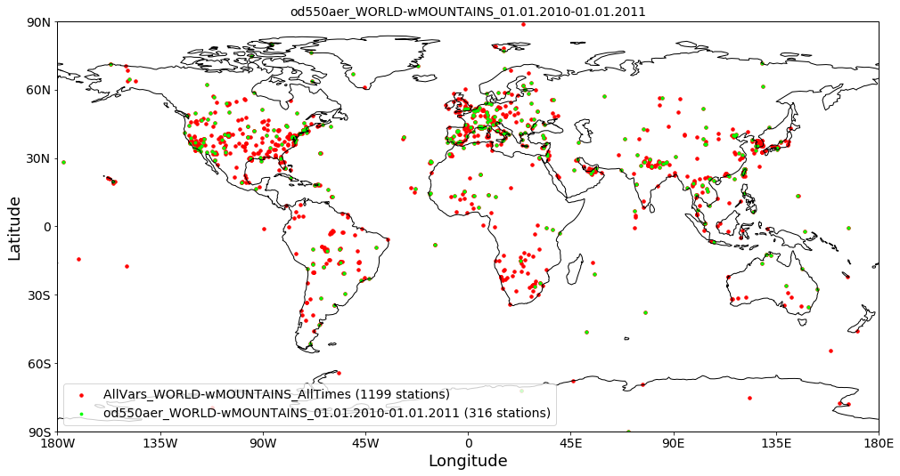

As you can see, you can specify additional input parameters, e.g. to
display only stations that contain variable data or to specify a time
interval.

In any case, it is always good to know about the help function:

.. code:: ipython3

    help(data.plot_station_coordinates)

.. parsed-literal::

    Help on method plot_station_coordinates in module pyaerocom.ungriddeddata:
    
    plot_station_coordinates(var_name=None, filter_name=None, start=None, stop=None, ts_type=None, color='r', marker='o', markersize=8, fontsize_base=10, **kwargs) method of pyaerocom.ungriddeddata.UngriddedData instance
        Plot station coordinates on a map
        
        All input parameters are optional and may be used to add constraints 
        related to which stations are plotted. Default is all stations of all 
        times.
        
        Parameters
        ----------
        
        var_name : :obj:`str`, optional
            name of variable to be retrieved
        filter_name : :obj:`str`, optional
            name of filter (e.g. EUROPE-noMOUNTAINS)
        start 
            start time (optional)
        stop 
            stop time (optional). If start time is provided and stop time not, 
            then only the corresponding year inferred from start time will be 
            considered
        ts_type : :obj:`str`, optional
            temporal resolution
        color : str
            color of stations on map
        marker : str
            marker type of stations
        markersize : int
            size of station markers
        fontsize_base : int
            basic fontsize 
        **kwargs
            Addifional keyword args passed to 
            :func:`pyaerocom.plot.plot_coordinates`
            
        Returns
        -------
        axes
            matplotlib axes instance
    

Quicklook plotting of station timeseries
''''''''''''''''''''''''''''''''''''''''

Time series of individual stations can be plotted as follows:

.. code:: ipython3

    data.plot_station_timeseries(station_name='Granada', var_name='od550aer');

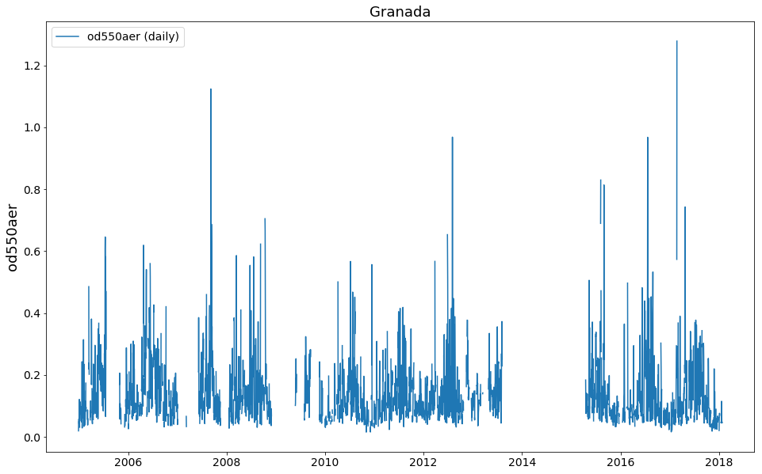

Access metadata of the data files that were read
''''''''''''''''''''''''''''''''''''''''''''''''

Look into the metadata of the different files. Metadata can be accessed
via the ``metadata`` attribute, and there is one metadatadictionary for
each file that was read:

.. code:: ipython3

    len(data.metadata)

.. parsed-literal::

    1199

Access metadata of first file (index 0):

.. code:: ipython3

    data.metadata[0]

.. parsed-literal::

    OrderedDict([('var_info',
                  OrderedDict([('od550aer', OrderedDict([('unit', '1')]))])),
                 ('latitude', 45.3139),
                 ('longitude', 12.508299999999998),
                 ('altitude', 10.0),
                 ('station_name', 'AAOT'),
                 ('PI', 'Brent_Holben'),
                 ('ts_type', 'daily'),
                 ('data_id', 'AeronetSunV3Lev2.daily'),
                 ('variables', ['od550aer']),
                 ('instrument_name', 'sun_photometer')])

Filtering of the data
'''''''''''''''''''''

So far, you can filter ``UngriddedData`` objects by common metadata
attributes. For instance:

.. code:: ipython3

    subset = data.filter_by_meta(latitude=(30, 60), longitude=(0, 45), altitude=(0, 1000))
    print(subset)

.. parsed-literal::

    
    Pyaerocom UngriddedData
    -----------------------
    Contains networks: ['AeronetSunV3Lev2.daily']
    Contains variables: ['od550aer']
    Contains instruments: ['sun_photometer']
    Total no. of meta-blocks: 160
    Filters that were applied:
     Filter time log: 20190228175037
    	latitude: (30, 60)
    	longitude: (0, 45)
    	altitude: (0, 1000)

.. code:: ipython3

    subset.plot_station_coordinates();

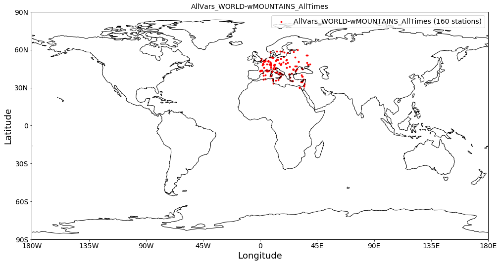

Other attributes that may be useful
'''''''''''''''''''''''''''''''''''

Access all station names and print the first 4:

.. code:: ipython3

    stat_names = data.station_name
    print(stat_names[:4])

.. parsed-literal::

    ['AAOT', 'AOE_Baotou', 'ARM_Ascension_Is', 'ARM_Barnstable_MA']

Essentially, what ``data.station_name`` does is, it iterates over all
metadata-dictionaries (that are stored in ``data.metadata``, and are
organised *per file that was read*) and extracts the ``station_name``
attribute and appends it to a list which is then returned by the method.

Hence, the list of station names corresponds to the list of
metadata-blocks / files that are stored in the data object:

.. code:: ipython3

    len(stat_names)

.. parsed-literal::

    1199

In a similar manner, you can access coordinates latitude, longitude and
altitude arrays for all files.

.. code:: ipython3

    lons = data.longitude
    lons[:4]

.. parsed-literal::

    [12.508299999999998,
     109.62879999999998,
     -14.349805999999996,
     -70.29006100000001]

.. code:: ipython3

    lats = data.latitude
    lats[:4]

.. parsed-literal::

    [45.3139, 40.851699999999994, -7.966963999999998, 41.669588999999995]

.. code:: ipython3

    alts = data.altitude
    alts[:4]

.. parsed-literal::

    [10.0, 1314.0, 341.0, 15.0]

List of unique station names
''''''''''''''''''''''''''''

As mentioned earlier, some databases provide more than one data file per
station. Since the ungridded reading (see previous) tutorial is done
*per data file*, this means that their can be more than one
metadata-block per station (not the case here, though). In any case, you
can get a list of unique station names using:

.. code:: ipython3

    unique_names = data.unique_station_names
    unique_names[:4]

.. parsed-literal::

    ['AAOT', 'AOE_Baotou', 'ARM_Ascension_Is', 'ARM_Barnstable_MA']

Get all station coordinates
'''''''''''''''''''''''''''

.. code:: ipython3

    stat_coords = data.station_coordinates
    stat_coords['Mace_Head']

.. parsed-literal::

    {'latitude': 53.32583000000001, 'longitude': -9.89944, 'altitude': 20.0}

``StationData``: Access the data from individual stations
^^^^^^^^^^^^^^^^^^^^^^^^^^^^^^^^^^^^^^^^^^^^^^^^^^^^^^^^^

As you could see above the metadata dictionaries in the
``UngriddedData`` class for each file do only contain the associated
metadata. For the sake of performance the actual data arrays are all
stored in one big 2D numpy array (which does not need to bother you too
much) which is accessible in the ``_data`` attribute of the
``UngriddedData`` object (if you like to dive into it).

**In most cases that concern model evaluation, the observation data is
analysed station-by-station. For this purpose the StationData class was
designed, which is introduced below.**

Starting from an instance of the ``UngriddedData`` object, the
individual station data (i.e. time series of one or more variables +
metadata) can be accessed using the method:

`UngriddedData.to_station_data <https://pyaerocom.met.no/api.html?highlight=to_station_data#pyaerocom.ungriddeddata.UngriddedData.to_station_data>`__

or using the square brackets ``[]`` which is equivalent to the former as
it is only a wrapper for ``to_station_data``. This meants, calling

.. code:: python

   UngriddedData[0]

will give you the same output as

.. code:: python

   UngriddedData.to_station_data[0]

that is, the data associated with the first file that was read (i.e. the
first metadata-block in the object) into the ``UngriddedData`` object
(see previous tutorial for details regarding the reading of ungridded
observation networks).

To specify the station, you can either use the metadata index of the
corresponding data file (``meta_idx=9``, for 10th file) **or** you can
specify the station name or a wildcard specifying the station name.

The method returns a
`pyaerocom.StationData <https://pyaerocom.met.no/api.html?highlight=stationdata#pyaerocom.stationdata.StationData>`__
object, which is a dictionary-like object which contains data vectors
and time-stamps as well as metadata.

Below we will illustrate the several options to access station data (and
show that they contain the same data):

Option 1. Get station data using the corresponding metadata indices that match the station name
                                                                                               

Find index (or indices) that match the station name:

.. code:: ipython3

    index = data.find_station_meta_indices('Granada')
    index

.. parsed-literal::

    [488.0]

The result shows that there is one file that matches this station name
(as we would expect for AERONET data) and the corresponding metadata
index is 488.

To access the data, you can use the method ``to_station_data``. It helps
to have a look into the options of this method:

.. code:: ipython3

    help(data.to_station_data)

.. parsed-literal::

    Help on method to_station_data in module pyaerocom.ungriddeddata:
    
    to_station_data(meta_idx, vars_to_convert=None, start=None, stop=None, freq=None, merge_if_multi=True, merge_pref_attr=None, merge_sort_by_largest=True, insert_nans=False) method of pyaerocom.ungriddeddata.UngriddedData instance
        Convert data from one station to :class:`StationData`
        
        Todo
        ----
        - Review for retrieval of profile data (e.g. Lidar data)
        
        Parameters
        ----------
        meta_idx : float
            index of station or name of station.
        vars_to_convert : :obj:`list` or :obj:`str`, optional
            variables that are supposed to be converted. If None, use all 
            variables that are available for this station
        start
            start time, optional (if not None, input must be convertible into
            pandas.Timestamp)
        stop 
            stop time, optional (if not None, input must be convertible into
            pandas.Timestamp)
        freq : str
            pandas frequency string (e.g. 'D' for daily, 'M' for month end) or
            valid pyaerocom ts_type
        interp_nans : bool
            if True, all NaN values in the time series for each 
            variable are interpolated using linear interpolation
        min_coverage_interp : float
            required coverage fraction for interpolation (default is 0.68, i.e.
            roughly corresponding to 1 sigma)
        merge_if_multi : bool
            if True and if data request results in multiple instances of 
            StationData objects, then these are attempted to be merged into one 
            :class:`StationData` object using :func:`merge_station_data`
        merge_pref_attr 
            only relevant for merging of multiple matches: preferred attribute 
            that is used to sort the individual StationData objects by relevance.
            Needs to be available in each of the individual StationData objects.
            For details cf. :attr:`pref_attr` in docstring of 
            :func:`merge_station_data`. Example could be `revision_date`. If 
            None, then the stations will be sorted based on the number of 
            available data points (if :attr:`merge_sort_by_largest` is True, 
            which is default).
        merge_sort_by_largest : bool
            only relevant for merging of multiple matches: cf. prev. attr. and
            docstring of :func:`merge_station_data` method.
        insert_nans : bool
            if True, then the retrieved :class:`StationData` objects are filled
            with NaNs 
        
        Returns
        -------
        StationData or list
            StationData object(s) containing results. list is only returned if 
            input for meta_idx is station name and multiple matches are 
            detected for that station (e.g. data from different instruments), 
            else single instance of StationData. All variable time series are
            inserted as pandas Series
    

So the first input argument takes either the metadata index, or the name
of the station. Here we use the metadata index option using the index
that we just retrieved:

.. code:: ipython3

    granada_opt1 = data.to_station_data(meta_idx=index[0], insert_nans=True)
    type(granada_opt1)

.. parsed-literal::

    pyaerocom.stationdata.StationData

The returned data type is an instance of the
`pyaerocom.StationData <https://pyaerocom.met.no/api.html?highlight=stationdata#pyaerocom.stationdata.StationData>`__
class.

**NOTE:** if there is more than one index match for one station (i.e.
``data.find_station_meta_indices('Granada')`` returns more than one
match), then, using Option 1, you would need to call ``to_station_data``
for each of the index matches. Alternatively you could use either of the
following methods, which automatically merge the individual
``StationData`` objects into one, in case of multiple matches for that
station name.

Let’s have a quick look at the ``StationData`` object (it is a
dictionary-like object and simple to use):

Option 2: Retrieve station data using the station name directly
'''''''''''''''''''''''''''''''''''''''''''''''''''''''''''''''

.. code:: ipython3

    granada_opt2 = data.to_station_data('Granada', insert_nans=True)

Other than option 1, in case of multiple meta-index matches, this method
automatically merges the individual data objects.

Option 3: Use […] notation
                          

This is a wrapper for the method ``to_station_data`` so you may use
meta-index or station name for access.

.. code:: ipython3

    granada_opt3_1 = data[index[0]]
    granada_opt3_2 = data['Granada']

Let’s have a look if the data objects are really the same (by plotting the AOD timeseries for the 4 different options):
                                                                                                                       

.. code:: ipython3

    ax = granada_opt1.plot_timeseries('od550aer', lw=3, label='Option 1', tit='Method: UngriddedData.to_station_data()')
    granada_opt2.plot_timeseries('od550aer', ls='--', lw=1, label='Option 2',ax=ax)
    
    # plot the results from the [] access option into a new figure (don't pass ax)
    ax = granada_opt3_1.plot_timeseries('od550aer', lw=3, label='Option 3.1 (using meta-index)', 
                                        tit='Method: UngriddedData[]')
    granada_opt3_2.plot_timeseries('od550aer', ls='--', lw=1, label='Option 3.2 (using station name)',ax=ax)

.. parsed-literal::

    <matplotlib.axes._subplots.AxesSubplot at 0x7f34b631c630>

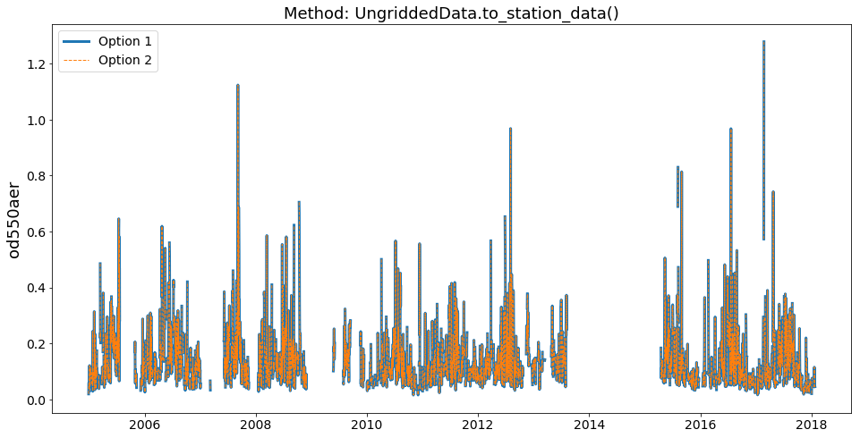

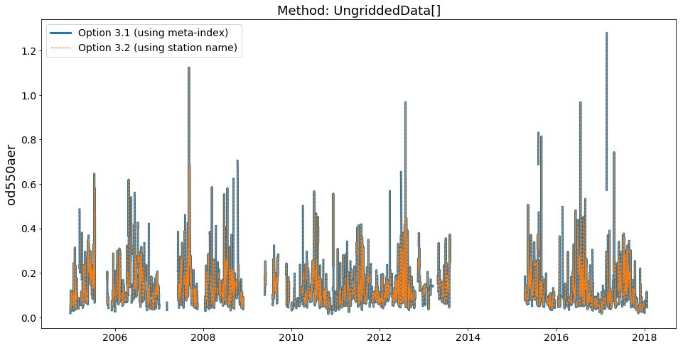

Looks good. Let’s explore the ``StationData`` object a little more (you
can print it and it will get you a nice overview):

.. code:: ipython3

    print(granada_opt1)

.. parsed-literal::

    
    Pyaerocom StationData
    ---------------------
    var_info (BrowseDict([('od550aer', OrderedDict([('unit', '1'), ('overlap', False), ('ts_type', 'daily')]))]))
       od550aer (<class 'collections.OrderedDict'>)
        unit: 1
        overlap: False
        ts_type: daily
    station_coords ({'latitude': 37.163999999999994, 'longitude': -3.605, 'altitude': 680.0})
       latitude: 37.163999999999994
       longitude: -3.605
       altitude: 680.0
    data_err (BrowseDict([('od550aer', array([nan, nan, nan, ..., nan, nan, nan]))]))
       od550aer (array, 2758 items)
       [nan
        nan
        ...
        nan
        nan]
    
    overlap: 
    filename: None
    station_id: None
    station_name: Granada
    instrument_name: sun_photometer
    PI: Brent_Holben
    country: None
    ts_type: daily
    latitude: 37.163999999999994
    longitude: -3.605
    altitude: 680.0
    data_id: AeronetSunV3Lev2.daily
    dataset_name: None
    data_product: None
    data_version: None
    data_level: None
    revision_date: None
    ts_type_src: daily
    
    Data arrays
    .................
    dtime (array, 4774 items)
       [numpy.datetime64('2004-12-29T00:00:00.000000000')
        numpy.datetime64('2004-12-30T00:00:00.000000000')
        ...
        numpy.datetime64('2018-01-22T00:00:00.000000000')
        numpy.datetime64('2018-01-23T00:00:00.000000000')]
    
    Pandas Series
    .................
    od550aer (Series, 4774 items)

You can see that the ``StationData`` object contains both metadata (e.g.
``PI``) and data vectors which can be either 1D numpy arrays or python
lists (e.g. ``dtime``) or ``pandas.Series`` objects (e.g. variable
``od550aer``). All attributes can be accessed and manipulated either
using dictionary style access (i.e. ``[]`` notation), or using the ``.``
operator.

Here some examples:

.. code:: ipython3

    # get longitude using "[]" notation
    granada_opt1['longitude']

.. parsed-literal::

    -3.605

.. code:: ipython3

    # get longitude using "." notation
    granada_opt1.longitude

.. parsed-literal::

    -3.605

.. code:: ipython3

    # assign longitude using "." notation and display new value (again using "[]" notation)
    granada_opt1.longitude = 42
    granada_opt1['longitude']

.. parsed-literal::

    42

.. code:: ipython3

    granada_opt1['station_name']

.. parsed-literal::

    'Granada'

Get station name:

.. code:: ipython3

    granada_opt1.station_name

.. parsed-literal::

    'Granada'

Small detour through the ``pandas`` world
'''''''''''''''''''''''''''''''''''''''''

As you can see in the output above, the time-series data in the
``StationData`` object is an instance of the ``pandas.Series`` class.

.. code:: ipython3

    aod_data = granada_opt1.od550aer
    type(aod_data)

.. parsed-literal::

    pandas.core.series.Series

**NOTE**: pyaerocom relies on pandas, so if you are not familiar with
the pandas library, it is a good advice to make yourself familiar with
it (especially if you are interested in timeseries analysis). See `here
for a short introduction into
pandas <https://pandas.pydata.org/pandas-docs/stable/getting_started/10min.html>`__.

Anyways, you should know about the 2 basic datatypes of pandas which
are:

-  `pandas.Series <https://pandas.pydata.org/pandas-docs/stable/reference/api/pandas.Series.html>`__
-  `pandas.DataFrame <https://pandas.pydata.org/pandas-docs/stable/reference/api/pandas.DataFrame%20.html>`__

Both objects are very similar in their handling and the ``Series`` class
can be imagined as a *single column* of the ``Dataframe`` object which
is a table-like object that has columns (e.g. variables) and rows
(e.g. time-stamps). It is hence, easy to go back and forth between the
two objects.

Anyways, here is some examples what you can do with an instance of the
``pandas.Series`` object that we just accessed from the
``pyaerocom.StationData`` object from Granada (and which we named
``aod_data``).

First, you can get a basic clue about the data by using the ``describe``
method:

.. code:: ipython3

    aod_data.describe()

.. parsed-literal::

    count    2758.000000
    mean        0.138543
    std         0.104699
    min         0.015534
    25%         0.072014
    50%         0.108543
    75%         0.170734
    max         1.278507
    dtype: float64

Second, you may plot it:

.. code:: ipython3

    aod_data.plot();

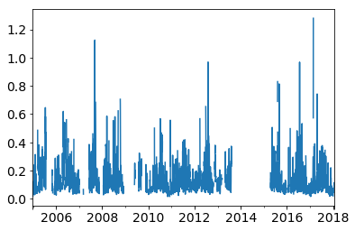

Third, you may extract subsets using *fancy indexing*:

.. code:: ipython3

    aod_data_march2010 = aod_data['2010-3-1':'2010-4-1']
    aod_data_march2010.plot()

.. parsed-literal::

    <matplotlib.axes._subplots.AxesSubplot at 0x7f34bd32bf98>

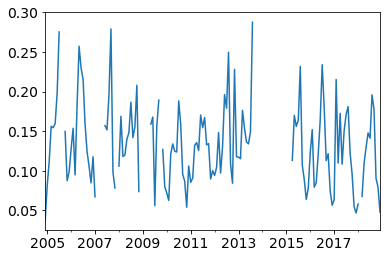

Or fourth, resample to another frequency:

.. code:: ipython3

    aod_data_monthly = aod_data.resample('M', 'mean')
    aod_data_monthly.plot()

.. parsed-literal::

    <matplotlib.axes._subplots.AxesSubplot at 0x7f34bd2b37f0>

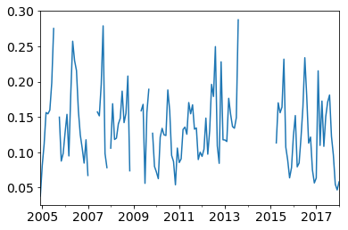

Or fifth, resample to lower frequency, but require a minimum number of
observations per period:

.. code:: ipython3

    monthly_with_count = aod_data.resample('M').agg(['mean', 'count'])
    monthly_with_count.head()

.. raw:: html

    

    
    <table border="1" class="dataframe">
      <thead>
        <tr style="text-align: right;">
          <th></th>
          <th>mean</th>
          <th>count</th>
        </tr>
      </thead>
      <tbody>
        <tr>
          <th>2004-12-31</th>
          <td>0.038038</td>
          <td>2</td>
        </tr>
        <tr>
          <th>2005-01-31</th>
          <td>0.081300</td>
          <td>28</td>
        </tr>
        <tr>
          <th>2005-02-28</th>
          <td>0.111567</td>
          <td>24</td>
        </tr>
        <tr>
          <th>2005-03-31</th>
          <td>0.156312</td>
          <td>17</td>
        </tr>
        <tr>
          <th>2005-04-30</th>
          <td>0.154527</td>
          <td>26</td>
        </tr>
      </tbody>
    </table>
    

Now, here you see an example, where ``pandas`` automatically converted
our Series (which is single variable) to a DataFrame (which is a table),
since we told the resampler above, to aggregate monthly mean and monthly
count.

Now let’s say we require at least 15 observations (here, days, since our
original dataset is in daily resolution) per month:

.. code:: ipython3

    invalid_mask = monthly_with_count['count'] < 15
    monthly_with_count['mean'][invalid_mask] = np.nan
    aod_monthly_min15d = monthly_with_count['mean']
    aod_monthly_min15d.head()

.. parsed-literal::

    2004-12-31         NaN
    2005-01-31    0.081300
    2005-02-28    0.111567
    2005-03-31    0.156312
    2005-04-30    0.154527
    Freq: M, Name: mean, dtype: float64

Now plot both the monthly timeseries from above without constraint and
the one with constraint:

.. code:: ipython3

    ax = aod_data_monthly.plot(label='Monthly without constraint', lw=3, figsize=(14,6))
    aod_monthly_min15d.plot(ax=ax, style='x-', label='Monthly (at least 15 days per month)')
    ax.legend();

.. image:: tut06_intro_UngriddedData_and_StationData_classes/tut06_intro_UngriddedData_and_StationData_classes_68_0.png

As you can see, there is quite some months missing when applying the
filter.

You may also be intersted in a climatology:

.. code:: ipython3

    aod_monthly_climatology = aod_data_monthly.groupby(aod_data_monthly.index.month).mean()
    aod_monthly_climatology

.. parsed-literal::

    1     0.090553
    2     0.130528
    3     0.118712
    4     0.134921
    5     0.148511
    6     0.166422
    7     0.177145
    8     0.191789
    9     0.142857
    10    0.117423
    11    0.092444
    12    0.083954
    dtype: float64

And do the same for the monthly data with minimum 15 days per month that
we created above:

.. code:: ipython3

    aod_monthly_climatology_min15d = aod_monthly_min15d.groupby(aod_monthly_min15d.index.month).mean()
    aod_monthly_climatology_min15d

.. parsed-literal::

    1     0.091438
    2     0.137147
    3     0.119908
    4     0.140677
    5     0.147466
    6     0.166284
    7     0.188155
    8     0.182201
    9     0.137702
    10    0.113832
    11    0.071302
    12    0.089056
    Name: mean, dtype: float64

.. code:: ipython3

    ax = aod_monthly_climatology.plot(label='Monthly climatology (no constraint)')
    aod_monthly_climatology_min15d.plot(label='Monthly climatology (min 15 days/month)')

.. parsed-literal::

    <matplotlib.axes._subplots.AxesSubplot at 0x7f34bed47dd8>

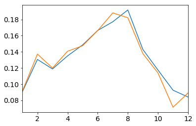

That was enough of a detour into the pandas world. As you shall see
below, some of these pandas features are also provided in the pyaerocom
data objects (e.g. resampling) and more will follow soon!

Plotting of timeseries data directly from `StationData <https://pyaerocom.met.no/api.html?highlight=stationdata#pyaerocom.stationdata.StationData>`__ class
'''''''''''''''''''''''''''''''''''''''''''''''''''''''''''''''''''''''''''''''''''''''''''''''''''''''''''''''''''''''''''''''''''''''''''''''''''''''''''

Let’s come back to the ``StationData`` object. Below are some more
examples that show how you can plot the timeseries directly from the
``StationData`` object. This includes to do a resampling out of the box
when plotting:

.. code:: ipython3

    ax = granada_opt1.plot_timeseries('od550aer')
    ax = granada_opt1.plot_timeseries('od550aer', freq='monthly', lw=3, ax=ax)
    granada_opt1.plot_timeseries('od550aer', freq='yearly', ls='none', marker='o', ms=14, ax=ax);

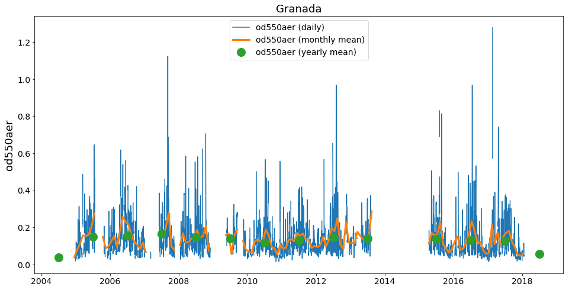

The resampling of the timeseries in the plotting method is done
automatically (if input ``ts_type`` is provided).

Currently, this does not apply additional constraints such as a minimum
number of available observations when downsampling (like we showed
above). From the yearly data (green dots) you can see clearly that this
can be an issue, especially for the first and the last year.

In order to account for it, you may to the following:

.. code:: ipython3

    # convert to monthly with at least 5 days per month
    od550aer_monthly = granada_opt1.resample_timeseries('od550aer', 'monthly', 'mean', min_num_obs=5)
    
    # assign to our StationData
    granada_opt1['od550aer_monthly'] = od550aer_monthly
    
    # convert to yearly with at least 6 months per year
    od550aer_yearly_constrained = granada_opt1.resample_timeseries('od550aer_monthly', 'yearly', 'mean', min_num_obs=6)

Compare the result with the yearly product plotted above:

.. code:: ipython3

    ax = granada_opt1.plot_timeseries('od550aer')
    ax.plot(od550aer_yearly_constrained, ls='none', marker='o', ms=14, label='od550aer (yearly constrained)')
    ax = granada_opt1.plot_timeseries('od550aer', freq='yearly', ls='none', marker='o', ms=10, ax=ax)

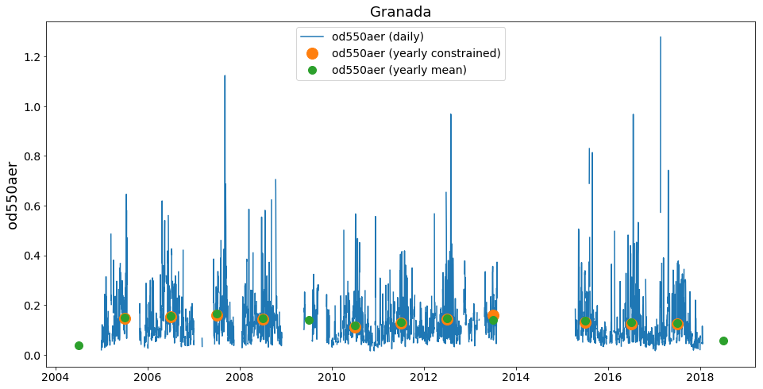

