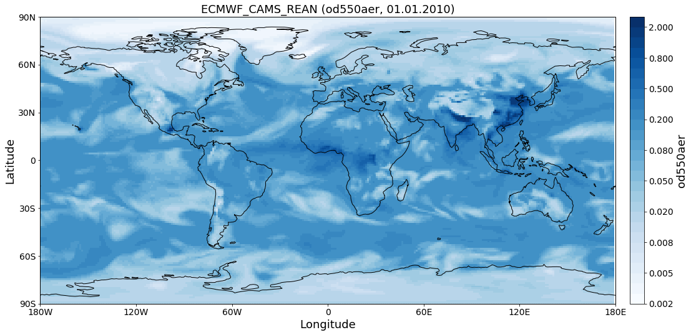
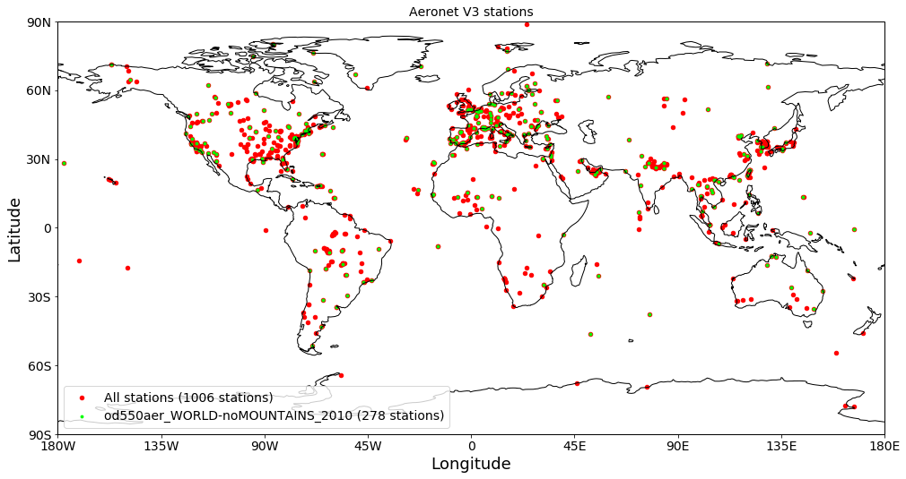
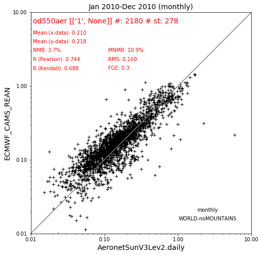
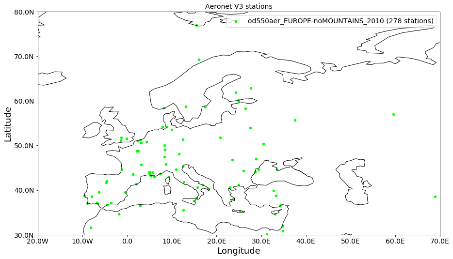
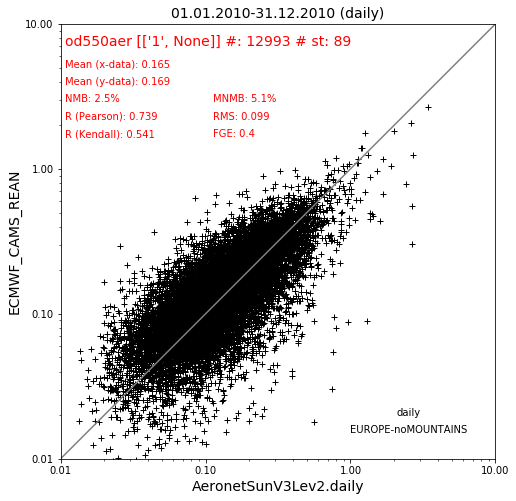

Colocating gridded data with discrete observations
~~~~~~~~~~~~~~~~~~~~~~~~~~~~~~~~~~~~~~~~~~~~~~~~~~

This notebook gives an introduction into collocation of gridded data
with observations. Here, the 550 nm AODs of the ECMWF CAMS reanalysis
model are compared with global daily AeroNet Sun V2 (Level 2) data for
the year 2010. The collocated data will be analysed and visualised in
monthly resolution. The analysis results will be plotted in the form of
the well known Aerocom loglog scatter plots as can be found in the
online interface (see e.g.
`here <http://aerocom.met.no/cgi-bin/aerocom/surfobs_annualrs.pl>`__).

Import setup and imports
^^^^^^^^^^^^^^^^^^^^^^^^

.. code:: ipython3

    import pyaerocom as pya
    pya.change_verbosity('critical')
    
    YEAR = 2010
    VAR = "od550aer"
    TS_TYPE = "daily"
    MODEL_ID = "ECMWF_CAMS_REAN"
    OBS_ID = 'AeronetSunV3Lev2.daily'

.. parsed-literal::

    Init data paths for lustre

.. parsed-literal::

    0.009348154067993164 s

Import of model data
^^^^^^^^^^^^^^^^^^^^

Create reader instance for model data and print overview of what is in
there.

.. code:: ipython3

    model_reader = pya.io.ReadGridded(MODEL_ID)
    print(model_reader)

.. parsed-literal::

    
    Pyaerocom ReadGridded
    ---------------------
    Model ID: ECMWF_CAMS_REAN
    Data directory: /lustre/storeA/project/aerocom/aerocom-users-database/ECMWF/ECMWF_CAMS_REAN/renamed
    Available variables: ['ang4487aer', 'od440aer', 'od550aer', 'od550bc', 'od550dust', 'od550oa', 'od550so4', 'od550ss', 'od865aer']
    Available years: [2003, 2004, 2005, 2006, 2007, 2008, 2009, 2010, 2011, 2012, 2013, 2014, 2015, 2016, 2017, 9999]
    Available time resolutions ['daily', 'monthly']

Since we are only interested in a single year we can use the method

.. code:: ipython3

    model_data = model_reader.read_var(VAR, start=YEAR)
    #model_data = read_result[VAR][YEAR]
    print(model_data)

.. parsed-literal::

    /home/jonasg/anaconda3/lib/python3.6/site-packages/iris/fileformats/_pyke_rules/compiled_krb/fc_rules_cf_fc.py:2029: UserWarning: Gracefully filling 'lat' dimension coordinate masked points
      warnings.warn(msg.format(str(cf_coord_var.cf_name)))
    /home/jonasg/anaconda3/lib/python3.6/site-packages/iris/fileformats/_pyke_rules/compiled_krb/fc_rules_cf_fc.py:2029: UserWarning: Gracefully filling 'lon' dimension coordinate masked points
      warnings.warn(msg.format(str(cf_coord_var.cf_name)))

.. parsed-literal::

    pyaerocom.GriddedData: ECMWF_CAMS_REAN
    Grid data: Aerosol optical depth at 550 nm / (1) (time: 365; latitude: 161; longitude: 320)
         Dimension coordinates:
              time                             x              -               -
              latitude                         -              x               -
              longitude                        -              -               x
         Attributes:
              Conventions: CF-1.6
              NCO: "4.5.4"
              history: Sat May 26 21:08:48 2018: ncecat -O -u time -n 365,3,1 CAMS_REAN_001.nc...
              nco_openmp_thread_number: 1
         Cell methods:
              mean: step
              mean: time

.. code:: ipython3

    fig = model_data.quickplot_map(time_idx=0)

Import of AeroNet Sun V3 data (Level 2)
^^^^^^^^^^^^^^^^^^^^^^^^^^^^^^^^^^^^^^^

Import Aeronet data and apply filter that selects only stations that are
located at altitudes between 0 and 1000 m.

.. code:: ipython3

    obs_reader = pya.io.ReadUngridded(OBS_ID, [VAR, 'ang4487aer'])
    obs_data = obs_reader.read().filter_by_meta(stat_alt=[0, 1000])
    print(obs_data)

.. parsed-literal::

    Found Cache match for AeronetSunV3Lev2.daily

.. parsed-literal::

    
    Pyaerocom UngriddedData
    -----------------------
    Contains networks: ['AeronetSunV3Lev2.daily']
    Contains variables: ['ang4487aer', 'od550aer']
    Contains instruments: ['sun_photometer']
    Total no. of meta-blocks: 1006
    Filters that were applied:
     Filter time log: 20181127115648
    	stat_alt: [0, 1000]

Plot station coordinates
^^^^^^^^^^^^^^^^^^^^^^^^

First, plot all stations that are available at all times (as red dots),
then (on top of that in green), plot all stations that provide AODs in
2010.

.. code:: ipython3

    ax = obs_data.plot_station_coordinates(color='r', markersize=20,
                                           label='All stations')
    ax = obs_data.plot_station_coordinates(var_name='od550aer', start=2010, 
                                           filter_name='WORLD-noMOUNTAINS',
                                           color='lime', markersize=8, legend=True,
                                           title='Aeronet V3 stations',
                                           ax=ax) #just pass the GeoAxes instance that was created in the first call

Now perform collocation and plot corresponding scatter plots with statistical values
^^^^^^^^^^^^^^^^^^^^^^^^^^^^^^^^^^^^^^^^^^^^^^^^^^^^^^^^^^^^^^^^^^^^^^^^^^^^^^^^^^^^

2010 monthly World no mountains
'''''''''''''''''''''''''''''''

Colocate 2010 data in monthly resolution using (cf. green dots in
station plot above).

.. code:: ipython3

    obs_data

.. parsed-literal::

    UngriddedData <networks: ['AeronetSunV3Lev2.daily']; vars: ['ang4487aer', 'od550aer']; instruments: ['sun_photometer'];No. of stations: 1006

.. code:: ipython3

    data_coloc = pya.colocation.colocate_gridded_ungridded(model_data, obs_data, ts_type='monthly',
                                                           filter_name='WORLD-noMOUNTAINS')
    data_coloc

.. parsed-literal::

    Interpolating data of shape (12, 161, 320). This may take a while.
    Successfully interpolated cube

.. parsed-literal::

    <xarray.DataArray 'od550aer' (data_source: 2, time: 12, station_name: 278)>
    array([[[     nan, 0.117588, ...,      nan,      nan],
            [     nan, 0.132128, ...,      nan,      nan],
            ...,
            [0.132236, 0.195057, ...,      nan,      nan],
            [     nan, 0.098409, ...,      nan,      nan]],
    
           [[0.189948, 0.140062, ..., 0.079353, 0.204337],
            [0.150408, 0.190089, ..., 0.10622 , 0.257806],
            ...,
            [0.159844, 0.178564, ..., 0.054091, 0.239393],
            [0.147172, 0.138039, ..., 0.077916, 0.19986 ]]])
    Coordinates:
      * data_source   (data_source) <U22 'AeronetSunV3Lev2.daily' 'ECMWF_CAMS_REAN'
        var_name      (data_source) <U8 'od550aer' 'od550aer'
      * time          (time) datetime64[ns] 2010-01-01 2010-02-01 2010-03-01 ...
      * station_name  (station_name) <U19 'ARM_Darwin' 'ATHENS-NOA' 'Agoufou' ...
        latitude      (station_name) float64 -12.43 37.97 15.35 -9.871 42.02 ...
        longitude     (station_name) float64 130.9 23.72 -1.479 -56.1 -93.77 ...
        altitude      (station_name) float64 29.9 130.0 305.0 277.0 338.0 49.0 ...
    Attributes:
        data_source:      ['AeronetSunV3Lev2.daily', 'ECMWF_CAMS_REAN']
        var_name:         ['od550aer', 'od550aer']
        ts_type:          monthly
        filter_name:      WORLD-noMOUNTAINS
        ts_type_src:      daily
        ts_type_src_ref:  daily
        start_str:        20100101
        stop_str:         20101231
        unit:             ['1', None]
        data_level:       colocated
        revision_ref:     20181105
        region:           WORLD
        lon_range:        [-180, 180]
        lat_range:        [-90, 90]
        alt_range:        [-1000000.0, 1000.0]

.. code:: ipython3

    data_coloc.plot_scatter()

.. parsed-literal::

    <matplotlib.axes._subplots.AxesSubplot at 0x7f8fe27f25f8>

2010 daily Europe no mountains
''''''''''''''''''''''''''''''

Now perform colocation only over Europe. Starting with a station plot.

.. code:: ipython3

    obs_data.plot_station_coordinates(var_name='od550aer', start=2010, 
                                      filter_name='EUROPE-noMOUNTAINS',
                                      color='lime', markersize=20, legend=True,
                                      title='Aeronet V3 stations')

.. parsed-literal::

    <cartopy.mpl.geoaxes.GeoAxes at 0x7f8fe2c358d0>

.. code:: ipython3

    data_coloc = pya.colocation.colocate_gridded_ungridded_2D(model_data, obs_data, ts_type='daily',
                                                                 filter_name='EUROPE-noMOUNTAINS')
    data_coloc

.. parsed-literal::

    Old name of function colocate_gridded_ungridded(still works)

.. parsed-literal::

    Interpolating data of shape (365, 161, 320). This may take a while.
    Successfully interpolated cube

.. parsed-literal::

    <xarray.DataArray 'od550aer' (data_source: 2, time: 365, station_name: 89)>
    array([[[0.163447,      nan, ...,      nan,      nan],
            [0.078648,      nan, ...,      nan,      nan],
            ...,
            [     nan,      nan, ...,      nan,      nan],
            [     nan,      nan, ...,      nan,      nan]],
    
           [[0.086522, 0.015151, ..., 0.075447, 0.03005 ],
            [0.067198, 0.043074, ..., 0.103671, 0.042999],
            ...,
            [0.242585, 0.186407, ..., 0.053797, 0.011344],
            [0.079498, 0.122098, ..., 0.027066, 0.019639]]])
    Coordinates:
      * data_source   (data_source) <U22 'AeronetSunV3Lev2.daily' 'ECMWF_CAMS_REAN'
        var_name      (data_source) <U8 'od550aer' 'od550aer'
      * time          (time) datetime64[ns] 2010-01-01 2010-01-02 2010-01-03 ...
      * station_name  (station_name) <U19 'ATHENS-NOA' 'Andenes' 'Arcachon' ...
        latitude      (station_name) float64 37.97 69.28 44.66 45.76 42.0 43.93 ...
        longitude     (station_name) float64 23.72 16.01 -1.163 3.111 -4.603 ...
        altitude      (station_name) float64 130.0 379.0 11.0 423.0 873.0 32.0 ...
    Attributes:
        data_source:      ['AeronetSunV3Lev2.daily', 'ECMWF_CAMS_REAN']
        var_name:         ['od550aer', 'od550aer']
        ts_type:          daily
        filter_name:      EUROPE-noMOUNTAINS
        ts_type_src:      daily
        ts_type_src_ref:  daily
        start_str:        20100101
        stop_str:         20101231
        unit:             ['1', None]
        data_level:       colocated
        revision_ref:     20181105
        region:           EUROPE
        lon_range:        [-20, 70]
        lat_range:        [30, 80]
        alt_range:        [-1000000.0, 1000.0]

.. code:: ipython3

    data_coloc.plot_scatter()

.. parsed-literal::

    <matplotlib.axes._subplots.AxesSubplot at 0x7f8fe2b1e400>

