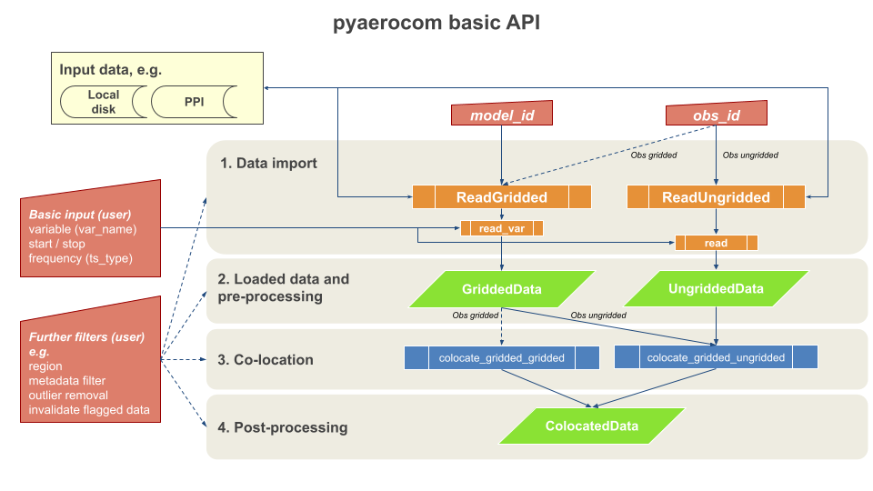

Tutorials
=========

In this section you can find example tutorial notebooks for pyaerocom.

.. note::

  The tutorials are jupyter notebooks that were converted to restructured text.
  You can find in all notebooks in the `pyaerocom-tutorials repository
  <https://github.com/metno/pyaerocom-tutorials/tree/master/notebooks>`__.

.. note::

  The tutorials currently undergo revision. While most of the content below is
  still valid, some of the displayed features are outdated with respect to the
  most recent release. 

Pyaerocom API flowchart (simplified)
------------------------------------

The following flowchart illustrates the minimal workflow to create standard output in pyaerocom based on a user query (that typically comprises a model ID and observation ID as well as one (or more) variable(s) of interest.

A user query typically comprises a model (+ experiment -> model run) and an observation network, which are supposed to be compared.

**Note**: the flowchart depicts a situation, where the data from the observation network is *ungridded*, that is, the data is not available in a gridded format such as NetCDF, but, for instance, in the form of column separated text files (as is the case for AERONET data, which is used as an example here and included in the test dataset).
For `gridded` observations (e.g. satellite data), the flowchart is equivalent but with :class:`ReadGridded` class and :class:`GriddedData` for the observation branch.

The following "Getting started" tutorial introduces the individual features displayed in the flowchart.

.. include:: tut00_get_started.rst

.. include:: tut01_intro_regions.rst

.. include:: tut02_intro_class_ReadGridded.rst

.. include:: tut04_intro_class_GriddedData.rst

.. include:: tut05_intro_ungridded_reading.rst

.. include:: tut06_intro_UngriddedData_and_StationData_classes.rst

.. include:: tut07_intro_colocation.rst

.. include:: tut08_trends_computation.rst

Further tutorials
-----------------

.. include:: add01_intro_time_handling.rst

.. include:: add02_read_ebas_nasa_ames.rst

.. include:: add03_ebas_database_browser.rst

.. include:: add04_stationdata_merging.rst

.. include:: add05_variables.rst
